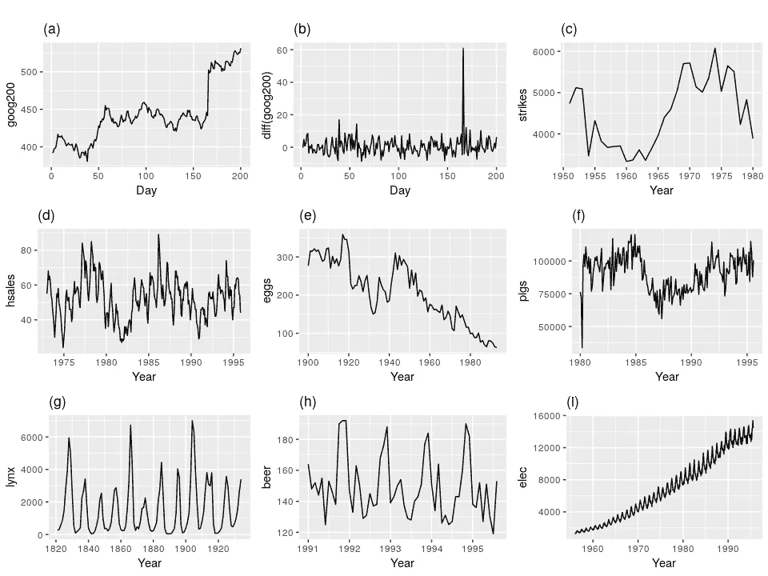
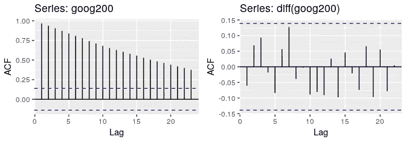
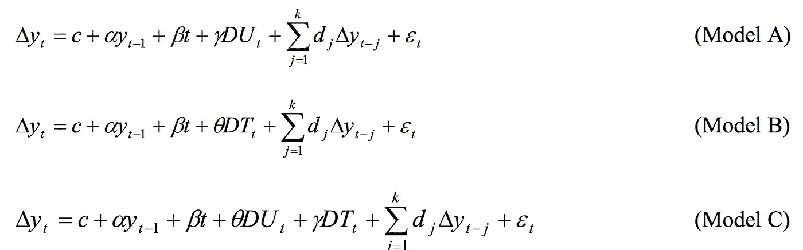

# 检测时间序列数据中的平稳性

> 原文：<https://towardsdatascience.com/detecting-stationarity-in-time-series-data-d29e0a21e638?source=collection_archive---------1----------------------->

平稳性是时间序列分析中的一个重要概念。关于这个话题的简明(但全面)介绍，以及让这个话题变得重要的原因，请看一下我之前关于这个话题的博客文章。无需重复太多，只需指出:

1.  平稳性意味着一个时间序列的统计特性(或者说产生它的过程)不会随着时间而改变。
2.  平稳性很重要，因为许多有用的分析工具、统计测试和模型都依赖于它。

因此，确定时间序列是否平稳的能力非常重要。这通常意味着能够以很高的概率确定一个序列是由一个平稳过程生成的，而不是在两个严格的选项之间做出决定。

在这篇简短的文章中，我将介绍几种方法来做到这一点。

# 形象化

平稳性检测的最基本方法依赖于绘制数据或其函数，并直观地确定它们是否呈现平稳(或非平稳)数据的某些已知属性。

## **在看数据**

试图通过观察一个时间序列的图表来确定它是否是由一个平稳过程产生的是一个可疑的冒险。然而，我们可以寻找非平稳数据的一些基本属性。让我们以[[hynd man&Athanasopoulos，2018](https://otexts.com/fpp2/stationarity.html) ]中的以下美好情节为例:

Figure 1: Nine examples of time series data; (a) Google stock price for 200 consecutive days; (b) Daily change in the Google stock price for 200 consecutive days; (c) Annual number of strikes in the US; (d) Monthly sales of new one-family houses sold in the US; (e) Annual price of a dozen eggs in the US (constant dollars); (f) Monthly total of pigs slaughtered in Victoria, Australia; (g) Annual total of lynx trapped in the McKenzie River district of north-west Canada; (h) Monthly Australian beer production; (i) Monthly Australian electricity production. [Hyndman & Athanasopoulos, 2018]

[Hyndman & Athanasopoulos，2018]给出了几种用于排除上述图中平稳性的试探法，对应于平稳过程的基本特征([，我们之前已经讨论过](/stationarity-in-time-series-analysis-90c94f27322)):

*   在系列(d)、(h)和(I)中可以观察到显著的季节性。
*   在系列(a)、(c)、(e)、(f)和(I)中可以看到明显的趋势和变化水平。
*   系列(I)显示方差增加。

作者还补充说，尽管系列(g)中的强周期可能看起来使其不稳定，但这些周期的时间使其不可预测(由于潜在的动态主导猞猁种群，部分由可用饲料驱动)。这使得系列(b)和(g)成为唯一的固定系列。

如果你和我一样，在看上面的图时，没有发现这些观察中至少有一些是微不足道的，你不是唯一一个。事实上，这不是一个非常可靠的检测平稳性的方法，它通常用于获得数据的初步印象，而不是做出明确的断言。

## **查看自相关函数(ACF)图**

[自相关](https://en.wikipedia.org/wiki/Autocorrelation)是信号与自身延迟副本或滞后的相关性，作为延迟的函数。当绘制增加滞后的 ACF 值时(称为[相关图](https://en.wikipedia.org/wiki/Correlogram)的图)，对于平稳时间序列，这些值往往会迅速降为零(见图 1，右)，而对于非平稳数据，降级会发生得更慢(见图 1，左)。

Figure 2: The ACF of the Google stock price (left; non-stationary), and of the daily changes in Google stock price (right; stationary).

或者，【 [Nielsen，2006](https://www.jstor.org/stable/3879300?seq=1#metadata_info_tab_contents) 】建议，绘制基于自相关和比例自协方差的相关图，并对其进行比较，提供了区分平稳和非平稳数据的更好方法。

# 参数测试

另一种更严格的方法，检测时间序列数据中的平稳性，是使用统计测试来检测*特定类型的平稳性*，即由生成随机过程的简单参数模型产生的平稳性[详见我之前的帖子](/stationarity-in-time-series-analysis-90c94f27322)。

我将在这里介绍最突出的测试。我还将为每个测试命名 Python 实现，假设我已经找到了。有关 R 实现，请参见 [CRAN 任务视图:时间序列分析](https://cran.r-project.org/web/views/TimeSeries.html)(此处也是)。

## 单位根检验

**Dickey-Fuller 检验**
[Dickey-Fuller](https://en.wikipedia.org/wiki/Dickey%E2%80%93Fuller_test)检验是第一个为检验零假设而开发的统计检验，假设给定时间序列的自回归模型中存在单位根，因此该过程不是平稳的。最初的测试处理简单的 lag-1 AR 模型的情况。该测试有三个版本，它们测试的单位根过程的模型不同；

1.  单位根检验:∆yᵢ = δyᵢ₋₁ + uᵢ
2.  有漂移的单位根检验:∆yᵢ = a₀ + δyᵢ₋₁ + uᵢ
3.  具有漂移和确定性时间趋势的单位根检验:
    ∆yᵢ = a₀ + a₁*t + δyᵢ₋₁ + uᵢ

选择使用哪个版本—这可以显著影响测试的规模和功效—可以使用一系列有序测试的先验知识或结构化策略，从而发现最合适的版本。

开发了测试的扩展，以适应更复杂的模型和数据；这些包括[增强的迪基-富勒(ADF)](https://en.wikipedia.org/wiki/Augmented_Dickey%E2%80%93Fuller_test) (使用任意阶的 AR*p*并支持时间趋势的建模)[菲利普-佩伦检验(PP)](https://en.wikipedia.org/wiki/Phillips%E2%80%93Perron_test) (对未指定的自相关和异方差增加稳健性)和 [ADF-GLS 检验](https://en.wikipedia.org/wiki/ADF-GLS_test)(处理恒定和线性趋势的局部去趋势数据)。

Python 实现可以在 [statsmodels](https://www.statsmodels.org/stable/generated/statsmodels.tsa.stattools.adfuller.html#statsmodels.tsa.stattools.adfuller) 和 [ARCH](https://github.com/bashtage/arch) 包中找到。

**KPSS 测试**
另一个针对单位根存在的著名测试是 [KPSS 测试](https://en.wikipedia.org/wiki/KPSS_test)。[科维亚特科夫斯基等人，1992 年]与迪基-富勒检验家族相反，零假设假设围绕一个均值或线性趋势平稳，而另一个是单位根的存在。

测试基于线性回归，将序列分成三部分:确定性趋势( *βt* )、随机游走( *rt* )和平稳误差( *εt* )，回归方程为:

并且其中 ***u*** ~(0，σ)和都是 *iid* 。因此，零假设被表述为 *H₀: σ =0* ，而备选项为 *Hₐ: σ > 0* 。通过分别设置 *β=0* (在这种情况下 ***x*** 在均值 r₀附近是稳定的)或 *β≠0* 来确定零假设中的平稳性是围绕均值还是趋势。

KPSS 检验通常用于补充迪基-富勒型检验。我将在以后的文章中谈到如何解释这样的综合结果。

Python 实现可以在 [statsmodels](https://www.statsmodels.org/stable/generated/statsmodels.tsa.stattools.kpss.html#statsmodels.tsa.stattools.kpss) 和 [ARCH](https://github.com/bashtage/arch) 包中找到。

**Zivot 和 Andrews 测试** 上述测试没有考虑到[结构突变](https://en.wikipedia.org/wiki/Structural_break)的可能性——涉及过程的平均值或其他参数变化的突然变化。假设断裂的时间是一个外生现象，Perron 表明，当静态选择为真且结构断裂被忽略时，拒绝单位根的能力下降。

[Zivot 和 Andrews，1992]提出了一个单位根检验，其中他们假设断点的确切时间是未知的。根据 Perron 对结构突变形式的描述，Zivot 和 Andrews 继续用三个模型来检验单位根:

*   模式 A:允许一次性改变系列级别。
*   模型 B:允许趋势函数斜率的一次性变化。
*   模型 C:结合了系列趋势函数的水平和斜率的一次性变化。

因此，为了针对一次性结构突变的替代方案测试单位根，Zivot 和 Andrews 使用了以下与上述三个模型相对应的回归方程:[Waheed 等人，2006]

Python 实现可以在 [ARCH](http://bashtage.github.io/arch/doc/unitroot/tests.html#arch.unitroot.ZivotAndrews) 包和[这里](https://github.com/JimVaranelli/ZAUnitRoot)中找到。

## 半参数单位根检验

**方差比检验**
【Breit ung，2002】提出了一种基于方差比统计的单位根存在性的非参数检验。零假设是过程 I(1)(一阶积分)，而备选项是 I(0)。我将这个测试列为半参数测试，因为它测试的是一个特定的、基于模型的平稳性概念。

# 非参数检验

由于参数检验的局限性，以及人们认识到它们只涵盖真实数据中可能遇到的情况的一个狭窄的子类，一类针对平稳性的非参数检验在时间序列分析文献中出现了。

自然，这些测试为调查时间序列数据开辟了一条有希望的途径:你不再需要假设非常简单的参数模型碰巧适用于你的数据，以确定它是否是平稳的，或者冒着发现这些模型没有捕捉到的现象的复杂形式的风险。

然而，它的现实要复杂得多；目前，还没有任何广泛适用的非参数测试来涵盖生成时间序列数据的所有真实场景。相反，这些测试仅限于特定类型的数据或流程。此外，我无法找到以下任何测试的实现。

我将在这里提到我遇到的几个例子:

## 连续时间马尔可夫过程平稳性的非参数检验

[ [Kanaya，2011](https://pdfs.semanticscholar.org/8293/c4c6a2aaead2c9f0ac3b4aff6f94b71e5768.pdf) ]建议对*单变量* [*时齐马尔可夫过程*](https://en.wikipedia.org/wiki/Markov_chain#Time-homogeneous_Markov_chain_with_a_finite_state_space)*进行这种非参数平稳性检验，构造基于核的检验统计量并进行蒙特卡罗模拟，以研究该检验的有限样本容量和功效特性。*

## *函数时间序列平稳性的非参数检验*

*[Delft et al，2017]提出了一种非参数平稳性检验，仅限于函数时间序列——通过将一个*连续的*(在自然界中)时间记录分成自然的连续间隔(例如天数)获得的数据。请注意，[Delft 和 Eichler，2018]已经提出了对函数时间序列的局部平稳性的测试(参见[我以前的帖子](/stationarity-in-time-series-analysis-90c94f27322)中关于局部平稳性的一些参考)。此外，[Vogt & Dette，2015]提出了一种非参数方法来估计局部平稳框架中的平滑变化点。*

## *基于局部傅立叶分析的平稳性非参数检验*

*[ [Basu 等人，2009](https://ieeexplore.ieee.org/document/4960256) ]提出了最适用于平稳性的非参数检验，因为它适用于任何零均值离散时间随机过程(我在这里假设离散过程的任何有限样本都可以很容易地转换为零均值)。*

# *最后的话*

*就是这样。我希望上面的评论能让你对如何检测数据中的平稳性有所了解。我也希望它能让你了解这项任务的复杂性；由于缺乏对少数非参数检验的实现，你将被迫对你的数据做出强有力的假设，并以必要的怀疑来解释你得到的结果。*

*至于一旦在数据中检测到某种类型的平稳性，该怎么办的问题，我希望在以后的文章中涉及到这个问题。像往常一样，我喜欢听我错过或做错的事情。干杯！*

# *参考*

## *学术文献*

*   *Basu，p .，Rudoy，d .，和 Wolfe，P. J. (2009 年 4 月)。[基于局部傅立叶分析的平稳性非参数检验](https://ieeexplore.ieee.org/document/4960256)。在 *2009 年 IEEE 国际声学、语音和信号处理会议*(第 3005–3008 页)。IEEE。*
*   *j . Breit ung(2002 年)。[单位根和协整的非参数检验](https://www.sciencedirect.com/science/article/pii/S0304407601001397)。*计量经济学杂志*，108(2)，343–363。*
*   *Cardinali 和 g . p . Nason(2018 年)。二阶平稳性的实用有效小波包测试。*应用和计算谐波分析*， *44* (3)，558–583。*
*   *Hyndman，R. J .，& Athanasopoulos，G. (2018 年)。[预测:原理与实践](https://otexts.com/fpp2/stationarity.html)。OTexts。*
*   *Kanaya，S. (2011 年)。[连续&时间马尔可夫过程平稳性的非参数检验](https://pdfs.semanticscholar.org/8293/c4c6a2aaead2c9f0ac3b4aff6f94b71e5768.pdf)。牛津大学就业市场论文。*
*   *科维亚特科夫斯基，菲利普，施米特，和申(1992)。[用单位根检验平稳性的零假设:我们有多确定经济时间序列有单位根？](http://debis.deu.edu.tr/userweb//onder.hanedar/dosyalar/kpss.pdf)。*计量经济学杂志*，*54*(1–3)，159–178。*
*   *尼尔森，B. (2006 年)。非平稳自回归的相关图。*英国皇家统计学会杂志:B 辑(统计方法论)*， *68* (4)，707–720。*
*   *m .瓦希德、t .阿拉姆和 S. P .加利(2006 年)。结构突变和单位根:来自巴基斯坦宏观经济时间序列的证据。*可从 SSRN 963958* 处获得。*
*   *范·代尔夫特(2017 年)。函数时间序列平稳性的非参数检验。 *arXiv 预印本 arXiv:1708.05248* 。*
*   *范·代尔夫特和艾希勒(2018)。"局部平稳函数时间序列."*电子统计杂志*，12:107–170。*
*   *Vogt，m .，& Dette，H. (2015 年)。检测局部平稳过程中的渐变。*统计年鉴*， *43* (2)，713–740。*
*   *Zivot，e .和 D. Andrews，(1992)，大崩盘的进一步证据，石油价格冲击和单位根假说，*商业和经济统计杂志，* 10，251–270。*

## *在线参考*

*   *[数据转换和预测模型:使用什么以及何时使用](https://people.duke.edu/~rnau/whatuse.htm)*
*   *[预测流程图](https://people.duke.edu/~rnau/411flow.gif)*
*   *[egcm R 包的文档](https://cran.r-project.org/web/packages/egcm/egcm.pdf)*
*   *[“非平稳时间序列和单位根检验”](http://www.econ.ku.dk/metrics/Econometrics2_05_II/Slides/08_unitroottests_2pp.pdf)Heino Bohn Nielsen*
*   *[如何解读 Zivot &安德鲁斯单位根检验？](https://stats.stackexchange.com/questions/14547/how-to-interpret-zivot-andrews-unit-root-test)*