# 用拓扑数据分析检测股市崩盘

> 原文：<https://towardsdatascience.com/detecting-stock-market-crashes-with-topological-data-analysis-7d5dd98abe42?source=collection_archive---------7----------------------->

## 由 Wallyson Lemes De Oliveira、 [Lewis Tunstall](https://medium.com/@lewis.c.tunstall) 、Umberto Lupo 和 Anibal Medina-Mardones 撰写

只要有金融市场，就会有金融崩溃。当市场下跌时，大多数人都会遭受损失……那些能够预见到下跌的人可以保护他们的资产，或者持有高风险的空头头寸来获利(这种情况尽管令人紧张，正如[的大空头](https://www.youtube.com/watch?v=vgqG3ITMv1Q)中所描述的那样)。

市场上的资产与一个动态系统相关联，其价格随可用信息的变化而变化。金融市场上的资产价格是由广泛的信息决定的，在[有效市场假说](https://en.wikipedia.org/wiki/Efficient-market_hypothesis)中，信息的一个简单变化将立即被定价。

> 金融系统的动态可以与物理系统的动态相媲美

就像固体、液体和气体之间发生相变一样，我们可以区分市场上的正常状态和混乱状态。

观察显示，金融崩溃之前会有一段资产价格波动加剧的时期[【1】](https://arxiv.org/abs/cond-mat/9901035)。这种现象转化为时间序列几何结构的异常变化。

在这篇文章中，我们使用拓扑数据分析(TDA)来捕捉时间序列中的这些几何变化，以便为股市崩盘提供一个可靠的检测器。[代码](https://github.com/giotto-ai/stock-market-crashes)实现了[吉迪亚和卡茨](https://arxiv.org/abs/1703.04385)给出的想法，这要归功于[乔托-TDA](https://giotto.ai) 一个用于拓扑数据分析的开源库。

## 对于金融崩溃的确切定义，人们几乎没有共识

直觉上，股市崩盘是资产价格的快速下跌。价格下跌是由大规模出售资产引起的，这是在价格进一步下跌之前试图平仓。

意识到一个巨大的投机泡沫(就像次贷危机)，或者一个灾难性的事件，将会导致市场崩溃。在过去二十年里，我们目睹了两次大崩盘:2000 年的互联网崩盘和 2008 年的全球金融危机。

## **我们的结果一言以蔽之**

我们分析了从 1980 年至今标准普尔 500 指数的每日价格。S&P 是一个常用来衡量金融市场状况的指数，它衡量 500 家大型美国公司的股票表现。

> 与简单的基线相比，我们发现拓扑信号往往对噪声具有鲁棒性，因此不容易产生假阳性。

这突出了 TDA 背后的一个关键动机，即拓扑和几何可以提供一个强大的方法来抽象复杂数据中的微妙结构。

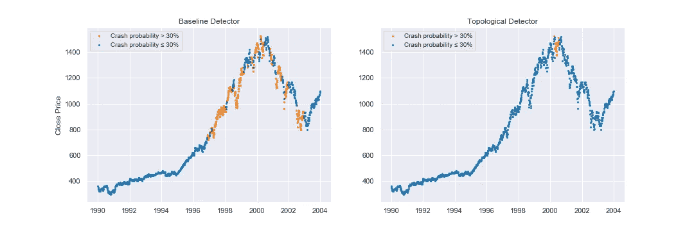

Detection of stock market crashes from baseline (left) and topological (right) models, discussed in detail below.

让我们更详细地描述这两种方法。

**一个简单的基线**

鉴于市场崩盘代表股价的突然下跌，检测这些变化的一个简单方法是跟踪滚动窗口内平均价格值的一阶导数。事实上，在下图中，我们可以看到这种天真的方法已经捕捉到了黑色星期一崩盘(1987 年)、网络泡沫破裂(2000-2004 年)和金融危机(2007-2008 年)。

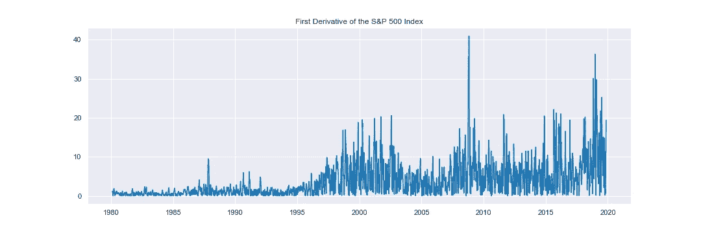

Magnitude of the first derivative of mean close prices between successive windows.

通过归一化这个时间序列，取[0，1]区间内的值，我们可以应用一个阈值来标记原始时间序列上发生崩溃的点。

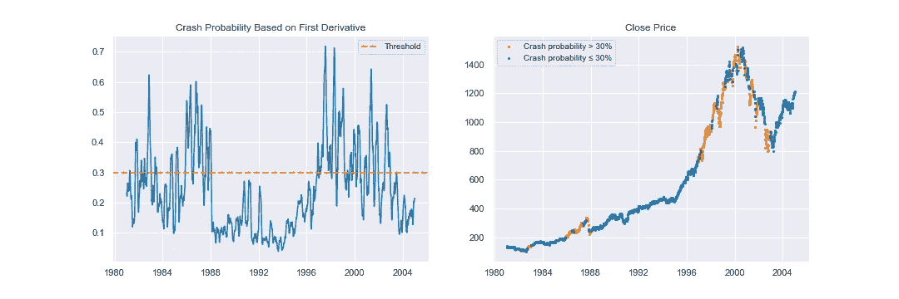

Crash probability for baseline model (left), with points above threshold shown on original time series (right).

> 显然，这种简单的方法相当嘈杂。

随着许多点被贴上崩溃的标签，遵循这个建议将导致过度恐慌和过早出售你的资产。让我们看看 TDA 是否能帮助我们降低信号中的噪声，并获得一个更强大的检测器！

# **TDA 管道**

TDA 背后的数学很深奥，不在本文讨论范围内——我们建议这个[概述](/persistent-homology-with-examples-1974d4b9c3d0?gi=856d8bda11eb)。出于我们的目的，将 TDA 视为提取可用于下游建模的信息特征的手段就足够了。

我们开发的流水线包括:2)将时间序列嵌入到点云中，并构建点云的滑动窗口，3)在每个窗口上构建过滤，以具有编码每个窗口的几何形状的进化结构，4)使用持久性同源性提取那些窗口的相关特征，5)通过测量这些特征从一个窗口到下一个窗口的差异来比较每个窗口，6)基于该差异构建碰撞指示器。

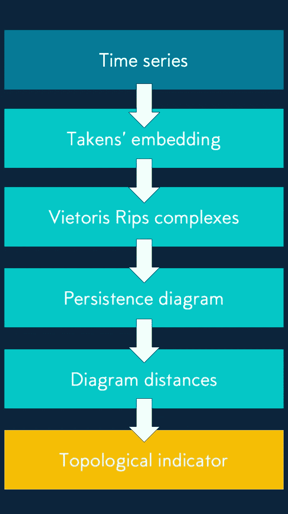

TDA pipeline

## **时间序列作为点云— Takens 嵌入**

TDA 流水线的典型起点是从点云生成单纯复形。因此，时间序列应用中的关键问题是如何生成这样的点云？离散时间序列，就像我们正在考虑的，通常被可视化为二维散点图。这种表示使得通过从左到右扫描图来跟踪时间序列的 ***局部*** 行为变得容易。但是在传达可能在更大的时间尺度上发生的重要影响时，它常常是无效的。

一组众所周知的捕捉周期行为的技术来自傅立叶分析。例如，时间序列上的时间窗口的[离散傅立叶变换](https://en.wikipedia.org/wiki/Discrete_Fourier_Transform)给出了关于该窗口中的信号是否作为几个简单周期信号的总和出现的信息。

为了我们的目的，我们考虑一种不同的编码时间演化过程的方式。它基于动力学的一些关键性质可以在更高维度中被有效地揭示的想法。我们首先说明一种将单变量时间序列表示为 ***点云*** 的方式，即任意维度的欧几里德空间中的一组向量。

过程如下:我们选择两个整数 *d* 和 *τ* 。对于每一次 *tᵢ ∈ (t₀，t₁…)*，我们收集变量 *y* 在 *d* 不同时间的值，以 *τ* 均匀间隔，从 *tᵢ* 开始，将它们表示为具有 *d* 条目的向量，即:

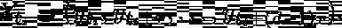

结果就是一组 *d* 维空间的向量！ *τ* 称为延时参数， *d* 为嵌入尺寸。

这种延时嵌入技术也称为塔肯斯嵌入，以芙罗莉丝·塔肯斯命名，他用一个著名的[定理](https://en.wikipedia.org/wiki/Takens%27s_theorem)在 ***非线性*** 动力系统的背景下证明了它的重要性。

最后，在整个时间序列上对*滑动窗口*分别应用该程序，得到一个具有可能有趣拓扑的点云***时间序列(每个滑动窗口一个)。下面的 GIF 显示了这样的点云是如何在二维空间中生成的。***

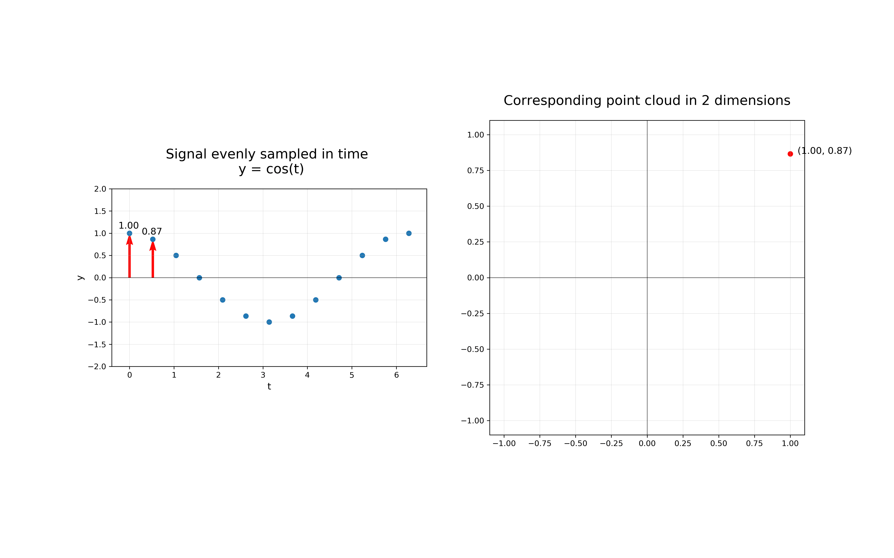

Illustration of the Taken’s embedding with embedding dimension d=2 and time delay *τ=*1

## **从点云到暂留图**

现在我们知道了如何生成时间序列的点云，我们可以用这些信息做什么呢？输入持久同调，它在单纯复形中寻找在某个参数值范围内持续存在的拓扑特征。通常，某个特征(如孔)最初不会被观察到，然后会出现，在某个参数值范围后会再次消失。

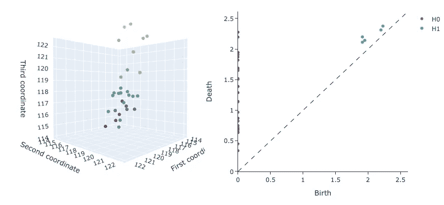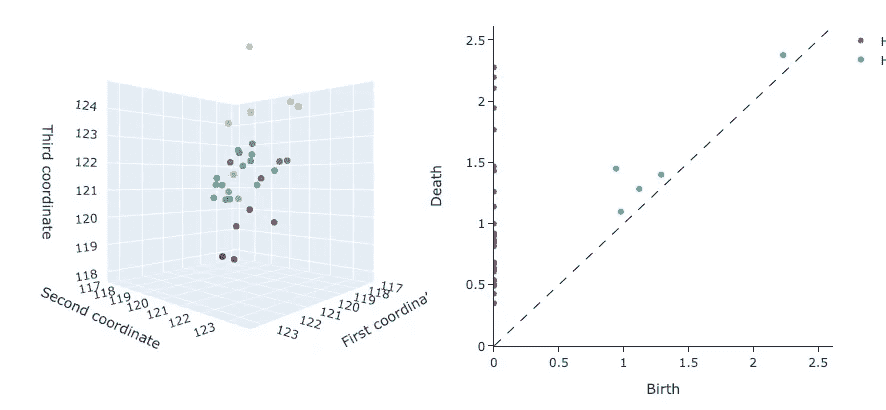

Point clouds from two successive windows and their associated persistence diagram

## **持久图之间的距离**

给定两个窗口及其对应的持久性图，我们可以计算各种距离度量。在这里，我们比较了两个距离，一个基于持久性景观的概念，另一个基于贝蒂曲线。

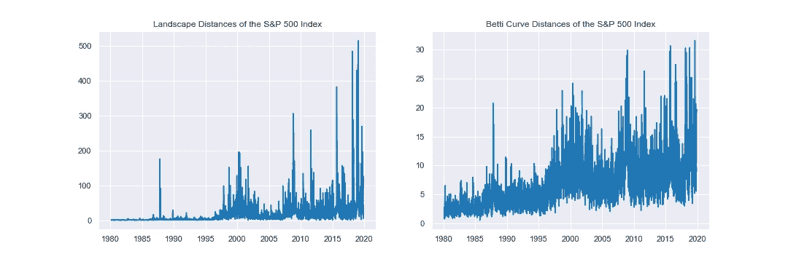

Magnitude of the landscape (left) and Betti curve (right) distances between successive windows.

从这些图中，我们可以推断，基于景观距离的度量比 Betti 曲线的噪声小。

## **一个拓扑指示器**

使用窗口之间的景观距离作为我们的拓扑特征，就像我们对基线模型所做的那样，对其进行归一化是一件简单的事情。下面我们展示了网络泡沫和全球金融危机导致的股市崩溃的检测结果。与我们的简单基线相比，我们可以看到，使用拓扑特征似乎可以降低目标信号中的噪声。

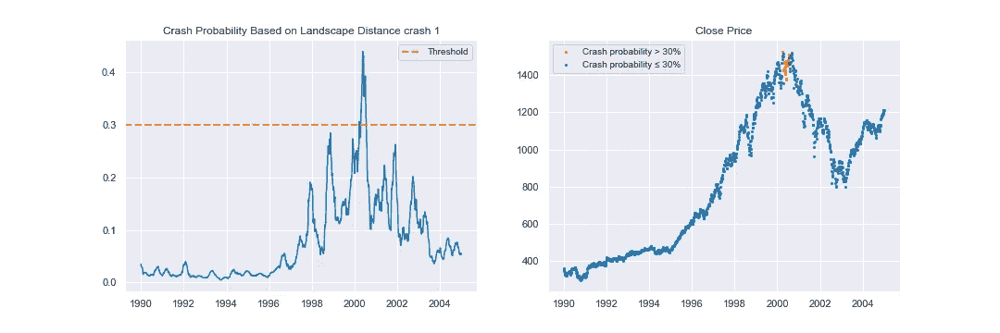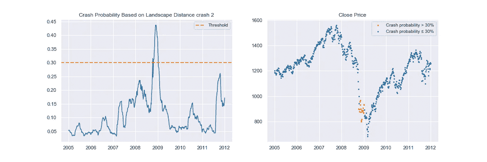

Crash probabilities and detections using topological features. The time ranges correspond to the dot-com bubble in 2000 (upper) and the global financial crisis in 2008 (lower).

# **结论**

我们的结果表明，崩盘前的高波动期会产生几何特征，使用拓扑数据分析可以更有力地检测到这些特征。然而，这些结果只涉及一个特定的市场和一段很短的时间，所以人们应该进一步调查该程序对不同市场和不同阈值的稳健性。然而，结果是令人鼓舞的，并为未来的发展打开了一些有趣的思路。

# 更多带代码的文章:

**图形嵌入**

*   [入门](/getting-started-with-giotto-learn-a-python-library-for-topological-machine-learning-451d88d2c4bc)，预测分子键的例子，[其笔记本](https://github.com/giotto-ai/molecule_bond_prediction)
*   [化学函数的形状](/the-shape-of-chemical-functions-d1e1568d020)及其[笔记本](https://github.com/giotto-ai/the-shape-of-chemical-functions):图形嵌入[图形波](http://snap.stanford.edu/graphwave/)

**时间序列**

*   [检测股灾](/detecting-stock-market-crashes-with-topological-data-analysis-7d5dd98abe42)及其[笔记本](https://github.com/giotto-ai/stock-market-crashes):TDA 股灾时间序列分析
*   [噪音背后的形状](/the-shape-that-survives-the-noise-f0a2a89018c6)和它的[笔记本](https://github.com/giotto-ai/noise-to-signal):用 TDA 进行时间序列分析，产生对大量噪音具有鲁棒性的信号

**可视化**

*   [Mapper 入门，](/visualising-high-dimensional-data-with-giotto-mapper-897fcdb575d7)可视化高维数据以找到其粗略结构
*   [与选举结果相关的美国社会经济](/the-shape-of-the-united-states-presidential-elections-c336d80e4ddf)研究([笔记本)](https://github.com/giotto-ai/us-election-tda):使用 Mapper。

**持久性**

*   [足球的形状](/the-shape-of-football-games-1589dc4e652a)和它的[笔记本](https://github.com/giotto-ai/football-tda):带有持续性图表的团队表现特征

**乔托**

*   Github 上的 Giotto-tda 库
*   更多学习资料请访问[网站](https://giotto.ai/)
*   [推特](https://twitter.com/giotto_ai)
*   [松弛](https://slack.giotto.ai/)进行支撑