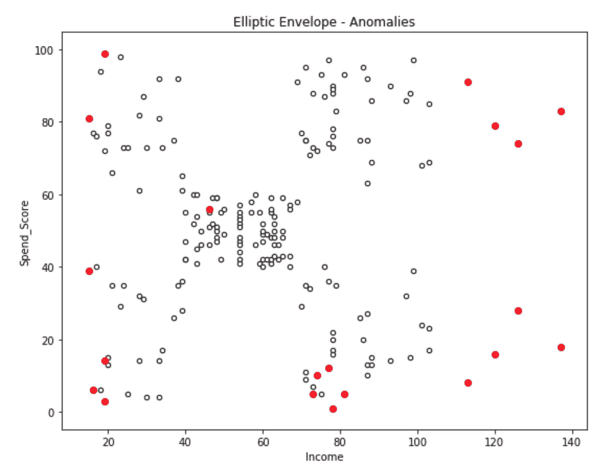
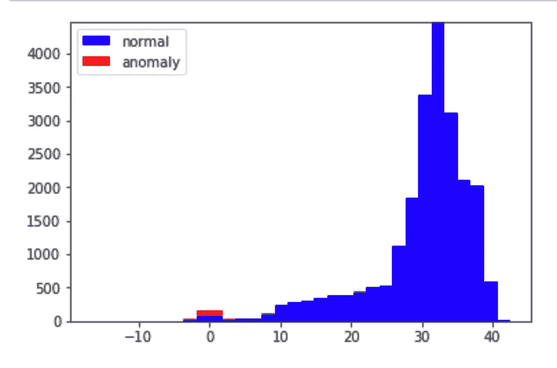
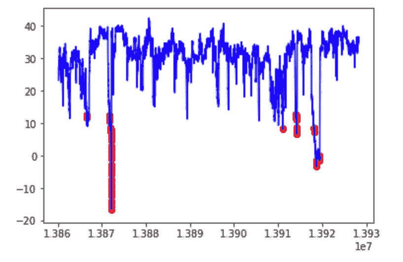

# 使用异常检测技术检测机器故障的开始

> 原文：<https://towardsdatascience.com/detecting-the-onset-of-machine-failure-using-anomaly-detection-techniques-d2f7a11eb809?source=collection_archive---------10----------------------->

Source: [mc.ai](https://mc.ai/anomaly-detection-with-machine-learning-deep-learning/)

# 介绍

影响产品质量的因素很多，但并非所有这些因素都在制造商的控制之下。质量问题最常见的来源之一是没有得到适当维护的故障设备。因此，监控机器和部件(如冷却风扇、轴承、涡轮机、齿轮、皮带)的状态并保持理想的工作状态变得非常重要。

当机器或部件出现故障时，执行纠正性维护，以确定故障原因，并确定维护和重新启动机器至正常工作状态所需的维修程序。然而，因为机器已经在没有任何预先警告的情况下发生故障，所以需要时间来采购和修理故障部件。因此，需要考虑一种维护策略来最大限度地减少服务停机时间。但是机器和它们的部件会随着时间而退化，并且故障的时间是无法提前知道的。因此，基于时间的维护策略主要用于维护机器和设备的状态。

在这篇文章中，我将讨论各种可以用来检测机器中发生的故障的技术。

# 异常检测

在一个教室里，总有一些学生要么比其他学生表现得更好，要么在确保科目分数方面甚至以最低分数不及格。大多数时候，学生的分数除了刚才提到的，一般都是正态分布的。这些标记可以分别称为极端高点和极端低点。在统计学和机器学习等其他相关领域，这些值被称为异常值或异常值。

[异常检测](https://en.wikipedia.org/wiki/Anomaly_detection)(或异常值检测)是对罕见项目、事件或观察结果的识别，这些项目、事件或观察结果因与大多数数据显著不同而引起怀疑。通常，异常数据可能与某种问题或罕见事件有关，例如银行欺诈、医疗问题、结构缺陷、设备故障等。这种联系使得挑选出哪些数据点可以被视为异常变得非常有趣，因为从业务角度来看，识别这些事件通常非常有趣。

Anomaly Detection

这引发了一个问题:我们如何识别数据是正常的还是异常的？有各种技术可以帮助我们识别这一点。

# 异常检测技术

存在许多异常检测方法。其中一些方法的粗略分组包括统计算法、基于聚类的方法、基于最近邻的方法、基于分类的方法、基于频谱的方法、基于空间二次采样的方法和深度学习方法。

## 基于统计的方法

基于统计的方法假设数据遵循特定的分布，因此模型是根据指定的概率分布创建的。检测数据异常的最简单方法是标记偏离分布共同统计特性的数据点。例如，可以根据偏离平均值的某个标准偏差来定义异常。这些模型的优点是它们输出一个概率作为离群值的度量。

Statistical based methods

## 基于聚类的方法

在基于聚类的异常检测中，假设相似的数据点属于相似的组。这由到群集质心的距离决定。然后通过为聚类的大小或到聚类质心的距离设置阈值来计算异常分数；如果聚类具有小于阈值的数据点，则它们被标记为异常，或者如果数据点到聚类中心的距离超过设置的阈值，则它被标记为异常。k 均值聚类就是这种方法的一个例子。

Clustering-based method (K Means Clustering)

## 基于最近邻的方法

基于最近邻的异常检测通常假设正常数据样本出现在看似密集的邻域中，而异常数据样本远离它们最近的邻居。最近邻方法通常可以分为基于距离的方法和基于密度的方法。这两种方法都需要相似性或距离度量来决定数据实例的异常程度。一些例子包括 k-NN、马氏距离和局部异常因子(LOF)。

Nearest Neighbor method (KNN)

## 基于分类的方法

根据标签的可用性，基于分类的异常检测可以分为单类(仅正常标签)和多类(多类)分类。基于分类器的异常检测包括两个步骤:

1.  在训练阶段，使用可用的标记训练数据来学习分类器。
2.  然后，使用在初始步骤中训练的分类器将测试实例分类为正常或异常。

单类支持向量机(OCSVM)和神经网络方法是这种检测方法的例子。

Classification based method (One class SVM)

## 基于频谱或子空间的方法

基于谱或子空间的方法试图提取最能描述训练数据可变性的特征。这些方法假设正常数据可以表示在一个低维子空间中，在这个子空间中正常数据与异常数据是有区别的。主成分分析(PCA)被认为是一种基于子空间的异常检测方法。

Subspace based method (PCA)

## 基于子采样的方法

许多离群点检测方法遭受维数灾难；随着给定数据集维度的增加，基于距离的方法会失败，因为任何一对点之间的相对距离都会变得相对相同。为了克服这个问题，基于子采样的方法将高维空间划分成更小的子空间，并且监视不同子空间中的异常值排序。离群点是在较小的子空间中始终排名较高的点。隔离森林是一种算法，它将高维空间划分为更小的维度，并尝试在低维空间中发现异常。

Subsampling based methods (Isolation forest)

## 高斯分布方法

高斯分布也称为正态分布。我们将使用高斯分布来开发异常检测算法，也就是说，我们将假设我们的数据是正态分布的。这是一个假设，不能适用于所有的数据集，但当它适用时，它证明了一个发现异常值的有效方法。

[椭圆包络](https://scikit-learn.org/stable/modules/generated/sklearn.covariance.EllipticEnvelope.html)是一种方法，通过假设我们的整个数据是基础多元高斯分布的表达式，试图找出我们数据的总体分布的关键参数。

Gaussian based methods (Elliptic Envelope)

# 履行

我已经从 Numenta 异常基准(NAB)下载了[数据集](https://github.com/numenta/NAB/tree/master/data/realKnownCause)。NAB 是评估流实时应用中异常检测算法的新基准。具体来说，我将使用环境温度数据集，该数据集包含来自办公室环境的实时观测数据。

该数据集包含从 2013 年 12 月 2 日到 2014 年 2 月 19 日间隔 5 秒的 22695 次观测。数据集不包含空值。建筑物的温度是华氏温度，后来被转换成摄氏温度。

以下是一段时间内温度读数的图形表示。

Temperature Distribution

## 特征工程

我对数据集进行了特征工程，这将有助于建立一个更好的模型。

1.  一天分为白天和晚上，这对于确定故障是发生在白天还是晚上非常有用。

白天—早上 7 点到晚上 10 点

夜间——晚上 10.01 到早上 6.59

2.一周分为工作日或周末，如果故障发生在大多数员工在办公室(工作日)或其他时间，这将是有用的信息。

3.四个不同的类别将观察结果分为“工作日夜晚”、“工作日光亮”、“周末光亮”、“周末夜晚”

正如我们所见，工作日白天的温度更加稳定。

# 模型

## k 表示聚类

*k*-均值聚类旨在将 *n* 个观测值划分为 *k* 个簇，其中每个观测值属于具有最近均值的簇，作为该簇的原型。这里 k 是一个超参数，使用[弯头方法](https://bl.ocks.org/rpgove/0060ff3b656618e9136b)选择。

用肘法，k 被发现是 15。然后，数据被分成 15 个不同的组，如图所示。

K means clustering with k=15

下一步是得到每个点和它最近的质心之间的距离。最大的距离被认为是异常的。下面是聚类视图中异常的可视化表示。

Anomalies (Red color) and normal readings (Blue color)

我们可以清楚地看到，K 表示聚类能够成功地将异常(红色)与正常(蓝色)区分开来。异常也可以随着时间的推移而可视化。

Anomalies visualized throughout time (K Means)

异常也可以通过温度再分配来可视化。

Anomaly detection using temperature repartitioning (K Means)

使用 K 均值聚类的一个缺点是，它会将记录末尾附近的低温检测为异常，但不会检测高温附近的异常。

## 隔离森林

使用隔离林方法检测到以下异常。

Anomalies visualized throughout time (Isolation Forest)

Anomaly detection using temperature repartitioning (Isolation Forest)

## 一等 SVM

Anomalies visualized throughout time (One Class SVM)

Anomaly detection using temperature repartitioning (One Class SVM)

## 椭圆形信封

Anomalies visualized throughout time (Elliptic Envelope)

Anomaly detection using temperature repartitioning (Elliptic Envelope)

# 结果

一类 SVM 在所有算法中表现最好，能够发现高温和低温范围内的异常。

博客的代码可以在[这里](https://github.com/animeshgoyal9/Detecting-Onset-of-Machine-Failure-using-Anomaly-Detection)找到。

# 参考

 [## 如何使用机器学习进行异常检测和状态监控

### 在这篇文章中，我将介绍机器学习和统计的一些不同的技术和应用…

towardsdatascience.com](/how-to-use-machine-learning-for-anomaly-detection-and-condition-monitoring-6742f82900d7)  [## sklearn .协方差. elliptic envelope-sci kit-learn 0 . 21 . 2 文档

### 如果为真，则计算稳健位置和协方差估计的支持，并且重新计算协方差估计…

scikit-learn.org](https://scikit-learn.org/stable/modules/generated/sklearn.covariance.EllipticEnvelope.html)  [## Python 中的异常检测技术

### DBSCAN、隔离森林、局部异常因子、椭圆包络和一类 SVM

medium.com](https://medium.com/learningdatascience/anomaly-detection-techniques-in-python-50f650c75aaf)  [## Scikit-Learn 中的异常检测

### 所有 AD 的核心是你想为正常点拟合一个生成分布或决策边界，然后…

sdsawtelle.github.io](http://sdsawtelle.github.io/blog/output/week9-anomaly-andrew-ng-machine-learning-with-python.html?source=post_page---------------------------)