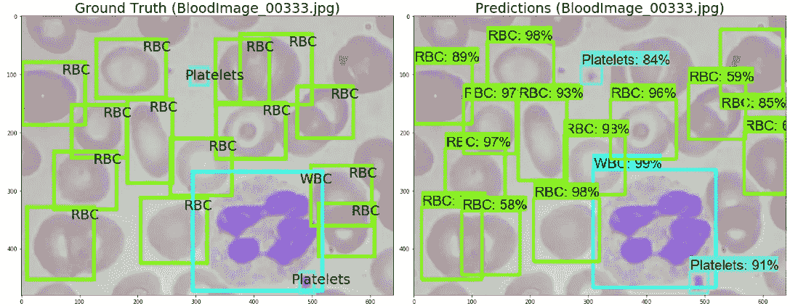
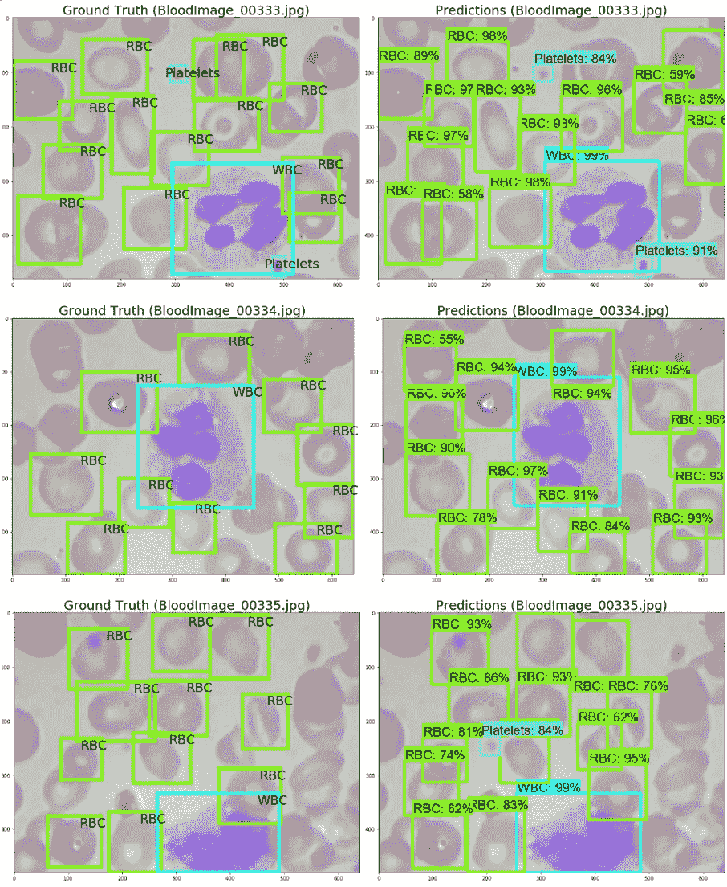
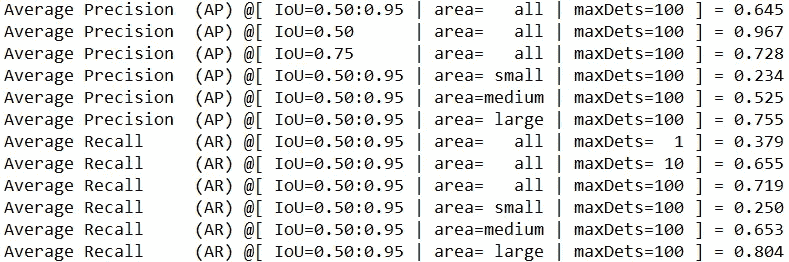

# 利用深度学习对血细胞进行检测和分类(第 2 部分—训练和评估)

> 原文：<https://towardsdatascience.com/detection-and-classification-of-blood-cells-with-deep-learning-part-2-training-and-evaluation-53381dbbc565?source=collection_archive---------18----------------------->

使用 Tensorflow 对象检测 API 处理 BCCD 数据集



# **训练**

我们现在终于为训练做好了准备。

```
# directory = ...YOUR_DIRECTORY/models/research/object_detection 
# type the following into Anaconda Promptpython train.py --logtostderr --train_dir=training/ --pipeline_config_path=training/faster_rcnn_inception_v2_pets.config
```

大约 30 秒到 1 分钟后，训练过程应该开始。如果代码运行顺利，您应该会看到全局步数以及显示的每一步的损失。为了更好地监控训练，我们推出了 Tensorboard。

```
# directory = ...YOUR_DIRECTORY/models/research/object_detection 
# type the following into Anaconda Prompttensorboard --logdir=training
```

将 [http://localhost:6006/](http://localhost:6006/) 复制到浏览器中，打开 Tensorboard。我对我的模型进行了大约 30 分钟的训练，但你的训练时间可能会根据你的系统配置而有所不同。

# **导出推理图**

一旦你对训练损失感到满意，你可以在训练窗口中按 Ctrl + C 来中断训练。我们现在将导出推理图，以便可视化结果并对模型进行评估。

```
# directory = ...YOUR_DIRECTORY/models/research/object_detection 
# type the following into Anaconda Promptpython export_inference_graph.py --input_type image_tensor --pipeline_config_path training/faster_rcnn_inception_v2_pets.config --trained_checkpoint_prefix training/model.ckpt-**YOUR_CHECKPOINT_NUMBER(e.g.2859)** --output_directory inference_graph
```

应该在…YOUR _ DIRECTORY/models/research/object _ detection/inference _ graph 下创建推理图文件夹。

# **可视化结果**

用 Jupyter 笔记本打开 models/research/object _ detection/文件夹中的**object _ detection _ tutorial . ipynb**笔记本。为了适应我们的情况，我对笔记本做了一些修改。请随意将编辑过的代码复制到相应的部分。我没有对下面没有讨论的部分做任何修改。

```
# Importsimport numpy as np
import os
import six.moves.urllib as urllib
import sys
import tarfile
import tensorflow as tf
import zipfilefrom distutils.version import StrictVersion
from collections import defaultdict
from io import StringIO
from matplotlib import pyplot as plt
from matplotlib import patches
from PIL import Image# This is needed since the notebook is stored in the object_detection folder.
sys.path.append("..")
from object_detection.utils import ops as utils_opsif StrictVersion(tf.__version__) < StrictVersion('1.12.0'):
  raise ImportError('Please upgrade your TensorFlow installation to v1.12.*.')
```

注释掉“变量”和“下载模型”部分。

```
#Load a (frozen) Tensorflow model into memoryPATH_TO_FROZEN_GRAPH = r"...**YOUR_DIRECTORY**\models\research\object_detection\inference_graph\frozen_inference_graph.pb"
detection_graph = tf.Graph()
with detection_graph.as_default():
    od_graph_def = tf.GraphDef()
    with tf.gfile.GFile(PATH_TO_FROZEN_GRAPH, 'rb') as fid:
        serialized_graph = fid.read()
        od_graph_def.ParseFromString(serialized_graph)
        tf.import_graph_def(od_graph_def, name='')
```

为了显示预测，我们需要对测试图像目录进行更改。我在 images 文件夹中创建了一个名为“test_samples”的单独文件夹，并选择了前 3 个图像(BloodImage_00333 到 00335)来运行测试。

```
# DetectionPATH_TO_TEST_IMAGES_DIR = r"...**YOUR_DIRECTORY**\models\research\object_detection\images\test_samples"
FILE_NAME = 'BloodImage_00{}.jpg'
FILE_NUMBER = range(333,336)
TEST_IMAGE_PATHS = [ os.path.join(PATH_TO_TEST_IMAGES_DIR, FILE_NAME.format(i)) for i in FILE_NUMBER]
```

我计划在地面实况旁边显示预测，因此我们需要参考“test_labels.csv”。

```
import pandas as pd
train = pd.read_csv(r"...**YOUR_DIRECTORY**\models\research\object_detection\images\test_labels.csv")
train.head()
```

下面的代码将在左边显示真实的图像，在右边显示预测。

```
for image_path in TEST_IMAGE_PATHS:
    image = Image.open(image_path)
  # the array based representation of the image will be used later in order to prepare the
  # result image with boxes and labels on it.
    image_np = load_image_into_numpy_array(image)
  # Expand dimensions since the model expects images to have shape: [1, None, None, 3]
    image_np_expanded = np.expand_dims(image_np, axis=0)
  # Actual detection.
    output_dict = run_inference_for_single_image(image_np_expanded, detection_graph)
  # Visualization of the results of a detection.
    vis_util.visualize_boxes_and_labels_on_image_array(
        image_np,
        output_dict['detection_boxes'],
        output_dict['detection_classes'],
        output_dict['detection_scores'],
        category_index,
        instance_masks=output_dict.get('detection_masks'),
        use_normalized_coordinates=True,
        line_thickness=5)
    figure, (ax2, ax1) = plt.subplots(1, 2, figsize=(20,18))
# plots prediction
    ax1.set_title("Predictions (" + image_path[-20:] + ")", size=25)
    ax1.imshow(image_np)

# plots ground truth
    original = image
    ax2.set_title("Ground Truth (" + image_path[-20:] + ")", size=25)
    ax2.imshow(original)
    for _,row in train[train.filename == image_path[-20:]].iterrows():
        xmin = row.xmin
        xmax = row.xmax
        ymin = row.ymin
        ymax = row.ymaxwidth = xmax - xmin
        height = ymax - ymin# assign different color to different classes of objects
        if row["class"] == 'RBC':
            edgecolor = 'lawngreen'
            ax2.annotate('RBC', xy=(xmax-40,ymin+20), size=25)
        elif row["class"] == 'WBC':
            edgecolor = 'cyan'
            ax2.annotate('WBC', xy=(xmax-40,ymin+20), size=25)
        elif row["class"] == 'Platelets':
            edgecolor = 'aquamarine'
            ax2.annotate('Platelets', xy=(xmax-40,ymin+20), size=25)# add bounding boxes to the image
        rect = patches.Rectangle((xmin,ymin), width, height, edgecolor = edgecolor, facecolor = 'none', lw=6)
        ax2.add_patch(rect)

    plt.tight_layout()
    plt.show()
```

如果一切运行正常，您应该看到以下内容:



仅通过视觉检查，该模型仅用 30 分钟的训练时间就表现良好。边界框很紧，它检测到了大部分血细胞。值得注意的是，该模型能够检测大(白细胞)和小(血小板)细胞。在某些情况下，它甚至检测出了未被标记的红细胞。这预示着该模型的可推广性。

# **评估**

由于对预测的肉眼观察似乎令人满意，我们现在将使用 COCO 指标进行正式评估。

首先，我们必须 git clone COCO Python API。

```
# directory = ...YOUR_DIRECTORY/models/research
# type the following into Anaconda Promptgit clone https://github.com/cocodataset/cocoapi.git
```

这将下载“coco”文件夹，你应该在你的 _DIRECTORY/models/research 中看到它。

```
# directory = ...YOUR_DIRECTORY/models/research
# type the following into Anaconda Promptcd coco/PythonAPI
```

这将把目录更改为 YOUR _ DIRECTORY/models/research/coco/python API。在这个阶段，官方指令要求在 Anaconda 提示符下键入“make”。然而，我无法让它工作，在 github 和 stackoverflow 中搜索给了我解决方法。

首先，你需要按照这里“Jason246”的回答安装 Microsoft Visual C++构建工具:[https://stack overflow . com/questions/48541801/Microsoft-Visual-C-14-0-is-required-get-it-with-Microsoft-Visual-C-Build-t](https://stackoverflow.com/questions/48541801/microsoft-visual-c-14-0-is-required-get-it-with-microsoft-visual-c-build-t)

接下来，使用代码编辑器在您的 _ DIRECTORY/models/research/coco/python API 下打开“setup.py”文件，并进行以下更改。

```
# change thisext_modules = [
    Extension(
        'pycocotools._mask',
        sources=['../common/maskApi.c', 'pycocotools/_mask.pyx'],
        include_dirs = [np.get_include(), '../common'],
        **extra_compile_args=['-Wno-cpp', '-Wno-unused-function', '-std=c99']**,
    )
]# to thisext_modules = [
    Extension(
        'pycocotools._mask',
        sources=['../common/maskApi.c', 'pycocotools/_mask.pyx'],
        include_dirs = [np.get_include(), '../common'],
        **extra_compile_args={'gcc': ['/Qstd=c99']}**,
    )
]
```

接下来，运行“setup.py”文件。

```
# directory = ...YOUR_DIRECTORY/models/research/coco/PythonAPI
# type the following into Anaconda Promptpython3 setup.py build_ext --inplace
```

之后，将您的 _DIRECTORY/models/research/coco/PythonAPI 中的 pycocotools 文件夹复制到您的 _ DIRECTORY/models/research 中。

现在，转到您的 _ DIRECTORY/models/research/object_detection/legacy，将“eval.py”文件复制到“object _ detection”文件夹。我们终于可以运行评估脚本了。

```
# directory = ...YOUR_DIRECTORY/models/research/object_detection
# type the following into Anaconda Promptpython eval.py --logtostderr --pipeline_config_path=training/faster_rcnn_inception_v2_pets.config --checkpoint_dir=training/ --eval_dir=eval/
```

这将把评估结果保存到 eval/目录中。就像训练一样，我们可以用 Tensorboard 来可视化评价。

```
# directory = ...YOUR_DIRECTORY/models/research/object_detection 
# type the following into Anaconda Prompttensorboard --logdir=eval
```

“eval.py”还将基于 COCO 指标生成一份报告。我的模型的结果如下:



精度(阳性预测值)是真阳性与真阳性+假阳性的比例。回忆(敏感度)是真阳性与真阳性+假阴性的比例。

在宽松交集超过并集(IOU)为 0.5 的情况下， **96.7%** 的模型的阳性预测是真阳性。当我们以 0.05 的步长对 IOU 0.5 至 0.95 的 APs 取平均值时，该百分比降低为 **64.5%** 。值得注意的是，该模型在较小的物体上表现不佳，对于小型和中型物体，AP 分别为 **23.4%** 和 **52.5%** 。

从召回率来看，该模型平均检测到 71.9%的真阳性，对于小物体的性能较差。

# **总结**

总之，我们使用 Tensorflow 目标检测 API 建立了一个模型，以在 BCCD 数据集中定位和分类 3 种类型的血细胞。未来的工作包括增加训练时间，提高小对象的性能，以及将模型扩展到其他数据集。

感谢阅读。


Photo by [Sergei Akulich](https://unsplash.com/@sakulich?utm_source=medium&utm_medium=referral) on [Unsplash](https://unsplash.com?utm_source=medium&utm_medium=referral)