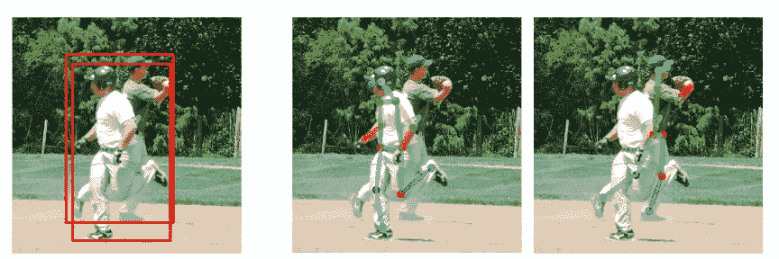
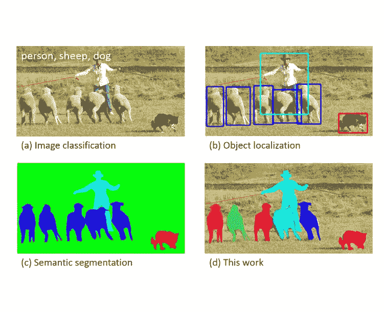
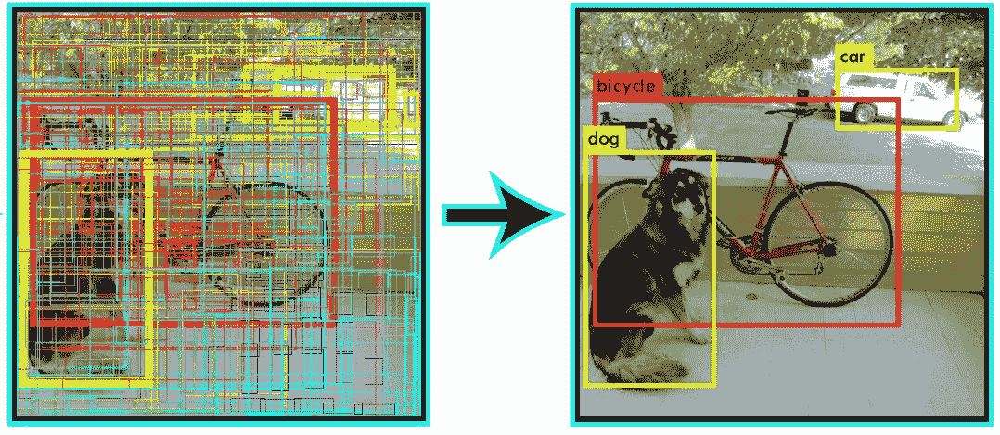
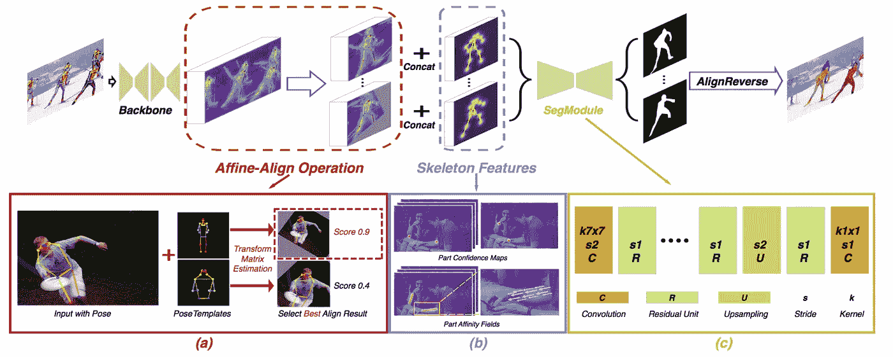
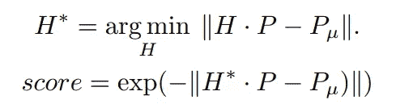
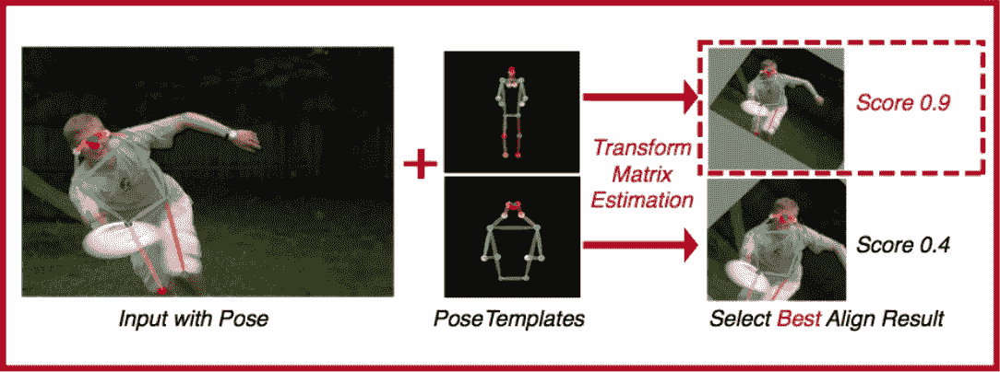
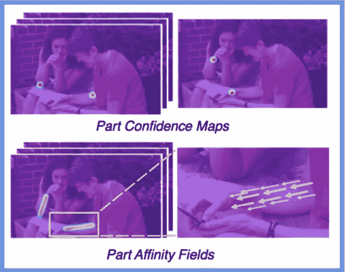
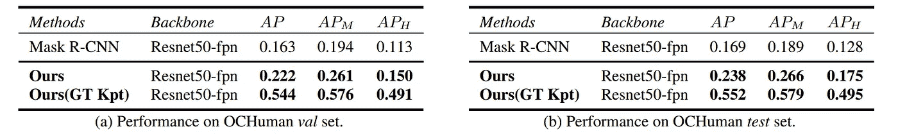
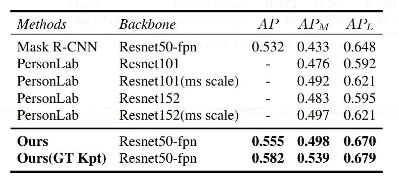
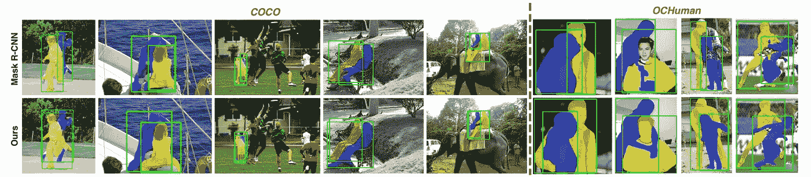

# 使用 Pose2Seg 和 PyTorch 的免检测人体实例分割

> 原文：<https://towardsdatascience.com/detection-free-human-instance-segmentation-using-pose2seg-and-pytorch-72f48dc4d23e?source=collection_archive---------10----------------------->

## 考虑到人类的独特性

Photo by [Jezael Melgoza](https://unsplash.com/@jezael?utm_source=medium&utm_medium=referral) on [Unsplash](https://unsplash.com?utm_source=medium&utm_medium=referral)

近年来，由于现实生活应用的高需求，计算机视觉领域中与“人”相关的研究变得越来越活跃，其中之一就是实例分割。

图像实例分割的标准方法是首先执行对象检测，然后从检测包围盒中分割对象。最近，像 [Mask R-CNN](https://engineering.matterport.com/splash-of-color-instance-segmentation-with-mask-r-cnn-and-tensorflow-7c761e238b46) 这样的深度学习方法联合执行它们。然而，随着与人类相关的任务变得越来越普遍，如人类识别、跟踪等。有人可能想知道为什么“人类”这一类别的独特性没有被考虑进去。

“人类”类别的独特性可以由姿势骨架很好地定义。此外，与使用包围盒相比，人类姿态骨架可以用于更好地区分具有严重遮挡的情况。

Figure 1: Heavily occluded people are better separated using human pose than using bounding-box.

在这篇文章中，我将回顾[“pose 2 seg:无检测人体实例分割”](https://arxiv.org/pdf/1803.10683.pdf)，它提出了一种新的基于姿势的人体实例分割框架，该框架基于人体姿势来分离实例。

在这篇文章中，我将介绍两件事:第一，实例分割任务的概述。二、“Pose2Seg”概述。

> **代码提示:**
> 我们在这里分享代码[。包括数据集和训练模型。跟着走！](https://github.com/erezposner/Pose2Seg)

# 1.什么是实例分段？

实例分割是一项任务，我们希望在像素级别识别每个对象。这意味着标签是类感知和实例感知的。例如，图 2(d)显示了绵羊 1、绵羊 2 等的单独标记。

实例分段被认为是常见用例中最具挑战性的:

Figure 2\. Common computer vision use cases

*   **分类:**此图中有一个人。图 2(a)
*   **目标检测:**在该图像中的这些位置有 5 只羊。图 2(b)
*   **语义分割:**有羊、人、狗像素。图 2(c)
*   **实例分割**:在这些位置有 5 只不同的羊、1 个人和 1 只狗。图 2(d)

# 2.Pose2Seg:无检测人体实例分割

## 2.1 直觉

Pose2Seg 背后的主要思想是，虽然*通用对象实例分割*方法工作良好，但大多数都基于强大的对象检测基线。即首先生成大量的建议区域，然后使用非最大抑制(NMS)来移除冗余区域，如图 3 所示。

Figure 3\. (Left) Before non-max suppression, (Right) After Before non-max suppression

但是，当同一类别的两个对象有很大的重叠时，NMS 会将其中一个对象视为多余的建议区域，并将其删除。这意味着几乎所有的对象检测方法都不能处理大重叠的情况。

但是，当处理大多数“人类”类别时，它可以由姿势骨架很好地定义。如图 1 所示，人体姿态骨架更适合于区分两个纠缠在一起的人，因为它们可以提供比边界框更清晰的个人信息，如不同身体部位的位置和可见性。

自底向上方法的主要思想是首先检测所有人的每个身体部位的关键点，然后将这些部位分组或连接以形成人体姿态的几个实例，这使得可以分离具有大重叠的两个缠绕的人体实例

## 2.2 网络结构

总体网络结构如下图 4 所示。网络的输入是存在的所有人体实例的 RGB 图像和人体姿态。首先，使用主干网络提取图像的特征。然后，名为*仿射对齐*的模块用于根据人体姿态将感兴趣区域对齐到统一的大小(为了一致性)。此外，为每个人体实例生成*骨架*特征。

现在，RoI 和*骨架*特征被融合并被传递到称为 S *egModule* 的分割模块，以产生每个 RoI 的实例分割。最后，对估计矩阵进行仿射对齐操作，对每个实例进行反向对齐，得到最终的分割结果。

网络子模块将在下面的小节中详细描述。

Figure 4\. Overview of our network structure. (a) Affine-Align operation. (b) Skeleton features. (c) Structure of *SegModule*

## 2.3 仿射对齐操作

仿射对齐操作主要受快速 R-CNN 中呈现的 RoI 汇集和掩模 R-CNN 中的 RoI 对齐的启发。但是，虽然这些根据它们的包围盒来对齐人类，但是仿射对齐用于基于人类姿态来对齐。

为此，最频繁的人体姿态被离线存储，稍后在训练/推断时与每个输入姿态进行比较(参见下面的图 5)。这个想法是为每个估计的姿势选择最佳模板。这是通过估计输入姿态和模板之间的仿射变换矩阵 *H* 并选择产生最佳分数的一个来实现的。

这里 ***P_u*** 表示姿势模板，而 ***P*** 表示单人姿势估计。矩阵 H*是为最适合的每姿态模板选择的仿射变换。最后，将产生最佳分数的变换 *H** 应用于图像或特征，并将其变换到期望的分辨率。关于仿射对齐操作还有更多细节，请参考[论文](https://arxiv.org/pdf/1803.10683.pdf)了解更多细节。

Figure 5\. Affine-Align operation

## 2.4 骨骼特征

Figure 6\. Skeleton feature module

图 6 显示了 s *keleton* 的特征。对于该任务[，采用零件亲缘关系字段(PAF)](https://arxiv.org/abs/1611.08050)。PAF 的输出是每个骨架的 2 通道矢量场图。PAF 用于表示人类姿势的骨架结构以及身体部位的部位置信度图，以强调身体部位关键点周围的那些区域的重要性。

## 2.5 秒模块

SegModule 是一个简单的编码器-解码器架构。一个主要的考虑是它的感受野。由于*骨架*特征是在对齐后引入的，因此 SegModule 需要有足够的感受野，以便不仅完全理解这些人工特征，而且学习它们与基础网络提取的图像特征之间的联系。因此，它是基于对准的 ROI 的分辨率来设计的。

网络从一个 7 × 7、步长为 2 的卷积层开始，其后是几个标准残差单元，以便为感兴趣区域提供足够大的感受野。然后，双线性上采样层用于恢复分辨率，另一个残差单元与 1 × 1 卷积层一起用于预测最终结果。这样一个具有 10 个剩余单元的结构可以实现大约 50 个像素的感受野，对应于 64 × 64 的对准尺寸。单元越少，网络的学习能力越差，单元越多，学习能力的提高越小。

# 3.实验和结果

Pose2Seg 在两个数据集上进行了评估:(1) OCHuman，这是本文提出的最大的验证数据集，主要针对严重遮挡的人；以及(2) COCOPersons(可可的人称类别)，包含日常生活中最常见的场景。

该算法主要与常用的基于检测的实例分割框架 Mask-RCNN 进行比较。

在使用 OCHuman 数据集对遮挡数据的测试中，如表 1 所示，Pose2Seg 框架实现了比 Mask R-CNN 高近 50%的性能。

Table 1\. Performance on occlusion. All methods are trained on COCOPersons train split, and tested on OCHuman

在一般情况下的测试中，在 COCOPerson 验证集 Pose2Seg 上的实例分割任务获得了 0.582 AP(平均精度)，而 Mask R-CNN 获得了 0.532。见表 2。

Table 2\. Performance on general cases.

要从基于边框的框架中更好地理解 Pose2Seg 的优势，请参见下面的图 7。看看“开箱即用”的器官在 Mask R-CNN 中是如何不分段的。

Figure 7\. Pose2Seg method’s results vs. Mask R-CNN on occlusion cases. Bounding-boxes are generated using predicted masks for better visualization and comparison.

# 4.结论

如果你对源代码感兴趣，可以在我的 [Pose2Seg GitHub 库](https://github.com/erezposner/Pose2Seg)中找到。

一如既往，如果您有任何问题或意见，请随时在下面留下您的反馈，或者您可以随时通过 [LinkedIn](http://www.linkedin.com/in/erezposner) 联系我。

在那之前，下一篇文章再见！😄