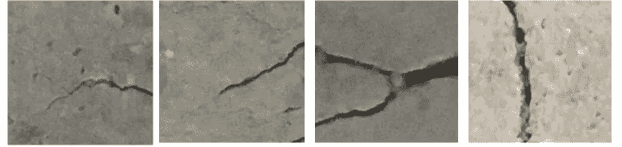

# 基于深度学习的混凝土结构表面裂缝检测

> 原文：<https://towardsdatascience.com/detection-of-surface-cracks-in-concrete-structures-using-deep-learning-f8f85cd8ac8b?source=collection_archive---------6----------------------->

## *用数据做酷事！*

Crack in Concrete Building

# 介绍

表面裂缝的检测是混凝土结构健康监测中的一项重要任务。如果裂缝发展并继续扩展，它们会减少有效的承载表面积，并且随着时间的推移会导致结构的失效。裂纹检测的手动过程费时费力，并且受到检查员主观判断的影响。在高层建筑和桥梁的情况下，人工检查也很难进行。在这篇博客中，我们使用深度学习来建立一个简单但非常准确的裂缝检测模型。此外，我们在真实世界数据上测试该模型，并且看到该模型在检测混凝土和非混凝土结构示例道路中的表面裂缝方面是准确的。代码在我的 [Github 的链接](https://github.com/priya-dwivedi/Deep-Learning/tree/master/crack_detection)上是开源的。

原文全文刊登在[我的网站](https://deeplearninganalytics.org) [这里](https://deeplearninganalytics.org/detection-of-surface-cracks-in-concrete-structures-using-deep-learning/)。

# 数据集

对于这个博客，我们使用公开可用的[混凝土裂缝图像数据集](https://data.mendeley.com/datasets/5y9wdsg2zt/2)。Ozgenel 和 Gonenc 在[论文](https://www.researchgate.net/publication/326676263_Performance_Comparison_of_Pretrained_Convolutional_Neural_Networks_on_Crack_Detection_in_Buildings)中公开了该数据集。

数据集由 20，000 幅有裂缝的混凝土结构图像和 20，000 幅无裂缝的图像组成。该数据集由 458 幅高分辨率图像(4032x3024 像素)生成。数据集中的每个图像都是 227 x 227 像素的 RGB 图像。一些有裂缝和无裂缝的样本图像如下所示:

Sample images with cracks

Sample images without cracks

可以看到，数据集有各种各样的图像——不同颜色的石板，不同强度和形状的裂缝。

# 模型构建

针对这个问题，我们用 Pytorch 搭建一个卷积神经网络(CNN)。由于我们的图像数量有限，我们将使用预训练的网络作为起点，并使用图像增强来进一步提高准确性。图像增强允许我们进行变换，如垂直和水平翻转、旋转和亮度变化，从而显著增加样本并帮助模型泛化。

对于以下步骤，请跟随我在 Github 上的[代码。](https://github.com/priya-dwivedi/Deep-Learning/blob/master/crack_detection/Crack%20Detection%20Model.ipynb)

**将输入数据混洗并分割成训练和赋值**

下载的数据将有两个文件夹，一个用于正极，一个用于负极。我们需要把这个分成 train 和 val。下面的代码片段将为 train 和 val 创建新的文件夹，并将 85%的数据随机放入 train，将 rest 放入 val。

Split into train and val

**应用变换**

Pytorch 使应用数据转换变得容易，这可以增加训练数据并帮助模型一般化。我选择的变换是随机旋转、随机水平和垂直翻转以及随机颜色抖动。此外，每个通道除以 255，然后归一化。这有助于神经网络训练。

Transforms

**预训练模型**

我们使用在 ImageNet 上预先训练的 Resnet 50 模型来启动该模型。要了解更多关于 ResNet 模型的信息，请阅读我的博客。如下所示，ResNet50 模型由 5 个阶段组成，每个阶段都有一个卷积和单位块。每个卷积块有 3 个卷积层，每个单位块也有 3 个卷积层。ResNet-50 拥有超过 2300 万个可训练参数。我们将冻结所有这些权重和 2 个更完全连接的层，第一层在输出中有 128 个神经元，第二层在输出中有 2 个神经元，这是最终的预测。

ResNet50 Model

ResNet model layers

如模型摘要所示，该模型具有 2300 万个不可训练参数和 262K 个可训练参数

Model Parameters

我们使用 Adam 作为优化器，对模型进行 6 个时期的训练。

# 真实图像上的模型训练和预测

我们使用迁移学习，然后在训练数据集上训练模型，同时在验证集上测量损失和准确性。正如下面的损失和准确性数字所示，模型训练非常快。在第一个历元之后，训练准确率为 87%，验证准确率为 97%！。这就是迁移学习的力量。我们的最终模型的验证准确率为 98.4%。

Model Training Stats

**在真实世界图像上测试模型**

现在最有趣的部分来了。是的，该模型对验证数据起作用，但我们想确保它也对来自互联网的看不见的数据起作用。为了测试这一点，我们随机拍摄了开裂的混凝土结构和路面裂缝的图像。这些图像比我们的训练图像大得多。请记住，该模型是在 227，227 像素的作物上训练的。我们现在将输入图像分成小块，并对其进行预测。如果模型预测有裂缝，我们就把补丁涂成红色(有裂缝),否则就把补丁涂成绿色。下面的代码片段可以做到这一点。

Prediction on crops

该模型在以前从未见过的图像上表现得非常好。如下图所示，该模型能够通过处理图像上的数百个补丁来检测混凝土中非常长的裂缝。

Crack Detection on Concrete. Left-Original Image. Right-Red regions are predictions with crack and green regions are predictions of no crack

此外，我还在路面裂缝上测试了该模型。这个模型不是在路面上训练出来的，但它在挑选路面裂缝方面也做得很好！

Crack Detection on Roads. Left-Original Image. Right-Red regions are predictions with crack and green regions are predictions of no crack

更多真实世界的图像和模型预测在这个项目的 [github link](https://github.com/priya-dwivedi/Deep-Learning/tree/master/crack_detection/real_images) 上分享。

# 结论

这篇博客展示了使用深度学习和开源数据来构建现实世界的应用程序是多么容易。整个工作花了半天时间，并输出了一个实用的解决方案。我希望您亲自尝试这些代码，并在更多真实世界的图像上进行测试。

我对计算机视觉和深度学习充满热情。我有自己的深度学习咨询公司，喜欢研究有趣的问题。我已经帮助许多初创公司部署了基于人工智能的创新解决方案。请到 http://deeplearninganalytics.org/.[的](http://deeplearninganalytics.org/)来看看我们吧

你也可以在 https://medium.com/@priya.dwivedi[的](https://medium.com/@priya.dwivedi)看到我的其他作品

如果你有一个我们可以合作的项目，请通过我的网站或 info@deeplearninganalytics.org 联系我

# 参考

*   2018—zgenel，f .，nenç Sorguç，a .“预训练卷积神经网络对建筑物裂缝检测的性能比较”，ISARC 2018，柏林。
*   关于裂纹检测重要性的好论文—[https://www.hindawi.com/journals/ace/2018/3924120/](https://www.hindawi.com/journals/ace/2018/3924120/)
*   关于 Pytorch 中图像分类的好博客。博客中使用的几个代码片段来自这里。
*   另一个关于 Pytorch 中图像分类的好博客。博客中使用的几个代码片段来自这里。