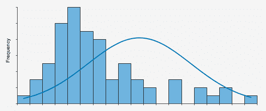

# 使用 Mann-Whitney U 检验确定两个分布是否显著不同

> 原文：<https://towardsdatascience.com/determine-if-two-distributions-are-significantly-different-using-the-mann-whitney-u-test-1f79aa249ffb?source=collection_archive---------14----------------------->

# 使用 Python 的速成课程

如果您在日常工作中使用统计学，很可能在某个时候会遇到分布比较问题。比较分布以确定它们是否不同可以带来许多有价值的见解；特别是，如果与数据集相关联的不同属性导致不同的(统计上显著的)结果。

为了更好的说明这个问题，我们来做一个例子。我们将从通过 UCI 机器学习知识库获得的'[成人'数据集](https://archive.ics.uci.edu/ml/datasets/Adult)中提取数据。这个存储库包含来自 1994 年美国人口普查的数据样本，包括个人工资(> $50K，<= 50K)、年龄、教育、婚姻状况、种族和性别等信息。

*Snapshot of the UCI data set, uploaded directly into a pandas dataframe.*

现在我们有了一些数据，让我们把它形象化。首先，我们使用 matplotlib hist()函数查看美国人口的年龄分布:

根据上面的直方图，大部分样本集中在 30 至 40 岁之间，在 35 岁左右达到高峰，之后开始下降。

但是，当我们根据收入水平对数据进行分组时，年龄分布是如何变化的呢？让我们再次可视化分布，这一次将数据分成> 50K 美元和<=$50K categories:

*Age Distribution, subset by salary level (<=$50K, >$50K)*

As you can see in the visual above, the distribution changes when we subset the data by salary level. For the population making less than $50K a year, the distribution peaks around 25 years of age. For the population making greater than $50K a year, the peak occurs around 45 years of age. This intuitively makes sense, as people earlier on in their career make less money than those later on, who are more established.

Now that we’ve graphed the different age distributions based on salary, is there a way to statistically prove that the two differ? Yes — using the Mann-Whitney U Test.

# So, what does the Mann-Whitney U Test do exactly?

The Mann-Whitney U Test is a null hypothesis test, used to detect differences between two independent data sets. The test is specifically for non-parametric distributions, which do not assume a specific distribution for a set of data. Because of this, the Mann-Whitney U Test can be applied to any distribution, whether it is Gaussian or not.

*Example of a non-parametric distribution, which doesn’t follow a standard Gaussian distribution (see line as example). Image courtesy of* [*https://www.statistixl.com/features/nonparametric-tests/*](https://www.statistixl.com/features/nonparametric-tests/) *.*

Specifically, the null hypothesis of the Mann-Whitney U Test states that the distributions of two data sets are identical. If the null hypothesis is correct, there is a 50 percent chance that an arbitrarily selected value in one distribution is greater than another arbitrarily selected value in the second distribution ( [2](https://www.graphpad.com/guides/prism/7/statistics/how_the_mann-whitney_test_works.htm?toc=0&printWindow) 。

与 Mann-Whitney U 检验相关的检验统计量定义为 U，其中 U 是 U1 和 U2 两个值中较小的一个，通过以下方程组( [3](http://sphweb.bumc.bu.edu/otlt/mph-modules/bs/bs704_nonparametric/BS704_Nonparametric4.html) )定义:

其中 R1 指的是第一组的等级总和，而 R2 指的是第二组的等级总和。n1 和 n2 分别指第一组和第二组的样本总体。

***有关如何计算 U 的分步说明，请查看以下链接，该链接涵盖非参数测试，可通过波士顿大学公共卫生学院获得:***[***http://SPH web . bumc . bu . edu/otlt/mph-modules/bs/bs 704 _ nonparametric/bs 704 _ nonparametric 4 . html***](http://sphweb.bumc.bu.edu/otlt/mph-modules/bs/bs704_nonparametric/BS704_Nonparametric4.html)

# 对数据应用曼-惠特尼 U 检验

对分布应用 Mann-Whitney U 检验很简单，只需使用 scipy.stats 包中的 mannwhitneyu()函数。我们应用代码，比较两种分布，如下所示:

我们收到以下测试输出:

第一个输出，即 U 统计量，在上一节中被定义为 Mann-Whitney U 检验的检验统计量 U。使用[双尾测试表](http://ocw.umb.edu/psychology/psych-270/other-materials/RelativeResourceManager.pdf)解释 U 统计量，该表包含 U 的临界值。为了拒绝α=0.05 的零假设，从测试中获得的 U 必须低于测试表中的 U 临界值。

当两个样本量都很大时，u 往往很大。这就解释了为什么本例中的 u 统计量(61203011.5)如此之大。

第二个 Python 输出是与测试相关联的 p 值。p 值越低，反对零假设的证据越强。根据一般经验，当 p 值低于 0.05 时，可以拒绝零假设。这个具体例子的 p 值非常低，以至于记录为 0，因此我们可以明确拒绝零假设。这一结果从统计学意义上证实了年收入超过 5 万美元的人的年龄分布不同于年收入低于 5 万美元的人的年龄分布。

我的曼-惠特尼 U 检验教程到此结束。本教程的完整 Python 代码可以在下面的 Github repo 中找到:[***【https://github.com/kperry2215/mann_whitney_comparison***](https://github.com/kperry2215/mann_whitney_comparison)

***另外，看看我的一些其他数据科学教程:***

 [## 使用 Python - Tech Rando 中的 AutoML 自动调整和选择 ML 模型

### 在同一数据集上测试不同的 ML 方法以评估模型性能可能是一项单调乏味的任务。此外…

techrando.com](https://techrando.com/2019/10/21/automate-your-ml-model-tuning-and-selection-a-review-of-different-python-automl-packages/)  [## 时间序列中离群点检测的无监督机器学习方法

### 在这篇文章中，我将介绍一些我最喜欢的检测时间序列数据中异常值的方法。有许多不同的…

techrando.com](https://techrando.com/2019/08/23/unsupervised-machine-learning-approaches-for-outlier-detection-in-time-series/)  [## 使用 Python - Tech Rando 进行变化点检测简介

### 我的很多工作都大量涉及时间序列分析。我使用的一个很棒但不太为人所知的算法是…

techrando.com](https://techrando.com/2019/08/14/a-brief-introduction-to-change-point-detection-using-python/) 

# 来源

1.  [https://www.statistixl.com/features/nonparametric-tests/](https://www.statistixl.com/features/nonparametric-tests/)
2.  [https://www . graph pad . com/guides/prism/7/statistics/how _ the _ Mann-Whitney _ test _ works . htm？toc=0 &打印窗口](https://www.graphpad.com/guides/prism/7/statistics/how_the_mann-whitney_test_works.htm?toc=0&printWindow)
3.  [http://SPH web . bumc . bu . edu/otlt/mph-modules/bs/bs 704 _ nonparametric/bs 704 _ nonparametric 4 . html](http://sphweb.bumc.bu.edu/otlt/mph-modules/bs/bs704_nonparametric/BS704_Nonparametric4.html)

*原载于 2019 年 11 月 21 日 https://techrando.com**的* [*。*](https://techrando.com/2019/11/21/determine-if-two-distributions-are-significantly-different-using-the-mann-whitney-u-test/)