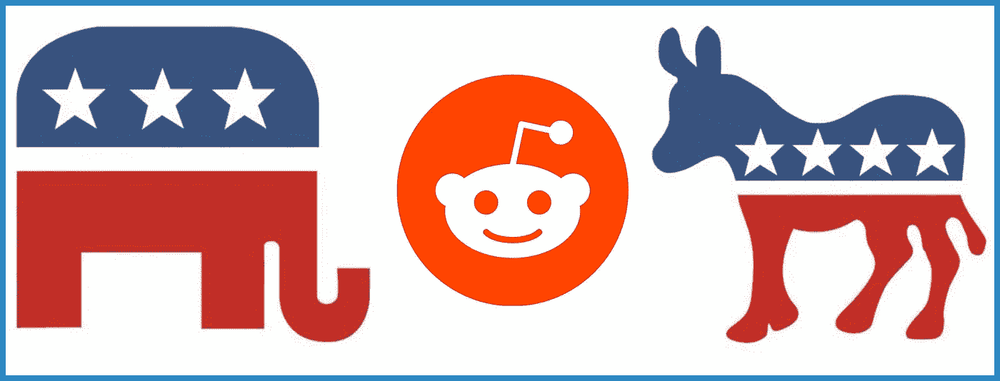
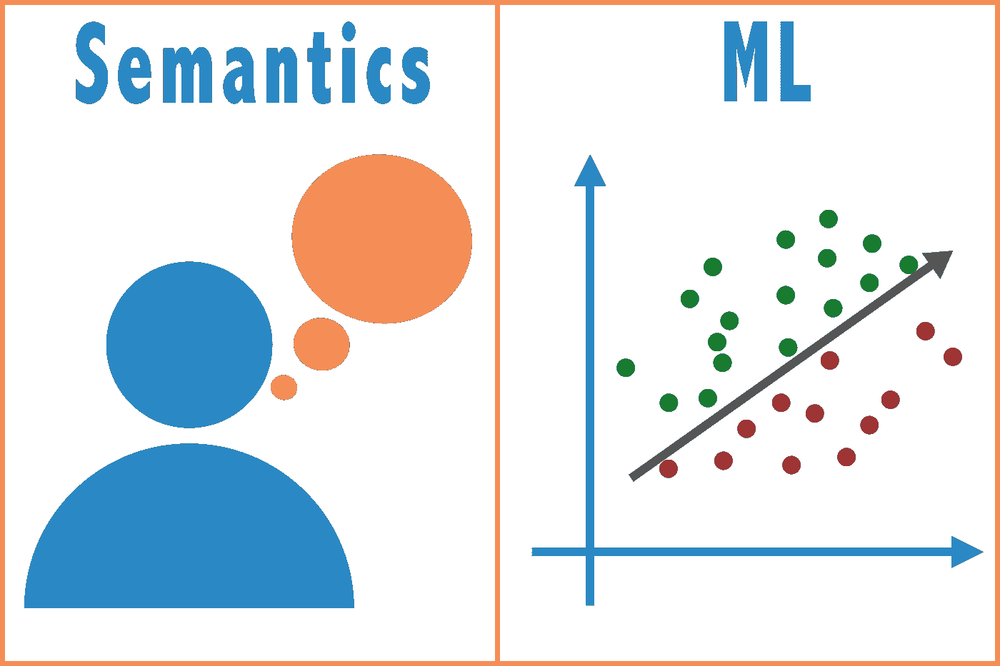
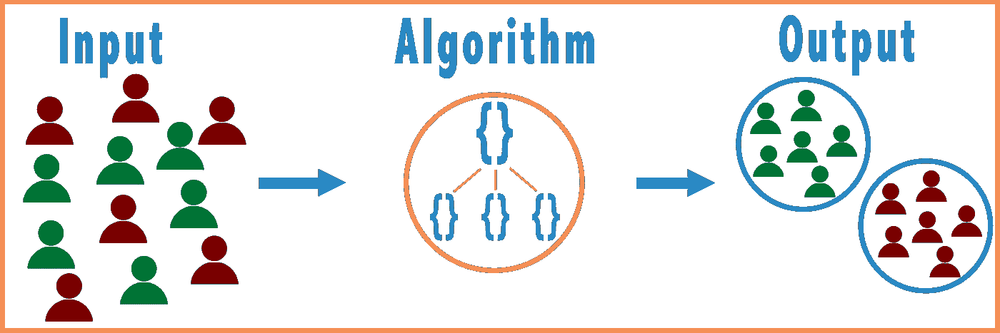
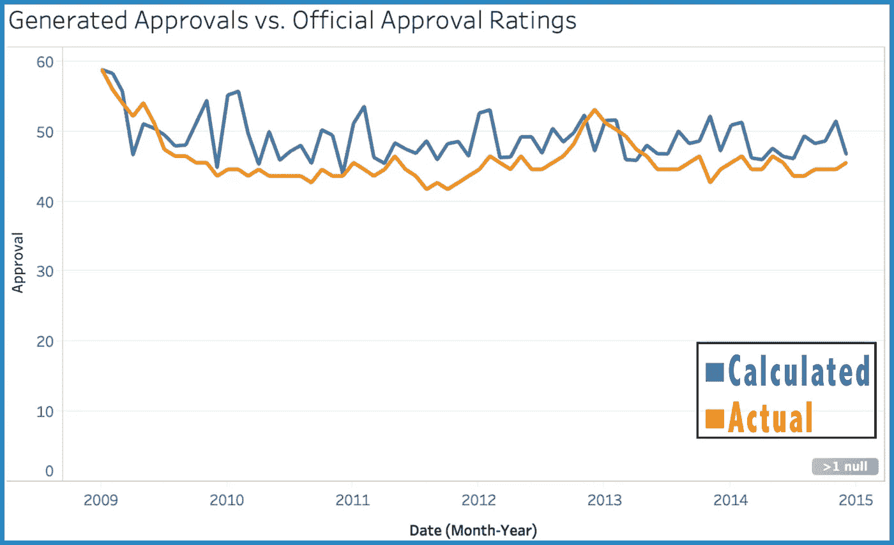
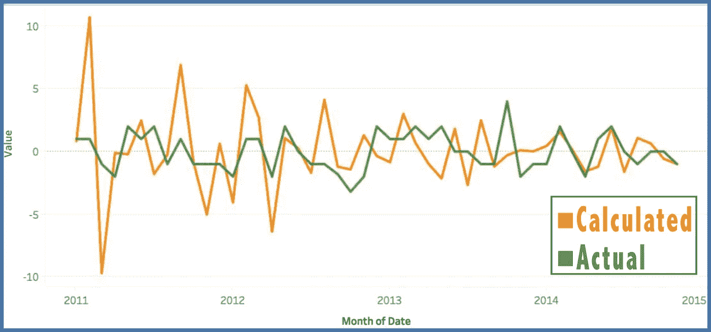
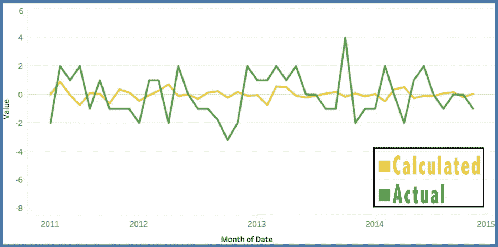

# 使用 Reddit 情绪分析确定总统支持率

> 原文：<https://towardsdatascience.com/determining-presidential-approval-rating-using-reddit-sentiment-analysis-7912fdb5fcc7?source=collection_archive---------12----------------------->

## NLP 调查 Reddit 的聚合情绪如何预测美国总统的支持率

在过去的一个学期里，我和其他 5 名杜克大学的本科生一起从各种子数据中提取信息，以预测和确定总统的支持率。在 Reddit 上，有人赞美总统，有人厌恶总统。我们的团队量化了这种情绪，计算了平均值，得出了一些有趣的结果。我们的分析只关注总统的支持率，但我们的方法很容易推广到计算任何人、政策或产品的支持率。值得注意的是，我们在这个项目中关注巴拉克·奥巴马总统，因为在他担任总统期间有最多的可用数据。

# 团队

如前所述，这个问题是由 6 名杜克大学本科生解决的——电气和计算机工程专业的大二学生**米兰·巴特**、经济学和计算机科学专业的大四学生**安德鲁·库夫**、计算机科学专业的大三学生 [**凯瑟琳·达纳**](https://www.linkedin.com/in/catherine-dana-a9720a133/) 、计算机科学专业的大三学生 [**梅兰妮·法费尔**](https://www.linkedin.com/in/melanie-farfel/) 、经济学和计算机科学专业的大四学生**亚当·斯诺登**、生物学和计算机科学专业的大三学生**我自己**

# 动机和问题定义

Reddit 已经被广泛用于分享观点和想法。讨论一个主题有特定的论坛；这些被称为**子编辑**。我们看了 3 个子主题:[*r/政治*](https://www.reddit.com/r/politics/) ，*[*r/民主党*](https://www.reddit.com/r/democrats/) ，[*r/共和党*](https://www.reddit.com/r/Republican/) 。正如你可能猜到的，第一个致力于围绕所有政治的讨论。*共和党/民主党*和*共和党/共和党*都是民主党和共和党成员讨论政策、议题和候选人的论坛。*

*每个子编辑都有数百万条评论和数千条帖子。我们使用包含这些帖子的数据集进行分析。我们也非常依赖情感分析。**情感分析是利用自然语言处理系统地量化书面语言表达的态度**。比如那句“最悲惨的事就是在车流中等待。”是否定句。然而，这句话“这是美妙的击败高峰时间的交通和快速回家。”是肯定句。*

*我们可以对关于总统的帖子进行情感分析，看看用户是否对总统赞不绝口，如果是的话，有多赞。我们在子网站上的帖子的总体情绪和总统的支持率之间建立了联系。*

**

# *数据源*

***我们的主要数据源是 2011 年至 2016 年 Reddit 评论** **的一个** [**大型 JSON 对象，其中包括所有公开评论的评论、评分和子编辑。**这是一个压缩了 250GB 的海量数据集。我们使用了拉斯姆森报告](https://www.reddit.com/r/bigquery/comments/3cej2b/17_billion_reddit_comments_loaded_on_bigquery/)中的[总统支持率数据集，这些数据是由国家调查生成的。](http://www.rasmussenreports.com/scoreboards/obama_approval_index_month_to_month)*

*使用 Google BigQuery，我们从提到的三个子条目中提取了所有包含单词“Obama”的评论。我们用一个详尽的正则表达式清除了每个注释，替换了所有非字母数字值。我们按月份和年份汇总了评论。**我们的基本对象有 3 个值:发表评论的日期、子编辑和评论本身。***

*BigQuery 上的查询结果是一个 CSV 文件。我们使用 Python 来访问和分析 CSV 文件中的信息。我们根据评论发表的月份和年份对它们进行了分类。*

# *情感分析*

*对于我们的情感分析，我们非常依赖于 [TextBlob](https://textblob.readthedocs.io/en/dev/) ，这是一个用于处理和分析文本的 Python 库。我们主要使用他们的情感分析方法，该方法返回[-1，1]范围内的一个数字，其中-1 完全是负数，1 完全是正数。有两种主要的情感分析方法——**语义方法**和**机器学习方法**。*

**

*语义方法获取句子中各个单词的情感总和(或平均值)。输入句子中的单词被**词条化**，这意味着它们由一个共同的词根分组。这是因为*生气、愤怒、愤然、*和*恼*都指代同一个负面想法。然后将每个单词的情感相加，为句子生成一个值。我们也可以在使用*而非*时**反转**情绪。“不开心”这个短语可以类似于“心烦”来量化。此外，如果使用像*非常*、*非常*或*难以置信*这样的修饰语，我们可以**更重视**的情感。*

*第二种方法是有**监督的** **机器学习方法**。在机器学习中，**监督算法**被赋予两个参数:(1)输入和(2)预期输出。该算法然后推断出将输入映射到输出的函数。然后，该函数可用于新的输入，以产生输出。这种方法是典型的分类问题。有兴趣了解更多的，看[这里](https://medium.com/@Mandysidana/machine-learning-types-of-classification-9497bd4f2e14)。*

**

# *分析方法*

*在我们的方法中，我们对给定月份和年份的所有类别的情绪进行了平均。在 4 年的时间里，这产生了 48 个数据点。然后，我们将这些数据点标准化为实际支持率的范围。我们最小的数据点成了 4 年来最低的支持率。我们最大的变成了最大的。所有其他值以类似方式映射。这可能扭曲了我们的基本数据，但它让我们更清楚地看到趋势和轨迹。*

# *结果*

*第一个结果来自 *r/politics* 。我们发现相关系数为 0.495，这表明这两条线是正相关的。然而，我们发现最有趣的趋势。**我们发现，在实际支持率适度上升和下降的同时，我们计算出的支持率也呈双曲线上升和下降。**鉴于 Reddit 的性质，这一结果是直观的。发帖的人往往观点比较夸张。这导致了更多的两极分化的帖子，更大的情绪值，和更多的双曲线趋势。*

**

*在上图中，我们看了一下**的支持率**。对于*共和党人*和*共和党人*，我们决定分析**支持率的趋势**。这是通过计算我们计算值的斜率(一阶导数)来实现的。我们又一次看到了更加夸张和放大的变化。出于与上述类似的原因，这是有意义的。下图显示了*共和党/民主党的结果。**

**

*然而，这是**而不是**共和党/共和党的情况。我们再次关注了支持率的趋势，我们看到了更多停滞不前的结果。实际上，支持率的趋势并没有什么有意义的变化。**我们的团队查看了*共和党人/共和党人*情绪分析的原始值，发现帖子的聚合几乎总是负面的。我们假设这是党派政治的副产品，在党派政治中，每个政党都强烈批评对方的任何行动或政策。在 subreddits 上尤其如此，因为用户可能更倾向于党派。***

**

# *结束语*

*从网络资源中提取情感已经成为一个有趣的问题，尤其是在政治领域。对于那些感兴趣的人来说，[这里](https://web.stanford.edu/~jesszhao/files/twitterSentiment.pdf)是一篇有趣的文章，它使用 Twitter 的情绪分析来观察 2016 年的选举。这种方法代表了一种相对较新的方式来预测公众对从政策到人民的任何事情的反应。对于那些对复制结果或使用我们的代码感兴趣的人，请看这里的。*

# *感谢阅读！*

*有问题吗？评论？给我发电子邮件到[andrew.oliver.medium@gmail.com](mailto:andrew.oliver.medium@gmail.com)！*