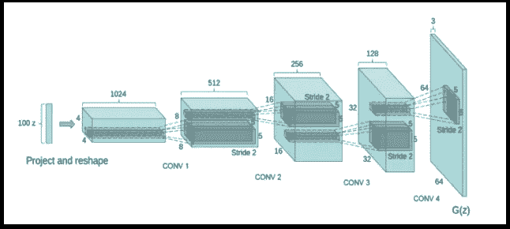
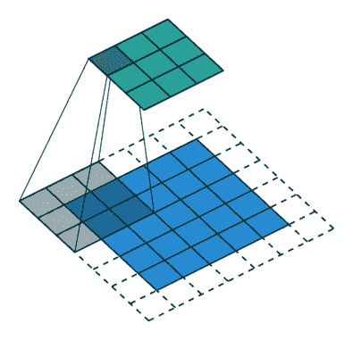

# 在 Tensorflow 2.0 中开发 DCGAN 模型

> 原文：<https://towardsdatascience.com/developing-a-dcgan-model-in-tensorflow-2-0-396bc1a101b2?source=collection_archive---------6----------------------->

# 介绍

2019 年 3 月初，TensorFlow 2.0 发布，我们决定基于 [Taehoon Kim](https://github.com/carpedm20/DCGAN-tensorflow) 的 DCGAN 实现创建一个图像生成器。下面是如何在 TensorFlow 2.0 中开发 DCGAN 模型的教程。

> *“为了避免 D(鉴别器)网络的快速收敛，G(生成器)网络每更新一次 D 网络就更新两次，与原论文不同。”*
> 
> ***—金泰勋***

# 先决条件

*   Jupyter 笔记本
*   张量流 2.0
*   访问高性能 GPU

# DCGAN 架构

下图显示了 DCGAN 论文中引用的生成器。本质上，该网络接收一个 100x1 噪声矢量，标记为 *100z* ，并将其映射到 64x64x3 的 G(Z)输出。

> 100 x 1→1024 x 4 x 4→512 x 8 x 8→256 x 16 x 16→128 x 32 x 32→64 x 64 x 3

第一层通过在每一步投影和整形来扩展随机噪声



Source: carpedm20

## 大步

跨距指定了卷积沿高度和宽度的“步数”。这里有一个动画示例:



An example of strides

## 输入噪声

```
generator = make_generator_model()noise = tf.random.normal([1,100]) # shape is 1, 100
generated_image = generator(noise, training = False)plt.imshow(generated_image[0, :, :, 0], cmap =”gist_rainbow”)
```

## 致密层

在 Keras 中，您可以创建层来开发模型。模型通常是层的网络，其中最常见的类型是层的堆叠

将密集连接的图层添加到模型将接受 shape (*，100)的输入数组。第一层之后数据的形状将为(*，4*4*1024)。在这种情况下，由于自动形状推断

批处理标准化功能类似于网络每一层的预处理，您不需要指定向前移动的输入的大小。

ReLU 对于所有正值都是线性的，对于所有负值都设置为零。泄漏 ReLU 对于负值具有较小的斜率，而不是完全为零。

> 例如，当 x < 0

```
def **make_generator_model**():

 model = tf.keras.Sequential()

 model.add(layers.Dense(4*4*1024, use_bias = False, input_shape = (100,)))

 model.add(layers.BatchNormalization())

 model.add(layers.LeakyReLU())
```

## First Layer

The generator uses a transposed convolutional layer (upsampling) to produce an image from seed (random noise).

*   **512** 是输出空间的维度时，泄漏 ReLU 可以具有 y = 0.01x
*   **(5，5)** 指定 2D 卷积窗口的高度和宽度
*   **步幅= (2，2)**

```
model.add(layers.Conv2DTranspose(512, (5, 5), strides = (2,2), padding = “same”, use_bias = False))

assert model.output_shape == (None, 8, 8, 512)
model.add(layers.BatchNormalization())
model.add(layers.LeakyReLU())
```

## 第二层

生成器使用转置卷积层(上采样)从前一层生成图像。

*   256 是输出空间的维数
*   **(5，5)** 指定 2D 卷积窗口的高度和宽度
*   **步幅= (2，2)**

```
model.add(layers.Conv2DTranspose(256, (5,5), strides = (2,2), padding = “same”, use_bias = False))assert model.output_shape == (None, 16, 16, 256)
model.add(layers.BatchNormalization())
model.add(layers.LeakyReLU())
```

## 第三层

生成器使用转置卷积层(上采样)从前一层生成图像。

*   128 是输出空间的维数
*   **(5，5)** 指定 2D 卷积窗口的高度和宽度
*   **步幅= (2，2)**

```
model.add(layers.Conv2DTranspose(128, (5,5), strides = (2,2), padding = “same”, use_bias = False))assert model.output_shape == (None, 32, 32, 128)
model.add(layers.BatchNormalization())
model.add(layers.LeakyReLU())
```

## 最后一层

生成器使用转置卷积层(上采样)从前一层生成图像。

*   64 是输出空间的维数
*   **(5，5)** 指定 2D 卷积窗口的高度和宽度
*   **步幅= (2，2)** 指定卷积沿高度和宽度的步幅

```
model.add(layers.Conv2DTranspose(3, (5,5), strides = (2,2), padding = “same”, use_bias = False, activation = “tanh”))assert model.output_shape == (None, 64, 64, 3)
 return model
```

## 价值函数

发电机的损耗量化了它欺骗鉴别器的能力。直观地说，如果生成器运行良好，鉴别器会将假图像分类为真实图像(或 1)。

这里，我们将把鉴别器对生成的图像的决定与 1 的数组进行比较。

```
def **generator_loss**(fake_output):
 return cross_entropy(tf.ones_like(fake_output), fake_output)
```

## 【计算机】优化程序

鉴别器和生成器优化器是不同的，因为我们将分别训练两个网络。Adam 优化算法是随机梯度下降的扩展。

随机梯度下降为所有权重更新保持单一学习率(称为 alpha ),而学习率在训练期间不变。
为每个网络权重(参数)保持一个学习速率，并随着学习的展开而调整。

```
generator_optimizer = tf.keras.optimizers.Adam(1e-4)
discriminator_optimizer = tf.keras.optimizers.Adam(1e-4)
```

# 结果— MNIST

首先，我们在 MNIST 数据集(28 x 28 灰度图像)上使用 3 个反卷积层来训练我们的 DCGAN 模型，这产生了更清晰的渲染，如下所示:

# 结果— CelebA

使用在 CelebA 数据集(25，600 / 202，599 张图像)的子集上训练的具有 4 个 DC 层的 DCGAN 模型，我们能够生成运行 100 个时期的类似人脸的图像。

# 工具/资源

## [纸张空间](http://paperspace.com)

*   TensorFlow 1.5 — GPU — Py3 — P5000
*   TensorFlow 2.0 — GPU — Py3 — P5000
*   tensor flow 2.0—GPU—Py3—Tesla V100

## **MNIST 数据集**

*   60，000 张图片
*   128 x 128

## CelebA 数据集

*   202，599 张图片
*   从 218 x 178 转换为 64 x 64

# 挑战

*   了解使用 Tensorflow 创建的 GAN 模型
*   利用 Tensorflow 2.0 开发 DCGAN 模型
*   将数据集图像从 218 x 178 调整/裁剪为 64 x 64
*   训练新模型时 Jupyter 笔记本出现内存泄漏
*   与 TensorFlow 1.3 和 2.0 不兼容
*   12 小时后纸张空间自动关闭

# 未来的工作

*   将模型迁移到可以使用 CelebA 数据集完整计算 100 个历元的环境中
*   调整模型架构以生成更好的图像
*   开发一种解决方案来更有效地调整图像大小

[](https://github.com/skywall34/BabyGan) [## skywall34/BabyGan

### 带 DCGAN 的图像发生器。在 GitHub 上创建一个帐户，为 skywall34/BabyGan 开发做贡献。

github.com](https://github.com/skywall34/BabyGan) 

# 参考

没有互联网的伟大人们，我们不可能完成这个项目。请为您的下一个数据科学项目查阅以下资源:

*   **深度卷积生成对抗网络的无监督表示学习**——[https://arxiv.org/abs/1511.06434](https://arxiv.org/abs/1511.06434)
*   **使用生成模型的压缩感知**——【https://arxiv.org/pdf/1703.03208.pdf 
*   在 TensorFlow 中使用深度学习的**图像完成**—[http://bamos.github.io/2016/08/09/deep-completion/](http://bamos.github.io/2016/08/09/deep-completion/)