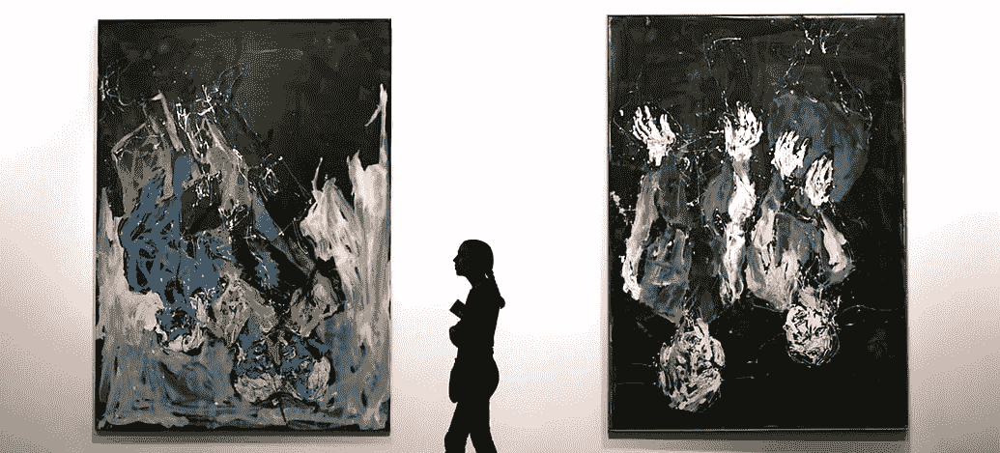
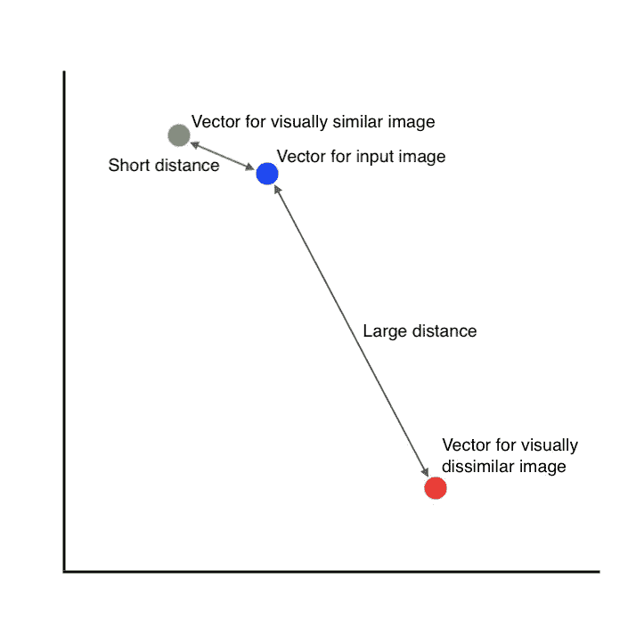
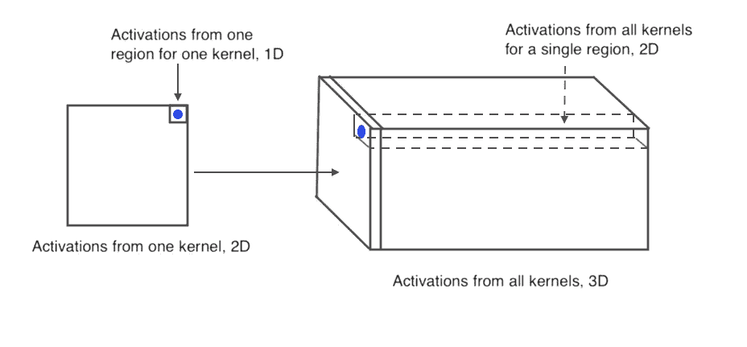
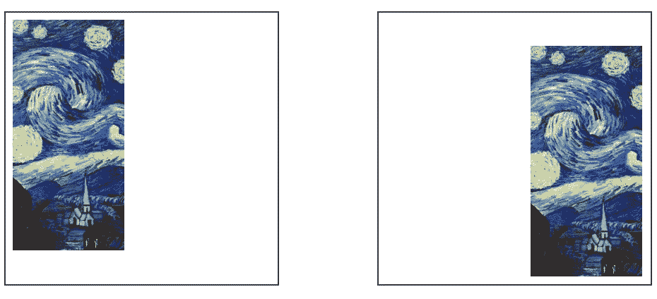
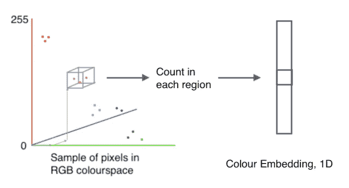
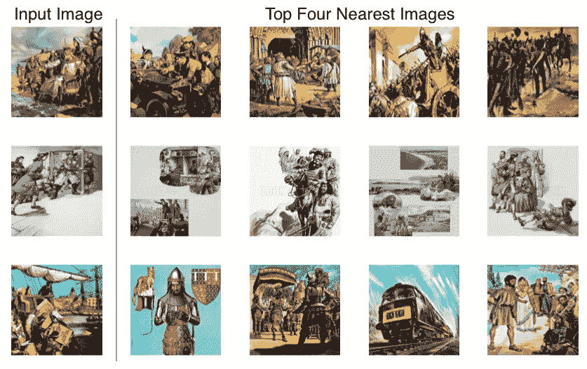

# 为艺术品的视觉相似性比较开发艺术风格嵌入

> 原文：<https://towardsdatascience.com/developing-art-style-embeddings-for-visual-similarity-comparison-of-artworks-7a9d4ade2045?source=collection_archive---------15----------------------->

## 这项任务是作为一个高清历史图片在线图书馆[的概念验证的一部分。](https://www.lookandlearn.com)

本练习的目的是找到一个将图像转换为嵌入向量的函数，其中向量之间的欧几里德距离表示图像在视觉上的相似程度。这允许对一个图像的嵌入进行最近邻搜索，以返回视觉上相似的图像，从而实现图像推荐和聚类。

这项任务因图像是插图而不是照片而变得复杂。虽然照片是主题的真实表现，因此相似的主题和构图会产生视觉上相似的图像，但插图包括风格的额外维度。

> 风格:“绘画、写作、作曲、建筑等的一种方式。某一特定时期、地点、人物或运动的特征

为了创建图像嵌入，使用了两种方法:

*   卷积神经网络嵌入
*   3D 色彩空间最近邻

## 卷积神经网络嵌入

用于将图像转移到嵌入的模型借鉴了来自**神经类型转移**和**电子商务图像内容相似性工作**的发现。 [*一种艺术风格的神经算法*](https://arxiv.org/abs/1508.06576) 由Gatys et。al 和@Raghul Asokan 撰写的被用来研究神经类型转移。[使用 TensorFlow 创建图像相似性函数及其在电子商务中的应用](https://blog.griddynamics.com/create-image-similarity-function-with-tensorflow-for-retail/)作者 [Nina Pakhomova](https://blog.griddynamics.com/author/nina-pakhomova/) 用于开发对相似图像检索技术的理解。

风格转移和图像相似性技术都利用预先训练的卷积(CNN)图像分类模型来从图像中提取和抽象信息。这些模型已经被训练来提取用于分类目的的信息，随着网络深度的增加，中间卷积层捕获关于图像内容的越来越复杂的信息。

[source](http://www.cs.toronto.edu/~frossard/post/vgg16/)

为此，我将使用在 image-net 数据库上训练的 VGG-19 模型，其架构如上图所示。为了利用这个网络提取艺术风格，我们必须首先做出一些主观假设，在手头任务的背景下是什么定义了风格。

*   我们假设一种风格可以被描述为各种纹理和颜色的组合。
*   我们还假设子特征，即整体图像中重复出现的小部分，对我们体验的风格很重要。例如，一幅建筑物和一幅风景的铅笔画可能具有相似的纹理，但是建筑物的锐角和窗户赋予了建筑图一种与风景截然不同的风格。

幸运的是，我们知道 CNN 在每个卷积层捕获并提取这些信息，每个核“搜索”纹理或子特征。当纹理或子特征存在于底层图像中时，内核在对图像该区域进行采样时输出较高的值。单个内核的激活过程如下所示。

[https://www.mdpi.com/1996-1073/12/15/2846/xml](https://www.mdpi.com/1996-1073/12/15/2846/xml)

当一个层的所有内核都通过输入时，深度等于内核数量 k 的 3D 矩阵被输出。

这些内核越深入网络，提取的纹理就越复杂，最深的内核激活整个结构，如眼睛或窗户。这种行为在[深层梦境](https://en.wikipedia.org/wiki/DeepDream)的图像中得到了证明。

使用我们上面关于什么定义艺术风格的假设，并且知道每个核捕获艺术风格的不同元素，我们可以使用来自特定区域的所有核的激活的组合作为该区域的艺术风格的数学描述。为了总结所有地区的这些发现，人们可以简单地将每一次激活整合成一个嵌入向量，就像在**电子商务图像内容相似度中所做的那样。**然而，这种方法效率低，因为它需要存储每个激活，并且对图像上的空间变化敏感。这将导致下面的两幅图像被评为风格非常不同，尽管只是在空间上有所不同。

为了克服这些问题 *Gatys et。al* 在他们的神经风格转印纸中使用 gram 矩阵。Gram 矩阵计算每个内核的输出之间的相关性。在其输出中显示高相关性的核组合被认为是图像风格的描述。例如，在上面的《星夜》中，两幅图像中的单个笔触和漩涡的纹理高度相关，因此图像的克矩阵是相似的。

在计算上，通过将卷积输出展平为 2D 数组来计算格拉姆矩阵，每个内核为列，每个激活为行，a。该数组与其转置的点积作为格拉姆矩阵 G 输出。此处 G(i，j)给出了内核 I 和 j 的激活之间的相关性。*注意，术语“相关性”的使用相当宽松，因为这不是统计意义上的真实相关性。潜在地，术语累积共活化将更准确。*

产生的 gram 矩阵的大小是 k，它被展平成一个向量用于存储。从哪个(些)中间层提取内核输出是通过反复试验确定的，重点放在性能上，因为使用的层越深，所需的计算和计算时间就越多。

## 3D 色彩空间最近邻

哪些颜色是显而易见的视觉描述符，也是我们不想忽视的。虽然 gram matrices 将提取颜色信息，但我们使用了二次采样方法来明确编码当前的主色。色彩降维已经被很好地记录下来，通常为了提取图像中的主色，我会使用聚类方法，比如 K-means。然而，在这种情况下，我希望将图像的颜色表示为一个向量，其中每个元素总是对应于相同的颜色，从而允许图像之间的比较。

为了实现这一点，图像的 3D RGB 色彩空间被分成 n 个互斥的立方体，每个立方体的边长为 255/n。对每个立方体内的像素数量进行计数，并将计数存储在长度为 n 的向量中。

## 嵌入结构

最后，将展平的 gram 矩阵与颜色嵌入连接起来，形成维数为 N = k + n 的嵌入。

Model Architecture

## 结果

10，000 幅图像的样本集用于测试该模型。由于这种方法是无人监督的，不需要进一步的训练，这个小集合是足够的。

*如果你正在读这封信，感谢你能走这么远！随着这个项目的继续，请随时关注。*

