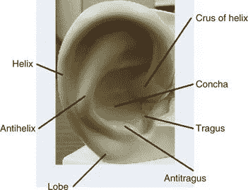
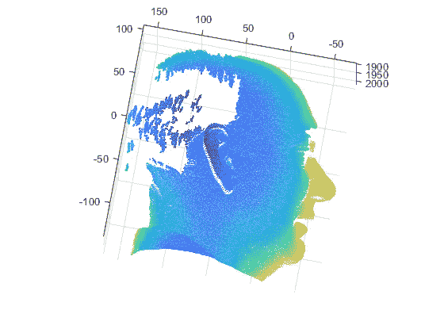
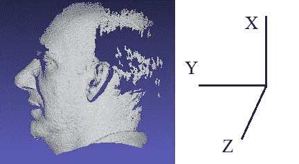
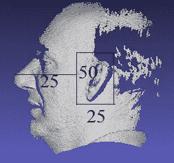
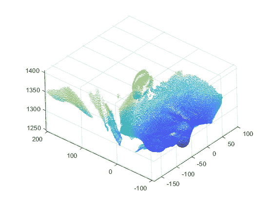
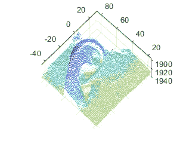
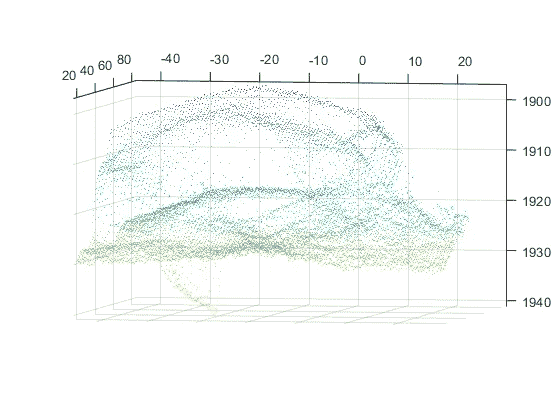
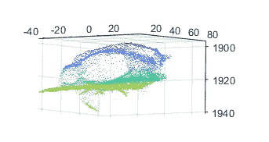

# 利用 Matlab 开发三维人耳识别系统

> 原文：<https://towardsdatascience.com/development-of-3d-ear-recognition-system-using-matlab-c2fab95e874b?source=collection_archive---------18----------------------->

## 处理 3D 耳朵图像的初学者指南

人脸、虹膜和指纹已被广泛用于个人身份验证的生物特征。在计算机视觉和图像处理中使用最先进的深度学习技术，使开发的系统的准确性提高了近 100%。然而，基于这些特点的生物特征识别系统很容易被伪造，尤其是基于指纹的身份认证，并且很难获取虹膜样本。因此，研究人员正在尝试开发新的身份验证特征。最近的研究表明，人类的耳朵代表了某种独特的形状和模式，可以用来识别一个人。

1.  据报道，一个人的双耳的结构和形状几乎相同，但与其他人严格不同，这使其成为一种适合于个人识别的特征。
2.  与面部不同，它不受年龄影响，即耳朵的形状不会随着年龄和时间而改变。
3.  与指纹和虹膜不同，基于耳朵的生物特征识别系统不需要用户合作来获取样本，并且可以在不受限制的环境中无需用户的确认而被捕获。

可用于开发基于耳朵的生物特征识别系统的几何形状特征如图 1 所示。

Figure 1: Key components of ear ([source](https://link.springer.com/referenceworkentry/10.1007%2F978-0-387-73003-5_171))

图 1 显示了主要的形态学组成部分，包括外耳轮(即耳朵的外部结构)、对耳轮、耳垂、对耳屏、外耳和耳轮脚。

从 2D 图像中提取特征相对容易，因为存在对应于颜色、形状和纹理的灰度值。在三维图像中，我们只有(X，Y，Z)点和深度值，这使得很难分析关键部件的几何形状。在从 3D 人耳图像中提取特征之前，我将讨论开发人耳生物识别系统的预处理步骤。其中一个困难的部分是找到耳朵的位置，并从整个图像中裁剪出来。在本文中，我使用鼻尖的深度值从整个侧面人脸图像中裁剪出耳朵。

# 关于数据库

我们使用了圣母大学(UND)的数据库，这些数据库免费供公众使用。如下所述，所获得的数据库属于几个集合:

*   集合 E : 114 个人，464 张可见光侧脸(耳)图像，拍摄于 2002 年。
*   **收藏 F** : 302 个人体对象，942 张 3D (+对应 2D)侧面(耳)图像，拍摄于 2003 年和 2004 年。
*   **收集 G** : 235 个人类对象，738 张 3D (+对应的 2D)侧面(耳朵)图像，拍摄于 2003 年至 2005 年。
*   **收集 J2** : 415 名人类受试者，1800 张 3D (+对应的 2D)侧面(耳)图像，拍摄于 2003 年至 2005 年之间。

然而，在我们的实验中，我们使用了集合 F 和集合 G 样本。

# 读取 3D 深度图像

数据库的示例图像是. abs.gz 格式。不过，UND 也提供了相应的 RGB 图像，但我只使用了 3D raw 图像进行实验。您可以读取原始图像并可视化 X、Y 和 Z 的每个平面，如这里讨论的。整个过程与三维人脸可视化的过程相同。但是，耳朵区域的裁剪与面部部分的裁剪略有不同。接下来，我将讨论如何从整个 3D 图像中裁剪耳朵区域。

# 耳朵检测和裁剪

在裁剪 ROI(感兴趣区域)之前，让我们先看看图像在数据库中的方向。

Figure 2: 3D visualization of database image.

Figure 3: Visualization in Meshlab

图 2 和图 3 是同一主题的不同角度的视图。你可以使用 Matlab 旋转并使其方向一致。从上面的图中可以清楚地看到，数据库图像带有侧脸，只有整个脸部的耳朵部分对我们来说是重要的。因此，我们必须从整个面部只修剪耳朵。要裁剪耳朵区域，首先让我们了解每个图像中可用的深度信息。如果用于获取图像的相机被放置在面向原点的 z 轴处，并且人正看着 y 轴的递增值，则耳尖将具有最小深度值，鼻尖将具有最大深度值。如果仔细观察图 2，您会注意到深度值从 1900 增加到 2000。这意味着它的耳尖离相机很近。要了解更多关于耳尖深度的信息，请看这篇文章的[图 5。唯一的区别是，我计算的是鼻尖，而我们讨论的是耳尖。从图 3 中可以看出，耳尖具有最小的 *z 值*，而鼻子具有最大的 *y 值*。](/development-of-3d-face-recognition-using-matlab-a54ccc0b7cdd)

参见图 2，我们可以说鼻尖在 y 方向*上的值约为-55 单位。耳朵和鼻尖之间的距离大约为 25 个单位，并且对于每张图像来说几乎是固定的，除非图像没有捕捉到除此之外的角度。我们将在这篇文章的后面讨论它，现在，我凭经验发现 50 个单位高度和 25 个单位宽度的矩形形状足以覆盖整个耳朵区域，如果这个矩形形状距离鼻子点+/- 25 个单位。这里，鼻尖为负值时考虑+25，即要捕捉右耳图像(如图 2 所示)，当 *y 值*(鼻尖)为正时考虑-25，人正看着 *y 值*的增加值。这是传感器对左耳成像的情况。要理解 ROI 的裁剪过程，请参见图 4。*

Figure 4: Cropping ROI

然而，一些图像样本是在不同的方向收集的，如图 5 所示。对于这样的图像，我没有发现耳朵和鼻尖之间有任何关系

Figure 5: Image captured at different angle.

因此，我没有选择这些图像进行进一步的处理。(如能对这些图像的处理提供任何帮助，我们将不胜感激)。考虑图 4 所示的 ROI 裁剪方法，得到的图像如图 6 所示。

Figure 6(a)

Figure 6(b)

图 6(a)和 6(b)表示以不同角度示出的被裁剪的耳朵区域。这些图像可能有孔洞、噪声；因此，有必要对其进行仔细的预处理。在下一节中，我们将讨论去除尖峰、孔洞填充和去噪的方法。

# 去尖峰、填洞和去噪

**去尖峰**:3D 面有噪声，包含尖峰，因此需要应用平滑技术。在我们的研究中，我们将 2D 加权中值滤波技术的概念扩展到三维人脸图像。所研究的技术使用网格中值滤波的加权中值实现来执行 3D 数据集的滤波。

**补洞:**去除尖刺会导致孔洞的产生，因此有必要对这些孔洞进行补洞。为此，我们使用了 3D 插值。在所有的插值技术中，我们使用了'*'立方'*。在*三次*插值方法中，查询点处的插值基于每个维度中相邻网格点处的值的三次插值。这种插值基于三次卷积。

**去噪:**我用 3D 高斯滤镜去噪。

用于预处理步骤的代码如下所示。

最后，预处理后的人耳图像如图 7 所示。我们发现一些孔在预处理步骤后仍然存在，这意味着进一步改进是可能的。为此，您可以使用其他方法来生成更好的特征。

Figure 7: Pre-processed ear image

最后，我从云点生成网格，用于从 3D 裁剪的耳朵图像中提取特征，这将在下一篇文章中讨论。完整的代码可以在我的 [GitHub](https://github.com/gautamkumarjaiswal/3DEarRecognition) 库中找到。您可以下载并使用它对 3D ear 数据集进行预处理。如果你觉得这篇文章有帮助，请随意投赞成票。

我要感谢 **Jayeeta Chakraborty** ，他同样为开发这个项目做出了贡献。在下一篇帖子里，我将分享 3D 人耳识别的*迭代最近点* (ICP)方法。[编辑:由于一些权限问题，我现在不被允许分享 ICP 的代码。]我希望这篇文章可以帮助初学者开始使用 3D 数据库。