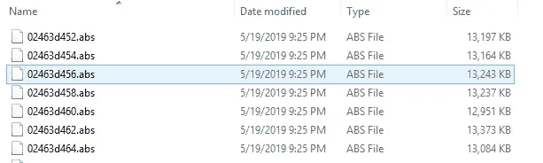
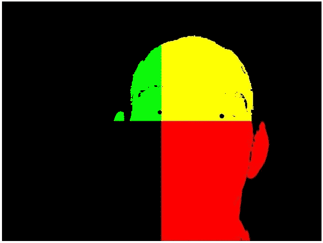
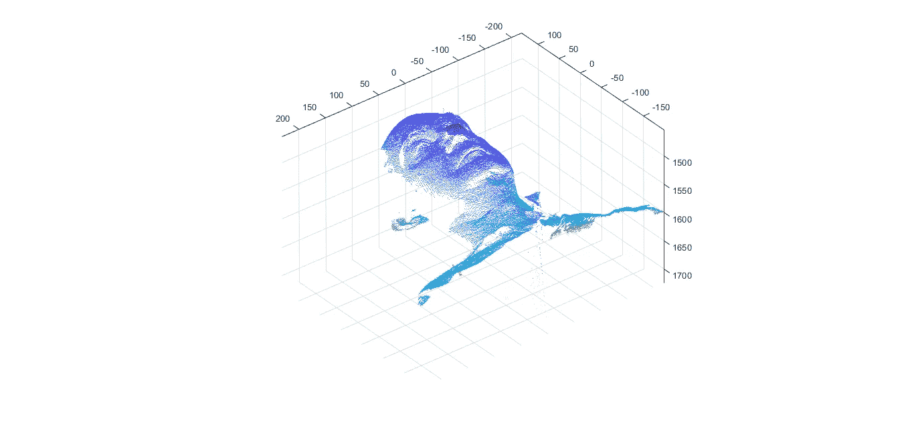
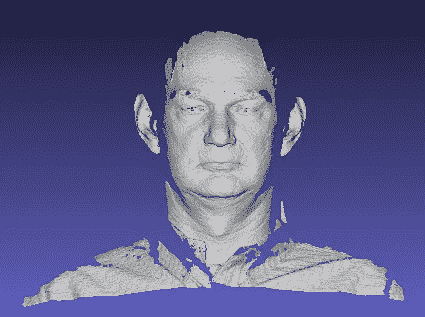
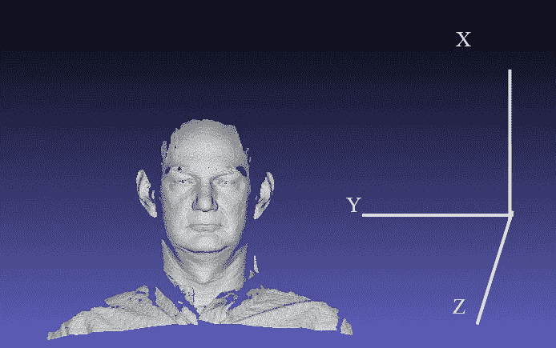
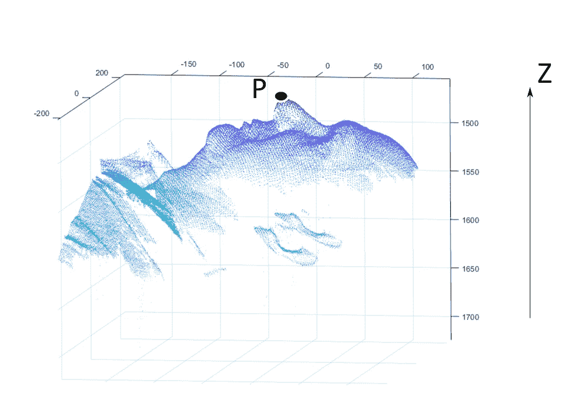
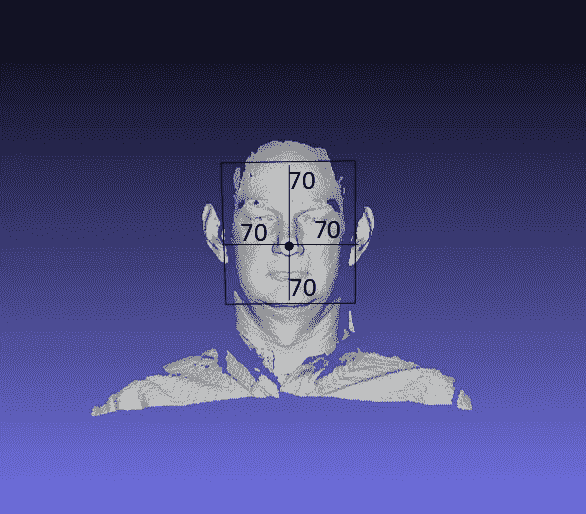
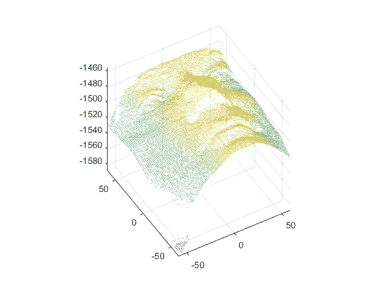
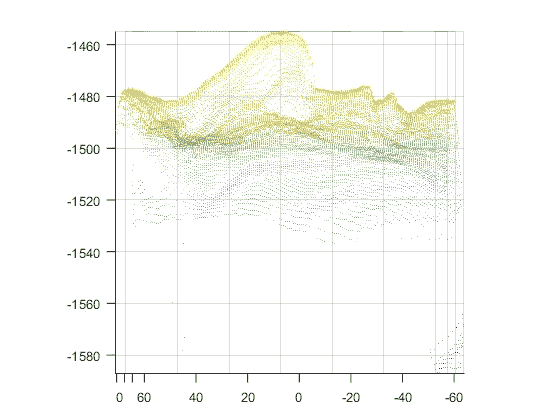
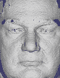

# 利用 Matlab 开发三维人脸识别系统

> 原文：<https://towardsdatascience.com/development-of-3d-face-recognition-using-matlab-a54ccc0b7cdd?source=collection_archive---------25----------------------->

## 处理 3D 人脸图像的初学者指南

在过去的十年中，已经提出了几种用于图像处理和计算机视觉应用的机器学习算法。LBP、HAAR 是一些流行的算法，它们被广泛地用于人脸识别，并且产生极好的结果。但是，这些算法大多不适合无约束环境下的实时识别。最近，最新的深度学习技术已经成为超越传统机器学习算法的新宠。人脸识别应用程序处理的图像只不过是范围(0–255)内像素值的组合。算法在这些灰度值中找到一个有区别的模式，并将其视为一个特征，该特征被认为对于每幅图像是唯一的。然而，在 3D 图像中，不存在像素信息，而只有每个点的位置(x，y，z)可用。这使得很难在 3D 图像中找到图案。

最近，我开始研究 FRGC2.0 3D 人脸数据集，最初，我无法找到足够的资源来处理 3D 图像。终于，过了一段时间，我看到了一篇基于 3D 人脸识别的论文，作者是[阿杰马勒·米安](http://www.csse.uwa.edu.au/~ajmal)，在此感谢他提供的有益建议和参考。我还想提一下我的同事 Jayeeta Chakraborty，他同样为开发这个项目做出了贡献。在这篇文章中，我将讨论开发三维人脸识别系统的预处理步骤，以便其他寻找类似工作的人可以有一个良好的开端。

# **读取 3D 深度图像**

物体的 3D 图像包含物体中每个点的高度、宽度和深度。通常，3D 原始数据集，例如 FRGC 2.0 人脸数据库、集合 F 和集合 G 的 3D 人耳数据库中具有图像文件。abs、. abs.Z 或. abs.gz 格式。图 1 显示的是 [FRGC 2.0](https://www.nist.gov/programs-projects/face-recognition-grand-challenge-frgc) 三维人脸数据库的图像样本。

这些图像是压缩的 ASCII 文本文件。建议不要预先解压缩数据集，因为扩展这些文件可能需要很大的磁盘空间。每个图像文件都有一个三行标题，给出行数和列数。接下来是四幅图像。第一个是所谓的“标志”图像，其中像素值为 1 意味着该像素的相应(x，y，z)值有效。如果标志值为零，您应该忽略该像素的(x，y，z)分量。跟随旗帜图像的是 X 坐标图像、Y 坐标图像和 Z 坐标图像。都是浮点图像。您可以使用每个范围像素的 3D 坐标，也可以丢弃 X 和 Y 图像，只关注 Z 值。请注意，图像的“纵横比”不一定是 1。以下代码部分可用于获取 x、y、z 和标志值。

您可以使用 imshow()函数打印 x，y，z，这将显示相机朝向 x 轴、y 轴和 z 轴时拍摄的图像。连接所有你能看到的图像，如图 2 所示。

我们提取了云点，将其转换成。ply 文件，并显示它可视化三维形状的图像。下图 3 显示了人脸的 3D 视图。因为原始图像包含包括颈部和肩部的面部图像，这对于特征提取过程是不需要的。因此，我们必须从整个图像中只裁剪人脸区域，这将在下一节中讨论。

(a)

(b)

图 3:以上数字是同一主题。图(a)表示使用 Matlab 的 3D 可视化，而图(b)是在 Meshlab 工具中显示时产生的。

# 人脸检测

为了从整个图像中只提取人脸区域，我们利用了深度信息。如果您注意到图 4 中所示的图像，可以观察到对象面向 *z 轴*，传感器捕捉到正面。因此，噪声提示点距离摄像机的深度最小。

Figure 4: Subject is facing towards camera in z-axis

如果你仔细观察图 3，你会注意到深度值从 1500 增加到 1700，当我们从鼻子点到耳朵。如果仍然不清楚鼻尖的概念，请看图 5。

Figure 5: Nose tip detection

你会注意到黑点显示的鼻尖( *P* )的 *z 值*(深度)在 1450 到 1480 左右，假设是 1460。现在考虑以鼻尖' *P* '为中心，我们画了一个尺寸为 140 单位的正方形，如图 6 所示。

Figure 6: Face region cropping

经验上发现正方形的大小适合于覆盖面部区域。唯一的要点在于，选择正方形来表示人脸区域。最后，从整幅图像中裁剪出面部部分，我们得到了如图 7 所示的人脸。

Figure 7 (a): Cropped facial region

Figure 7 (b) : Cropped face image

图 7 (a)和 7(b)表示当在不同角度可视化时裁剪的面部图像。一旦你得到了裁剪后的人脸区域，下一步就是去尖峰，孔洞填充和去噪。

# 去尖峰、填洞和去噪

**去尖峰**:3D 面有噪声，包含尖峰，因此需要应用平滑技术。在我们的研究中，我们将 2D 加权中值滤波技术的概念扩展到三维人脸图像。所研究的技术使用网格中值滤波的加权中值实现来执行 3D 数据集的滤波。

**补洞:**去除尖刺会导致孔洞的产生，因此有必要对这些孔洞进行补洞。为此，我们使用了 3D 插值。在所有的插值技术中，我们使用了'*'立方'*。在*三次*插值方法中，查询点处的插值基于每个维度中相邻网格点处的值的三次插值。这种插值基于三次卷积。

**噪声去除:**数字图像易受不同种类噪声的影响。噪声是图像采集方法错误的结果，所产生的值不能代表实际场景的真实强度。再次有许多方法来消除噪声，我们使用三维高斯滤波器。

这是经过所有预处理步骤后的最终图像，如图 8 所示。

Figure 8: Pre-processed image.

下面显示了用于人脸区域检测、人脸裁剪、去尖峰、孔洞填充和去噪的源代码。

经过所有的步骤，我们得到的最终输出是一个网格图像。该网格图像可以根据应用要求用于特征提取技术。在我们的例子中，我们提取了 PCA 特征，以及线、点和面特征，我将在下一篇文章中讨论。在另一个实验中，我们将 ICP 应用于网格图像，以匹配产生更好结果的图像。如果要运行 ICP 算法，建议有 GPU。

完整的代码可以在 [GitHub](https://github.com/gautamkumarjaiswal/3DFaceRecognition) 库获得。您可以下载并使用它来预处理您自己的 3D 人脸数据集。如果你觉得这篇文章有帮助，请随意投赞成票。

在下一篇帖子中，我将分享使用*主成分分析* (PCA)和*迭代最近点* (ICP)的基于特征级和得分级融合的人脸识别【编辑:由于一些权限问题，我暂时不分享 PCA 和 ICP 的代码。].