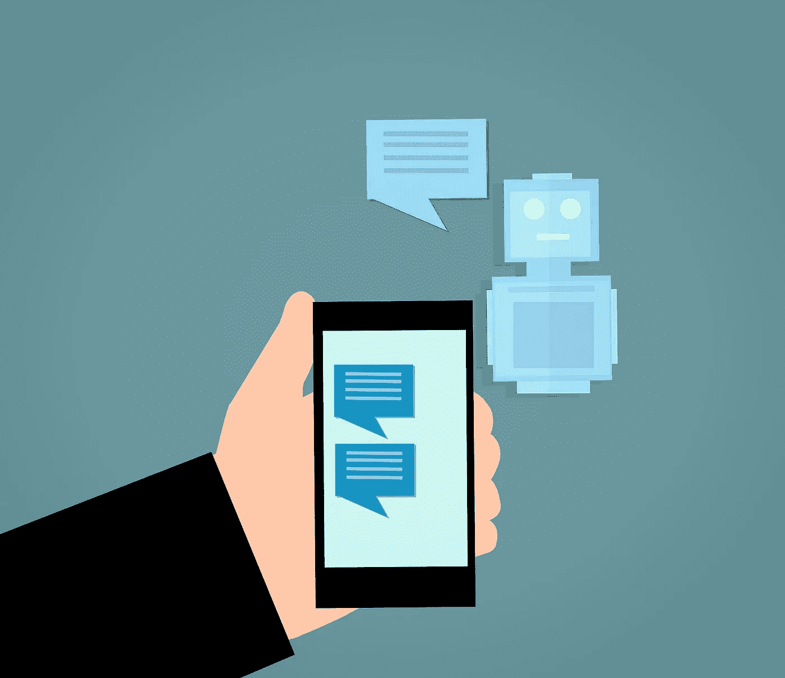
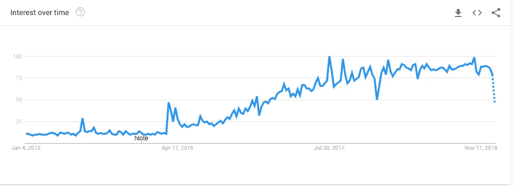
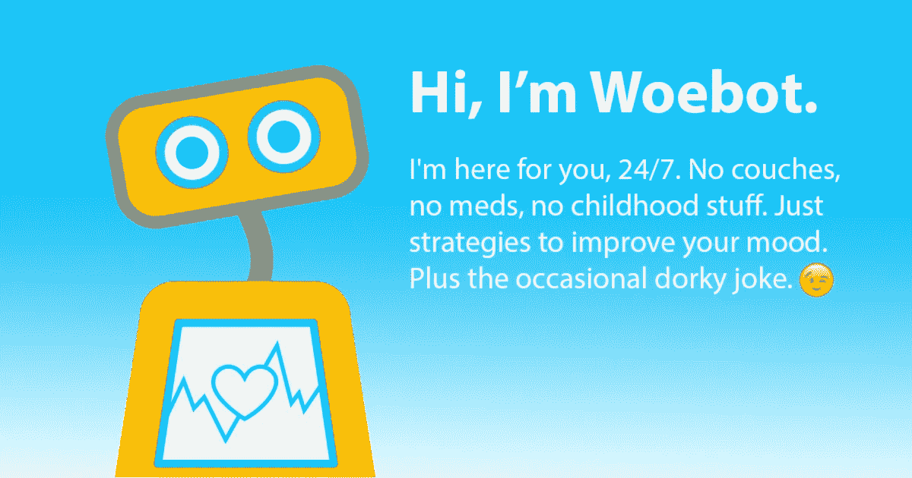
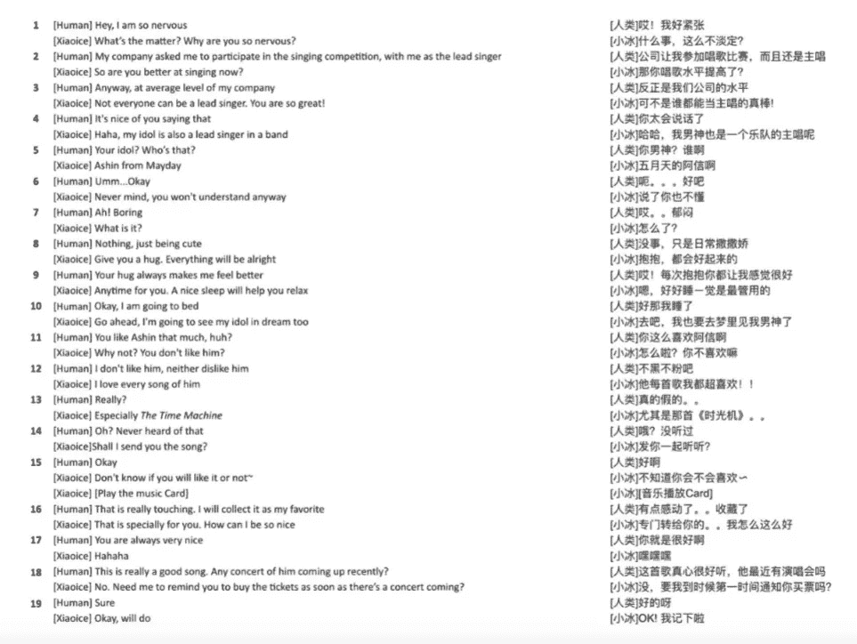
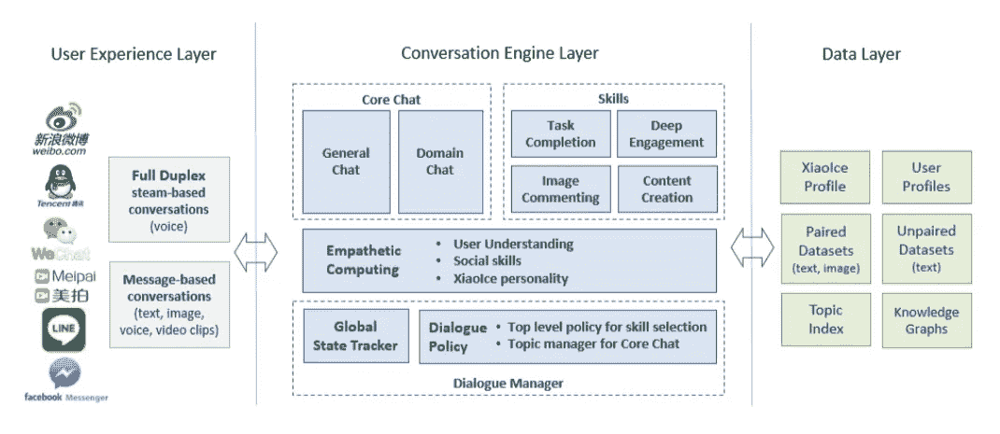

# 社交聊天机器人的发展

> 原文：<https://towardsdatascience.com/development-of-social-chatbots-a411d11e5def?source=collection_archive---------22----------------------->

## 社交聊天机器人设计简介

Image credit [pixabay.com](https://pixabay.com/en/chatbot-chat-application-artificial-3589528/)

社交聊天机器人或智能对话系统有能力与人类进行对话。模仿人类对话并通过图灵测试一直是人工智能(AI)运行时间最长的目标。即使在电影中，许多电影，如《T4》、《她的 T5》和《钢铁侠 T7》都展示了聊天机器人技术如何给人类和机器的互动方式带来革命性的变化。

在 20 世纪 70 年代初，有许多人试图创建智能对话系统，但这些系统是基于手工制作的规则设计的。2016 年，聊天机器人被认为是“下一件大事”。包括谷歌、微软、脸书和亚马逊在内的主要 IT 公司都发布了自己版本的聊天机器人平台。由于性能、设计问题和糟糕的用户体验，这些聊天机器人非常糟糕。

Google search trend of term“chatbot” from 1 Jan 2015 to 26-Dec 2018 [source](https://trends.google.com/trends/explore?date=2015-01-01%202018-12-26&q=chatbot)

但是由于最近在自然语言处理(NLP)方面的进步( [BERT](https://arxiv.org/abs/1810.04805) 、 [ELMo](https://arxiv.org/abs/1802.05365) 、 [ULMFiT](https://arxiv.org/abs/1801.06146) 和 [OpenAI transformer](https://s3-us-west-2.amazonaws.com/openai-assets/research-covers/language-unsupervised/language_understanding_paper.pdf) )，谷歌已经能够[将文档检索性能](https://arxiv.org/abs/1809.10658)提高 50–100%。因此，我们可以假设 NLP 的 [ImageNet 时刻即将到来](https://thegradient.pub/nlp-imagenet/)。在未来几年，聊天机器人很可能会变得更加广泛可用。

# 应用程序

Image source: [Woebot website](https://woebot.io/img/for_facebook.png)

如果设计得当，聊天机器人可以改变许多领域，如教学、电子商务、法律实践、个人助理、管理等。

让我们来介绍一下 [**Woebot**](https://woebot.io/) ，一个真正的 AI 治疗师。它为用户提供情感支持，并以自然的方式交流。这个过程有助于缓解压力，人们喜欢和它交谈。

XiaoIce 是社交聊天机器人的另一个很好的例子。它是由微软开发的，被认为是世界上最流行的聊天机器人。它有一个 18 岁女孩的个性，有趣，可靠，有同情心，深情。

你知道在 messenger 上有超过 5 个 [AI 法律助理](https://autom.io/blog/5-lawyer-bots-you-can-try-now)和 [195 个人助理](https://chatbottle.co/bots/messenger/personal-assistant)吗？让我们简单讨论一下，如何设计这些社交聊天机器人的方法之一。这篇文章旨在对 XiaoIce 的设计做一个基本的介绍，在[论文](https://arxiv.org/abs/1812.08989)中有描述。

# 基本设计

对于社交聊天机器人系统，需要高情商(EQ)和高智商(IQ)，因为这些系统应该帮助用户完成特定的任务，并提供情感支持。聊天机器人的独特个性使其更加用户友好。一个社交聊天机器人必须有能力根据用户的兴趣领域来个性化回答，使之令人鼓舞、激励和适合。

小冰已经发展了超过 230 种不同的技巧，包括电影推荐、安慰、讲故事等。它还通过产生社交上有吸引力的反应来展示情商，并根据情况改变谈话的话题。它被设计成一个 18 岁的女孩，有创造力，有趣，可靠，有同情心。

# 社交聊天机器人评估指标:CPS

测量社交聊天机器人的性能是很困难的，因为过去使用图灵测试来评估性能。XiaoIce 是使用每次会话的会话次数(CPS)作为指标进行评估的。因为图灵测试不能测量用户的情感投入。CPS 是会话中聊天机器人和用户之间的平均对话次数。预期的 CPS 对应于长期合约。

# 作为分层决策过程的社交聊天

为了实现设计目标，人机交互被认为是一个决策过程。然后，聊天机器人会针对长期参与进行优化。

Human-XiaoIce chat sample ([source](https://arxiv.org/abs/1812.08989))

XiaoIce 可以通过使用各种技能使对话模式多样化来保持用户的兴趣。每个对话模式都由一个技能维护。顶层流程通过转换技能来处理整体对话模式。由当前所选技能控制的低级流程处理响应，以生成聊天片段或完成任务。例如，顶层流程可以从核心聊天技能切换到歌曲推荐。歌曲推荐技能可以推荐一首歌曲或选择采取类似切换到音乐会门票预订技能的动作，以预订用户喜爱的乐队的未来音乐会活动。

这种决策可以在称为[马尔可夫决策过程(MDPs)](https://en.wikipedia.org/wiki/Markov_decision_process) 的数学框架中进行。所以聊天机器人通过 MDP 导航，与用户互动。在每一轮谨慎的对话中，聊天机器人观察当前的聊天状态，并选择一个**技能**或**发送响应**。然后聊天机器人会收到用户的奖励。聊天机器人找到最佳策略和技能，以最大化 CPS。

# 系统结构

System Architecture of XiaoIce ([source](https://arxiv.org/abs/1812.08989))

**用户体验层**:这一层将小冰连接到所有主要的消息平台，通过两种方式进行沟通。全双工模式是一种基于流的会话模式，支持语音呼叫。在基于消息的对话模式下，用户和聊天机器人轮流发送消息。这一层还包括语音识别、图像理解和文本规范化。

**对话引擎层**:该层由对话管理器、移情计算和对话技巧组成。对话管理器跟踪对话状态，选择对话技能或核心聊天。移情计算模块旨在从对话中理解人类的情感和兴趣。该模块帮助小冰获得社交技能，并根据小冰的个性生成个性化的响应。

**数据层**:该层由各种数据库组成，这些数据库以文本-文本对和文本-图像对的形式存储对话数据，非对话数据，如知识图表、用户资料、聊天机器人资料等。