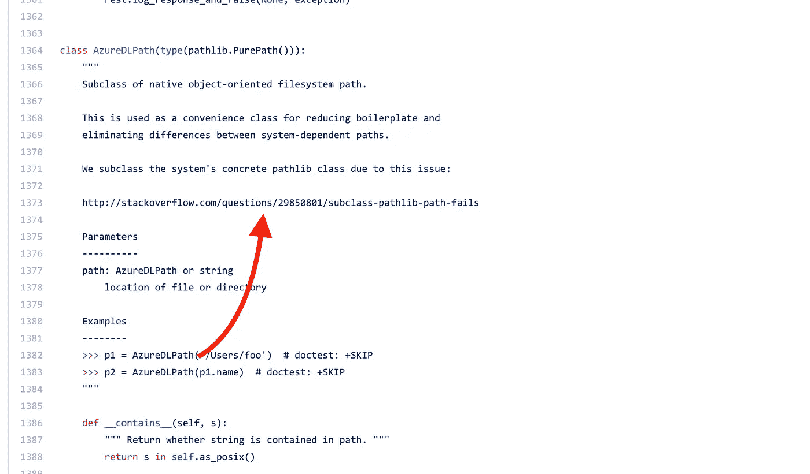
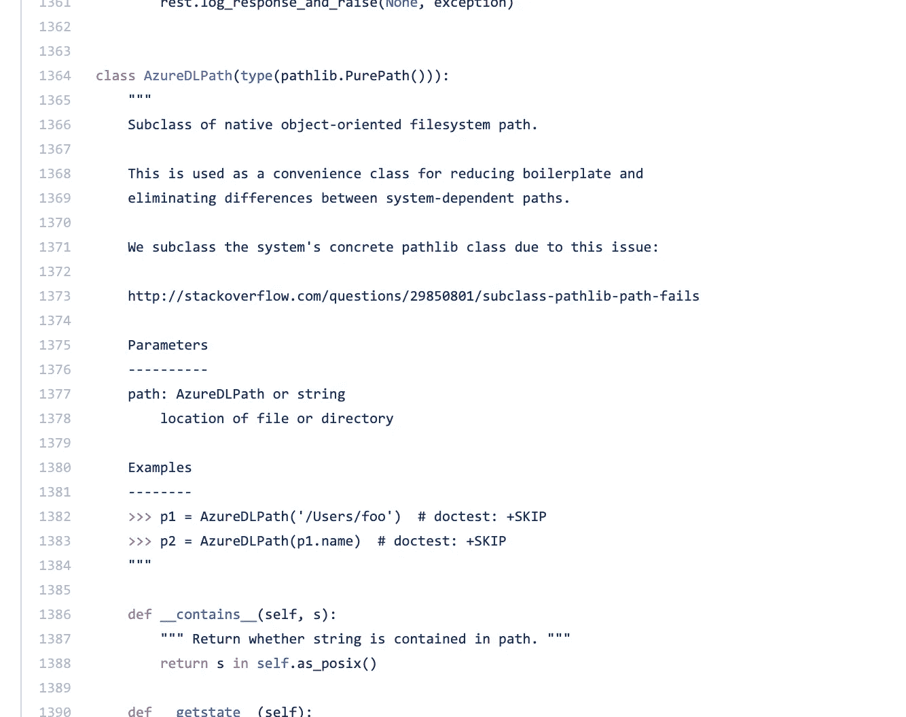

# 数据科学家现在应该使用的开发实践。

> 原文：<https://towardsdatascience.com/development-practices-that-data-scientists-should-use-now-7c4f54d6b92?source=collection_archive---------31----------------------->

我曾与经验丰富的开发人员、专家数据科学家、新人、非程序员一起工作，所有这些人都有一个共同点:他们必须编写代码。

正常情况下，这篇文章应该是非常笼统的，大多数程序员都是这样工作的，但是由于一些数据科学或数据工程实践固有的实验性质，我发现，有时候，这些建议中的一些，呃…被忽视了。因此，这里是{科学家|工程师}应该知道的关于编码实践的绝对最低数据。

# 你从来不为自己写代码，而是为别人写。

这是我告诉编码数据科学家的第一条基本规则:永远不要为自己写代码，而要为别人写。

而且，请注意，“其他”人可能是…你。如果不为同事写，至少为未来的自己写。

这意味着什么？

*   注释您的代码。是现在的两倍:)实际上，在编写代码之前进行注释也是一个很好的实践:)
*   礼貌地写。使用显式的变量名，文件名(我看见你了，untitled09.ipynb 先生)。删除/注释你不再使用的代码。
*   记录你的代码(不完全等同于注释)。放一篇自述，助读者一臂之力。
*   收集你正在使用的模块的版本，以便在一年内(谁知道一年内会创建多少 JS 框架)，当你不得不匆忙运行项目时，你会找到你需要的模块版本。

# 不推入回购的代码是不存在的。

我很惊讶有这么多数据科学家在他们自己的 GPU 包装的机器上工作，所有的铃铛和哨子，以及一个非常脆弱的硬盘驱动器，他们所有的生命都装在一个小小的空间里。

比如说，硬盘的密度是每平方英寸 500 千兆比特。这意味着我微小的动作会导致灾难。考虑到我自己撞上家具的能力，对于这么小的空间来说，这是很大的信任。

因此，对待你电脑上的代码，就像它不存在一样。它没有版本控制，没有审核，没有 CIed，没有备份。它。只是。不会。存在。

哦，你知道 Jupyter 笔记本实际上是**版本的**文件吗？

# 在选择架构时尽可能保守

你是数据科学家？太好了。你想使用最新的框架，它在 Github 知识库上有半颗星，发布于 3 年前，从那以后再也没有接触过(抱歉，没有链接)。不要。

你将有很多不确定性要处理，所以请避免在薄冰上滑冰，使用一个废弃大学的不起眼的 Pytorch 叉子。

# 一行代码花费的时间是编写时间的 10 倍

…说到这里…你必须意识到，一行代码的成本远远超过了编写它所花费的时间。甚至是死代码。

因此，当你添加一个没有人要求你的新功能时，当你训练你的模型来检测不属于规格的模式时，你只是在建立技术债务。

成功的编码会议通常包括修剪代码中不必要的部分。这是管理复杂性的一个简单方法。

Trim your code.

# 你也从来不为自己训练。

机器学习通常涉及训练数据，评估你的训练，并建立一个可扩展的、强大的推理机。

第一部分涉及大量的实验。总会有一个更好的人来改进你的机器学习设计。我是说，即使是你，伊恩·古德菲勒，如果你在读这封信，相信我，有人比你更好。比如你未来的自己！

所以，根据经验，永远不要为自己训练，而是为别人训练。这意味着，记录，评论，和两件主要的事情:

*   向其他人提供根据您的原始数据进行训练的方法(例如，将您的数据版本化并给出其 URL！)
*   给其他人一些方法来*根据你的测试数据评估*

似乎很明显？去读一些深度学习的论文，你会明白并不总是*那么*明显:)

# 错误的编码者复制/粘贴。伟大的程序员无耻地偷窃。

程序员做的事情有一半是在谷歌上查找答案。啊，堆栈溢出的帖子来了，解释如何解决你的问题！

现在，一旦你复制并粘贴了解决方案，请参考原始的堆栈溢出帖子，例如作为注释。虽然不多，但当你试图弄清楚你为什么这么做时，它真的很有帮助。

Even [Microsoft](https://github.com/Azure/azure-data-lake-store-python/blob/master/azure/datalake/store/core.py) does that!

当你以后查看你的代码时，这会节省很多时间。

# 不要用 Python 2(拜托)

Don’t scare the python

啊，来吧…现在是 2019 年，真的。Python 3 带来了如此多的东西。另外，你不喜欢 UnicodeErrors，对吧？

总而言之，遵循这些简单的规则会让你成为一个更好的程序员、更好的数据工程师和更好的数据科学家。如果你做的事情有目的，至少让其他人分享它！

你呢？你的最佳实践是什么？在评论里告诉我！