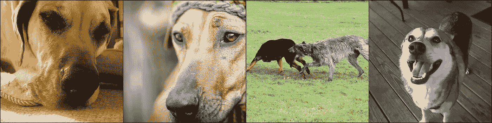

# 设计零射击学习

> 原文：<https://towardsdatascience.com/devise-zero-shot-learning-c62eed17e93d?source=collection_archive---------2----------------------->


Completely unrelated apart from the fact that people are ‘learning’ in this beautiful fresco: [The School of Athens](https://en.wikipedia.org/wiki/The_School_of_Athens) by Raffaello Sanzio

## 由 [Fromme 等人(2013)](https://papers.nips.cc/paper/5204-devise-a-deep-visual-semantic-embedding-model.pdf) 撰写的《设计:深度视觉语义嵌入模型》是一篇真正漂亮的论文。作者提出了一种新的图像分类方法，利用语言模型学习语义知识。该方法能够对训练期间观察到的数万个图像标签*而非*进行零拍摄预测。我将向您详细解释这种方法，并且我使用 Docker 在 AWS 上部署了一个 device model[,以便您可以对其进行试验。](http://ec2-18-195-116-70.eu-central-1.compute.amazonaws.com:8000/apidocs/)

本文组织如下:

首先，我将向您解释“传统”图像分类器的潜在问题，以及如何通过结合计算机视觉和语言建模来解决这些问题。为了可视化模型的能力，我将向你展示一些由部署在 AWS 上的模型 I [做出的零炮预测的很酷的例子。最后，如果您想自己培训和部署这样一个模型，我将为您介绍一些有用的资源。](http://ec2-18-195-116-70.eu-central-1.compute.amazonaws.com:8000/apidocs/)

在经典编程中，你可能会定义一组*规则*，允许你从你的*数据*中计算*答案*。**规则和数据进，答案出。**

如果我要求你写下一组规则，在给定像素值的情况下，判断任意图像是否包含汽车，你肯定会失败。这个任务太复杂了，无法手工表达这样的规则。所以我们做的就是“参数化规则”，从数据和答案中学习参数。**数据和答案在，排除。** 原则上，这是所有(监督)机器学习背后的思想。

卷积神经网络形式的“传统”图像分类器(相对于设计而言是传统的)是参数化函数，其学习为输入图像的 *n* 个可能类别中的每一个计算有意义的概率。概率分布通常用网络顶部的 *softmax 层*计算。

这种神经网络已经被证明在图像识别任务中表现出色，那么为什么还需要改进的方法呢？

最大的问题是，我们被限制在数据集的 *n* 个类别，我们在这些类别上训练我们的图像分类器。ImageNet 的精简版(1000 类)包含 90 多种不同品种的狗。因此，在这个数据集上训练的训练有素的分类器可以比我更成功地区分更多的狗品种，但它*永远无法将图像分类为狗，因为“狗”这个词本身不是一个类别。*

另一方面，设计模型预测接下来的四张照片非常像“狗”，即使它从来没有被展示过“狗”类别的训练对。



*免责声明:如果你为一个受限的设置训练一个模型，例如医疗诊断，带有 softmax 输出层的分类器当然是一个完全有效的好方法。你的模型不需要归纳成无数在训练中没有看到的不同类别。*

回到我们的狗身边。原则上，您可以构建一个手工制作的层次结构，确定如果一个图像包含一只“德国牧羊犬”，它就自动包含一只狗。但是手动为所有现有的单词构建这样一个层次结构是大量的工作，这是我们在机器学习中极力想要避免的。毕竟，你选择将我们的世界划分为越严格定义的类别，构建标签数据集就越复杂和昂贵。

让我们仔细看看图像分类器返回的类别概率:

使用 softmax 输出图层，每张图片只能属于一个类别，因为 softmax 旨在将高概率分配给一个类别。这意味着你不应该引入一个额外的类别“狗”,因为网络将很难决定是将图像归类为“狗”还是特定的狗品种。

原则上，这个问题可以通过在输出层中使用 sigmoid 激活函数而不是 softmax 来解决，并允许不同的标注适用于单个图像。然后，您将不会预测图像的 *n* 个类别概率的总和为 1，而是预测每个类别的一个独立概率，即该类别的对象是否可能包含在图像中。这允许你引入额外的类别，如“狗”,而不与狗的品种竞争。

我这么说是什么意思？

如果在网络顶部使用 softmax 图层，您可能会得到类似“该图像包含一只德国牧羊犬的概率为 87%”的答案。所有其他 999 类加起来占 13%。

如果您在输出图层中使用 sigmoid 并允许不同的类别包含在图像中，您可能会得到类似于“图像包含德国牧羊犬的概率为 87%，狗的概率为 89%，法国斗牛犬的概率为 67%，…，核潜艇的概率为 0.13%，飞机的概率为 1%”的答案。请注意，概率的总和不再是 100%。

使用这种方法，分类器不必决定是否应该将高概率分配给“dog”*或“German shepherd dog”*，因为它必须使用 softmax 输出层。它决定每个类别是否可能被检测到，而不考虑其他类别。

那么问题解决了吗？

比方说，你为 ImageNet 找到或创建了包含成千上万个附加类别的标签，即“狗”，并实际上成功训练了一个卷积神经网络，允许预测成千上万个类别概率。网络现在可能会说“这个图像包含一只德国牧羊犬和一只狗”。网络能否回答这个图像中是否包含“小狗”、“小狗”或“猎犬”的问题？不，它不能，因为当你添加像“狗”这样的类别到数据集中时，你没有包括“小狗”、“小狗”或“猎犬”这样的类别。那么接下来，我们应该把这些词也作为潜在的标签吗？

问题是，这些分类器都不能预测它们在训练中没有遇到的类别，它们不能将关于它们已经被训练的类别的语义信息转移到看不见但相似的类别。

像 DeViSE 这样的模型为这个问题提供了一个真正优雅的解决方案，它将图像识别任务与从在*未标注文本*上训练的语言模型中学习到的关于单词/类别相似性的语义信息相结合。

基本上，目标是开发一个能够推断图像包含“狗”、“小狗”、“小狗”或“猎犬”的模型，因为这些词与“德国牧羊犬”相似。我们希望我们的模型能够归纳出在训练过程中从未遇到过的类别，因为这些类别在语义上与模型被训练的类别相似。这就是所谓的零射击分类。

## 设计

建立一个设计模型始于在一个*未标注的*文本语料库上训练一个语言模型。

每个单词(或令牌)都被表示为高维空间中的一个点，或者用简单的英语来说，表示为一个向量，比如说 300 个浮点数(当然也可以是 400 或 500 或 1325，但在本文的其余部分，我们假设是 300)。这样的向量被称为单词向量，单词向量包含的数字是模型的参数。这意味着，随着模型的学习，优化器可以更改这些值。接下来，你需要一个神经网络，一个参数化的函数，它可以根据过去的 *m* 个单词来预测句子的下一个单词。简单地说，这就提出了一个问题“如果你有这个由 *m* 个单词组成的句子，下一个单词会是什么？”。问这个问题的好处在于，你不必对你的数据集做任何标记，你只需浏览任何文本语料库，并反复询问你的神经网络下一个单词是什么。网络通过调整其参数来学习预测下一个单词，这些参数包括代表单词的所有单词向量中的数字。

300 个元素向量指向高维嵌入空间中的一个点，并且相似的单词在该空间中彼此接近，因为同义词倾向于出现在相似的上下文中。这个高维空间中代表“狗”的点会接近代表“doggy”的点。(在这个高维空间中“接近”的一种可能解释将在后面解释。)

我知道这一切对你来说可能听起来非常吓人，但不要担心，此时我希望你知道的是，在训练语言模型后，代表单词“dog”的 300 个数字更接近于代表“doggy”的 300 个数字，而不是代表“train”的 300 个数字。

如果你自己还没有训练过语言模型，但有兴趣这样做，我强烈推荐你跟着[这个](https://youtu.be/gbceqO8PpBg?t=5103)一起编码，我保证，我在这里写的一切对你来说会更有意义。

目前，我们需要的只是语义上有意义的单词向量。幸运的是，我们可以在这里简单地下载经过训练的嵌入/词向量。

现在到了第二部分:将图像映射到这个丰富的高维嵌入空间。听起来很困惑？别担心，这比听起来容易。

我们采用基于预训练的 softmax 输出层的图像分类器，在网络的顶部截断最终的分类层，并用几个层来代替它们，这些层不预测 *n* 类的 *n* 类概率，而是简单地预测 300 个数字，这代表一个词向量。我们将分类问题转化为回归问题。

将图像映射到高维单词向量嵌入空间中，然后允许我们在这个高维嵌入空间中找到与其接近的单词——或者用英语来说:我们预测图像的单词向量，并找到具有相似单词向量的单词。

来自报纸:

> 我们的模型的一个明显的优点是，它能够对它从未观察到的候选标签做出合理的推断。例如，一个在标记为虎鲨、牛鲨和蓝鲨的图像上训练的设备模型，但从来没有标记为鲨鱼的图像，将可能具有概括为这种更粗粒度的描述符的能力，因为语言模型已经学习了与所有特定鲨鱼相似的鲨鱼的一般概念的表示。
> 
> 例如，使用余弦距离与虎鲨最接近的 9 个术语是牛鲨、黑顶鲨、鲨鱼、大洋白顶鲨、沙洲鲨、灰鲨、蓝鲨、安魂鲨和大白鲨。与汽车最接近的 9 个术语是轿车、肌肉车、跑车、小型车、汽车、赛车、皮卡、经销商和轿车。

训练设计模型的主要步骤是:

1.  下载[字向量](https://dl.fbaipublicfiles.com/fasttext/vectors-wiki/wiki.en.zip)。
2.  下载带标签的图像数据集，即 ImageNet。完整的 ImageNet 数据集可以从[这里](https://www.kaggle.com/c/imagenet-object-localization-challenge)下载(不过大约 170GB)。ImageNet 的一小部分可以从[这里](http://files.fast.ai/data/imagenet-sample-train.tar.gz)下载。部署在 AWS 上的模型是在完整的 170GB 数据集上训练的，但子集也工作得相当好。
3.  找到你有一个词向量的 ImageNet 的类别。构建包含*图像-单词向量*训练对的数据集。
4.  在预训练的图像分类网络的顶部截断最终分类图层，并用自定义图层替换它们以预测 300 个数字。在 PyTorch 中，可以这样做:

5.定义一个损失函数。也就是说，你可以使用余弦相似性的适应。记住，单词的数字表示是矢量。在学校里，你可能被教导过，你可以把向量想象成箭头。当两个箭头指向同一个方向时，它们是相似的(我们忽略箭头的长度)。余弦相似度计算两个向量之间角度的余弦。如果角度为 0，余弦相似度为 1，如果角度为 90，余弦相似度为 0。对于损失，当向量彼此更相似时，我们想要更小的数字，因此，当它们之间的角度更小时。因此，我们简单地将损失计算为两个向量的 *1 -余弦相似度*:

6.训练网络。

如果你想自己做这件事，我建议你按照 fast.ai 第 2 部分的这一部分编写代码。正式课程[笔记本](https://github.com/fastai/fastai/blob/master/courses/dl2/devise.ipynb)来了。[我的笔记本](https://github.com/fg91/DeViSE-zero-shot-classification/blob/master/DeViSE%20-%20A%20Deep%20Visual-Semantic%20Embedding%20Model.ipynb)稍微没那么杂乱/评论更多。它还使用 PyTorch 从头开始构建模型，而不是调用 fast.ai 便利函数来构建它。也可以随意借鉴。

让我们总结一下我们讨论的内容:我们不是建立一个返回 *n* 个类别的 *n* 个类别概率的模型，而是建立一个预测给定图像的单词向量的模型。然后我们简单地寻找具有相似单词向量的单词(*近似*最近邻搜索)。这允许模型利用语义知识来概括和预测在训练期间没有看到的类(零射击学习)。

这种方法还有一个额外的巨大好处:

1.  语言模型的数据集根本不需要标记！我们使用的单词向量是在维基百科文本语料库上训练的，但理论上，你可以在所有书面文本的整体上训练大型语言模型。以这种方式学习到的语义相似性知识很可能比任何手工制作的语义相似性层次结构都要好！
2.  您使用的数据集不必像使用传统图像分类器时那样维护良好！来自报纸:

> 也许更重要的是，虽然我们在这里训练的是一个精选的学术图像数据集，但我们的模型的架构自然适合于在所有可用的图像上进行训练，这些图像可以用(更大的)词汇表中包含的任何文本术语进行注释。我们相信，训练这种形式的大规模“开放”图像数据集将极大地提高视觉对象分类系统的质量。

好了，理论够了，让我们来玩玩模型吧！我使用 Docker 将它部署在 AWS 上，这样您也可以使用它。(免责声明:该应用程序在 AWS 上的单个 t2.micro 实例上运行，因此它在一年内保持在新客户获得的 AWS 免费层内。我的故事通常每天有大约 100 名观众，所以我不希望有太多的读者同时使用它。)

 [## 设计

### Fromme 等人的深度视觉语义嵌入模型(2013 年)](http://ec2-18-195-116-70.eu-central-1.compute.amazonaws.com:8000/apidocs/) 

我们将使用该模型进行三种不同的零炮预测:

1.  通过首先预测输入图像的单词向量，然后从大约 50.000 个存储的单词向量中找到近似的最近邻居，来计算输入图像的前五个零镜头预测(类别)。

我向该应用程序提供了大约 5000 张随机图片，这些图片来自我在培训期间创建的验证数据集。该应用程序为每张存储的图片预测一个单词向量。这使我们能够:

2.给定输入图像，预测语义相似的图像。这是通过预测输入图像的单词向量，然后对为存储图像预测的单词向量执行近似最近邻搜索来完成的。

3.给定一个输入单词，预测语义相似的图像。这是通过将输入单词翻译成其相应的单词向量，然后对存储图像的预测单词向量执行近似最近邻搜索来完成的。

让我们从 3 号开始。还有试试“鸟”这个词。ImageNet 中有几种鸟，即“信天翁”、“雪鸟”、“靛雀”、“美洲鹰”、“秃鹰”或“鸵鸟”，但没有“鸟”这一类别。

该模型预测以下图像最像“鸟”:


“昆虫”也一样(不是 ImageNet 中的一个类别):


包含类别“curch”。显然，该模型可以概括为“大教堂”类别:


单词“measure”没有出现在任何 ImageNet 类别中(事实上，没有一个动词是一个类别)。然而，该模型能够预测用于“测量”的以下图像:


“服装”一词也是如此:


单词“连衣裙”也不属于 ImageNet 中的任何类别，但是该模型预测了以下图片:


“跑车，跑车”是唯一包含“运动”一词的品类。该模型为“运动”预测了以下图片:


“武器”不是一个范畴:


“植物人”也不是:


让我们试试别的:

函数`wordvec_2_image`需要一个，但接受两个单词作为输入。如果你传递两个单词，单词向量被平均(相加并除以 2)。让我们看看语言模型是否学会了平滑过渡，这意味着我们可以在词向量之间进行插值，并找到一些有意义的东西。

> (Mikolov 等人，2013)证明了简单的算术运算揭示了表征空间中丰富的线性结构。一个典型的例子证明了向量(“国王”)—向量(“男人”)+向量(“女人”)产生了一个向量，它的最近邻居是皇后的向量。(引自[拉德福德等人，2016](https://arxiv.org/pdf/1511.06434.pdf) )

存储的数据集中预测单词“ship”的前四个图像:


有两艘旧帆船和两艘现代船。让我们检查一下模型对单词“船”+“帆”的预测:


好了，现代的船都走了，现在所有的船都有帆了。这是否意味着有意义的插值在这种模型中是可能的？嗯，我们只看了四张照片，所以我对这样的声明要小心。第五艘可能是现代船。帆只出现在船上，所以矢量这个词可能一开始就很接近。对它们进行平均会返回一个与“ship”和“sail”都非常相似的单词向量，我们看到的结果可能是一个巧合，而不是有意义的插值。

不出所料，单单“帆”就给出了类似的选择:


最后一段相当含糊。让我们试着量化其中的一些:

我们用`np.corrcoef(wordvectors.get_word_vector("ship"), wordvectors.get_word_vector("boat"))[0,1]`计算两个词向量的*皮尔逊相关系数*来估计两个词的相似度([见笔记本](https://github.com/fg91/DeViSE-zero-shot-classification/blob/master/DeViSE%20-%20A%20Deep%20Visual-Semantic%20Embedding%20Model.ipynb))。数字越大意味着它们可能越相似。向量与其自身的相关系数是 1。

“Ship”和“bug”显然非常不相似，相关系数为 0.08。

可以算作同义词的“船”和“舟”给 0.56，“船”和“帆”给 0.59，“舟”和“帆”给 0.57。所以“帆”确实和“船”和“舟”都很相似。我们试着用一个与“船”不太相似的向量来插值，即“发动机”。

有些船有发动机，但不是所有的发动机都在船上。“船舶”和“发动机”的相关系数为 0.31。

“船”+“引擎”给出:


好了，现在有帆的船都走了。我们交叉核对一下。仅“引擎”的结果是:


所有这些东西都有引擎，但显然“引擎”并不自动意味着“带引擎的船”。看来*有意义的插值*原则上可能*有这种视觉语义嵌入模型。注意我写*出现*而*可能*。请记住，我们只看到了几张图片。*

*不过我不得不承认，我尝试的大多数两个单词的组合都没有产生任何有意义的结果。这可以归因于这样一个事实，我只为模型提供了大约 5000 张图片，以保持在 AWS 自由层内。你能找到其他很酷的组合吗？如果你有，请在评论中告诉我！*

*让我们试试 API 的另外两个函数。我们传递一张图片，并从存储的数据集中获得前五个零镜头预测和前四个语义最相似的图片。*

*“虾”和“对虾”都不是 ImageNet 中的类别:*

**

*[Source](https://commons.wikimedia.org/wiki/File:Shrimp_on_cutting_board.jpg)*

*这张图片的前五个零镜头预测是:*

```
***crayfish mosquitofish needlefish goosefish ladyfish***
```

*谷歌“小龙虾”，我能理解为什么模型认为它们和虾语义相似。该应用程序的所有存储图像都来自 ImageNet，因此，该模型不能返回一只虾的图像。我认为四个中的三个在语义上是相似的。孩子在那里做什么，我一点线索都没有…*

**

*最后一次尝试是 ImageNet 中不包含的类别的图像。让我们尝试一个被包含的模型，看看这个模型是否在原则上是*精确的*，而不仅仅是找到*相似的*类。下图显示了一只蓝色松鸦，ImageNet 中存在类别“松鸦”,*

**

*[Source](https://commons.wikimedia.org/wiki/File:Cyanocitta-cristata-004.jpg)*

*前五个零射击预测是:*

```
***jay Jay bobby Starr Shawn***
```

*并且来自存储的数据集中语义上最相似的图像是:*

**

*我是一名天体物理学家，不是鸟类学家，但对我来说，其中三只鸟的蓝白色羽毛位置正确，所以我认为这是一个成功。*

*到目前为止，我只给你们展示了成功的例子，但是当然，我也发现了几个预测是错误的例子。让我们试试这张图片:*

**

*[Source](https://commons.wikimedia.org/wiki/File:Polar_bear_(Ursus_maritimus)_in_the_drift_ice_region_north_of_Svalbard.jpg)*

*该模型返回以下前五个预测*

```
***dog beagling poodle kelpie turnspit***
```

*而下面这四张图即使“北极熊”是 ImageNet 类别！*

**

*当被要求展示“猫”类别的图片时，这个模型也会展示狗。*

**

*[Source](https://commons.wikimedia.org/wiki/File:Tabby_Pfaffengrund.JPG)*

*然而，对于这张猫的图片，零命中率的预测是*

```
***tabby fawn kitten cat grizzle***
```

*并且该模型返回以下四幅语义相似的图片:*

**

*当要求图片语义上与单词“虎斑猫”相似时，我也会得到猫的图片…*

*如果您尝试其他单词或图片，并想找出某个特定单词是否属于 ImageNet 的任何类别，请下载[该文件](https://gist.github.com/yrevar/942d3a0ac09ec9e5eb3a)并在命令行中运行`cat imagenet1000_clsidx_to_labels.txt | grep word`。*

*在这个[资源库](https://github.com/fg91/DeViSE-zero-shot-classification)中，你可以找到一个笔记本来训练模型(基于 fastai)，这是一个预训练的模型，以防你不想自己训练它，但想尝试应用程序，flask-app 将模型作为 API，关于如何使用 flask 开发服务器尝试应用程序的说明，以及关于如何在 Docker 容器中运行应用程序的说明。如果有兴趣学习 Docker 部署机器学习模型，可以考虑[这门课](https://www.udemy.com/deploy-data-science-nlp-models-with-docker-containers/)。这要花几美元(我不是附属机构)，英语也不完美，但我知道我到底在寻找什么来开始。*

*我发现[这个视频](https://www.youtube.com/watch?v=9K3OEhm2lR0&list=WL&index=7&t=0s)对于在 AWS 上部署容器非常有帮助。*只是一个警告:如果你试图在 AWS 上部署一个应用程序，并有资格获得 AWS 免费层服务(针对新客户)，请确保使用 ec2 t2.micro 实例，因为其他实例没有资格免费使用。此外，请记住，没有“仅自由层帐户”，一旦您超出自由层限制，您将被计费。**

*如果这篇论文发表在 2019 年，而不是 2013 年，我可以很好地想象一些媒体的标题:*“谷歌科学家创造了一个能看、能说、能描述从未教过的东西的人工智能……机器人将杀死我们所有人。”*好吧，我在这里故意夸大其词，但在所有这些宣传中，向人们解释什么是机器学习，什么不是机器学习是很重要的，特别是如果你属于那些能够理解的人。最终归结为以下几点:*

> *[……]机器学习和深度学习的核心问题是有意义地转换数据:换句话说，学习手头输入数据的有用表示——这些表示让我们更接近预期的输出。[……]所有机器学习算法都包括自动寻找这种转换，将数据转化为对给定任务更有用的表示。[……]从技术上来说，这就是深度学习:一种学习数据表示的多阶段方法。这是一个简单的想法——但是，事实证明，非常简单的机制，如果规模足够大，最终可能看起来像魔术一样。(引自 Chollet，Franç ois，用 Python 进行深度学习)*

*将输入图像转换为单词向量而不是 *n* 类概率的想法非常简单，但它允许我们做令人惊讶的事情，因为单词嵌入是连续的，并允许我们测量图像与未知类别的相似性——只需将数据转换为更有用的形式！此外，与“传统的”深度学习图像分类器(只要能够找到描述图像的词)相比，该算法能够利用更大和更不精确的真实生活数据集，这可以显著提高视觉对象分类方法的质量。*

*我希望你能从这篇文章中得到乐趣，并且我能教你一些东西。如果你有问题，请在评论中告诉我，我很乐意帮助你理解:)*