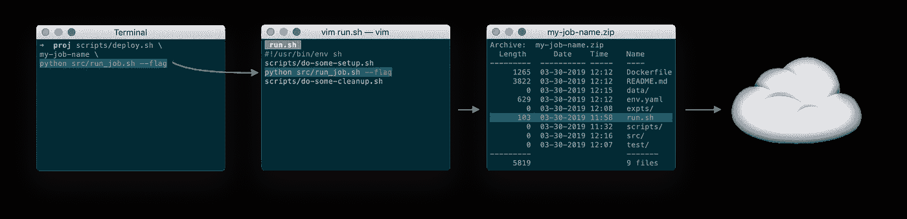
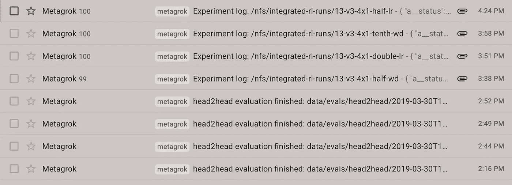

# 机器学习研究工作流程的开发运维

> 原文：<https://towardsdatascience.com/devops-for-machine-learning-research-workflows-bfd054da9f9e?source=collection_archive---------24----------------------->

## 我从独自研究中学到的一些东西


第一次做机器学习研究？或者也许你已经在一家大型机构中这样做过，现在你正试图自己解决这个问题？这篇文章送给你！

近年来，我一直在从事几个项目，这些项目需要专注和严格的实证研究。我的大部分工作都是独自完成的，不同程度地受到其他人的间接影响。因此，我有机会完全从零开始建立我的研究工作流程。

因为大量的研究都花在了运行受控实验和快速迭代想法上，所以拥有一个有组织的和健壮的研究环境是至关重要的。从我花费的大量时间(以及我犯的许多错误)中，我发现改进我的研究工作流程需要问自己以下两个问题:

1.  我能做些什么来提高我对工作结果的信心？
2.  我如何缩短我的反馈周期，以便我可以更快地迭代？

下面介绍的三个想法都回答了上面的一个或两个问题。

# 使开发与生产相匹配

你一直在做一个项目，它在你的笔记本电脑上运行良好。但是现在是时候扩大规模了。您可能想要运行更强大的机器，或者您可能想要运行更多的机器，或者您可能只想在代码运行时玩英雄联盟。像正常人一样，你决定开始在云上运行你的代码。


The Cloud. (For the screenreaders, literal clouds in the sky.)

虽然使用云计算提供商可以让您在水平和垂直方向上扩展您的实验，但代价是您的反馈周期通常会变长。其中一个很大的原因是你几乎立即开始调试“它在我的机器上工作”的问题。

对此的处理是确保您的开发环境与您的“生产”环境紧密匹配[1]。这通过减少由于环境不匹配而发生的错误数量，缩短了您的反馈周期。

为了使您的环境相匹配，我建议**创建一个 Docker 映像，您可以在您的开发机器上和云中使用它**。或者，您可以在云中的专用计算实例上进行开发，并将该实例的克隆作为生产机器启动。你可以在[【GCP】](https://cloud.google.com/compute/docs/disks/create-snapshots)和 [AWS](https://docs.aws.amazon.com/AWSEC2/latest/UserGuide/EBSSnapshots.html) 中使用*磁盘快照*来完成这项工作。

## 使用通用部署脚本

我在自己的设置中做的一件比较另类的事情是，我有一个通用的部署脚本。该脚本的目标是能够获取您在开发机器上运行的任何 shell 命令，并在生产机器上运行它。

该脚本有两个参数:一个标识符`**job-name**`和一个 shell 命令`**cmd**`。然后，它执行以下操作:

1.  将`**<cmd>**`以及其他一些设置命令写到我的工作目录中的一个名为`**run.sh**`的文件中。
2.  将我当前的工作目录(包含我所有的脚本和代码)打包到一个名为`**<job-name>.zip**`的文件中。
3.  上传`**<job-name>.zip**`到云端。
4.  启动一个实例，a)下载并解压`**<job-name>.zip**`，b)执行`**run.sh**`，c)自行关闭。



The deploy script in action. (Please ignore the fact that I’m trying to use Python to run a shell script here.)

这有两个主要好处:

*   我可以确定在我的开发机器上运行的确切代码现在正在生产中运行。这减少了错误的发生，并且**让我迭代得更快**。
*   为了更好的再现性，我现在可以审计和重新运行任何曾经在生产机器上运行过的代码。这**增加了我对结果的信心**。

## 处理数据

许多机器学习工作流(例如，任何涉及监督学习的工作)也涉及从大型数据集读取。要使数据集在开发和生产环境中保持同步，您可以做几件事:

*   **将数据包含在您的工作目录中**。如果您有大量数据，这就不太好了，因为您必须在每次部署时将数据上传作为工作的一部分。
*   **在每台机器上维护单独的数据副本**。如果您的数据不经常更改，这种方法还可以，但是如果您的数据经常更改，这种方法就很麻烦了。每次数据发生变化时，您都需要更新 Docker 映像或磁盘快照。
*   **将数据存储在对象存储器(如 S3)中，并在每个任务开始时下载数据**。如果作业的执行时间不是由最初的数据传输决定的，那么这种方法非常有效。
*   **使用 NFS 在开发和生产机器之间同步数据**。如果您不想编写用于访问文件的 S3 客户端代码，这是一个很好的选择。

下一节将讨论最后两种选择，并解释为什么我更喜欢后者。

# 使用 NFS 存储数据

在一个个人项目中，我用 GCS (GCP 的 S3 等价物)存储了一段时间的数据。使用 GCS 有很多好处:

*   存储很便宜
*   您可以存储数 Pb 的数据，而不会增加延迟
*   通过向他人发送 URL，您可以轻松地与其他人共享数据
*   您可以从任何地方访问 GCS

不幸的是，GCS 缺乏文件系统的易用性。这表现在几个方面[2]:

*   浏览文件和目录是一件痛苦的事情。像“计算一个目录中文件的数量”这样的操作在文件系统中非常简单，但是在 GCS 中却非常困难。(这是因为 GCS 本身没有目录结构的概念。)
*   **编写代码很麻烦。**任何涉及数据的操作都需要与 GCS 客户端库或`gsutil`命令行工具接口。
*   **大文件可能会带来问题。GCS 支持逐段流式文件，但是如果您的研究代码不支持，您需要首先将整个文件下载到您的本地系统。**

我的研究工作流程非常适合使用文件系统，而不是像 GCS 这样的对象存储，所以我硬着头皮在 GCP 上建立了一个 NFS 服务器。之后，我配置了 Docker 实例和 Kubernetes 集群，以便在启动时挂载 NFS 服务器。

在切换到 NFS 之后，操作通常是这样的:

```
def load_model_state_from_path(path):
  fd, name = get_tmp_filename()
  logger.info('Downloading %s -> %s', path, name)
  blob = get_blob(path)
  with os.fdopen(fd, 'w') as ofd:
    blob.download_to_file(ofd)
  rv = torch.load(name)
  os.unlink(name)
  return rv
```

现在看起来像这样:

```
def load_model_state_from_path(path):
  return torch.load(path)
```

我在编写新代码中获得的便利使得快速迭代变得更加容易。通过一点点关于如何处理数据文件的训练(例如，使用版本控制方案，避免覆盖数据)，你还可以对你的结果建立**信心**。

## 建立 NFS

*那么，我该如何在我的工作流程中设置 NFS 呢？*您有两个主要选项:

**使用交钥匙解决方案。**这将是 AWS 上的 [EFS](https://aws.amazon.com/efs/) 或 GCP 上的[云文件存储](https://cloud.google.com/filestore/)。此解决方案易于设置，但维护成本很高(存储成本约为 0.20 美元至 0.30 美元/ GB /月)。

滚动你自己的 NFS 服务器。如果你有成本意识，这个解决方案是最好的。设置您自己的 NFS 服务器的成本是:

*   每月 0.04 美元/ GB(比云文件存储节省 80%)，此外
*   大约每月 50 美元的开销(运行为 NFS 服务器提供动力的计算实例)

至少在 GCP，建立一个[单节点文件服务器](https://cloud.google.com/marketplace/docs/single-node-fileserver)相当容易。

不管怎样，一旦 NFS 启动并运行，您需要将它连接到您的开发和生产机器。

*   如果你在 GCP 上运行 Kubernetes(即谷歌 Kubernetes 引擎)，[本指南](https://medium.com/google-cloud/gke-with-google-cloud-single-node-filer-nfs-4c4dc569964f)提供了你将 NFS 安装到豆荚上所需的一切。
*   如果您在裸计算实例上启动作业(并且在 Linux 上)，您将需要编辑您的`/etc/fstab`文件以将您的 NFS 挂载到实例上。[这里有一个关于如何做的指南](https://linoxide.com/file-system/example-linux-nfs-mount-entry-in-fstab-etcfstab/)。
*   [另一个指南](https://docs.aws.amazon.com/efs/latest/ug/wt1-test.html)是专门针对 AWS 的，它将帮助您将 EFS 挂载到 EC2 实例上。

# 给自己发送电子邮件



A picture of my Gmail inbox, with many email notfications from various jobs.

当检查我过去的实验时，我会:

*   强迫性地刷新 GCP 仪表盘，从而浪费时间，或者
*   忘记我的实验几天(有时甚至几周)。

我对这个问题的解决方案非常简单:我让我的工作在达到令人满意的检查点时给我发电子邮件(例如，完成一次迭代培训)。这使得我的**反馈周期尽可能的短**，而不用我花任何时间检查我的实验。

你可以更进一步，在邮件中加入有用的信息。有一段时间，每当一个实验结束，我就手工绘制损耗曲线。为了让自己轻松一些，我现在让我的工作以编程方式生成损失曲线，并将它们附在我的电子邮件中。

当然，如果你发送的太多，电子邮件通知可能会适得其反。为了减少收件箱的混乱，我遵循以下两条原则:

*   偏向于发送太少的邮件，而不是太多的邮件。
*   如果有必要，利用你的电子邮件客户端的对话线程功能，给你自己发送相同主题的邮件。

对于个人项目，我会推荐 [Mailgun](https://www.mailgun.com/) 。集成到您的代码中非常简单，如果您每月发送的电子邮件少于 10，000 封，它也是 100%免费的。

# 最后的话

虽然我认为我在过去的几年里进步了很多，但我仍然认为我还有很多要学的。我很想听听你对这些技巧的想法，或者对你自己的环境有什么想法！

*最初发表于*[*www.yuzeh.com*](https://www.yuzeh.com/data/devops-for-research.html)*。感谢*[*@ no dira*](https://twitter.com/nodira)*和*[*Zack*](https://twitter.com/zswitten)*阅读本帖的早期草稿。*

# 脚注

1.  这里我滥用了开发环境和生产环境的术语。我的*开发环境*是我编辑和测试代码的地方；通常，我会手动启动我的笔记本电脑或专用计算实例。我的生产环境是代码无需修改就能运行的地方；它通常是以编程方式启动的计算实例。
2.  这里的难点描述了 GCS，但通常适用于许多存储系统，如 HDFS 或任何类型的数据库。虽然我不愿意说“文件系统”是轻松导航和存储数据的最终方式，但我确实认为大多数懂计算机的人在使用计算机的早期就接触到了文件系统，并且它最终成为一种非常熟悉的做生意的方式。