# 使用 TensorFlow.js 的逻辑回归预测糖尿病

> 原文：<https://towardsdatascience.com/diabetes-prediction-using-logistic-regression-with-tensorflow-js-35371e47c49d?source=collection_archive---------10----------------------->

## 了解如何使用 TensorFlow.js 构建逻辑回归模型，并用于预测患者是否患有糖尿病


> *TL；DR 使用高层 API 在 TensorFlow.js 中构建逻辑回归模型，并预测患者是否患有糖尿病。了解如何可视化数据、创建数据集、训练和评估多个模型。*

你已经在这个被遗忘的城市生活了 8 个多月了。除了家，你在任何地方都不会感到舒服。然而，这个地方树立了一个新的标准。干热和湿热之间的不断变化会很快杀死你。

网络连接时断时续，你已经超过两周没有收到你的家人的消息了。你不知道你的伴侣怎么样，你的孩子怎么样。你有时会质疑对国家的爱。

今天早上你感觉更糟。不断的饥渴。你已经尿了四次了，而且你的视力有些模糊。不仅仅是今天，至少一个星期以来你都有这种感觉。

你去看医生，她说你可能有糖尿病。你的父母都患有这种病，所以看起来很有可能。她不太确定，做了葡萄糖测试。不幸的是，你被叫到，应该在结果出来之前离开。

你要离开两周。只有几个人和你的笔记本电脑！你有几分钟时间下载糖尿病患者数据集。您已经安装了 TensorFlow.js 和整个 API 的副本。你能建立一个模型来预测你是否有糖尿病吗？

**在你的浏览器中运行本教程的完整源代码:**

# 糖尿病数据

> 糖尿病(Diabetes mellitus，DM)俗称糖尿病，是一组以长期高血糖为特征的代谢紊乱性疾病。高血糖的症状包括尿频、口渴和饥饿。如果不治疗，糖尿病会导致许多并发症。急性并发症包括糖尿病酮症酸中毒、高渗性高血糖状态或死亡。严重的长期并发症包括心血管疾病、中风、慢性肾病、足部溃疡和眼睛损伤。
> 
> 截至 2017 年，全球估计有 4.25 亿人患有糖尿病(约 5.5%)

我们的数据来自 [Kaggle](https://www.kaggle.com/uciml/pima-indians-diabetes-database) 但在论文中首次介绍:[使用 ADAP 学习算法预测糖尿病的发病](https://www.ncbi.nlm.nih.gov/pmc/articles/PMC2245318/pdf/procascamc00018-0276.pdf)

> 这项研究的人群是亚利桑那州凤凰城附近的皮马印第安人。自 1965 年以来，国家糖尿病、消化和肾脏疾病研究所一直对该人群进行持续研究，因为其糖尿病发病率高。每个 5 岁以上的社区居民被要求每两年进行一次标准化检查，包括口服葡萄糖耐量试验。根据世界卫生组织标准诊断糖尿病；也就是说，如果在任何调查检查中 2 小时后血浆葡萄糖至少为 200 mg/dl (11.1 mmol/l)，或者如果服务于该社区的印度健康服务医院在常规医疗护理过程中发现葡萄糖浓度至少为 200 mg/dl。

以下是数据汇总:

*   `Pregnancies` -怀孕次数
*   `Glucose` -口服葡萄糖耐量试验中 2 小时的血浆葡萄糖浓度
*   `BloodPressure` -舒张压(毫米汞柱)
*   `SkinThickness` -三头肌皮褶厚度(mm)
*   `Insulin` - 2 小时血清胰岛素(μU/ml)
*   `BMI`——身体质量指数(\frac{weight}{height^2} *身高* 2 *体重*单位为千克/米)
*   `DiabetesPedigreeFunction` -糖尿病谱系功能(DPF)
*   `Age` -年龄(岁)
*   `Outcome` -等级变量(0 -健康或 1 -糖尿病)

根据[使用神经网络估计糖尿病概率](http://www.personal.kent.edu/~mshanker/personal/Zip_files/sar_2000.pdf)的论文，DPF 提供:

> 亲属中的糖尿病史以及这些亲属与受试者的遗传关系的综合。DPF 使用来自父母、祖父母、兄弟姐妹、叔叔阿姨和堂兄妹的信息。它提供了受影响和未受影响的亲属对受试者最终糖尿病风险的预期遗传影响的测量。

## 皮马印第安人是谁？

> 皮马人(或 Akimel Oʼ odham，也拼写为 Akimel Oʼ otham，“河民”，以前被称为皮马)是一群居住在现在亚利桑那州中部和南部地区的美洲土著人。aki Mel o odham 幸存的两个部落的大多数人口居住在两个保留地:Gila 河印第安人社区(GRIC)的 Keli Akimel Oʼ otham 和 Salt 河 Pima-Maricopa 印第安人社区(SRPMIC)的 On 'k Akimel Oʼ odham。


## 读取数据

我们将使用 [Papa Parse](https://www.papaparse.com/) 库来读取 csv 文件。不幸的是，Papa Parse 不能很好地与`await/async`一起工作。让我们改变这一点:

我们使用`dynamicTyping`参数来指示 Papa Parse 从字符串转换数据集中的数字。让我们定义一个加载数据的函数:

并使用它:

干得好！我们有数据，让我们熟悉一下！

# 探测

虽然 [tfjs-vis](https://github.com/tensorflow/tfjs-vis) 很好，并且与 TensorFlow.js 很好地集成在一起，但它缺少(在撰写本文时)大量您可能需要的功能——覆盖图、颜色变化、比例定制等。这就是为什么我们将使用 [Plotly 的 Javascript 库](https://github.com/plotly/plotly.js/)为我们的数据探索制作一些美丽的情节。

让我们来看看健康人和糖尿病人的分布情况:

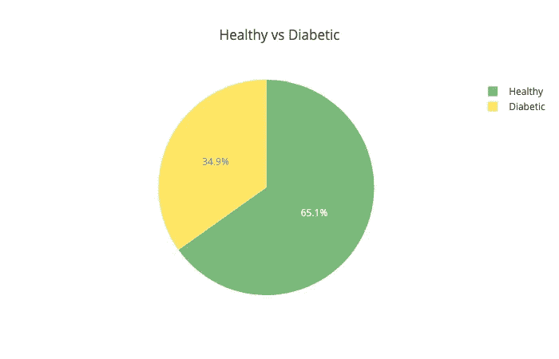

在我们的数据集中，65%多一点的病人是健康的。这意味着我们的模型应该在 65%的时间里更加准确，这样才是好的。接下来——胰岛素水平:

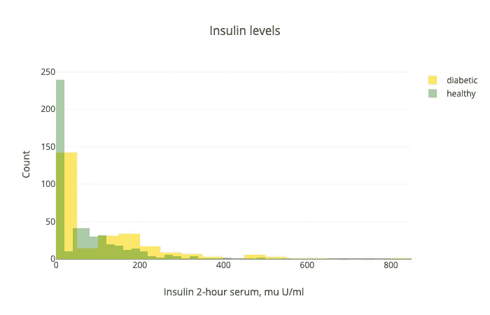

请注意，这两个分布之间有很大的重叠。此外，数据集中有很多 0。似乎我们有很多缺失的价值观。NaNs 被替换为 0。

另一个重要因素是测试后的葡萄糖水平:

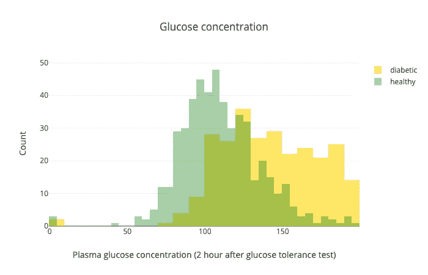

虽然有一些重叠，但这项测试似乎很好地区分了健康人和糖尿病患者。

让我们看看年龄:

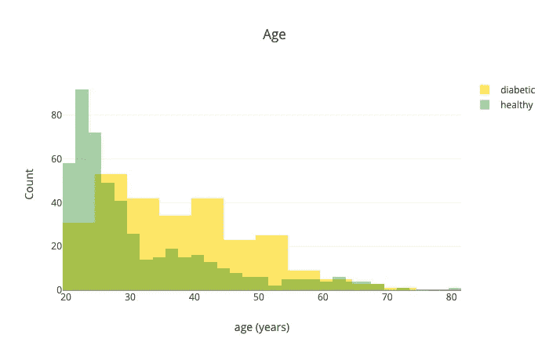

一般来说，老年人似乎更容易患糖尿病。

也许我们应该看看年龄和血糖水平之间的关系:

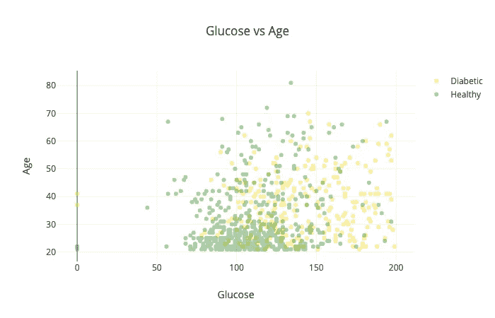

这两者的结合似乎可以很好地区分健康和糖尿病患者。这可能会给我们的模型带来奇迹。

你可能想尝试的另一个组合是皮肤厚度与身体质量指数:

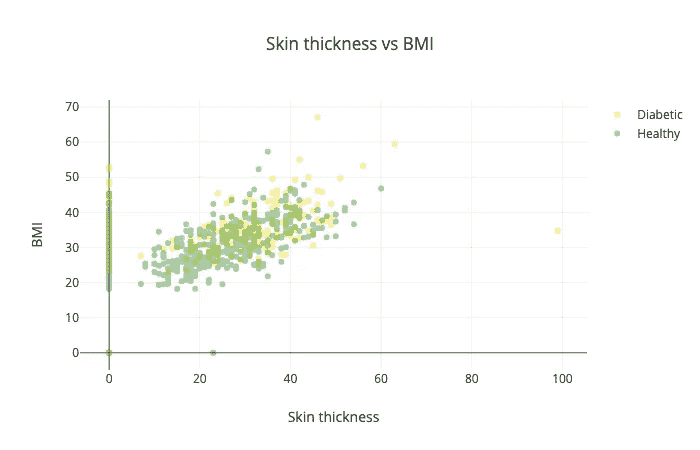

是的，这是可怕的，并没有告诉我们太多:)

## 预处理

目前，我们的数据位于一个对象数组中。不幸的是，TensorFlow 不能很好地处理这些问题。幸运的是，有 [tfjs-data](https://github.com/tensorflow/tfjs-data) 包。我们将从我们的 CSV 文件中创建一个数据集，并使用它通过`createDatasets()`函数训练我们的模型:

`features`参数指定哪些列在数据集中。`testSize`是将用于测试的数据部分。`batchSize`当数据集被分割成块(批)时，控制数据点的数量。

让我们从提取数据中的特征开始:

我们将要素中缺失的值替换为 0。你可以试着不用这一步来训练你的模型，看看会发生什么？

让我们准备标签:

oneHot 的定义如下:

一键编码将分类变量(健康— 0 和糖尿病— 1)转换为一个数组，其中 1 对应于类别的位置，所有其他变量为 0。以下是一些例子:

```
1; // diabetic =>
[0, 1];
```

和健康:

```
0; // healthy =>
[1, 0];
```

让我们从我们的数据中创建一个数据集:

请注意，我们还使用 42 的种子来混洗数据:)

最后，让我们将数据分成训练和验证数据集:

我们使用 [take](https://js.tensorflow.org/api/latest/#tf.data.Dataset.take) 来创建训练数据集， [skip](https://js.tensorflow.org/api/latest/#tf.data.Dataset.skip) 来省略验证数据集的训练示例，最后，使用[批处理](https://js.tensorflow.org/api/latest/#tf.data.Dataset.batch)将数据分割成块。

此外，我们返回数据来测试我们的模型(稍后将详细介绍)。

# 逻辑回归

逻辑回归(与其名称相反)允许您从数据中获得二元(是/否)答案。此外，它给出了每个答案的概率。像这样的问题:

*   这是垃圾邮件吗？
*   我应该向老板要求更高的薪水吗？
*   这个病人有糖尿病吗？
*   这个人是真正的朋友吗？
*   我的伴侣欺骗我吗？
*   我对我的伴侣不忠吗？
*   你明白我的意思吗？

如果有足够的数据，并且你足够幸运地相信所有这些问题都有答案，用逻辑回归是可以回答的吗？

但是我跑题了，让我们来看看逻辑回归的数学公式。首先，让我们从[线性模型](https://en.wikipedia.org/wiki/Linear_model)开始:

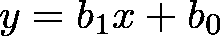

其中 *x* 是我们要用来训练模型的数据， *b* 1 控制斜率， *b* 0 控制与 *y* 轴的交点。

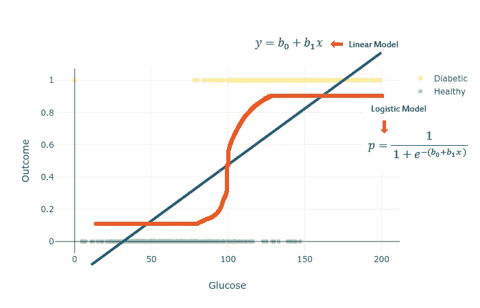

我们将使用 [softmax](https://en.wikipedia.org/wiki/Softmax_function) 函数从线性模型中获取概率，并获得逻辑回归的广义模型。 [Softmax 回归](http://deeplearning.stanford.edu/tutorial/supervised/SoftmaxRegression/)允许我们创建一个具有两个以上输出类别的模型(二元响应):

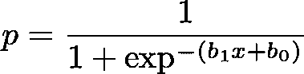

其中 *b* 1 定义曲线的陡度，而 *b* 0 左右移动曲线。

我们想利用我们的数据 *X* 和一些训练魔法来学习参数 *b* 1 和 *b* 0。让我们使用 TensorFlow.js 来实现它！

请注意，这个模型将给我们一个概率性的答案，而不仅仅是一个二元的反应。如果模型对某个预测不确定(例如低于 80%)，您可能会决定忽略该预测。

# 预测糖尿病

让我们通过在 TensorFlow.js 中构建一个模型来将理论付诸实践，并预测患者的结果。

## 模型

请记住，构建逻辑回归模型的关键是线性模型，并对其应用 softmax 函数:

请注意，我们有 2 个输出，因为根据我们为训练模型而选择的功能，存在一次性编码和动态输入计数。是的，在 TensorFlow.js 中建立逻辑回归模型就是这么简单。

下一步是[编译](https://js.tensorflow.org/api/latest/#tf.LayersModel.compile)模型:

我们模型的训练过程包括最小化损失函数。这由我们提供的[亚当](https://js.tensorflow.org/api/latest/#train.adam)优化器来完成。请注意，我们提供的学习率是`0.001`。

学习率被称为超参数，因为它是您提供给模型使用的参数。它控制每个新的更新应该“覆盖”您的模型已经知道的内容的程度。选择“正确的”学习速度有点像巫术。

我们使用[交叉熵损失](https://en.wikipedia.org/wiki/Cross_entropy)(被称为对数损失)来评估我们的模型做得有多好。它(严厉地)惩罚分类模型给出的错误答案，基于它们给每一类的概率。定义如下:

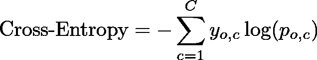

其中 *C* 是类的数量， *y* 是二进制指示器，如果类标签是观察的正确分类，并且 *p* 是 *o* 是类 *c* 的预测概率。

请注意，我们请求 TensorFlow 记录准确性指标。

# 培养

让我们使用 [fitDataset](https://js.tensorflow.org/api/latest/#tf.Sequential.fitDataset) 使用我们准备的训练和验证数据集来训练我们的模型:

我们对我们的模型进行 100 个时期的训练(整个训练集显示给模型的次数),并使用 [onEpochEnd](https://js.tensorflow.org/api/latest/#tf.LayersModel.fitDataset) 回调来记录可视化的训练日志。

我们将把所有这些打包到一个名为`trainLogisticRegression`的函数中，其定义为:

## 估价

让我们用目前为止我们已经建立的一切来评估我们的模型做得有多好:

请注意，我们仅使用葡萄糖水平来训练我们的模型。结果如下:

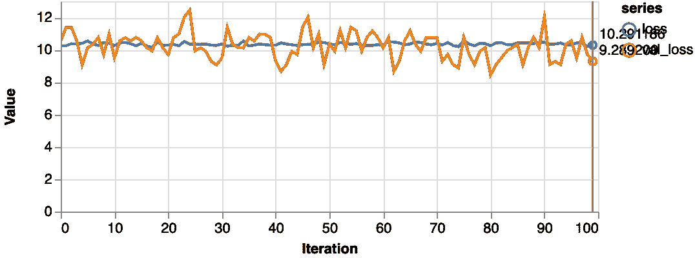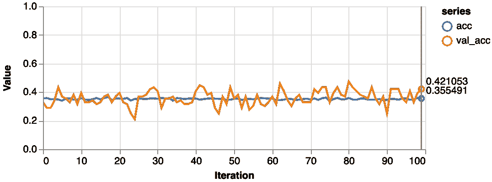

一点都不好。我们的模型比一个在 65%的时间里预测健康的假人表现更差。此外，损失从未真正开始下降。让我们尝试更多的数据:

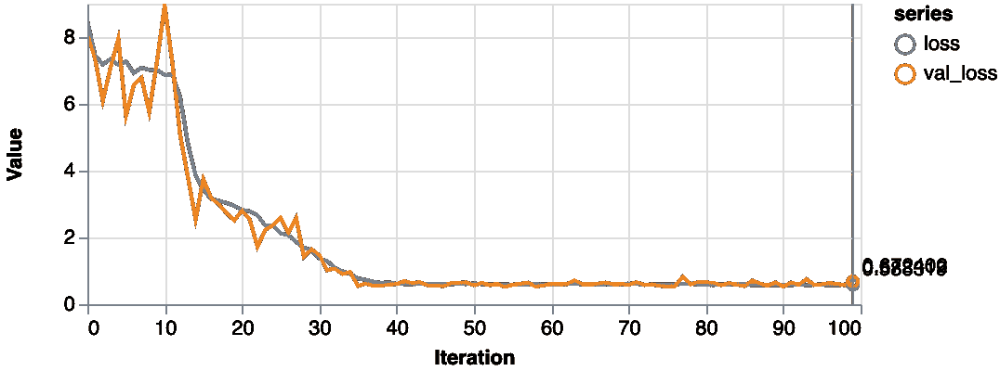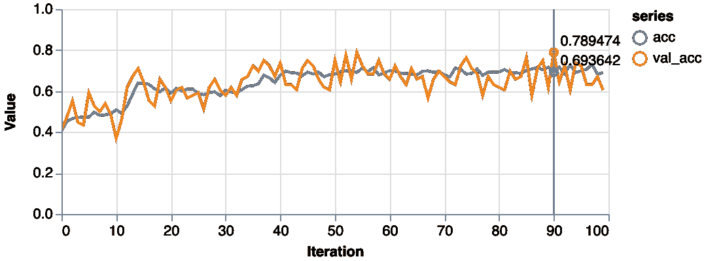

更好的是，在训练期间损失值显著降低，并且我们在验证集上获得了大约 79%的准确度。让我们用一个[混淆矩阵](https://en.wikipedia.org/wiki/Confusion_matrix)来仔细看看分类性能:

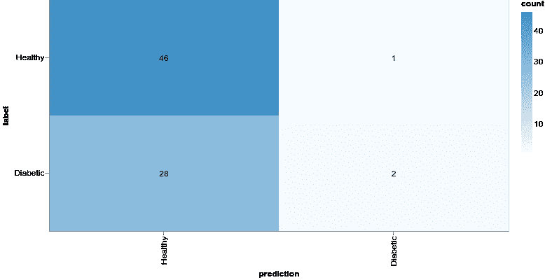

使用模型预测和测试集可以获得混淆矩阵:

即使我们的模型可能已经获得了更好的准确性，结果仍然是可怕的。与患糖尿病相比，健康被大大高估了。如果我们尝试一个更复杂的模型会怎么样:

这是该模型的混淆矩阵:

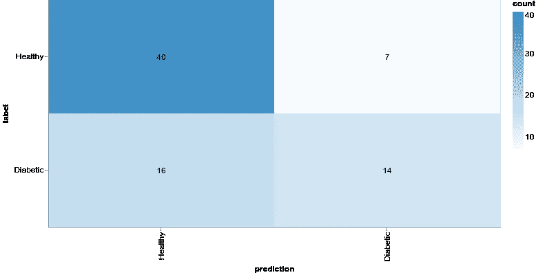

我们现在不研究这个模型，但是请注意，通过增加模型的复杂性，我们可以获得更好的结果。

# 结论

恭喜你！你建立并训练了不止一个，而是几个模型，包括逻辑回归，来预测病人是否患有糖尿病。你也遇到了现实世界——处理数据、训练和建立模型是很难的事情。此外，无论你有多少数据点，也不是一切都是可以预测的。

**在你的浏览器中运行本教程的完整源代码:**

也就是说，有一些方法可以改进构建和训练模型的过程。我们知道，在特定的环境下，使用某些技术比其他技术更好。嗯，机器学习是细致入微的:)

# 参考

*   【Saed Sayad 博士的逻辑回归
*   [tensor flow . js 简介](https://medium.com/tensorflow/a-gentle-introduction-to-tensorflow-js-dba2e5257702)

*最初发表于*[*https://www.curiousily.com*](https://www.curiousily.com/posts/diabetes-prediction-using-logistic-regression-with-tensorflow-js/)*。*

建立机器学习模型(特别是深度神经网络)，可以轻松地与现有或新的 web 应用程序集成。想想您的 ReactJs、Vue 或 Angular 应用程序通过机器学习模型的强大功能得到了增强:

[](https://leanpub.com/deep-learning-for-javascript-hackers) [## JavaScript 黑客的深度学习

### 建立机器学习模型(特别是深度神经网络)，您可以轻松地与现有或新的网络集成…

leanpub.com](https://leanpub.com/deep-learning-for-javascript-hackers)