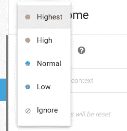
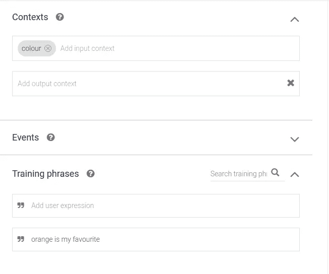
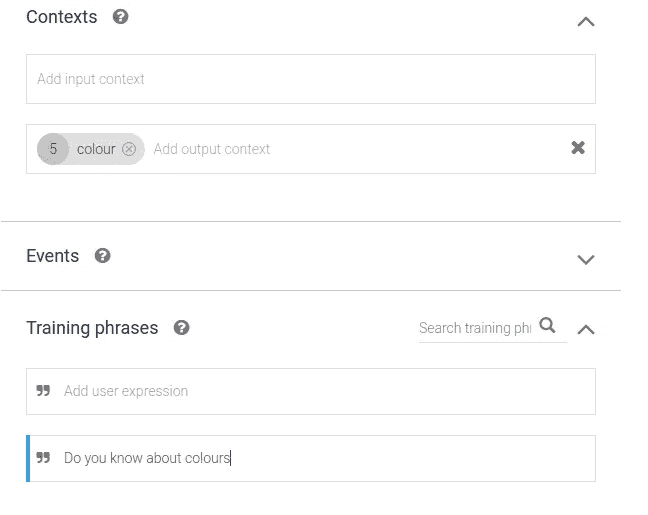
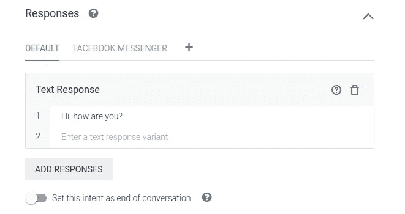
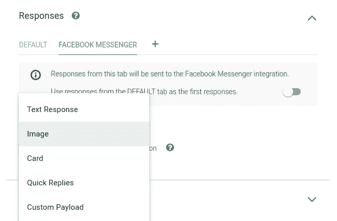

# DialogFlow:构建语音机器人和聊天机器人的简单方法

> 原文：<https://towardsdatascience.com/dialogflow-a-simple-way-to-build-your-voicebots-chatbots-27949a1ac443?source=collection_archive---------31----------------------->

## 了解 DialogFlow 的基础知识

如今，无论是 B2B 还是 B2C，企业都在很大程度上依赖聊天机器人来实现流程自动化和减少人工工作量。有各种各样的 NLP 聊天机器人平台被聊天机器人开发公司用来构建聊天机器人，其中最好的平台之一是 DialogFlow。该平台此前名为 API.AI，2016 年被谷歌收购，更名为 DialogFlow。

DialogFlow 是谷歌旗下的自然语言处理平台，可用于构建聊天机器人和语音机器人等对话应用。这是一个由人工智能驱动的平台，提供特定用途、引人入胜的语音和基于文本的对话。人类对话的复杂性仍然是机器缺乏的艺术，但特定领域的机器人是我们能够克服这些复杂性的最接近的东西。它可以与多个平台集成，包括 Web、脸书、Slack、Twitter 和 Skype。

# **对话流术语:**

***了解 DialogFlow 的基础知识***

# 1.代理人:

DialogFlow 代理处理与最终用户的对话流。要开始使用 DialogFlow，首先，我们需要使用 Dialogflow 控制台创建一个代理。

它是意图、实体、集成和知识的顶级容器。代理将终端用户对话期间的文本或音频转换为应用和服务可以理解的结构化数据。

# 2.意图:

意图用于理解和处理用户意图和上下文，以指导与最终用户的对话流程。

意图包含一些训练短语及其相应的响应。

当一个意图的训练短语与用户输入相匹配时，它就会被调用。并向最终用户提供其响应中定义的输出。如果输入有多个响应，那么响应将随机显示给用户。

如果我们有多个具有相同训练短语的意图，那么或者更高优先级的意图将匹配，或者具有活动输入上下文的意图将匹配。

## 意向优先级:

如果用户输入有可能与多个意图匹配，则可以设置意图优先级。具有较高优先级的意图将被调用。

## 回退意图:

当用户输入与任何意图都不匹配时，调用回退意图。

当我们创建一个代理时，代理中会添加两个默认意图。

欢迎意图和默认回退意图。

上下文用于理解自然语言用户上下文。也就是用户想要信息的环境。

**例如:**

一个人可以输入“橙色是我最喜欢的。”

现在，这种橙色可以与颜色或水果搭配。那么在这种情况下应该匹配哪个意图呢？

为了解决这个问题，在 DialogFlow 中使用了上下文。

## 上下文生命周期:

上下文有一个保持活动的生命周期。默认的生命周期是 5 次请求，但是可以更改。

这意味着在接下来的五个匹配的意图中，上下文将存在更长时间。

## 上下文有两种类型:

**a)输入上下文:**

只有当具有一些输入上下文的意图的所有输入上下文都是活动的时，才可以匹配该意图。

**比如:**

我们有两个相同的训练短语“橙色是我最喜欢的。”

但是这两种意图有不同的输入环境。一个包含颜色作为输入上下文，而另一个包含水果作为输入上下文。

输入上下文活动的意图将与用户输入相匹配。

**b)输出语境:**

如果具有一些输出上下文的意图与用户输入匹配，则其所有输出上下文将被激活。

**例如:**

用户输入“你了解颜色吗？”的颜色意图匹配

它会回答用户“你最喜欢的颜色是什么？”输出上下文“颜色”可以由意图设置为活动的。

当用户说“橙色是我的最爱”时，输入上下文“颜色”的意图将与用户输入相匹配。

# 4.实体:

实体用于从最终用户输入中提取一些有用的信息和参数。实体可以是系统定义的，也可以是开发人员定义的。

DialogFlow 提供了许多预定义的实体，如日期、时间、颜色、温度，称为系统实体，以处理最流行的常见概念。

然而，自定义实体也可以由开发人员根据他们的需求来定义。

从用户输入中提取的参数可以在意图之间传递，以引导对话流。

# 5.回应:

代理可以向最终用户提供两种类型的响应。

a)默认响应。

b)丰富的回复。

## a)默认响应:

默认响应也称为平台未指定响应。这些响应是显示给最终用户的简单文本响应。这些可以用于任何平台，包括网络，脸书，松弛。

## b)丰富的响应:

丰富响应也称为特定于平台的响应。丰富的响应被用来显示按钮，卡片，快速回复，通过脸书，slack 平台到用户的链接。

然而，要在 web 应用程序中使用丰富的响应，聊天机器人需要定制。

丰富的响应可以通过 DialogFlow 控制台进行配置，也可以在 webhook 响应中发送。

**6。Webhook:**

可以集成一个 Webhook 来给出我们的应用程序的响应。Webhook 集成很简单，可以使用履行选项来实现。可以在那里配置一个 URL，并且对于您想要调用 webhook 的意图，webhook 调用需要被设置为活动的。

# **结论:**

DialogFlow 是一个非常简单的平台，可以用最少的编码工作构建快速聊天机器人和语音机器人。它可以很容易地处理自然语言错误，并且可以与多种平台集成。它基本上是一个工具，允许建立聊天机器人，清楚地理解人类的对话，并在用相关参数解析对话后用适当的答案回复它们。更多了解可以参考这个[链接](https://cloud.google.com/dialogflow/docs/console)。

*原载于*[https://www . signity solutions . com/blog/dialog flow-voice bots-chatbots/](https://www.signitysolutions.com/blog/dialogflow-voicebots-chatbots/)*2019 年 10 月 1 日。*