# 80 年代真的有最多的昙花一现的奇迹吗？

> 原文：<https://towardsdatascience.com/did-the-80s-really-have-the-most-one-hit-wonders-356d3c545f43?source=collection_archive---------10----------------------->

## 还是看数据会偷走我们的阳光？

> 注意:如果你对阅读我的想法或发现不感兴趣，只想直接跳到结果，[点击这里](https://www.youtube.com/watch?v=dQw4w9WgXcQ)。

所以在最近的一次公路旅行中，当我们听着保罗的《T2》时，我和我的家人都在问自己这个问题。

这让我想到——当我问我的朋友、同事或街上的陌生人时，每个人似乎都同意 80 年代是昙花一现的黄金时代。但事实真的是这样吗？80 年代真的有最多的一炮走红的奇迹吗？或者这只是那些我们都认为是真的事实之一，尽管事实并非如此，就像口香糖在你的胃里呆了 7 年？

显然这是一个我们必须解决的问题——[用科学](https://www.youtube.com/watch?v=Ev-EIcCfjlY)！

我最初的计划是在 BigQuery 中完成这一切，因为这是我的 [jam](https://medium.com/firebase-developers/how-do-i-create-a-closed-funnel-in-google-analytics-for-firebase-using-bigquery-6eb2645917e1) 中的[类](https://medium.com/firebase-developers/analyzing-custom-retention-cohorts-using-bigquery-and-google-analytics-for-firebase-779777595950) [，但是当我开始以容易查询的形式搜索 Billboard top 100 数据时，我在 data.world 上偶然发现了这个数据集](https://medium.com/firebase-developers/how-to-use-select-from-unnest-to-analyze-multiple-parameters-in-bigquery-for-analytics-5838f7a004c2)，它似乎拥有我需要的一切。所以我最后用的就是这个。

请注意，我与这家公司没有任何关系，但我喜欢他们写得很好的服务条款，这很了不起。

# 获得每首歌曲的最高位置

因此，第一步是获取这个数据集(每周有一行是 Billboard Hot 100 中列出的歌曲),并将其压缩为一个列表，其中包含每首歌曲在排行榜中的最高位置以及它们达到最高位置的日期。

我最初有一个关于我如何做到这一点的更详细的分解，但我将跳过它，因为坦率地说，它并不那么有趣。

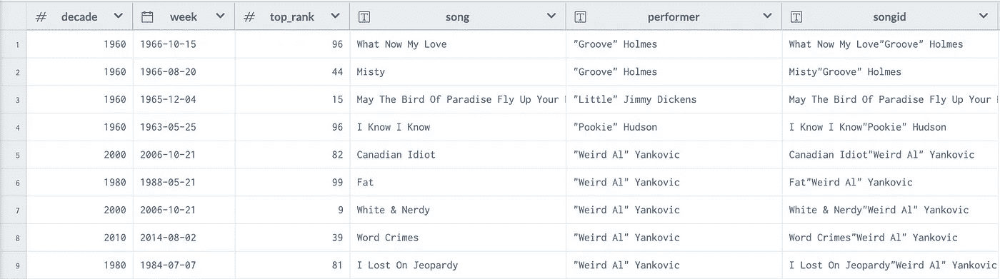

现在我们已经有了一个很好的数据集，让我们问自己一个更有趣的问题…

# 是什么让一击成名？

我最初的想法是，如果你只有一次进入公告牌百强，你就有资格成为一个昙花一现的奇迹。这里的问题是，进入热门 100 是一个真正的“击中”的慷慨定义。

你还记得，例如，80 年代的经典"[夜脉](https://www.youtube.com/watch?v=-6SCyeS5x8Q)"由重影(排行榜第 92 名)？我猜不会，除非你真的是“双重影像”乐队的前成员。

It’s as if Tommy Wiseau decided to direct music videos

同样，我认为 Kajagoogoo 是他们的歌曲“[太害羞](https://www.youtube.com/watch?v=-CfV2iVMeKA)”的昙花一现。但是他们的第二首歌“[坚持住](https://www.youtube.com/watch?v=DsuLdimruVI)”达到了 78 分。从技术上来说，他们会把两连击算作奇迹吗？大概不会。如果一次成功的奇迹的定义不包括 Kajagoogoo，这可能不是一个好的定义。哦，太好了。让我们把它放在引用中。

> 如果一次成功的奇迹的定义不包括 Kajagoogoo，这可能不是一个好的定义。

所以我决定，一个同样简单，但可能更准确的衡量一个热门奇迹的方法是简单地找到任何一个有一首歌达到 40 或更好排名的乐队。这似乎是一个很好的截止日期，因为前 40 名是美国文化的主要组成部分。

因此，让我们列出所有只有一首热门歌曲进入前 40 名的乐队，以及他们的热门歌曲名称、年代和排名:

好吧，这看起来很有希望。

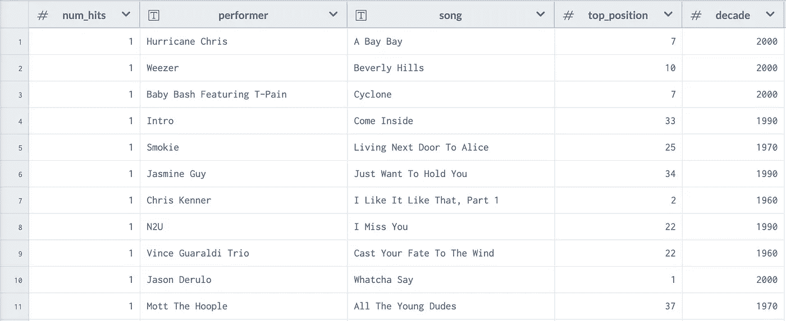

然后，当然，很容易将这些按年代分组并计数。

# 十年来最大的轰动奇迹(初步发现)

那么，当我把这个列表按十年分组时，我们发现了什么呢？

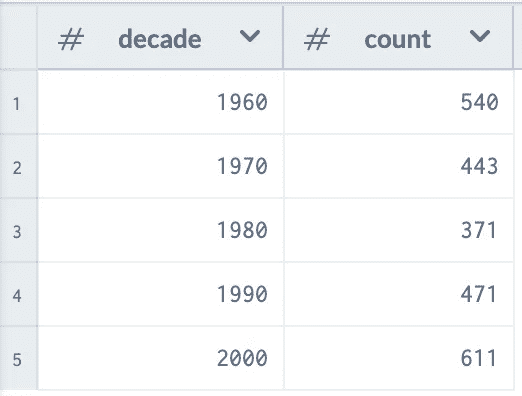

没错。根据我们的数据，实际上 20 世纪 80 年代的昙花一现最少，而 2000 年代的昙花一现最多。我们完事了吗？我们能不能简单的指着我们的数据，喊 [Whoomp！(就是它)](https://www.youtube.com/watch?v=ffCEr327W44)，继续前进？

好吧，等一下，因为我想解决两个数据问题。

## 眨眼 182 问题

根据我们的初步调查结果，Blink-182 被认为是一个昙花一现的奇迹，因为他们的歌曲中只有一首(“[所有的小事](https://www.youtube.com/watch?v=9Ht5RZpzPqw)”)实际上进入了前 40 名。其他一切都徘徊在 40 到 60 岁之间。我觉得这很奇怪。

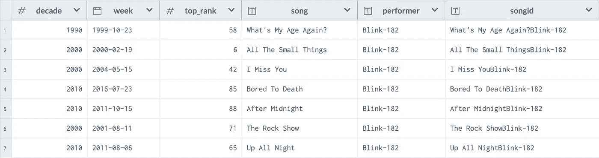

我认为这很大程度上是因为，到了 90 年代，另类音乐变得更加主流。因此，有可能有一张五次获得白金的流行朋克专辑几乎没有进入前 100 名排行榜，因为这些单曲在 Billboard 替代排行榜上获得了成功。我猜有很多乡村和 R&B 的艺术家也属于这一类。

但这一切都不能真正原谅这样一个事实，即有许多乐队在技术上被认为是基于这一定义的昙花一现，只是感觉不对。这包括威泽，奥兹·奥斯朋，梅西·埃丽奥特，贝克，拉什和柏树山。

所以我决定将我对昙花一现的定义修改为:

> 如果一个艺术家有一首歌进入前 25 名，但没有其他歌曲进入前 75 名，那么他就被认为是一个成功的奇迹。

这很好地解决了 Weezer、Blink-182 等不再被认为是昙花一现的奇迹。但是，最重要的是，Kajagoogoo 仍然是。

所以，做了一点工作，我就可以重新运行我的查询来查找有一首歌在前 25 名，没有其他歌在前 75 名的乐队。

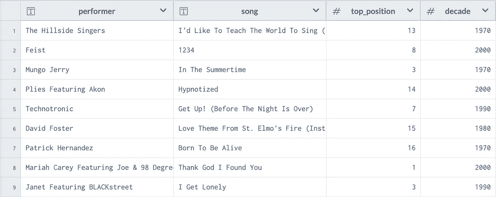

这产生了一个更小的每十年一次的奇迹列表(如果你仔细想想，这是有道理的)，但当你把它们都分组在一起时，你仍然会看到 80 年代的一次奇迹最少。

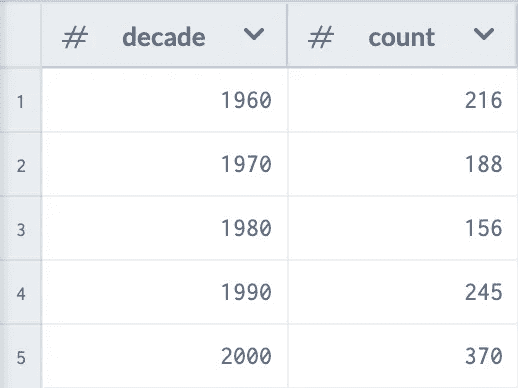

同样有趣的是，2000 年有着最多的轰动奇迹。这实际上给我们带来了下一个问题…

## 二重唱的问题，以小客串为特色

如果你浏览这些结果，你会开始注意到有许多由二重唱组成的昙花一现的奇迹。

就拿“[乌木和象牙](https://www.youtube.com/watch?v=TZtiJN6yiik)来说吧。这首歌在排行榜上排名第一，从技术上来说，这是一个成功的奇迹，因为表演者“保罗·麦卡特尼和斯蒂维·旺德”再也没有一首歌登上排行榜。《肯尼·罗杰斯与多莉·帕顿对唱》也是如此，该片发行了《[群岛在流](https://www.youtube.com/watch?v=HQW7I62TNOw)》。但我不会把这些艺术家称为昙花一现的奇迹。除非我想被永远禁止进入好莱坞。

Ohh… on second thought, I might be okay with that.

所以让我们来看看名字中有“&”、“和”或“与”的艺术家，以及名字中有“特色”的艺术家。

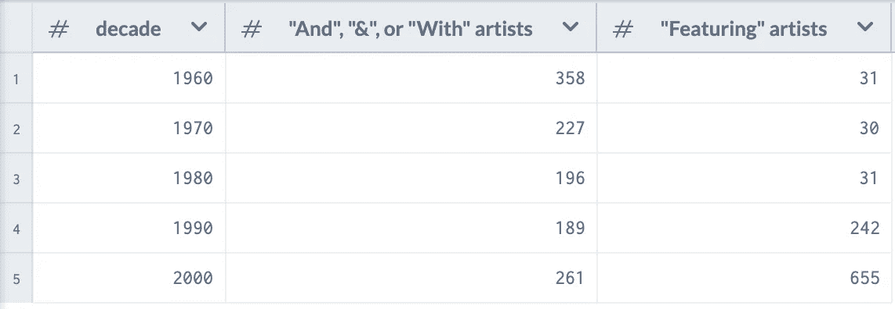

我们可以看到，这个问题在大多数十年中相当一致(尽管在 20 世纪 60 年代“和”艺术家有少量增加)。也就是说，直到你达到 90 年代中期。从那里开始，加速到 2000 年及以后，你会看到大量的艺术家“扮演”另一个表演者。

所以，如果我们看一下早期的结果，你会发现《50 美分》和《阿肯》都多次被认为是昙花一现的奇迹(我知道这有点多余)，因为他们的每首热门歌曲都有稍微不同的艺术家名字。

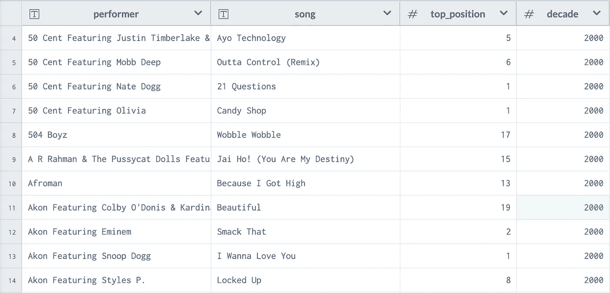

Both 50 Cent and Akon shouldn’t be on my one-hit wonder list. Afroman, you can stay.

现在，我可以通过使用一个小的正则表达式魔术来解决这个问题，将任何包含单词“Featuring”的艺术家姓名减少到首先列出的表演者。这意味着“以奈特·道格为特色的 50 美分”只是被认为是“50 美分”的点击率。

这个问题伴随着那个棘手的小词“And”(或“与”符号，或其他一些变体)。在某些情况下，将这些浓缩到首先列出的执行者可能是有意义的。这意味着你可以拿“大卫·鲍依&米克·贾格尔”的《在街上跳舞》来完全归功于大卫·鲍依——不管他愿不愿意。

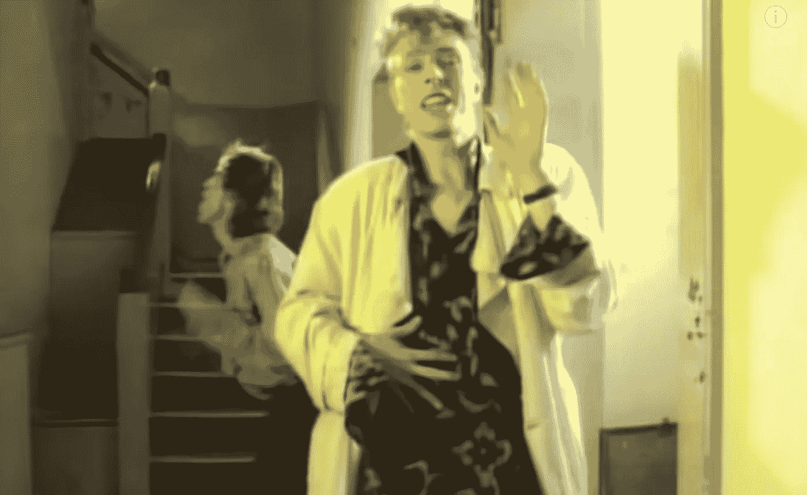

问题是，没有办法仅凭名字来区分一个乐队名称中碰巧有一个&符号(如“船长与坦尼尔”)和一个真正的二重唱(如“阿撒·富兰克林与乔治·迈克”)。

在大多数情况下，这没什么大不了的。你只会得到一些奇怪的乐队名字。胡蒂&河豚现在只是“胡蒂”。但是在一些情况下，你最终会把两个完全不同的波段浓缩成一个。例如，80 年代的乐队“爱与火箭”和 70 年代的乐队“爱与吻”现在都被认为是同一个名为“爱”的艺术家。

好消息是，这种情况似乎非常罕见——我只发现了少数两个完全不同的波段合并成一个波段的例子。也许如果我真的在乎，我会想办法把这些非二重唱乐队从真正的二重唱中分离出来。但那比我现在想处理的工作要多得多。我认为就目前而言，结合这些艺术家的好处超过了少量的误报

# 十年来最大的轰动一时的奇迹(最终结果)

也就是说，这是我对 one hit wonders 的查询，其中一个 one hit wonders 至少有一首歌进入前 25 名，但没有其他歌曲进入前 75 名，任何二重唱或歌曲“主打”别人都归功于首先列出的艺术家。

最终的统计结果是什么样的？

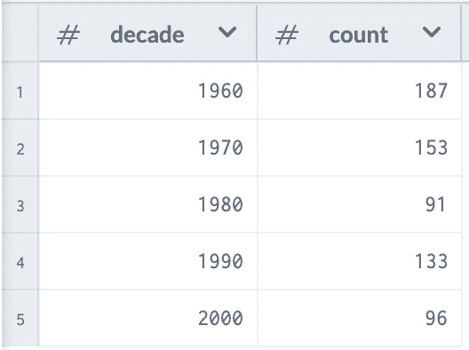

你可以看到二重唱和客串的结合严重减少了 2000 年代的昙花一现的数量。在 20 世纪 60 年代有所减少，但没有你想象的那么多，因为有很多艺术家的名字中带有“和”的字样。我怀疑(但无法证明)这是因为这些艺术家很少是真正的二重唱，而更多的是像“[兰迪&彩虹](https://www.youtube.com/watch?v=xgqMW4CHClk)这样的名字的乐队

## 昙花一现的奇迹

由于篇幅原因，我不能在这里列出所有轰动一时的奇迹，但这里列出了按十年细分的轰动一时的奇迹:[60 年代](https://gist.github.com/ToddKerpelman/450a56f4cedc6d69984564161bb0eee6)， [1970 年](https://gist.github.com/ToddKerpelman/7c36df2f9b87bd598aab15f2165ee487)，[80 年代](https://gist.github.com/ToddKerpelman/6e867481c7afe4acfb90d3d46a0513f6)，[90 年代](https://gist.github.com/ToddKerpelman/fc87a902df6b85b0b69fba45e5b3ad5e)，[2000 年代](https://gist.github.com/ToddKerpelman/46626f72db8878734b2c4c23b487be45)

但在这一切之后，我们最初的结果基本上仍然成立。20 世纪 80 年代的一次性奇迹最少，而 20 世纪 60 年代仍然最多。

这就引出了我们的下一个大问题…

# 为什么每个人都认为 80 年代有最多的轰动一时的奇迹？

那么，如果 80 年代的昙花一现最少，为什么看起来他们最多呢？我真的不知道，但这里有一些理论:

## **理论 1:80 年代是我们第一次接触流行音乐的时代**

也许我们都认为 80 年代是最热门的奇迹，因为那是我们最初接触流行音乐的时代。也许如果我伴随着 60 年代的音乐长大，我会回忆起“[我是一个女孩观察家](https://www.youtube.com/watch?v=raJWuz7qQVc)”，就像我现在回忆“[来吧艾琳](https://www.youtube.com/watch?v=ASwge9wc-eI)”一样。

…or maybe not. I don’t think that song aged well.

但是，正如我的朋友萨姆指出的那样，他也认为 80 年代是昙花一现的巅峰，而他在 80 年代并不活跃。这大大削弱了我的理论。也让我觉得自己真的老了。谢谢你萨姆。

## 理论 2:80 年代有最好的昙花一现的奇迹

因此，如果你曾经查看过“有史以来最受欢迎的单曲榜”，你会发现它们通常都是 80 年代的歌曲。会不会是 80 年代简单地创造出了更好的昙花一现的奇迹？因此，这十年与昙花一现的奇迹联系在一起，因为它有太多太棒的奇迹了？

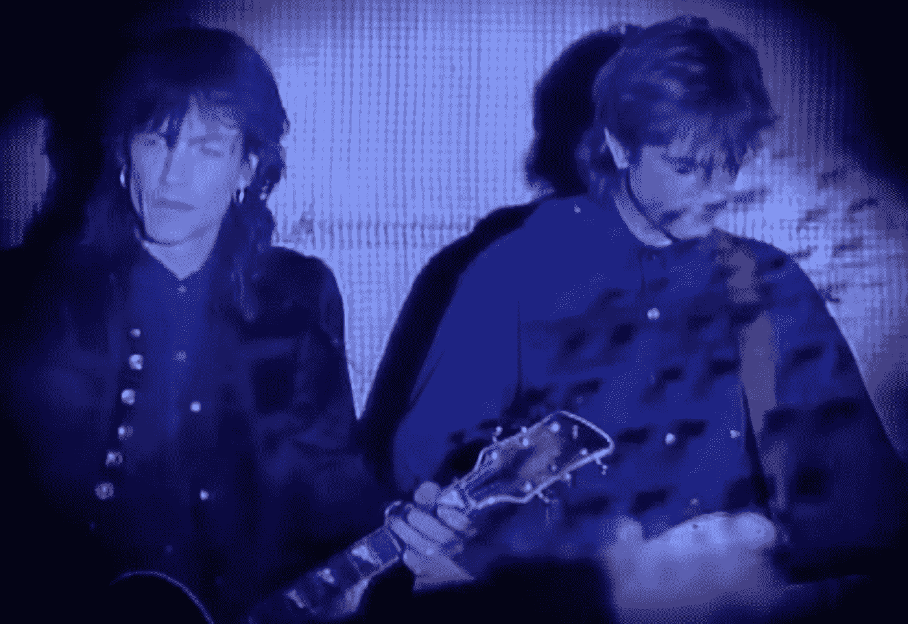

To be fair, nobody can pull off a bagpipe solo like [The Church](https://www.youtube.com/watch?v=pWxJEIz7sSA)

这里我有点怀疑。我可能把因果关系搞混了。如果我们走来走去都认为 80 年代是昙花一现的年代，那么当有人投票给我们列出最伟大的昙花一现的奇迹时，我们可能会自然而然地想到我们最喜欢的 80 年代的热门歌曲。

Photo by [israel palacio](https://unsplash.com/@othentikisra?utm_source=medium&utm_medium=referral) on [Unsplash](https://unsplash.com?utm_source=medium&utm_medium=referral)

但仍然值得研究。显然，要客观地判断出哪一个创造的奇迹是“最好的”是很难的。但是作为一个次要特征，我们可以看看这些昙花一现的奇迹在公告牌百强榜上停留了多长时间，以及它们的顶峰有多高。如果一首歌很好(或至少令人难忘)，你会希望它在排行榜上停留更长时间或达到更高的最高评级。

那么，当我们按十年细分这些统计数据时，会发生什么呢？

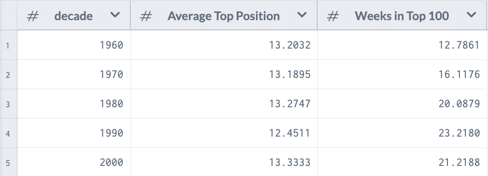

哼。嗯，看起来数据并不能真正支持我的理论。说到平均排名，这几十年是非常相似的。说到昙花一现的歌曲在排行榜上停留的时间更长，的确，60 年代和 70 年代的热门歌曲更短暂，但 90 年代的歌曲似乎在排行榜上停留的时间最长。

哦，如果你好奇的话，那是在最长的一段时间里排名前 100 的昙花一现的奇迹吗？邓肯·谢克的《勉强呼吸》，在排行榜上呆了整整 55 周。

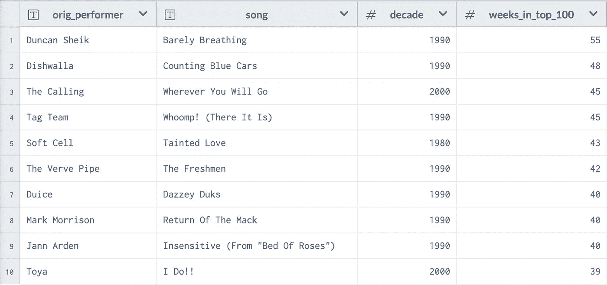

Also, if you haven’t ever listened to the [acoustic version](https://www.youtube.com/watch?v=THK4an_jb5g) of Barely Breathing, you really should.

## **理论三:** [**视频杀了电台明星**](https://www.youtube.com/watch?v=Iwuy4hHO3YQ)

我的最后一个理论是，MTV 在某种程度上对这一切负有责任。

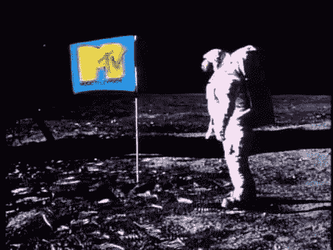

仔细想想，80 年代是 MTV 在音乐视频影响力上如日中天的时代。网络变得越来越受欢迎，但真人秀还没有接管，所以大多数节目是实际的音乐视频。还有(嗨，小朋友们！)这一切都发生在 YouTube 出现之前。

这意味着，与 60 年代和 70 年代不同，我们更多地注意到了一个奇迹，因为我们不仅仅是在收音机里听到它们；我们每天都在客厅里看到他们，接触到音乐背后的乐队——不仅仅是歌曲。

但与 90 年代末和 21 世纪初不同的是，看音乐视频没有其他选择，更不用说选择你要看的视频了。如果你想看音乐视频，你真的只有一个选择(好吧，如果算上 VH-1 的话是两个)，而且主要是流行音乐。

所以，也许我们都记得 80 年代是昙花一现的时代的原因是因为那时它们是我们客厅的焦点，这种现象变得更加明显。然后，这一名称就流传下来并影响了后代。

It’s probably also the reason we all think A-ha was a one-hit wonder, even though they’re not (see below)

我不知道这是否正确——但这是我迄今为止最好的理论。

# 其他有趣的事实

## 有史以来最大的昙花一现的奇迹是什么？

历史上有许多伟大的昙花一现的奇迹，但谁是最昙花一现的呢？我决定列出一份艺人名单，a)有一首歌在排行榜上排名第一，但 b)再也没有另一首歌出现在前 100 名中。

他们在这里，按时间顺序排列在图表上…

## 不是我认为的昙花一现的乐队

有几个乐队不是昙花一现，因为他们还有其他一些我忘记的小热门:

*   阿哈有"[承担 M](https://www.youtube.com/watch?v=djV11Xbc914) e" (#1)，但他们也有"[太阳永远照在电视上](https://www.youtube.com/watch?v=a3ir9HC9vYg) " (#20)和"[狼来了](https://www.youtube.com/watch?v=3c53Ii4irZY) " (#50)
*   梦幻学院有北方小镇的生活，但是他们也有爱情游行
*   卡特里娜和海浪有"[走在阳光下](https://www.youtube.com/watch?v=iPUmE-tne5U) " (#9)，但他们也有"[就是这样](https://www.youtube.com/watch?v=GgMEAdW97wc) " (#16)和"[你要哭吗](https://www.youtube.com/watch?v=F7xreT4mCM4) " (#37)
*   大国有“在一个大国里”(#17)，但他们也有“战场”(#52)
*   极端有"[多于文字](https://www.youtube.com/watch?v=UrIiLvg58SY) " (#1)，但他们也有"[空洞的心](https://www.youtube.com/watch?v=I-h4A7bF8wQ) " (#4)
*   《生死时速》有“[让我围着](https://www.youtube.com/watch?v=PGNiXGX2nLU)转”(#11)，但他们也有“[全新的情人](https://www.youtube.com/watch?v=ZWbj64Rwfvc)”(# 15)

同样，有几个乐队不是昙花一现，因为他们的歌曲没有我想象的那么成功

*   “视频杀死了电台明星”的 Buggles 仅在第 40 名达到顶峰
*   “[与你融为一体](https://www.youtube.com/watch?v=LuN6gs0AJls)”到了现代英语顶峰才排在第 76 位
*   她又来了，洛杉矶的巅峰时期只有第 49 位(但是六便士的版本并没有变得更富有，它的巅峰时期是第 32 位，这阻止了这个乐队的昙花一现)
*   原始人的《撞车》、Semisonic 的《T2》【关门时间】、原始人电台大神的《站在破电话亭外手里拿着钱的 T4》甚至都没进热门 100 强。听到这个消息让我…沮丧，宝贝。

## 解释为什么 90 年代为我们提供了惊人相似的昙花一现的奇迹。“经 95 南”[嗖！(就是它)](https://www.youtube.com/watch?v=ffCEr327W44)”的标签团队，以及为什么后者被证明在长期内更令人难忘

我发现了这个命题的一个真正不可思议的证明，这个中等的文章太窄了，无法包含。

# 已经结束了，为什么不呢？

所以你去吧，伙计们；所有你想知道但又不敢问的关于一次性奇迹的事情。如果您有兴趣进一步研究数据，请继续查看该项目！也许你会发现一些我没有发现的见解。毕竟，每个人都得在某个时候学习。

 [## 一击即中的奇迹 toddarooski 的项目

### 让我们弄清楚——80 年代真的是一炮走红奇迹最多的十年吗？

数据世界](https://data.world/toddarooski/one-hit-wonders)