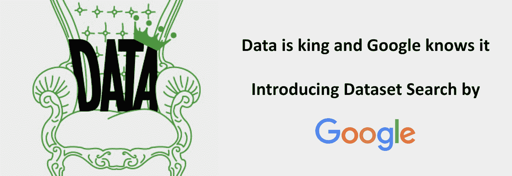
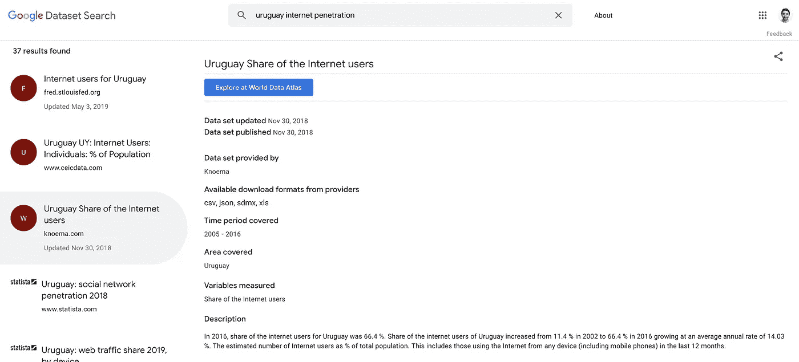

# 你遇到谷歌数据集搜索了吗？

> 原文：<https://towardsdatascience.com/did-you-meet-google-dataset-search-2d04858de20f?source=collection_archive---------14----------------------->

## 谷歌搜索引擎搜索来自世界各地的数据集

几周前，我写了一篇文章，讲述了当开始一个新的 DS/ML 项目时，我们通常会面临的那种[决定](/planning-a-data-science-project-top-decisions-to-be-made-e131fd324f5b)

*   话题
*   难度水平
*   项目的目标
*   我们会有观众吗？
*   时间和期限

这五点当然很重要，但除此之外，如果我们没有任何数据，我们就没有任何项目。数据为王。如果你不知道如何得到它，那么你就一无所有。除此之外，在我以前的文章中，我强调了一些你应该问自己的重要问题，关于来源、格式和必要的行动，以使自己掌握数据。

现在…如果我告诉你，有一个**源**，在那里你可以搜索成千上万的数据集，而且仅仅是来自世界各地的数据集，有几种**格式**，并且你可以很容易**发现和访问**？除了谷歌还有谁能提供这样的东西呢？欢迎来到[数据集搜索](https://toolbox.google.com/datasetsearch)…这不是什么新东西，但仍处于测试阶段——谷歌的数据集搜索引擎。

现在，如果你正在读这篇文章，并且在想:好吧，数据已经可以在网上获得了，这实际上并没有提供什么新的东西。公平地说，这实际上是真的。但是搜索数据可能会很麻烦，有时很难区分好的/真实的/完整的/可靠的和坏的/错误的/不完整的/不可靠的数据。这就是为什么，正如谷歌在推出该工具时所说，[数据集搜索](https://toolbox.google.com/datasetsearch)的诞生是为了方便访问网络上成千上万的数据仓库，提供对数百万数据集的访问；世界各地的地方和国家政府也发布他们的数据。

[数据集搜索](https://toolbox.google.com/datasetsearch)在移动和桌面上都可用，它已经在几种语言中工作，并且很快会有更多语言，除了搜索引擎之外，它没有任何科学。如果你知道如何使用谷歌主搜索引擎，那么你就会知道如何使用[数据集搜索](https://toolbox.google.com/datasetsearch)。只需键入您要查找的内容，Google 就会提供出版商提供的尽可能多的信息，包括:

*   源代码中下载页面的直接链接
*   谁在提供数据集
*   可用下载**格式**
*   涵盖的时间段
*   覆盖面积
*   测量的变量
*   以及数据集的简要描述

例如，我来自乌拉圭，所以我搜索“乌拉圭互联网渗透率”得到 37 个结果(有趣的是:自从我写了这篇文章并发表后，这个数字从 36 变成了 37)。考虑到我们谈论的是南美洲的一个小国，我个人认为这个数字相当可观。如果我们对英国[进行同样的搜索，数据集搜索](https://toolbox.google.com/datasetsearch)已经显示+100 个可用结果。

在 [The Verge](https://www.theverge.com) 不久前发表的一篇文章中，[开放数据研究所](https://theodi.org/)的首席执行官[林洋·坦尼森](https://www.linkedin.com/in/jenit/)说:

> “谷歌的参与应该有助于该项目取得成功(……)数据集搜索一直是一件难以支持的事情，我希望谷歌的介入将使它变得更容易”

当然，数据集搜索仍然有其局限性。正如你可以看到的权利时，进入它仍处于测试阶段。尽管谷歌还没有给出任何更新，但像高级搜索或过滤数据大小或列数这样的功能可能很快就会出现。

现在，如果你正在阅读这篇文章，并且你在网上某处有一个已发布的数据集，请仔细阅读下面几行:正如任何搜索引擎一样，[数据集搜索](https://toolbox.google.com/datasetsearch)将会变得越来越有用，因为人们可以获得越来越多的数据集。为此，谷歌正在遵循一种基于描述信息的开放标准(schema.org)的方法，任何发布数据的人都可以这样描述他们的数据集。此外，Google 还定义了一些标准来描述数据并使用户能够找到数据。因此，如果你想让你的数据出现在数据集搜索中，请访问谷歌关于数据集提供者指南的说明，以及开发者网站，其中也包括提问和提供反馈的链接。

以下是一些谷歌称之为数据集的例子:

*   包含一些数据的表格或 CSV 文件
*   一组有组织的桌子
*   包含数据的专有格式的文件
*   共同构成一些有意义的数据集的文件集合
*   一种其他格式的数据对象，使用特殊工具进行处理
*   图像捕捉数据
*   与机器学习相关的文件，如训练参数或神经网络结构定义

总而言之，无论你是一名经验丰富的研究人员还是像我一样热衷于数据科学家，你都应该对这一举措感到兴奋，并愿意传播消息，扩大当前可用数据集的数量。这非常好，不仅对数据科学界，而且对任何寻找数据集的人都是如此。我已经在着手发布我的一些数据，尤其是一个数据集，其中有我前段时间构建的数百名足球运动员的统计数据，当时我试图预测他们的市场价值。与此同时，请随意查看我的 [GitHub 库](https://github.com/gonzaferreiro/Market_value_football_players/tree/master/Final_datasets)并下载该数据，或者您可能找到的任何其他数据:)

别忘了看看我最近写的一些关于 [6 个业余错误的文章，这些错误是我在使用火车测试分割](/6-amateur-mistakes-ive-made-working-with-train-test-splits-916fabb421bb)、[5 分钟内抓取网页](/web-scraping-in-5-minutes-1caceca13b6c)或其他任何在[我的个人资料](https://medium.com/@g.ferreiro.volpi)中可以找到的。另外，**如果你想直接在你的邮箱里收到我的最新文章，只需** [**订阅我的简讯**](https://gmail.us3.list-manage.com/subscribe?u=8190cded0d5e26657d9bc54d7&id=3e942158a2) **:)**