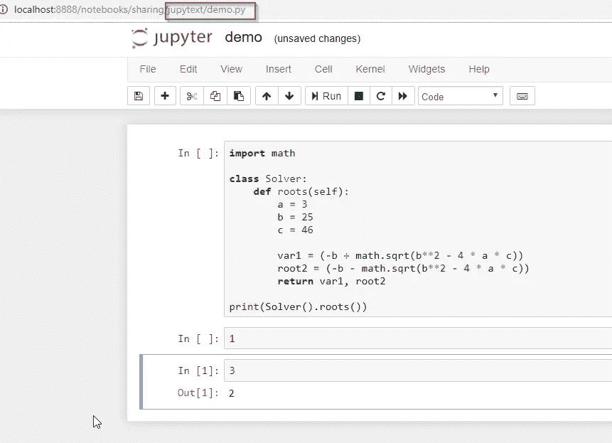
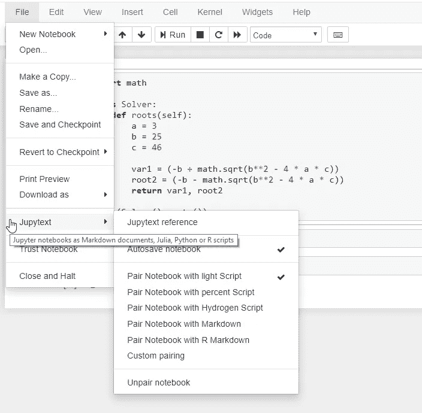
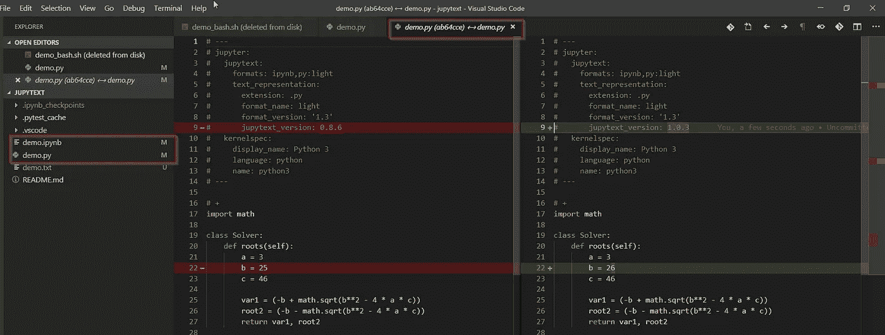
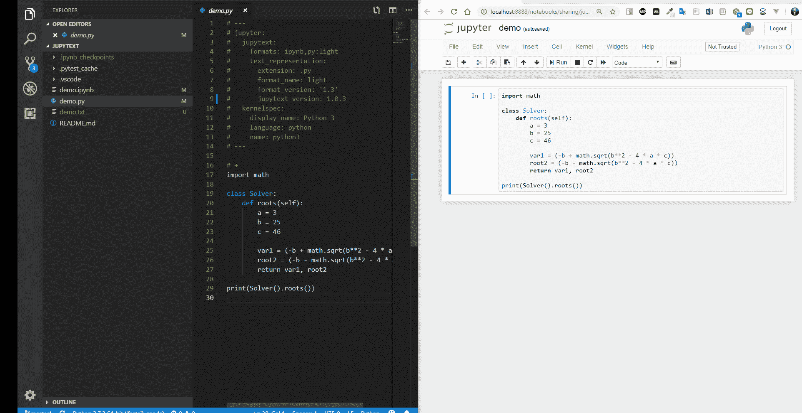
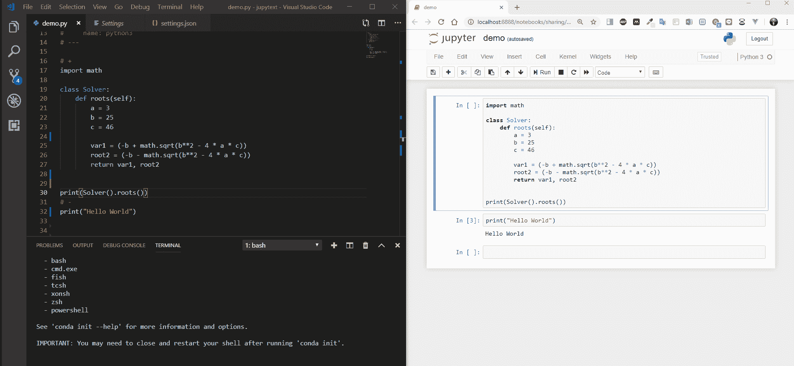

# jupytext——随心所欲地改变你的 Jupyter 笔记本

> 原文：<https://towardsdatascience.com/diff-your-notebook-as-you-want-jupytext-e5df4db682f7?source=collection_archive---------13----------------------->

Jupyter 笔记本已经成为许多数据科学家的首选工具，由于能够逐个运行单元，它已经广泛用于教育。事实上，笔记本是一个巨大的 JSON 文件，这使得它很难与 git 等工具一起工作，如果你想看看 Jupyter 笔记本的输出，nbdime 是一个很好的替代选择，我在大约六个月前写了一篇关于 nbdime 的[帖子](https://codeburst.io/jupyter-notebook-tricks-for-data-science-that-enhance-your-efficiency-ii-version-control-with-c2e7942f7681)。

nbdime 很棒，但是它不能很好地与像 VS Codes 和 PyCharm 这样的 ide 一起工作。如果有一个工具可以让你使用笔记本，但你可以像脚本一样不同，那该怎么办？有一个简单的解决方案——[Jupytext](https://github.com/mwouts/jupytext)。Jupytext 的神奇之处在于，它可以自动将您的笔记本与. py 脚本配对(您也可以与。html/。md 等……)。这是一个简单而有效的解决方案，让你享受双方的利益。这一对笔记本-脚本解锁了一些很酷的东西。

1.  *像笔记本一样打开一个. py 脚本*
2.  *版本控制简单*
3.  *Jupyter 笔记本的完整 IDE 重构功能*

# 1.像打开笔记本一样打开. py 脚本

你可以用这个命令很容易地安装 Jupytext，它会安装 Jupytext 和笔记本扩展。

```
pip install jupytext
```



You can open a py script like a .ipynb file with Jupyter notebook

如果你注意了文件名，它实际上是一个. py 文件，但是你可以把它当作一个笔记本。您可以以各种方式交互处理该文件，只是它仍然是一个. py 文件，因此输出不会缓存在脚本文件中，它只存在于您的浏览器中。

## 将你的笔记本与脚本配对

使用笔记本扩展，只需点击一下鼠标即可配对您的笔记本。在这里，我把我的笔记本和轻型脚本配对。如果你不在乎它是什么格式，就使用轻量级脚本。根据 Jupytext 文档，这些是当前支持的格式。

> Markdown 和 R Markdown 文档，Julia，Python，R，Bash，Scheme，Clojure，Matlab，Octave，C++和 q/kdb+脚本。



File → Jupytext →Pair Notebook with script

# 2.版本控制很容易

它将您的笔记本与脚本配对的事实意味着，嗯，**您可以对。py 文件。**笔记本不必再添加到存储库中，只要您想要显示输出。



Simply diff the .py file instead of the .ipynb file !

# **3。笔记本电脑的全面重构功能**

Jupytext 非常努力地想弄清楚你们配对的笔记本和脚本的变化。如果您在笔记本上进行更改，脚本将同时更新。



Sync Notebook with the script!

这是我正在做的事情的描述。

1.  在 VS 代码中进行重构
2.  保存脚本文件。
3.  按 F5 刷新笔记本以获取新的更改



Refactor in IDE -> Refresh in Notebook and continue

# 结论

这是我使用 Jupytext 最常见的用例，但是它可以做更多的事情。请查看他们的 Github 页面，了解更多高级用法。Marc 自己也写了一篇关于 [Jupytext 1.0](/introducing-jupytext-9234fdff6c57) 发布的博客，他在博客中详细解释了该功能。让我们对笔记本进行更多的重构。