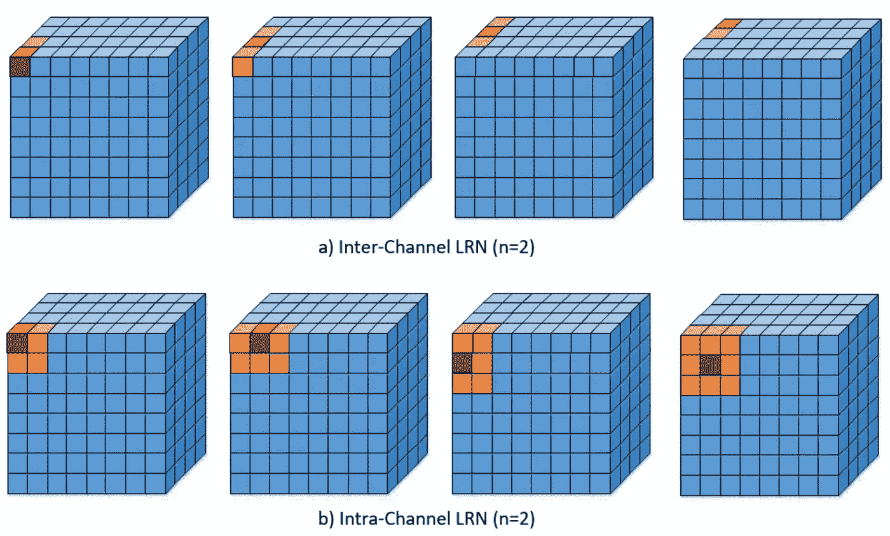
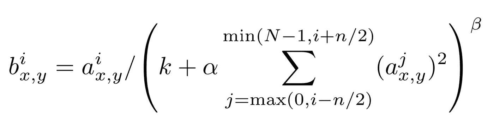
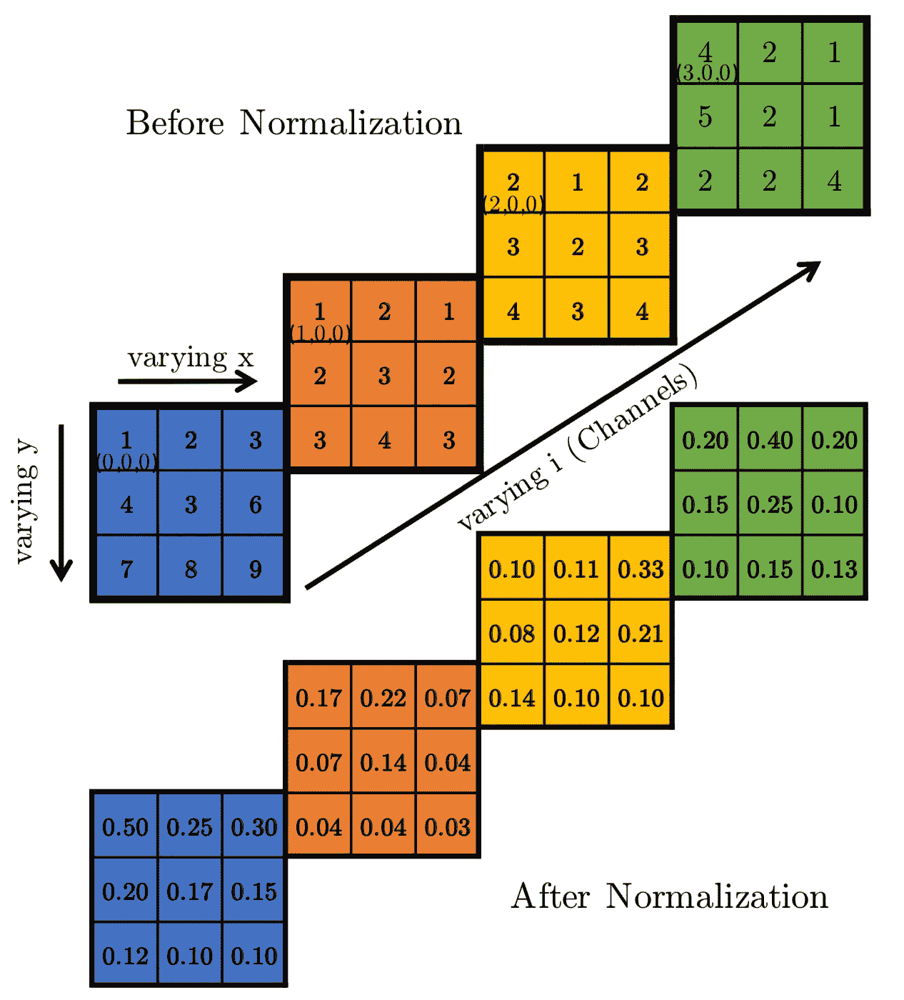
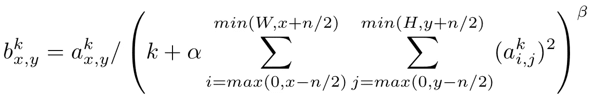
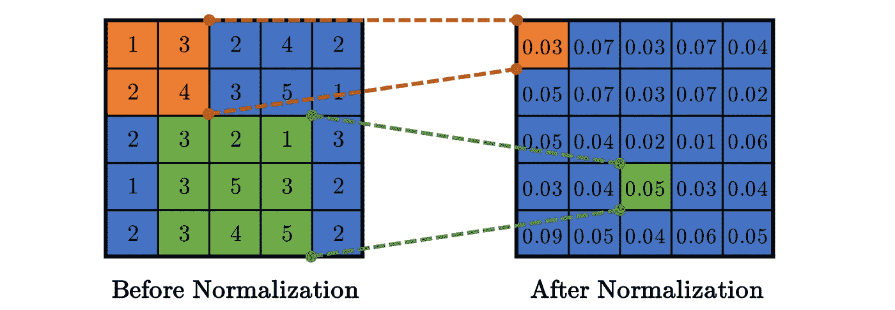
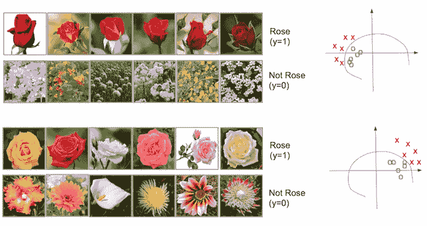
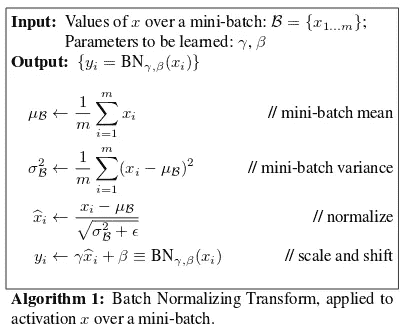
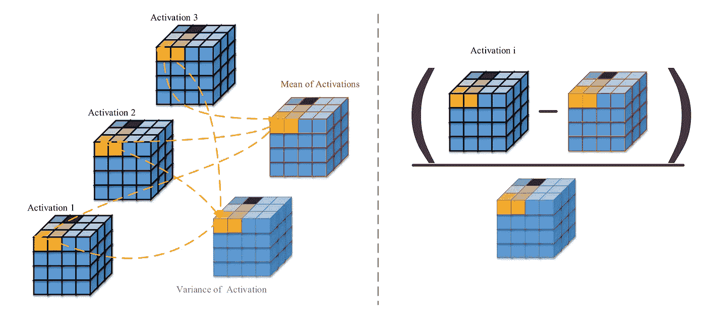
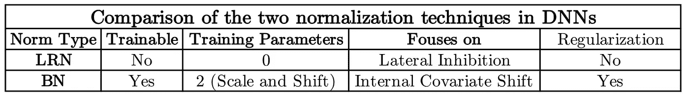

# 局部响应标准化和批量标准化的区别

> 原文：<https://towardsdatascience.com/difference-between-local-response-normalization-and-batch-normalization-272308c034ac?source=collection_archive---------2----------------------->

## 深度神经网络中使用的不同规范化技术的简短教程。

# 为什么要正常化？

归一化对于深度神经网络已经变得很重要，深度神经网络补偿某些激活函数的无界性质，例如 ReLU、eLU 等。使用这些激活函数，输出层不会被限制在一个有限的范围内(例如[-1，1]代表 *tanh* )，而是可以增长到训练允许的高度。为了限制无限制激活增加输出图层值，在激活函数之前使用了归一化。深度神经网络中使用了两种常见的规范化技术，并且经常被初学者误解。在本教程中，将讨论这两种规范化技术的详细解释，突出它们的主要区别。

# 局部响应标准化

本地响应规范化(LRN)首先在 AlexNet 架构中引入，其中使用的激活函数是 *ReLU* ，而不是当时更常见的 *tanh* 和 *sigmoid* 。除了上述原因，使用 LRN 的原因是为了促进*侧抑制。*它是神经生物学中的一个概念，指一个神经元降低其邻居活动的能力[1]。在 DNNs 中，这种横向抑制的目的是执行局部对比度增强，使得局部最大像素值被用作下一层的激励。

LRN 是一个**不可训练层**，它在局部邻域内对特征图中的像素值进行平方归一化。基于所定义的邻域，有两种类型的 LRN，如下图所示。

**通道间 LRN:** 这是 AlexNet paper 最初使用的。定义的邻域是穿过通道的**。对于每个(x，y)位置，归一化是在深度维度上进行的，并由以下公式给出**

LRN used in AlexNet [2]

其中 *i* 表示滤波器 I 的输出， *a(x，y)，b(x，y)* 分别为归一化前后 *(x，y)* 位置的像素值，N 为通道总数。常数 *(k，α，β，n)* 是超参数。 *k* 用于避免任何奇点(被零除)， *α* 用作归一化常数，而 *β* 是对比常数。常数 *n* 用于定义邻域长度，即在执行归一化时需要考虑多少个连续的像素值。( *k，α，β，n)=(0，1，1，N)* 的情况为标准归一化)。在上图中，当 N=4 时，N 等于 2。

让我们看一个通道间 LRN 的例子。请看下图

不同的颜色表示不同的通道，因此 N=4。假设超参数为( *k，α，β，n)=(0，1，1，2)。**n = 2*的值意味着在计算位置 *(i，x，y)* 的归一化值时，我们考虑上一个和下一个滤波器在相同位置的值，即 *(i-1，x，y)* 和 *(i+1，x，y)* 。对于 *(i，x，y)=(0，0，0)* 我们有*值(I，x，y)=1* ，*值(i-1，x，y)* 不存在，*值(i+，x，y)=1* 。因此 *normalized_value(i，x，y) = 1/( + ) = 0.5* ，可以在上图的下半部分看到。其余的标准化值以类似的方式计算。

**信道内 LRN:** 在信道内 LRN 中，邻域仅在同一信道内扩展，如上图所示。该公式由下式给出

其中(W，H)是特征图的宽度和高度(例如上图中的(W，H) = (8，8))。通道间和通道内 LRN 的唯一区别是归一化的邻域。在通道内 LRN 中，在所考虑的像素周围定义了 2D 邻域(与通道间的 1D 邻域相反)。例如，下图显示了在 n=2(即大小为(n+1)x(n+1)的 2D 邻域以(x，y)为中心)的 5×5 特征图上的通道内归一化。

# 批量标准化:

批量标准化(BN)是一个**可训练层**，通常用于解决 ***内部协变量移位(ICF)****【1】的问题。* ICF 的产生是由于隐藏神经元分布的改变/激活。考虑下面这个二元分类的例子，我们需要对玫瑰和非玫瑰进行分类

Roses vs No-roses classification. The feature map plotted on the right have different distributions for two different batch sampled from the dataset [1]

假设我们已经训练了一个神经网络，现在我们从数据集中选择两个明显不同的批次进行推断(如上所示)。如果我们对这两个批次进行正向传递，并绘制隐藏层(网络深处)的特征空间，我们将看到分布的显著变化，如上图右侧所示。这称为输入神经元的 ***协变移位*** 。这在训练时有什么影响？在训练期间，如果我们选择属于不同分布的批次，那么它会减慢训练，因为对于给定的批次，它会尝试学习某个分布，而该分布对于下一批次是不同的。因此，它不断地在分布之间来回跳跃，直到它收敛。这个 ***协变偏移*** 可以通过确保一个批次内的成员不属于相同/相似的分布来减轻。这可以通过随机选择批量图像来完成。隐藏神经元也存在类似的协变量移位。即使这些批次是随机选择的，隐藏的神经元也可能最终具有某种分布，从而减慢训练速度。隐藏层的这种协变量移位称为内部协变量移位。问题是我们不能像对输入神经元那样直接控制隐藏神经元的分布，因为它会随着训练更新训练参数而不断变化。批处理规范化有助于缓解这个问题。

在批量标准化中，隐藏神经元的输出在被馈送到激活函数之前以下面的方式被处理。

1.  将整批 *B* 标准化为零均值和单位方差

*   计算整个小批量产量的平均值: *u_B*
*   计算整个小批量产量的方差:s *igma_B*
*   通过减去平均值并除以方差来标准化小批量

2.引入两个可训练参数( *Gamma:* scale_variable 和 *Beta:* shift_variable)来缩放和移动标准化小批量输出

3.将该缩放和移位的标准化小批量馈送到激活功能。

BN 算法可以在下图中看到。

Batch Normalization Algorithm [2]

在一批所有激活中对每个像素进行归一化。考虑下图。让我们假设我们有一个 3 号的小批量。隐藏层产生大小为(C，H，W) = (4，4，4)的激活。由于批量大小是 3，我们将有 3 个这样的激活。现在，对于激活中的每个像素(即，对于每个 4x4x4=64 像素)，我们将通过找到所有激活中该像素位置的平均值和方差来对其进行归一化，如下图的左部所示。一旦找到平均值和方差，我们将从每次激活中减去平均值，然后除以方差。下图的右半部分描述了这一点。减法和除法是逐点进行的。(如果你习惯 MATLAB，除法就是点分**。/** )。

步骤 2(即缩放和移位)的原因是让训练决定我们是否需要归一化。在某些情况下，不进行规范化可能会产生更好的结果。因此，BN 不是预先选择是否包括归一化层，而是让训练来决定。当 *Gamma = sigma_B* 和 *Beta = u_B* 时，不进行归一化，恢复原始激活。吴恩达在 BN 上的一个非常好的视频教程可以在这里找到

# 比较:

LRN 有多个方向来跨(通道间或通道内)执行归一化，另一方面，BN 只有一种执行方式(针对所有激活中的每个像素位置)。下表比较了这两种标准化技术。

**参考文献:**

[1][https://www . learnopencv . com/batch-normalization-in-deep-networks/](https://www.learnopencv.com/batch-normalization-in-deep-networks/)

[2]约菲、谢尔盖和克里斯蒂安·塞格迪。"批量标准化:通过减少内部协变量转移加速深度网络训练." *arXiv 预印本 arXiv:1502.03167* (2015)。

# 奖金:

可以在下面的链接中找到这个主题和机器学习中许多其他重要主题的紧凑备忘单

 [## 机器学习面试主题的备忘单

### ML 面试的视觉备忘单(www.cheatsheets.aqeel-anwar.com)

medium.com](https://medium.com/swlh/cheat-sheets-for-machine-learning-interview-topics-51c2bc2bab4f) 

如果这篇文章对你有帮助，欢迎鼓掌、分享和回复。如果想了解更多关于机器学习和数据科学的知识，请关注我@[**Aqeel an war**](https://medium.com/u/a7cc4f201fb5?source=post_page-----272308c034ac--------------------------------)**或者在**[***LinkedIn***](https://www.linkedin.com/in/aqeelanwarmalik/)***上与我联系。***