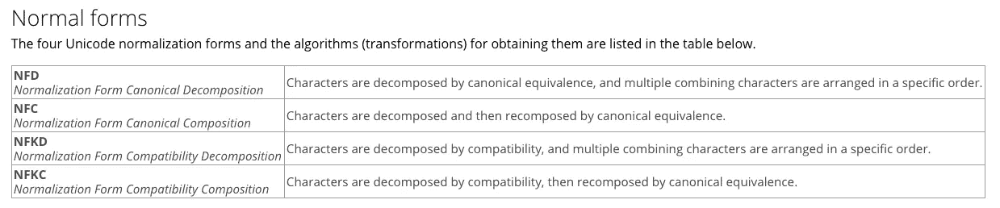
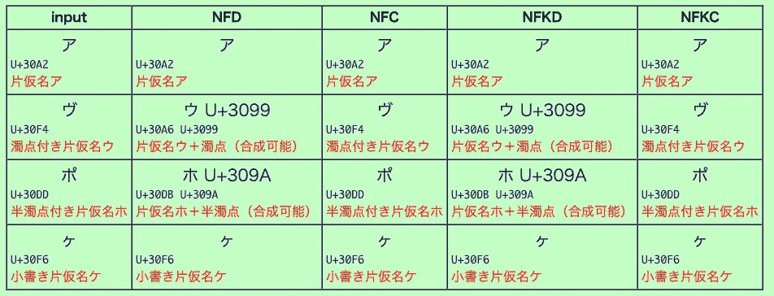

# 用 Python 代码解释 NFD、NFC、NFKD 和 NFKC 之间的区别

> 原文：<https://towardsdatascience.com/difference-between-nfd-nfc-nfkd-and-nfkc-explained-with-python-code-e2631f96ae6c?source=collection_archive---------6----------------------->

## Unicode 规范化形式之间的区别


Photo by [Joel Filipe](https://unsplash.com/@joelfilip?utm_source=unsplash&utm_medium=referral&utm_content=creditCopyText) on [Unsplash](https://unsplash.com/s/photos/form?utm_source=unsplash&utm_medium=referral&utm_content=creditCopyText)

最近我在做一个日文的 NLP 任务，其中一个问题是将特殊字符转换成标准格式。所以我做了一些调查，为有同样需求的人写了这篇文章。

日语包含不同形式的字符，例如，拉丁语有两种形式，全角形式和半角形式。


在上面的例子中，我们可以看到全幅形式是非常丑陋的，也很难利用后续的处理。所以我们需要把它转换成规范化的形式。

# TL；速度三角形定位法(dead reckoning)

使用`NFKC`方法。

```
>>> from unicodedata import normalize
>>> s = "株式会社ＫＡＤＯＫＡＷＡ Ｆｕｔｕｒｅ Ｐｕｂｌｉｓｈｉｎｇ"
>>> normalize('NFKC', s)
株式会社 KADOKAWA Future Publishing
```

# Unicode 规范化形式



from [Wikipedia](https://www.wikiwand.com/en/Unicode_equivalence#/Normal_forms)

有 4 种 Unicode 规范化形式。这篇[文章](https://unicode.org/reports/tr15/#Norm_Forms)给出了非常详细的解释。但我会用一种简单易懂的方式解释其中的区别。

首先，我们可以看到下面的[结果](https://maku77.github.io/js/string/normalize.html)以获得直观的理解。

```
ｱｲｳｴｵ ==(NFC)==> ｱｲｳｴｵ
ｱｲｳｴｵ ==(NFD)==> ｱｲｳｴｵ
ｱｲｳｴｵ ==(NFKC)==> アイウエオ
ｱｲｳｴｵ ==(NFKD)==> アイウエオ
パピプペポ ==(NFC)==> パピプペポ
パピプペポ ==(NFD)==> パピプペポ
パピプペポ ==(NFKC)==> パピプペポ
パピプペポ ==(NFKD)==> パピプペポ
ﾊﾟﾋﾟﾌﾟﾍﾟﾎﾟ ==(NFC)==> ﾊﾟﾋﾟﾌﾟﾍﾟﾎﾟ
ﾊﾟﾋﾟﾌﾟﾍﾟﾎﾟ ==(NFD)==> ﾊﾟﾋﾟﾌﾟﾍﾟﾎﾟ
ﾊﾟﾋﾟﾌﾟﾍﾟﾎﾟ ==(NFKC)==> パピプペポ
ﾊﾟﾋﾟﾌﾟﾍﾟﾎﾟ ==(NFKD)==> パピプペポ
ａｂｃＡＢＣ ==(NFC)==> ａｂｃＡＢＣ
ａｂｃＡＢＣ ==(NFD)==> ａｂｃＡＢＣ
ａｂｃＡＢＣ ==(NFKC)==> abcABC
ａｂｃＡＢＣ ==(NFKD)==> abcABC
１２３ ==(NFC)==> １２３
１２３ ==(NFD)==> １２３
１２３ ==(NFKC)==> 123
１２３ ==(NFKD)==> 123
＋－．～）｝ ==(NFC)==> ＋－．～）｝
＋－．～）｝ ==(NFD)==> ＋－．～）｝
＋－．～）｝ ==(NFKC)==> +-.~)}
＋－．～）｝ ==(NFKD)==> +-.~)}
```

这 4 种形式有两种分类方法。

```
# 1 original form changed or not
- A(not changed): NFC & NFD
- B(changed): NFKC & NFKD# 2 the length of original length changed or not
- A(not changed): NFC & NFKC
- B(changed): NFD & NFKD
```

# 1 .是否改变了原来的形式

```
ａｂｃＡＢＣ ==(NFC)==> ａｂｃＡＢＣ
ａｂｃＡＢＣ ==(NFD)==> ａｂｃＡＢＣ
ａｂｃＡＢＣ ==(NFKC)==> abcABC
ａｂｃＡＢＣ ==(NFKD)==> abcABC# 1 original form changed or not
- A(not changed): NFC & NFD
- B(changed): NFKC & NFKD
```

第一种分类方法是基于原始形式是否改变。更具体地说，A 组不包含`K`，但是 B 组包含`K`。`K`是什么意思？

```
D = Decomposition 
C = Composition
K = Compatibility
```

`K`意为兼容，用来与原始形态相区别。因为`K`改变了原来的形式，所以长度也改变了。

```
>>> s= '…'
>>> normalize('NFKC', s)
'...'>>> len(s)
1
>>> len(normalize('NFC', s))
1
>>> len(normalize('NFKC', s))
3
>>> len(normalize('NFD', s))
1
>>> len(normalize('NFKD', s))
3
```

# 2 原始形式的长度是否改变

```
パピプペポ ==(NFC)==> パピプペポ
パピプペポ ==(NFD)==> パピプペポ
パピプペポ ==(NFKC)==> パピプペポ
パピプペポ ==(NFKD)==> パピプペポ# 2 the length of original length changed or not
- A(not changed): NFC & NFKC
- B(changed): NFD & NFKD
```

第二种分类方法是基于原始格式的长度是否改变。一组包含`C`(构图)，不会改变长度。b 组包含`D`(分解)，会改变长度。

你可能想知道为什么长度是变化的？请看下面的测试。

```
>>> from unicodedata import normalize
>>> s = "パピプペポ"
>>> len(s)
5
>>> len(normalize('NFC', s))
5
>>> len(normalize('NFKC', s))
5
>>> len(normalize('NFD', s))
10
>>> len(normalize('NFKD', s))
10
```

我们可以发现“分解”法使长度加倍。



from [Unicode 正規化とは](http://nomenclator.la.coocan.jp/unicode/normalization.htm)

这是因为`NFD & NFKD`将每个 Unicode 字符分解成两个 Unicode 字符。比如`ポ(U+30DD) = ホ(U+30DB) + Dot(U+309A)`。所以长度从 5 变到 10。`NFC & NFKC`将分开的 Unicode 字符组合在一起，因此长度不变。

# Python 实现

您可以使用 unicodedata 库获得不同的表单。

```
>>> from unicodedata import normalize
>>> s = "パピプペポ"
>>> len(s)
5
>>> len(normalize('NFC', s))
5
>>> len(normalize('NFKC', s))
5
>>> len(normalize('NFD', s))
10
>>> len(normalize('NFKD', s))
10
```

长度

# 拿走

通常，我们可以使用`NFKC or NFKD`中的任何一个来获得规范化形式。只有当你的 NLP 任务对长度敏感时，长度才不会带来麻烦。我一般用`NFKC`的方法。

> ***查看我的其他帖子*** [***中等***](https://medium.com/@bramblexu) ***同*** [***一分类查看***](https://bramblexu.com/posts/eb7bd472/) ***！
> GitHub:***[***bramble Xu***](https://github.com/BrambleXu) ***LinkedIn:***[***徐亮***](https://www.linkedin.com/in/xu-liang-99356891/) ***博客:***[***bramble Xu***](https://bramblexu.com)

# 参考

*   [https://unicode.org/reports/tr15/#Norm_Forms](https://unicode.org/reports/tr15/#Norm_Forms)
*   [https://www . wiki wand . com/en/Unicode _ equivalence #/Normal _ forms](https://www.wikiwand.com/en/Unicode_equivalence#/Normal_forms)
*   [http://nomenclator.la.coocan.jp/unicode/normalization.htm](http://nomenclator.la.coocan.jp/unicode/normalization.htm)
*   [https://maku77.github.io/js/string/normalize.html](https://maku77.github.io/js/string/normalize.html)
*   [http://tech.albert2005.co.jp/501/](http://tech.albert2005.co.jp/501/)