# 套索、脊和漏失正则化—它们对共线性的影响

> 原文：<https://towardsdatascience.com/different-forms-of-regularization-and-their-effects-6a714f156521?source=collection_archive---------11----------------------->

# 介绍

这是我上一篇业余的、晦涩的文章的续篇——[关于正规化的简短说明](https://medium.com/@snaveenmathew/a-short-note-on-regularization-42ee07c65d90)。这篇文章提供了它所承诺的东西，但它不足以回答这些问题——正则化做了什么，为什么它可以工作，而相应的没有正则化的模型却不能？本文的目的是试图用线性代数(正规方程)和统计学(估计量的偏差-方差权衡)来回答这些问题。

让我们假设感兴趣的隐藏层的工程变量为 X 或 X，这是输入特征 Z 或 Z 的函数。在本文中，我们假设截距为 0，因为在一般情况下截距不会缩小。为简单起见，我们将导出线性回归的分析结果并将结果推广到逻辑回归，*假设* ***真实模型在(工程)特征*的空间中是线性的** *。*

# 重要

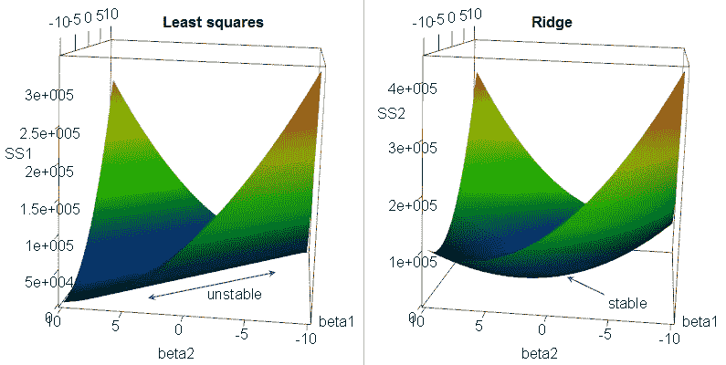

Collinearity problem in linear regression. Image source: [https://medium.com/@rrfd/what-is-ridge-regression-applications-in-python-6ed3acbb2aaf](https://medium.com/@rrfd/what-is-ridge-regression-applications-in-python-6ed3acbb2aaf)

我有意以机器学习中正则化的重要性开始这篇文章。这一部分可能含义模糊；本文的其余部分将从头开始构建思路，试图理解这些模糊的陈述。

*   沿着具有 h 个神经元的全连接隐藏层对深度神经网络进行切片，得到具有 h 个特征的更小的下游神经网络
*   如果上面选择的隐藏层是输出层之前的层，则生成的神经网络相当于逻辑回归
*   可以应用于线性/逻辑回归的简单线性代数可以扩展到深度神经网络，该深度神经网络在完全连接的隐藏层被切片

# 线性回归

## 模型定义

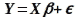

True model, unknown

## 估计的

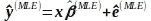

Estimated

## 损失函数

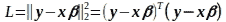

Square loss in terms of matrix product

## 解决办法

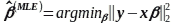

ML / OLS estimate for coefficients

阅读:[线性回归中极大似然估计和 OLS 的等价性](https://medium.com/@snaveenmathew/equivalence-of-mle-and-ols-in-linear-regression-d3e44e47df3c)

## 解析

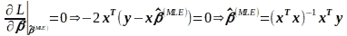

Normal equation — MLE by analytical method

# L2 正则化线性回归

## 模型定义

True model, unknown

## 估计的

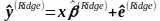

Estimated

## 损失函数

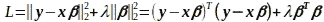

Loss in terms of matrix product

## 解决办法

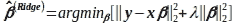

Solution

## 解析

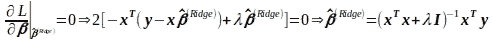

Ridge estimate using analytical method

# 理解差异

考虑一种设计矩阵不是满秩的情况(我上一篇文章中定义的几种情况:[正则化的简短说明](https://medium.com/@snaveenmathew/a-short-note-on-regularization-42ee07c65d90))。因此协方差矩阵是不可逆的。因此，MLE 不存在。

在这种情况下，考虑两种极端情况:λ = 0 和λ = ∞

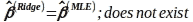

Case 1

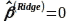

Case 2

在这两种极端情况之间，修正的协方差矩阵由下式给出

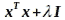

Modified covariance matrix for ridge regresion

将随着λ的增加而成为对角优势。所以保证是可逆的。这证明了即使设计矩阵不是满秩的，非零λ的岭估计总是存在的(在[这篇](https://stats.stackexchange.com/questions/282654/non-singularity-due-to-inclusion-of-non-zero-lambda-in-ridge-regression) StackExchange 文章中提供了严格的证明)。

因此，我们得出结论，使用 L2 正则化解决了共线性问题。与岭回归不同，Lasso (L1 正则化)回归没有解析解。在存在共线性的情况下，预计其行为类似于岭回归。Lasso 回归也是随着λ(小于∞)的增大，将变量的系数收缩到 0 来进行剪枝，这在 ridge 中是观察不到的(lasso 对剪枝的严谨分析可以在我的 [Quora 答案](https://www.quora.com/Why-do-L1-regularizations-causes-parameter-sparsity-whereas-L2-regularization-does-not/answer/Naveen-Mathew)上找到)。为方便起见，L1 正则化线性回归公式如下所示:

# L1 正则化线性回归

## 模型定义

True model, unknown

## 估计的

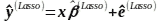

Estimated

## 损失函数

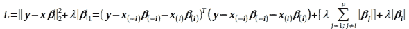

Loss in terms of independent variables

## 解决办法

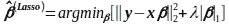

Solution

我们假设 lasso 的行为在协方差矩阵的可逆性方面类似于 ridge 的行为(严格的分析可以在[这篇论文](https://web.stanford.edu/~hastie/Papers/graph.pdf) —第 5 页中找到，也解释了使用坐标下降的原因)。lasso 的解析解不存在，除了一个简单的情况-当协方差矩阵是对角矩阵时。

**对角协方差注意:**参数估计变得类似于轮廓似然性——在一次坐标下降迭代中所选β的变化不会影响其他β。因此，坐标下降在一次迭代中收敛。

注意:我将在两篇独立的文章中用几何解释以更严格的方式讨论 L1 和 L2 正则化。

# 拒绝传统社会的人

辍学通常被视为调整神经网络的一种实用方式。很难以完全分析的方式处理辍学问题，因为:

1.  它涉及到一些随机化—只有期望值是已知的，实际上各个实现会根据种子而变化
2.  对(随机)梯度下降的每个样品/小批量/批量进行测试

该模型可以被视为:

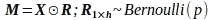

Masking variables in X at random; excluding intercept/bias

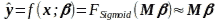

Linear regression on M vs y

在实践中，为了避免权重之间的相关性，已经使用了丢弃。实际上，这是通过随机化掩码来实现的，从而减少变量的同现。理论上，当相应的预测值相关时，权重是相关的。因此，使用压差进行掩蔽有助于减少过拟合。

# 把东西放在一起

让我们在输出层之前选择隐藏层。对于 h << n (sample size) we observe that the problem of overfitting occurs when variables are collinear. L2 regularization explicitly removes the effect of collinearity by modifying the covariance matrix; L1 regularization affects the covariance matrix indirectly. Dropout affects the covariance between the weights by sampling from the set of features and masking the features that are not chosen (similar to random forest) during each update based on gradients.

# Conclusion

Linear models and deep neural networks are related through linear algebra. Over determined systems (number of predictors >个样本)和共线系统(秩< number of predictors) lead to unstable solutions and overfitting that can be resolved using regularization. The 3 most common forms of regularization — ridge, lasso and droupout — reduce overfitting by reducing the collinearity among predictors (or hidden layer in deep neural networks). But it is important to note that collinearity is not the only cause of overfitting. There are other forms of regularization that penalize the curvature in each dimension (check smoothing splines).

A more rigorous analysis with geometric interpretation of ridge and lasso will be published in the future.

# Further reading

Research paper: [通过去相关表示减少深度神经网络中的过拟合](https://arxiv.org/pdf/1511.06068.pdf)

研究论文:[用基于集成的去相关方法正则化深度神经网络](https://www.ijcai.org/proceedings/2018/0301.pdf)

相关研究论文:[神经网络解释和对称破缺的权重集去相关训练算法](http://citeseerx.ist.psu.edu/viewdoc/download?doi=10.1.1.218.7991&rep=rep1&type=pdf)

相关研究论文:[多层感知器网络剪枝的去相关方法](https://link.springer.com/chapter/10.1007/978-3-319-11656-3_2)