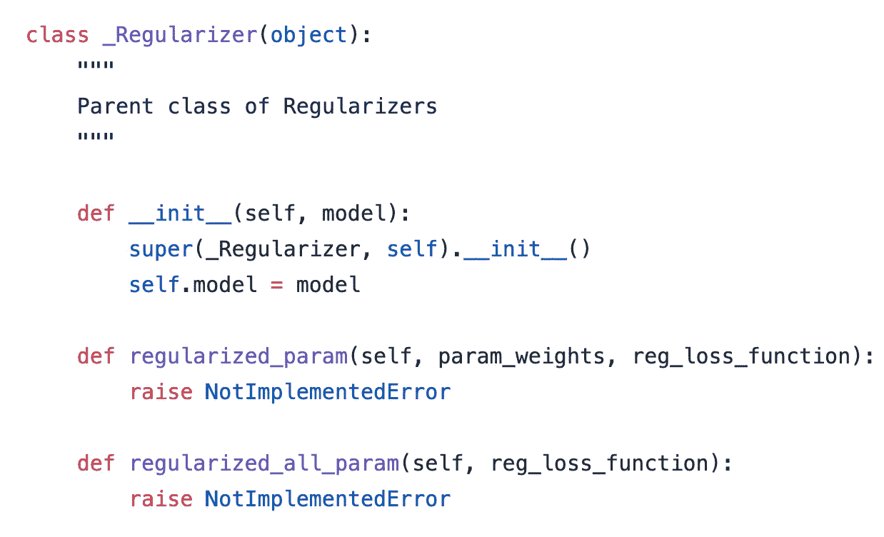
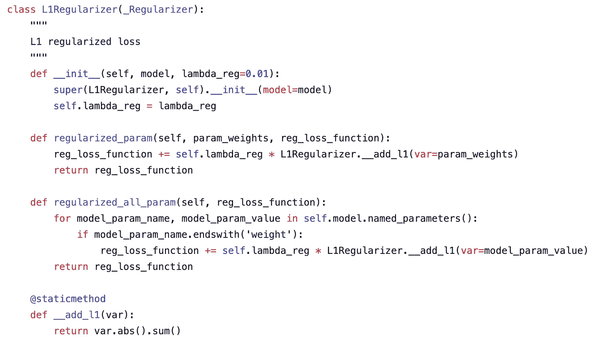
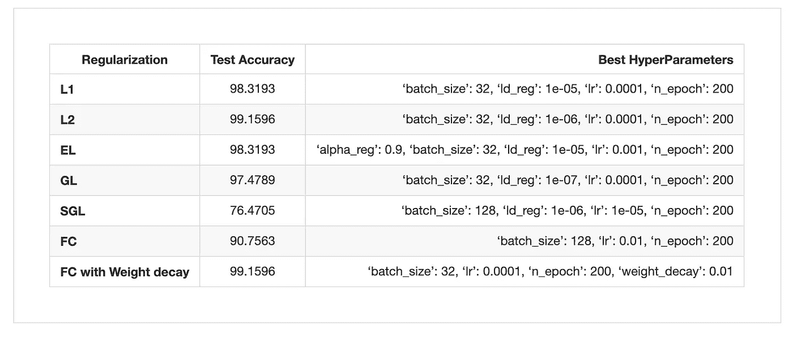
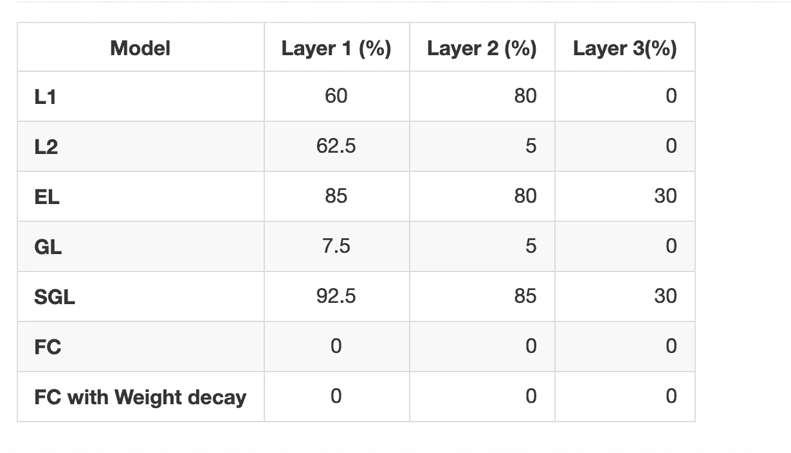

# Pytorch 神经网络的不同类型正则化

> 原文：<https://towardsdatascience.com/different-types-of-regularization-on-neuronal-network-with-pytorch-a9d6faf4793e?source=collection_archive---------14----------------------->

## *py torch 中正则化工具的实现*

Image by [Gerd Altmann](https://pixabay.com/users/geralt-9301/?utm_source=link-attribution&utm_medium=referral&utm_campaign=image&utm_content=3098693) from [Pixabay](https://pixabay.com/?utm_source=link-attribution&utm_medium=referral&utm_campaign=image&utm_content=3098693)

我在做一些关于神经元网络框架中的*稀疏性*的研究，我看到了文章“ [*深度神经网络的组稀疏正则化*](https://www.sciencedirect.com/science/article/pii/S0925231217302990.) *”。本文*解决了同时优化(I)神经网络的权重，(ii)每个隐藏层的神经元数量，以及(iii)活动输入特征子集(即特征选择)的挑战性任务。他们基本上提出了在神经元网络的正则化框架中整合*套索惩罚*。关于*正规化的定义和重要性，有大量的帖子和广泛的研究。*比如这些帖子*[*【1】*](/l1-and-l2-regularization-methods-ce25e7fc831c)**[*【2】*](/over-fitting-and-regularization-64d16100f45c)*都是对*正规化*的快速介绍。****

**为了重现深度神经网络**中的实验，我决定使用众所周知的深度学习框架 [PyTorch](https://pytorch.org/) 来构建我的项目。据 Medium 称，这是第[第四](https://medium.com/the-mission/8-best-deep-learning-frameworks-for-data-science-enthusiasts-d72714157761)最佳深度学习框架。它在学术层面越来越受欢迎，因为它易于模块化，比大多数竞争对手更快地测试新想法。****

**我意识到没有这样的工具可以做任何类型的正则化，除非 L2 正则化。在 pyTorch 中，L2 是在*优化器*的“*权重衰减*选项中实现的，不同于 [*千层面*](https://github.com/Lasagne/Lasagne/tree/master/lasagne) *(另一个深度学习框架)，*在其内置实现中提供了 L1 和 L2 正则化。您可以找到许多 [*建议的解决方案*](https://discuss.pytorch.org/t/simple-l2-regularization/139/2) 解释如何使用 pyTorch 框架实现 L1 正则化，但是没有简单的实现工具来插入您的实验。**

**为了弥补这种缺失，我决定使用 pyTorch 框架构建一些*“随时可用”的正则化对象。实现可以在 [*这里找到*](https://github.com/dizam92/pyTorchReg/blob/master/src/regularization/regularizer.py) 。我实现了 [L1](https://github.com/dizam92/pyTorchReg/blob/5ad3ca0a0cc7561741871a4135c2c08bc0bbef6c/src/regularization/regularizer.py#L21) 正则化、经典 [L2](https://github.com/dizam92/pyTorchReg/blob/5ad3ca0a0cc7561741871a4135c2c08bc0bbef6c/src/regularization/regularizer.py#L44) 正则化、 [ElasticNet](https://github.com/dizam92/pyTorchReg/blob/5ad3ca0a0cc7561741871a4135c2c08bc0bbef6c/src/regularization/regularizer.py#L67) 正则化(L1 + L2)、 [GroupLasso](https://github.com/dizam92/pyTorchReg/blob/5ad3ca0a0cc7561741871a4135c2c08bc0bbef6c/src/regularization/regularizer.py#L124) 正则化和一个更具限制性的惩罚 [SparseGroupLasso](https://github.com/dizam92/pyTorchReg/blob/5ad3ca0a0cc7561741871a4135c2c08bc0bbef6c/src/regularization/regularizer.py#L99) ，这是在*组稀疏正则化中为深度神经网络引入的。****

**类对象被构建为将 pyTorch *模型作为参数。*我们可以对特定的*参数*权重或模型中每一层的所有权重应用正则化惩罚。**

****

**Base model of regularizer object**

****

**Example of implementation of the L1 regularizer**

**我将这些实现应用于完全连接的神经元网络。这是最简单的模型架构，用于查看不同类型的正则化对模型性能的影响。**

**像最初的文章一样，我在代表图像分类问题的[数字](https://scikit-learn.org/stable/modules/generated/sklearn.datasets.load_digits.html)数据集上测试了实现。它由从几十个不同的人那里收集的 1797 个 8 × 8 的手写数字灰度图像组成。我使用了一个简单的全连接神经网络，它有两个隐藏层，分别有 40 和 20 个神经元。**

****

**Results Performances with different type of regularization applied to the simple FC model**

**从结果可以看出， **L2 正则化**模型和**权重衰减正则化**模型在测试集上具有相同的性能。这很好，也是我们所期望的，因为**重量衰减**是 pyTorch 已经提出的 L2 实现。较稀疏的方法(L1 正则化和 GL 正则化模型)也表现得相当好，但它们并不比**权重衰减正则化**模型更好。我们现在可以看看模型的真正稀疏性。为了对此进行研究，我们将绝对值低于 10e-3 的权重设置为 0。然后我们分析了每个模型中神经元的所有稀疏百分比。稀疏度百分比的计算方法是，取所有权重总和为 0 的神经元的数量，并将该数量除以每层的大小。正如所料， **L1 正则化**模型比 **L2 正则化**模型具有更稀疏的密度。但是在这种情况下，性能仍然很好。有时候，太多的稀疏对模型也不好。**

****

**总之，我提供了一个不同类型正则化选项的内置和自适应实现。我在 Digits 数据集上的一个更简单的全连接模型上测试了所有正则化，以查看不同正则化之间的性能。我们可以看到稀疏性在这些情况下仍然可以很好地执行任务。下一步是看看我们如何将 [pyTorchReg](https://github.com/dizam92/pyTorchReg) 模块扩展到其他模型架构。**