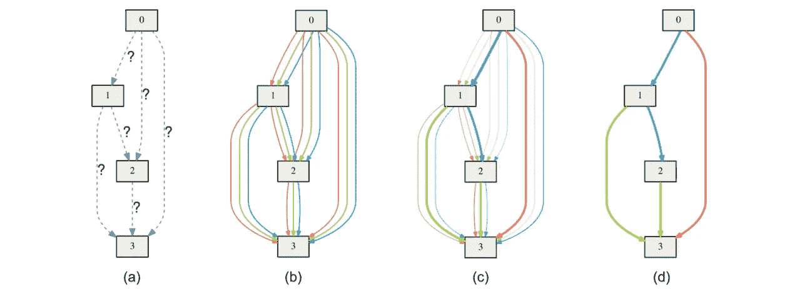
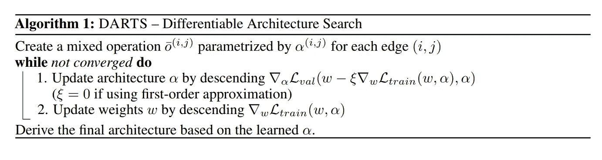
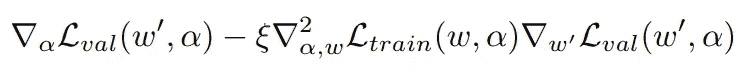
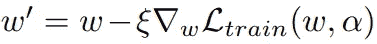
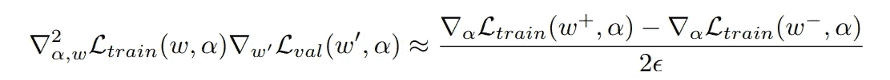
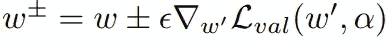

# 用 fastai 寻找 RNN 的差异化建筑

> 原文：<https://towardsdatascience.com/differentiable-architecture-search-for-rnn-with-fastai-a5e247aeb937?source=collection_archive---------29----------------------->

刘韩啸等人提出的可微分结构搜索( [DARTS](https://openreview.net/pdf?id=S1eYHoC5FX) )是一种使神经网络结构设计过程自动化的算法。它最初是在纯 pytorch 中实现的[。这篇文章触及了飞镖背后的关键思想，并展示了我如何使用](https://github.com/quark0/darts) [fastai](https://github.com/fastai/fastai) 重新实现飞镖，以达到清晰和易用的目的。

代码在[https://github.com/tinhb92/rnn_darts_fastai](https://github.com/tinhb92/rnn_darts_fastai)。

# **飞镖**

Overview of DARTS — from the paper

使用 [AWD-LSTM](https://github.com/salesforce/awd-lstm-lm) 作为主干，目标是找到一个好的 rnn 单元来填充模型的“递归”部分(RNNModel.rnns)。尝试不同的配置以最终提取最合适的 rnn 小区。

DARTS Algorithm — from the paper

我们来解释一下算法:

1.  **train_search:搜索好的 rnn 细胞基因型**
2.  **训练:导出基因型，训练其收敛并在测试集上评估**

第一部分，搜索好的 rnn 细胞基因型，包括连续松弛(即创建混合操作)和使用梯度下降交替更新架构α和权重θ

在 rnn 单元的一个节点上，我们不仅仅使用 *1 运算* (tanh，sigmoid …)，而是应用几个运算，并获得这些运算的加权和。实验中有 *5 种运算* : none，tanh，relu，sigmoid，identity。在每个节点给予这些 *5 操作*中的每一个的权重是可学习的参数。

在 Pytorch 中，我们使用 *torch.rand()* 对此进行初始化，并设置 *requires_grad = True* 。作者称此为**α/架构参数**以区别于**θ/网络的正常参数**。更新θ需要通常的向前和向后传递。

α的梯度在论文的等式(7)中描述:

Eq (7) in paper: Gradient for alpha

“ω”表示一步向前模型的权重。

ω’

等式(7)的第一部分通过使用ω’对验证数据进行 1 次正向和 1 次反向传递来计算。等式(7)的第二部分使用有限差分近似来计算:

Finite difference approximation

ω+和ω-定义为:

ω+ and ω-

评估有限差分只需要对权重进行 2 次向前传递，对α进行 2 次向后传递。复杂度从 O(|α| |θ|)降低到 O(|α|+|θ|)。

训练后，我们选择概率最高的操作(忽略无)将连续松弛转换为单元的 1 个离散规格。然后，这种基因型被训练收敛并在测试集上进行评估

# **用 fastai 实现**

在最初的实现中， **train_seach** 和 **train** 这两个阶段的训练循环用纯 pytorch 编码。如果循环不太复杂，这是没问题的，但是它会很快变得混乱，使代码难以破译。fastai 已经开发了一个[回调](https://t.co/zPGakJihrZ) [系统](https://www.youtube.com/watch?v=roc-dOSeehM&t=6s)来将训练循环的组件归类为独立的部分，以保持清晰。

callbacks at a glance — thanks to Jeremy’s [tweet](https://twitter.com/jeremyphoward/status/1117473237489688576) — [full notebook](https://github.com/fastai/fastai_docs/blob/0df9565eb91bbb51fd920476d11263668ecd63a0/dev_course/dl2/09b_learner.ipynb)

您可以指定在训练的每个阶段做什么:on_train_begin、on_epoch_begin、on_batch_begin、on_loss_begin …等等，而不会弄乱代码。阅读[文档](https://docs.fast.ai/callback.html)了解更多信息！

在最初的实现之后，我还有 DartsCell、DartsRnn 模块(用于 train 阶段)和它们各自的子类 DartsCellSearch、DartsRnnSearch(用于 train_search 阶段)。不同的是，为了便于理解，其他有趣的附加组件被放入它们自己的回调中。

train search loop — [link](https://github.com/quark0/darts/blob/f276dd346a09ae3160f8e3aca5c7b193fda1da37/rnn/train_search.py#L169)

上面的大 **train_search** 循环被一个带回调的学习者所取代，在回调中你可以快速看到所需内容的概述。

learner with callbacks — [link](https://github.com/tinhb92/rnn_darts_fastai/blob/master/train_search_nb.ipynb)

Train_search 有自己的 ArchParamUpdate 回调函数，上面提到的更新 alpha/architecture 参数的所有逻辑都存储在那里。
alpha(代码中的 arch_p)的优化器(arch_opt)是这个回调的一部分。

类似地，训练阶段有一个单独回调来触发 ASGD 优化器，且触发条件在回调中，与训练循环分开。 **train** 和 **train_search** 共享的其他任务如*正规化*、*隐藏初始化*、*保存*、*恢复*训练也有各自的回调。

更多细节，你可以查看我的[代码](https://github.com/tinhb92/rnn_darts_fastai)并运行提供的笔记本。