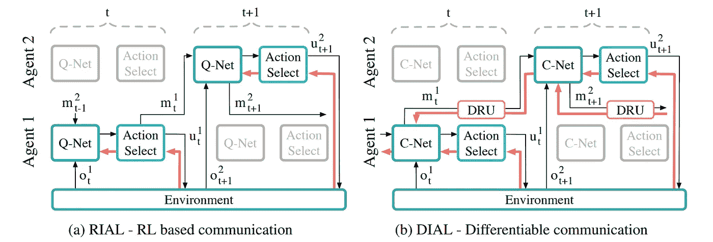
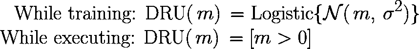
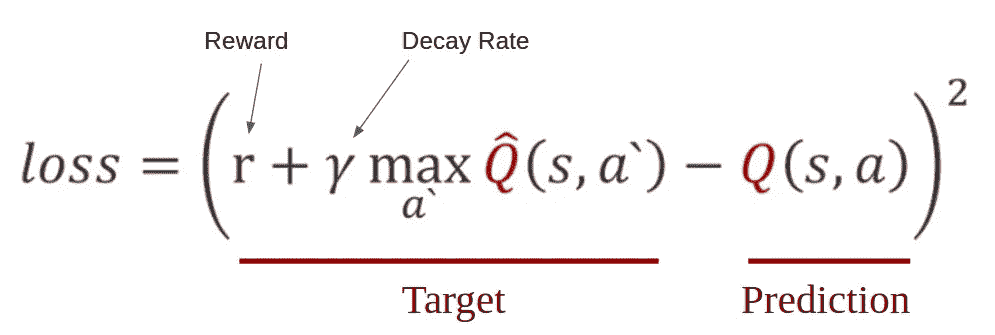

# 可微智能体学习解决囚犯开关之谜

> 原文：<https://towardsdatascience.com/differentiable-inter-agent-learning-to-solve-the-prisoners-switch-riddle-6b03f14ded7d?source=collection_archive---------24----------------------->

跨代理反向传播梯度以学习消息传递协议

强化学习是一个热门的研究领域。这主要是因为它旨在模拟那些看起来难以处理的系统。从 Deepmind 著名的 Atari 论文开始，我们已经走了很远。以下帖子来自我从以下文章中了解到的内容:

[https://arxiv.org/pdf/1605.06676.pdf](https://arxiv.org/pdf/1605.06676.pdf)

强化学习中一个有趣的研究途径是交流代理:一种代理可以互相发送消息以进行合作的设置。通信必不可少的一个好例子是每个代理只能部分观察到的环境，而代理需要更多的信息来合作完成任务。这些代理必须相互传递有意义的消息，其中“有意义”代表与它们自己的环境或它们将要采取的行动相关的有用信息有某种关联。

这样一个传递消息的环境将有一些重要的要求。考虑一个代理 ***A*** 发送消息 ***m*** 给另一个代理 b。他们开发的用于通信的协议，正如他们所了解的，将必须具有某些属性。

1.  给定系统的架构，这个消息协议应该是最佳的。一个代理人互相发送随机向量的系统显然是没有用的。这些被交换的向量( ***m*** )必须包含丰富的信息
2.  ***A*** 发出的信息必须被 ***B*** 理解

考虑到我们有多个代理，我们可以采用以下选项(甚至可能是中途退出):

1.  参数共享:为所有代理获取一组公共参数。也就是说，对所有代理使用单个网络，但是在执行期间单独使用这些参数，每个代理将自己的观察和接收的消息插入到网络中。这种方法通常更稳定且易于学习，因为如果提取了有用的特征，这些特征将用于所有代理。它们不必单独学习。
2.  没有参数共享:对每个网络使用不同的权重，让它们独立学习特征。这比前一个选项更不稳定。

一个早期设计的算法是 RIAL。RIAL 背后的思想很简单:只需在每个代理的动作选择器中提供消息作为动作选择。该消息被传递给其他代理。就这样。每个代理都单独接受培训。该框架遵循分散执行以及参数的独立更新，即梯度独立地通过每个代理并被更新。它们不会端到端地通过多个代理。

这种不通过多个代理传递梯度的实践在几个方面受到限制。很难找到最佳策略，因为消息类似于行动选择。

然后是[拨](https://arxiv.org/pdf/1605.06676.pdf)(差分内部代理学习)。让我们为每个代理中的专用消息引入一个输出。添加与其他代理发送的消息相对应的输入。使用这个框架，在训练时，将所有网络与每一步连接在一起，并让梯度端到端地流过所有代理，同时最小化损失函数(这是我们从贝尔曼方程得到的通常的 Q 学习损失函数)。我们最终得到的是一个交换消息的最佳协议。在训练时，每个代理学习构建有意义的消息，并理解其他代理给出的消息。这种设置遵循集中学习和分散执行。每个代理在执行时在环境中单独行动，但在训练阶段一起学习。

Source: [https://arxiv.org/pdf/1605.06676.pdf](https://arxiv.org/pdf/1605.06676.pdf)

这里需要注意的一点是，每条消息可以是离散的，也可以是连续的。问题定义可能会施加限制，只允许传递离散消息，如一位消息。我们如何将消息离散化？让我们介绍一个被称为 **DRU(离散化/正则化单元)**的单元，定义为:

我们将通过这个单元传递消息，而不是直接将消息从一个代理插入到另一个代理。由于噪声，该单元可以离散化消息。当我们在训练期间添加噪声时，我们迫使消息( ***m*** )朝向决策边界的最右边或最左边，以便添加噪声不会影响消息所在的一侧(即，正面或负面)。

让我们尝试实现这一点。考虑一下百名囚犯之谜。我直接引用[论文](https://arxiv.org/pdf/1605.06676.pdf)中的谜语陈述:

> 一百名囚犯刚刚被带进监狱。典狱长告诉他们，从明天开始，他们每个人都将被安置在一个隔离的牢房里，彼此之间无法交流。每天，典狱长会统一随机选择一名囚犯替换，并把他放在一个中央审讯室，里面只有一个带拨动开关的灯泡。囚犯将能够观察到灯泡的当前状态。如果他愿意，他可以打开灯泡。他还可以选择宣布他认为所有的囚犯都在某个时间点参观过审讯室。如果这个公告是真的，那么所有的囚犯都被释放，但如果是假的，所有的囚犯都被处决。典狱长离开了，囚犯们聚在一起讨论他们的命运。他们能就保证他们自由的协议达成一致吗

显然，解决方案必须将信息编码到随时间变化的转换模式中，而且很可能需要无限多的步骤来执行。

现在让我们来解开这个谜。我们将使用 TensorFlow，特别是 2.0。我们将不得不为少数囚犯解决这个问题，例如 3 或 4 个，因为策略空间随着代理的数量呈指数增长。这个问题可以建模为每天从他们的牢房中随机选择囚犯，并允许他们向下一个囚犯传递 1 位信息。这个**一位**囚徒就是灯泡的状态。因此，房间中的囚犯从前一个囚犯处接收 1 位(如果是第一个囚犯，则为随机位)，并被允许向下一个囚犯发送一位。记下天数，并用这一位发送给下一个囚犯，他们将不得不解决这个问题。

对于这篇文章，请参考我的[实现](https://github.com/sharan-dce/DIAL-switch)。

**环境**

参考类 [Jail](https://github.com/sharan-dce/DIAL-switch/blob/master/environment.py) ，它实现了我们将要使用的环境。每一步都随机选择囚犯。可以通过调用 step()方法来执行操作。采取“申报”行动时，根据申报正确与否，给予每个犯人 0.5 或-0.5 的奖励。

**定义 DRU**

以下代码片段显示了 DRU 的定义，该定义将仅在训练阶段中使用**(我已经为测试直接进行了离散化):**

**代理网络**

**播放一集**

现在核心部分。首先是一些重要的变量和初始化:

使用这些，让我们运行一个循环，直到我们没有完成:

第一部分通过代理运行消息。如果代理在房间中，则当前灯泡状态被给予代理，否则，DUMMY_MESSAGE 指示代理在其房间中，并且一天过去了。在不知道一天已经过去的情况下，代理将无法跟踪时间，当我们推送这个 DUMMY_MESSAGE 时，时间会被编码到 GRU 的隐藏状态中。我们将所有有用的变量记录到列表中，这样我们以后可以简单地通过迭代它们来计算损失。使用相同的、熟悉的、著名的贝尔曼方程计算目标，在损失函数中给出一项:

Link: [https://i.stack.imgur.com/XBsvH.png](https://i.stack.imgur.com/XBsvH.png)

请注意，主 Q 网络和目标 Q 网络使用的协议会略有不同，因此我们也必须通过目标网络传递一组不同的消息，以便使用此更新规则。目标网络给出的 Q 值只有在我们让它们遵循之前设计的协议时才有意义。

**主训练循环**

想播多久就播多久。在一个 tf 下。GradientTape()对象，调用 play_episode 方法。然后，我们简单地计算梯度并更新权重，这是通常的做法。

请注意，我不得不从这些片段中删除一些细节来展示这个想法。您可以在[实现](https://github.com/sharan-dce/DIAL-switch)中获得所有这些细节。一个重要的细节是，在上面的循环中，我们必须运行测试循环，其中我们使用离散消息 DRU，没有探索(没有随机动作选择)。它们反映了该系统运行得有多好。我们还必须更新目标网络，建议间隔为 100 集，如本文所述。