# 微分编程—逆向图形自动编码器

> 原文：<https://towardsdatascience.com/differentiable-programming-inverse-graphics-autoencoder-e1b0fabe67bf?source=collection_archive---------16----------------------->

## 编程的未来是向量化的、可逆的和可微分的

# 介绍

深度学习分类器、LSTM、YOLO 检测器、变分自动编码器、甘——这些家伙是真正意义上的元程序架构，还是只是关于如何解决特定优化问题的想法的明智实现？机器学习工程师实际上是决策系统的开发人员，还是仅仅是具有预定义参数化优化程序的支持 GPU 的计算机的操作员？可微分编程可以回答这些问题和其他一些问题，如解释模型和停止使用蛮力端到端 DNNs 加热我们的星球。数据科学家已经做了大量定制编程，在将数据传递到标准神经网络块或堆叠模型以获得更好的结果之前，对数据进行清理、过滤和标准化。现在是时候做自定义编程*后*的标准神经网络块和这个编程必须是可微分的。

# 想法

让我们考虑使用 MNIST (EMNIST)的手写字符识别。经典的方法是标记数千个样本，并让它们通过卷积或密集神经网络。结果将是一些可以预测字母的模型。这种有监督的方法需要标记大量数据(有半监督的方法，如主动学习[https://towards data science . com/Active-Learning-on-mnist-saving-on-labeling-f 3971994 C7 ba](/active-learning-on-mnist-saving-on-labeling-f3971994c7ba)可以减少标记工作)，它创建了一个无法解释数据本身和结果的模型。只有以相同的方式识别相同的分布式数据才有意义

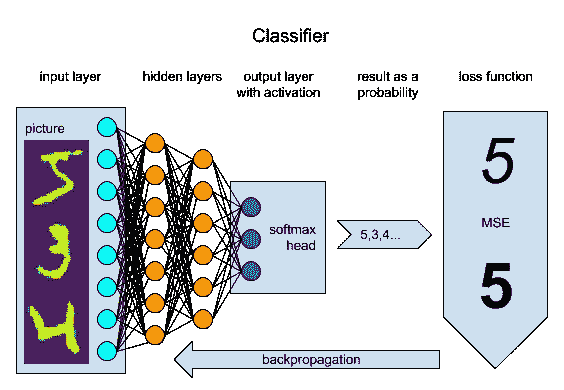

如果我们勇敢地离开监督学习的安全港，使用 AutoEncoder 通过自回归来学习嵌入空间，我们会发现我们不是在标记数据，而是在检查 Z 空间中隐藏的特征和见解。这个过程的真正结果不是再现的图像，而是学习的嵌入，这些嵌入可以被聚类并用于识别、特征解释和操作。但是我们仍然不能使用自动编码器的瓶颈来将其连接到数据转换管道，因为所学习的特征可以是线条粗细和角度的组合。每次我们重新训练模型时，我们都需要重新连接瓶颈 z 空间中的不同神经元。

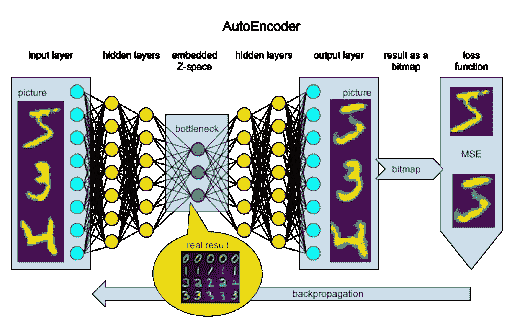

如果要求神经网络块从一开始就产生一些有用的东西，比如拿一支记号笔，画一个符号，会怎么样？这将更像是人类在学习。我们可以将 DNN 输出解释为用不同的标记大小(压力)和颜色强度绘制的点的列表，或者甚至将输出用作必须绘制手写符号的单个手势。在这种情况下，我们将把输出解释为一组速度记录(作为位置的一阶导数)。

为了使这些标记命令产生可完全微分的输出，并且因此对于反向传播是透明的，我们需要使用 DiffProg 方法。经典编程倾向于使用太多“数字”运算符，这些运算符无法传递梯度，例如阶跃函数无法用于调整初始参数，我们需要使用 sigmoid 来代替:

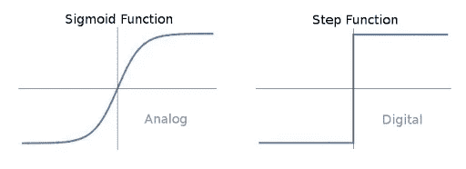

同样，我们可以使用高斯曲线来模拟标记点，只需将其呈现在 2D 空间中:

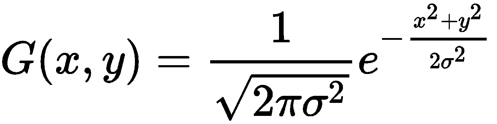

这里，𝜎可以用作反向标记尺寸， *x* 和 *y* 是标记点的坐标，颜色强度可以由附加的放大系数驱动:

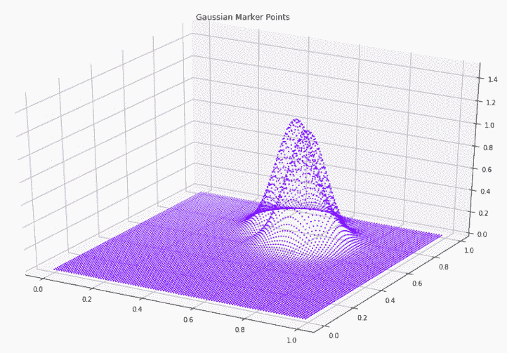

为了将多个标记点组合在一起，我们可以使用 *max* 功能。然后可以将生成的图像传递给损失函数——相同的 MSE:

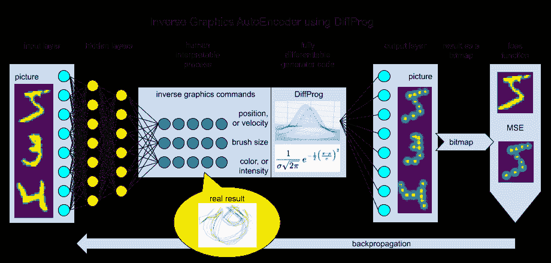

作为一个实际的结果，我们会收到一个可以在空间和时间上分解图像信息的模型(！)，创建一个程序，它将在一个简单的动作中，比如说，机械臂，画出所需的符号。

# 履行

我们将不关注神经网络块的细节，因为这篇文章是关于 DiffProg 的概念。我们只是使用一些具有密集层的 DNN 作为统计估计量。实施的详细信息可以在参考资料部分列出的笔记本中找到。让我们关注 TensorFlow 实现的细节。

# 静态点

加载 MNIST 数据后，我们创建模型。这里我们从一些参数开始。需要 varcoef 参数将标记的大小(以像素为单位)转换为公式中的方差。

```
points = 10 #number of points to fit the image in
varcoef = 0.01 #coefficient of the point size
epsilon = 0.0001 #fixing dividing by zero
```

我们使用输入数据点作为地面真值:

```
X = tf.placeholder(tf.float32, [None, dim]) #input
Y_ = X #autoregression labels
L = X
```

神经网络用于将 728 个 MNIST 像素翻译成 10 个标志点。每个都有垂直和水平的位置和大小。我们使用 sigmoid 函数来激活所有三点参数。这是一个简化的变体，结果应该不会让我们吃惊。

```
#two layers of fully connected NN
L = tf.layers.Dense(units=300, activation=tf.nn.sigmoid)(L)L = tf.layers.Dense(units=200, activation=tf.nn.sigmoid)(L)
#three output nodes (hor, ver and size) as logits to use with possibly different activations
LOGITS = tf.layers.Dense(units=points * 3, activation=None)(L)
#reshape and activations
LOGITS_ver, LOGITS_hor, LOGITS_size = tf.split(tf.reshape(LOGITS, [-1, points, 3]), 3, axis=2)
POS_ver = tf.nn.sigmoid(LOGITS_ver)
POS_hor = tf.nn.sigmoid(LOGITS_hor)
POS_size = tf.nn.sigmoid(LOGITS_size)
```

在这里，DiffProg 部分开始了——我们需要将高斯公式转化为矢量化形式，并通过批量大小、10 个标记点和图片的两个维度进行传播。为此，我们需要在公式中准备 GRAD_*为 ***𝑥*** ，MEAN_*为 **𝜇** 和 VAR2 为 2 **𝜎** :

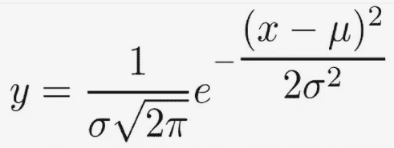

结果，我们将得到具有形状的标记张量:[批量大小，点，垂直，水平]。

```
#constant grid with gradients over coordinates
GRAD_ver = tf.tile(tf.expand_dims(tf.range(0., 1., 1\. / dim_ver), axis=1), [1, dim_hor])
GRAD_hor = tf.tile(tf.expand_dims(tf.range(0., 1., 1\. / dim_hor), axis=0), [dim_ver, 1])
#broadcasted marker point centers (gaussian means)
MEAN_ver = tf.tile(tf.expand_dims(POS_ver, axis=-1), [1, 1, dim_ver, dim_hor])
MEAN_hor = tf.tile(tf.expand_dims(POS_hor, axis=-1), [1, 1, dim_ver, dim_hor])
#broadcasted marker point size (gaussian variation)
VAR2 = tf.tile(tf.expand_dims(POS_size * varcoef + epsilon, axis=-1), [1, 1, dim_ver, dim_hor])
#gaussian marker points vector
MARKER = tf.exp((tf.square(GRAD_hor - MEAN_hor) + tf.square(GRAD_ver - MEAN_ver)) / -VAR2)
```

头部部分非常经典，除了我们将使用 max 函数来连接一个字形中的标记点:

```
#head of the model - predict, loss, train step
Y = tf.reshape(tf.reduce_max(MARKER, axis=1), [-1, dim])
LOSS = tf.losses.mean_squared_error(Y_, Y)
TRAIN = tf.train.AdamOptimizer().minimize(LOSS)
#we set two points accurate if their absolute error is less than 0.5
ACC = tf.reduce_mean(tf.cast(tf.less(tf.abs(Y_ - Y), 0.5), tf.float32))
```

在 10 个时期的训练之后，对于训练和测试数据集，准确度度量将为大约 97%。

复制的训练数据集图片:

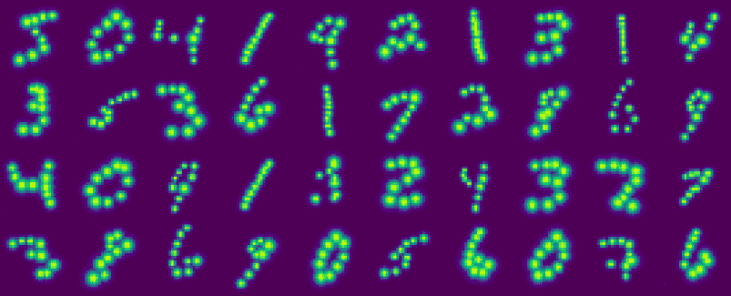

复制的测试数据集图片:

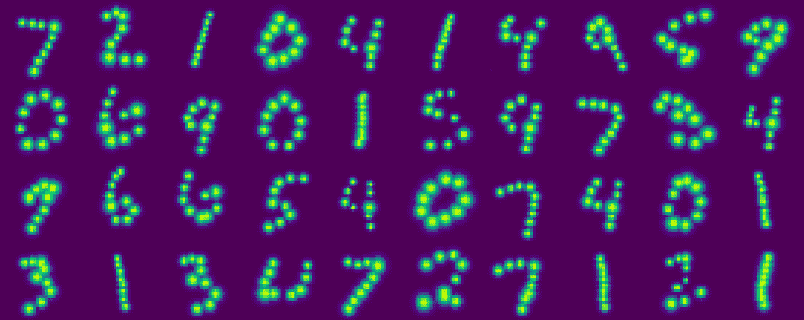

培训过程的可视化:

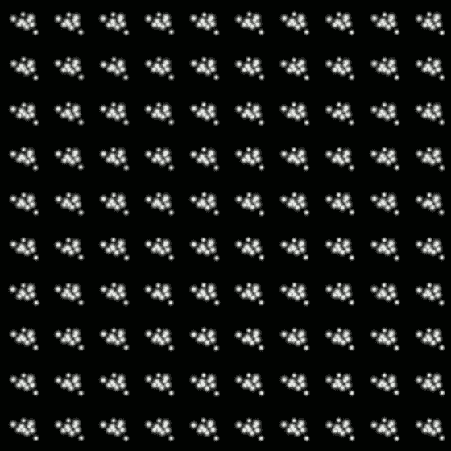

# 动态手势

现在，我们将从静态点的集合转到可以再现字形的线。为此，我们将稍微更改代码，以便将点位置计算为速度的积分，由神经网络预测。我们正在增加点数，因为现在不是所有的点数都可见。我们还需要一个参数来表示两点之间的最大步长。

```
points = 25 #number of points to fit the image in
step_size = 3 #maximum velocity in pixels to move the marker
varcoef = 0.01 #coefficient of the point size
epsilon = 0.0001 #fixing dividing by zero
```

使用更深的 NN 块并引入颜色强度作为附加标记点参数。

```
#four layers of fully connected NN
L = tf.layers.Dense(units=600, activation=tf.nn.sigmoid)(L)
L = tf.layers.Dense(units=500, activation=tf.nn.sigmoid)(L)
L = tf.layers.Dense(units=400, activation=tf.nn.sigmoid)(L)
L = tf.layers.Dense(units=300, activation=tf.nn.sigmoid)(L)
#four output nodes (hor, ver velocity, size and intensity) as logits to use with possibly different activations
LOGITS = tf.layers.Dense(units=points * 4, activation=None)(L)
```

对于每一步标记的速度，我们现在需要-1:1 的输出范围，因此我们将使用 tanh 激活并在 step_size 上乘以它们。为了计算最终点的位置，我们需要所有先前的速度值加上初始点(左中)的累积和。

```
#reshape and activations
LOGITS_ver, LOGITS_hor, LOGITS_size, LOGITS_color = tf.split(tf.reshape(LOGITS, [-1, points, 4]), 4, axis=2)
#velocity in range -1:1
VELO_ver = tf.nn.tanh(LOGITS_ver) / dim_ver * step_size
VELO_hor = tf.nn.tanh(LOGITS_hor) / dim_hor * step_size
#position as an integral of velocity (we start from the middle left point)
POS_ver = 0.5 + tf.math.cumsum(VELO_ver, axis=1, exclusive=True)
POS_hor = 0.1 + tf.math.cumsum(VELO_hor, axis=1, exclusive=True)
#size and color intensity in range 0-1
POS_size = tf.nn.sigmoid(LOGITS_size)
POS_color = tf.nn.sigmoid(LOGITS_color)
```

标记现在用表示每个点的颜色强度的附加 AMP 张量来计算。

```
#broadcasted marker point color (gaussian amplitude)
AMP = tf.tile(tf.expand_dims(POS_color, axis=-1), [1, 1, dim_ver, dim_hor])
#gaussian marker points vector
MARKER = AMP * tf.exp((tf.square(GRAD_hor - MEAN_hor) + tf.square(GRAD_ver - MEAN_ver)) / -VAR2)
```

在训练 50 个时期时，我们将实现训练和测试数据集的 98%的准确性。这些是通过训练数据集的一个手势再现的字形:

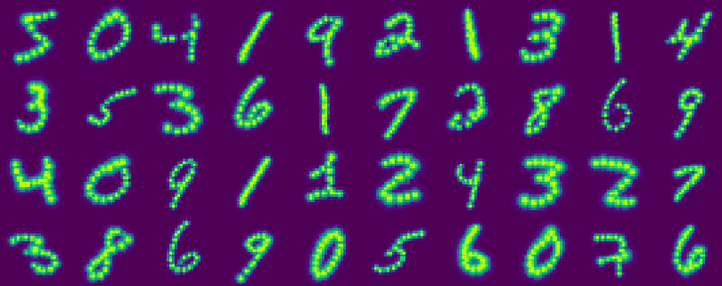

测试数据集:

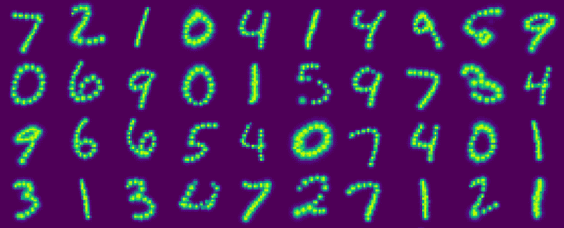

培训过程可视化:

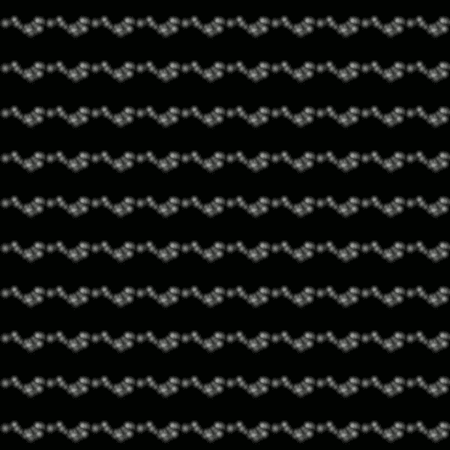

# 结果

正如我们已经讨论过的，实际的结果是能够像人类一样学习绘制符号字形。这些是带有标记大小和颜色的手势轨迹的图片。请注意，颜色强度对于绘制需要多条线的更复杂的符号至关重要。

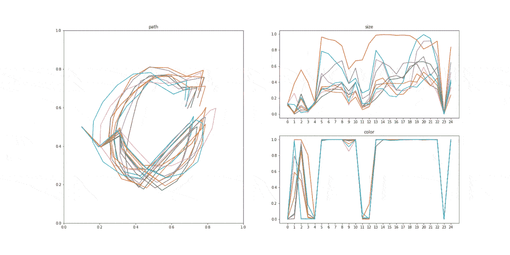

如果我们对训练进行多次实验，我们将观察到每次的风格都会不同，这取决于随机种子。

让我们转向更实际的结果——如何使用这种新技术进行符号分类。首先，让我们在测试数据集上对整个 728 像素的 MNIST 数据进行聚类。这将产生以下结果:

```
Errors: 4113 of 10000\. Accuracy: 58.87 on 10 clusters(labeled samples).
```

我们为每个聚类分配一个主导样本标签，并将其用于分类错误和准确性度量。当我们对学习的反向图形命令空间的速度和颜色强度进行相同的聚类时，我们将得到:

```
Errors: 1883 of 10000\. Accuracy: 81.17 on 10 clusters(labeled samples).
```

如我们所见，错误数量减少了两倍多。准确率提高了 81%以上。这意味着使用这种无监督学习，我们能够更好地理解数据，并比一组不相连的点更好地对 10 个手写数字进行分类。

# EMNIST 测试

使用相同数量的训练/测试数据快速检查 EMNIST 数据集— 60K/10K。

为训练数据复制的字形:

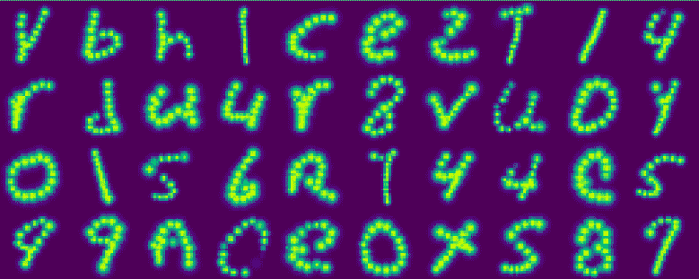

对于测试数据:

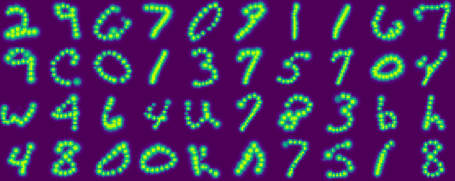

训练动态可视化:

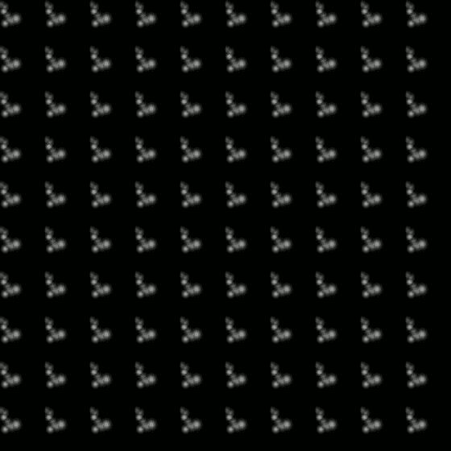

# 结论和下一步措施

这只是一个例子，说明如果我们停止简单地重用现有的香草神经网络块，并开始做一些具体的问题。端到端网络不能以有效的方式工作，因为效率是智能的指示，不能是人工的。它只是一种智能，数据科学家或未来的差分编程开发人员可以将它添加到解决方案中。如果我们用建造世界的方式来建造模型，我们需要让一切都联系起来，就像一个量子场，这种联系就是求导的能力。一点的多重导数给出了整个宇宙的信息。

此特定模型的后续步骤可能包括:

*   由于多重不平衡损失，差分规划模型可能不稳定。这必须通过正则化和更好的初始化来解决。
*   在该模型中，我们为手势选择了一个初始点，但我们没有强制在图片的反面完成，以使手写符号连接成一个单词。这样的修改可以解决单词级的手写识别问题。
*   用实线反推图形会更好，但需要高级的数学模型。
*   预测命令链需要更好的 NN 块，可能需要使用特殊的 r NN 块。

# 参考

## 代码和示例

[https://github . com/Andy-bosyi/articles/blob/master/DiffProg-MNIST-position . ipynb](https://github.com/andy-bosyi/articles/blob/master/DiffProg-MNIST-position.ipynb)
https://github . com/Andy-bosyi/articles/blob/master/DiffProg-MNIST-velocity . ipynb
[https://github . com/Andy-bosyi/articles/blob/master/DiffProg-EMNIST-velocity . ipynb](https://github.com/andy-bosyi/articles/blob/master/DiffProg-EMNIST-velocity.ipynb)

## 关于 DiffProg 的文章

[https://skymind.ai/wiki/differentiableprogramming](https://skymind.ai/wiki/differentiableprogramming)
[https://flux ml . ai/2019/02/07/what-is-differentiable-programming . html](https://fluxml.ai/2019/02/07/what-is-differentiable-programming.html)

## 附言（同 postscript）；警官（police sergeant）

如果你有私人问题，请在 Linkedin 或脸书联系我，有时我会在那里发布关于人工智能的简短新闻和想法。

我要感谢我的同事们[亚历克斯·西姆基夫](https://www.linkedin.com/in/oleksiy-simkiv/)、[米科拉·科兹连科](https://www.linkedin.com/in/mykola-kozlenko/)、[沃洛季米尔·森德茨基](https://medium.com/@volodymyrsendetskyi)、维亚奇·博西和[纳扎尔·萨维琴科](https://www.linkedin.com/in/nazar-savchenko/)富有成效的讨论、合作和有益的建议，以及整个 MindCraft.ai 团队的持续支持。
Andy Bosyi，
mind craft . ai 首席执行官
信息技术&数据科学