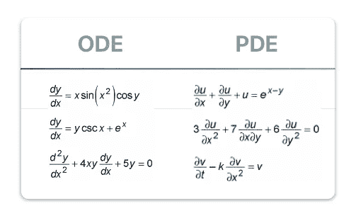
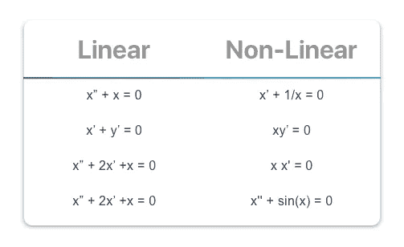
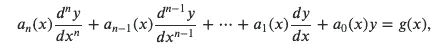
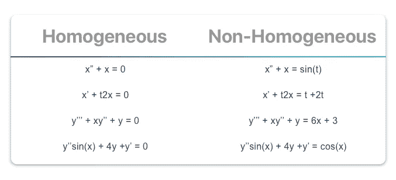
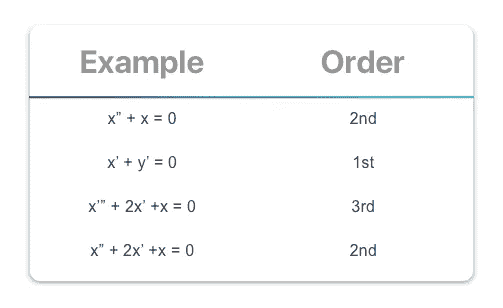

# 微分方程—基础

> 原文：<https://towardsdatascience.com/differential-equations-basics-c72db0a8c42a?source=collection_archive---------8----------------------->

## 订单概述和标准符号

Originally Published On [https://www.setzeus.com/](https://www.setzeus.com/)

在*微分方程* (DFQs)的优美分支中，存在着许多、多种已知的 ***类型的*** 微分方程。事实上，加深对 DFQ 的理解的最好方法之一是首先解决基本分类系统。为什么？因为你可能永远不会遇到一个完全陌生的 DFQ。大多数 dfq 已经解决了，因此很可能已经存在一个适用的、通用的解决方案。

除了描述方程本身的性质之外，分类和识别差异的真正附加值来自于提供起点的地图。解微分方程的诀窍是 ***不是*** 创造原创方法，而是分类&应用已证明的解决方案；有时，可能需要一些步骤来将一种类型的方程转换成另一种类型的等价方程，以便得到可实施的、通用的解决方案。

虽然有数百个附加类别和子类别，但用于描述 dfq 的四个最常见的属性是:

*   **普通 vs 部分**
*   **线性与非线性**
*   **同质与非同质**
*   **微分指令**

虽然这个列表并不详尽，但它是一个很好的垫脚石，通常在 DFQ 学期课程的前几周复习；通过快速回顾这些分类类别，我们将具备解决常见 DFQ 问题的基本入门工具。

# 普通与部分

第一，在野外发现的 dfq 的最常见的分类源于在手边的问题中发现的 ***衍生*** 的类型；简单来说，方程是否包含任何**偏导数**？

如果不是，那就是一个*常微分方程* ( **ODE** )。如果是，那就是一个*偏微分方程* ( **PDE** )

ODEs 包括单个独立变量*，微分基于该单个变量*。一个常微分方程有一组离散的(有限的)变量；他们经常模拟一维动力系统，比如钟摆随时间的摆动。

另一方面，偏微分方程要复杂得多，因为它们通常包含不止一个自变量和多个偏导数，这些偏导数可能基于也可能不基于某个已知的自变量。偏微分方程在 STEM 中非常受欢迎，因为它们被用来描述自然界中各种各样的现象，如热、流体流动或电动力学。这些看似不同的物理现象被形式化为偏微分方程；他们在[随机偏微分方程](https://en.wikipedia.org/wiki/Stochastic_partial_differential_equations)中找到它们的推广。

下面是几个例子，有助于识别 DFQ 方程包含的导数类型:

Originally Published On [https://www.setzeus.com/](https://www.setzeus.com/)

# 线性与非线性

第二个共同的性质，*线性*，是二元的&直截了当:一个方程中的变量&导数乘以常数&仅仅是常数吗？

如果是这样，那就是线性 DFQ。否则，它被认为是非线性的。变量及其导数必须 ***总是*** 以简单的一次幂出现。考虑到它们天生的简单性，求解线性方程的理论得到了很好的发展；很可能你已经在物理 101 课上遇到过他们。

不过，为了清晰起见，还是有几个例子值得回顾一下——下表列出了 dfq 中的线性度:

Originally Published On [https://www.setzeus.com/](https://www.setzeus.com/)

# 同质与非同质

对微分方程进行分类的第三种方式，DFQ 被认为是*齐次的*如果&只有当 ***被加法或减法运算符分隔的所有*** 项包括*相关的*变量；否则就是非齐次。检验这一性质的一个简单方法是将包含因变量的所有项移到等号的左边，如果右边不是零，则它是非齐次的。

下面是一个更正式的定义。参考微分方程的定义，由左侧的下图表示:

如果图的右边 g(x)等于零，则认为 DFQ 是齐次的。以下是一些例子:

Originally Published On [https://www.setzeus.com/](https://www.setzeus.com/)

在现实生活场景中，g(x) *通常*对应一个动态物理模型中的 ***强迫项*** 。例如，在电动摆中，驱动摆&的电机将会导致 g(x)！= 0.

# 一阶，二阶

最后一个基本分类，这肯定是你在数学预备分支中已经确定的性质:微分方程的 ***阶*** 。与多项式中描述最高 n 次的阶不同，对于微分，函数的阶等于等式中的 ***最高导数*** 。最基本的是:

Originally Published On [https://www.setzeus.com/](https://www.setzeus.com/)

# 最后

我们走吧！用于识别和分类微分方程的四个最常见的性质。正如你现在可能知道的，DFQ 巷的道路与植物学相似；当你第一次学习微分方程时，培养一种识别和分类 dfq 到它们适当的组的眼光是很实际的。一旦确定了，很有可能你就离找到通用的、适用的解决方案很远了。

诚然，我们只是为深入探索 STEM 每个领域背后的驱动分支搭建了舞台；要彻底了解解决方案，可以从研究更简单的设置开始，比如齐次一阶微分方程！

***最初发表于***

[https://www.setzeus.com/](https://www.setzeus.com/)

***来源***

[微分方程](https://amzn.to/2YKbJdd)

[微分方程——简明教程](https://amzn.to/2YKzYbl)