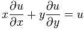

# 微分方程——历史与概述

> 原文：<https://towardsdatascience.com/differential-equations-history-overview-a1d45ebc1a8b?source=collection_archive---------2----------------------->

## 第一部分——它是什么，为什么与今天相关？

Originally Published On [Setzeus](https://www.setzeus.com/)

数学家和物理学家往往在很多问题上意见不一致。一个不容置疑的事实似乎渗透到每一个 STEM 主题&统一双方，然而，主要的信念是*分析单个组件之间的动态关系会导致对系统作为一个整体的更好理解。*与本系列探索的更抽象的主题形成鲜明对比，如[逻辑理论](https://blog.usejournal.com/logic-theory-history-overview-35087146b3b7)、[数论](/number-theory-history-overview-8cd0c40d0f01)、& [集合论](/set-theory-history-overview-c98bac98f99c)我们现在正前往普遍适用的测量世界**、解释变化的&**。

**微分方程**是数学的一个分支，以一个或多个记录的变化观察开始，&以一个或多个预测未来结果的函数结束。一个*代数方程*，如二次方程，用一个值或一组值求解；相比之下，*微分方程*是用一个函数或一类函数求解的。简称“DFQ ”,几乎所有 STEM 本科项目都将其作为核心要求，原因很简单:DFQ 是任何领域或行业模拟情况的绝佳工具。

Originally Published On [Setzeus](https://www.setzeus.com/)

在实际应用中，模型通常涉及对象&记录它们之间的变化率(导数/微分)——DFQ 的目标是定义两者之间的一般关系。这种系统在自然现象中极其常见，这也正是为什么 DFQ 在从物理学到经济学再到生物学的课题中扮演着重要角色。

# 站在巨人的肩膀上——牛顿和莱布尼茨

考虑到它作为任何数学家或科学家的基础部分的长寿和持久的影响，DFQ 的历史相当丰富也就不足为奇了。正如我们很快会看到的，现代 DFQ 是几个世纪以来进步的顶点——许多是家喻户晓的名字。然而，这种朝向既定分支的公共渐进过程，只有两位数学巨人才成为可能:[艾萨克·牛顿](https://www.britannica.com/biography/Isaac-Newton) & [戈特弗里德·莱布尼茨](https://www.britannica.com/biography/Gottfried-Wilhelm-Leibniz)。

历史告诉我们，两个人都有争议地声称在同一时期独立发明了微积分。这是关键，因为微积分，随着积分和导数的文字发展，为未来的数学家奠定了基础。

确定起源的确切时间的模糊性是多种因素的结果，例如竞争性/隐秘性的一般氛围，以及私人出版物的时间(一些笔记几十年后才被发现)。有一点是肯定的:它们既是**理所当然地归功于 DFQ 的起源，下面的例子就说明了这一点。**

**据说早在 1671 年，牛顿在未发表的草稿中提出了以下三种“类型”的微分方程:**

************

**上面的前两个方程只包含一个或多个因变量的普通导数；今天，这些被称为 ***常微分方程*** 。最后一个方程包含因变量的偏导数，因此，命名为**、*、*、**、*。*注意，这两个术语都是现代的*；当牛顿最终发表这些方程时(大约在 1736 年)，他最初将它们命名为“*通量*”。***

*大约在同一时期(~1675 年)，德国数学家[戈特弗里德·莱布尼茨](http://www.eoht.info/page/Gottfried+Leibniz)也在未发表的笔记中，介绍了两个关键的观点:他自己的微分&第一次记录了整数符号的实例:*

**

*尽管这些现在发现的草稿起源很早，但更大的数学界第一次听说这个话题还是在 20 年以后。具体来说，在 1693 年，莱布尼茨&牛顿*最终*都正式发表了&他们的微分问题的分布式解决方案——标志着 1693 年微分方程作为一个独特的数学领域的开端。*

**

*Gottfried Wilhelm Leibniz & Isaac Newton*

*随着基础的奠定，通往 DFQ 的道路是缓慢而稳定的——解决物理问题的尝试逐渐产生了模型，而模型又需要创新的解决方案。这些问题及其解决方案导致了一门独立学科的发展。社区的努力迅速加速了该领域的发展，超越了牛顿和莱布尼茨的贡献。*

*以下是历史上重要的 DQF 问题和发表了令人满意的解决方案的归因数学家的列表:*

**

*上面的列表只是所有造成 DFQ 问题的一小部分；然而，即使是这个删节的列表也凸显了数学家们的才能，他们为这个被认为是 STEM 基础之一的分支做出了贡献。从可识别的名字如拉格朗日、欧拉和伯努利，以及最初的牛顿和莱布尼茨，显而易见数学家对 DFQ 的持续发展有多么重要。*

## ***关于这个系列***

*当谈到现实世界的分析，DFQ 是真正的交易。用半衰期方程预测化学反应，用人口增长预测生态系统的文化数量，或者描述波浪的轨迹——对于任何对 stem 职业感兴趣的人来说，对 DFQ 的基本了解是**的必备**。*

*接下来我们去哪里？首先，探索 DFQ 符号&回顾不同类型的订单。接下来，我们将回顾拉格朗日力学&运动方程。之后，我们将讲述应用数学中最重要的公式之一:拉普拉斯变换。最后，我们将通过约瑟夫·傅立叶的眼睛探索热流的领域。*

****来源****

*[微分方程](https://amzn.to/2YKbJdd)*

*[Setzeus 个人网站](https://www.setzeus.com/)*

*[微分方程——简明教程](https://amzn.to/2YKzYbl)*