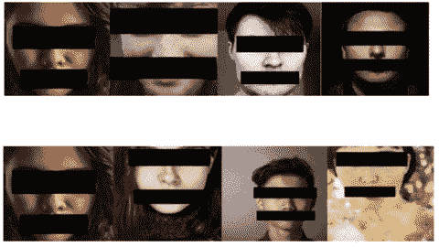

# 差异隐私注释 2:来自隐私圣经的强有力的概要

> 原文：<https://towardsdatascience.com/differential-privacy-note-2-a-powerful-synopsis-from-the-bible-of-privacy-51e2f99d3900?source=collection_archive---------16----------------------->

> “告诉我，我会忘记的。教我，我会记住。让我参与，我学习。”
> *—班哲明*

好吧，对于那些不知道差分隐私博客系列第 1 部分的人，只需阅读这篇博客“[差分隐私注释 1:来自隐私圣经的强大概要](https://medium.com/secure-and-private-ai-writing-challenge/differential-privacy-note-1-a-powerful-synopsis-from-the-bible-of-privacy-b0c5e04b30c3?source=friends_link&sk=bb7078626df4dda0342a3fff8395e61b)”，让自己完全了解隐私的新定义，以及这个新定义(即差分隐私)如何在解决隐私保护数据分析的竞争中脱颖而出。

在这篇博文中，我将阐明

1.  关于为什么私有数据分析系统有缺陷，以及为什么将一个[语义安全密码系统](https://en.wikipedia.org/wiki/Semantic_security)与私有数据分析进行比较是不可行的。

然后在后面的部分

2.将给出差分隐私的更正式的定义，特别是如何通过引入随机性来提供隐私。

3.差别隐私承诺了什么

4.差异隐私不能承诺什么

5.微分隐私的定性性质

# 私人数据分析:由于辅助信息导致的有缺陷的系统

私有数据分析的一个形式化目标是，分析者在分析完成后对数据集中任何个体的了解不会比分析开始前多。

同样，对手(对手)关于个人的之前和之后的观点(即，在访问数据库之前和之后)不应该“**太不同**，”或者对数据库的访问不应该改变对手关于任何个人的观点“**太多**”。

此外，如果分析师或对手对一个人一无所知，那么这个人就不会受到分析的伤害。此后，这种直觉被普遍地称为“**无所不知**”的方法，由于辅助信息，这种方法被证明是错误的。

因此，各种各样的研究人员试图提出一个观点，即在标准计算可用的情况下，我们为什么不能建立语义安全的私有数据库机制，在对查询产生答案的同时对单个行保密呢？

但是事实证明,[语义安全密码系统(SSC)](https://en.wikipedia.org/wiki/Semantic_security) 和私有数据分析之间的类比也是有缺陷的，在某些方面并不完美。

在 SSC 中有三方:

1.  消息发送者(加密明文消息的人)
2.  消息接收者(解密密文)
3.  窃听者(她因无法了解任何关于明文的信息而感到沮丧，因为她在发送之前并不知道这些信息)。

然而，在私有数据分析的环境中，只有两方:

1.馆长，运行隐私机制(类似于发送者)

2.数据分析师，他接收对查询的信息性响应(就像消息接收者一样)，并且还试图挤出关于个人的隐私泄露信息(就像窃听者一样)。

因为合法接收者与窥探对手是同一方。因此，SSC 和私有数据分析之间的类比是错误的，因为拒绝向对手提供所有信息意味着拒绝向数据分析师提供所有信息。

# **差分隐私的正式定义**

让我们听听这个领域的先驱之一“[辛西娅·德沃克](https://en.wikipedia.org/wiki/Cynthia_Dwork)”关于差分隐私和为什么随机性是必不可少的。

现在，是时候从数学上引入差分隐私的正式定义了，

**差分隐私**:一个具有域 N |X |的随机化算法 m 是(ε，δ)-差分隐私的，如果对于所有的 S ⊆范围(m)和对于所有的 x，y ∈ N |X |使得∨x y∨1≤1:
**pr[m(x)∈s]≤exp(ε)pr[m(y)∈s]+δ，**

其中(∨x y∨1)衡量 x 和 y 之间有多少记录不同，如果δ = 0，我们说 M 是ε差分私有的。

通常，研究人员对小于数据库大小中任何多项式的倒数的 **δ(delta)** 的值感兴趣。特别是， **δ** 的值在 1/∨x∨1 的数量级上是非常危险的:它们允许通过公布少量数据库参与者的完整记录来“保护隐私”,这被精确地称为“**仅仅几个**”哲学。

# 什么差别隐私承诺？

从一个非常基本的意义上来说，差分隐私的想法承诺保护个人免受由于其数据在私有数据库(x)中而可能面临的任何额外伤害，如果他们的数据不是 x 的一部分，他们就不会面临这些伤害。尽管一旦差分私有机制 M 的结果 M(x)被发布，个人确实可能面临伤害，但差分隐私承诺伤害的概率不会因他们选择参与而显著增加。

因为当一个人决定是否将他/她的数据包含在一个以不同的私人方式使用的数据库中时，他/她考虑的正是这种差异:他/她参与的伤害概率，与他/她不参与的伤害概率相比。

鉴于差别隐私的承诺，从未来伤害的角度来看，个人确信他/她的存在在参与和不参与之间应该是几乎无关紧要的。

# 有哪些差分隐私不承诺？

简而言之，差别隐私并不保证无条件免于伤害，更一般地说，差别隐私并不保证一个人认为是自己的秘密将保持秘密。它只是确保个人参与调查本身不会被披露，也不会导致个人参与调查的任何细节被披露。从调查中得出的结论很可能反映了个人的统计信息。但是，如果调查告诉我们，特定的**私人属性**与**公共可观察属性**密切相关，这并不违反差分隐私，因为这种相同的相关性几乎以相同的概率被观察到，而不管任何个人是否存在。

# 微分隐私的定性性质

因此，在对这个有缺陷的系统、它所包含的差别隐私、承诺和非承诺的正式定义感到恐惧之后，我们来到了这篇博文的最后一节，在这里我将列举它的一些关键属性。

1.  防范任意风险。
2.  **链接攻击的自动中和:**包括所有那些
    试图用所有过去、现在和未来的数据集和其他
    形式和来源的辅助信息。
3.  **隐私损失的量化**:差别隐私不是二元
    概念，有隐私损失的衡量标准。这允许在不同的技术之间进行比较:对于隐私损失的固定界限，哪种技术提供更好的准确性？对于固定的精度，哪种技术提供更好的隐私？
4.  **组成:**也许最关键的是，损失的量化还允许通过多次计算对累积隐私损失进行分析和控制。理解组合下差分私有机制的行为使得能够从较简单的差分私有构建块设计和分析复杂的差分私有算法。
5.  **后处理下的闭包**:差分隐私不受
    后处理的影响:数据分析师在没有关于私有数据库的额外知识的情况下，无法计算差分私有算法 M 的输出的函数并使其不那么差分私有。也就是说，无论是在正式的定义下，还是在任何直观的意义上，数据分析师都不能仅仅通过坐在角落里思考算法的输出来增加隐私损失，无论有什么辅助信息可用。

这就是差分隐私的最后一个属性，《差分隐私的算法基础》这本书的另一章的总结到此结束。我希望你在总结第二章中提到的概念时，已经学到了和我一样多的东西。

**感恩角:**

非常感谢 [Udacity](https://medium.com/u/2929690a28fb?source=post_page---------------------------) 和 [Akshit Jain](https://medium.com/u/ecfa0eae2974?source=post_page---------------------------) 为我提供了这个成长和学习人工智能这一新领域的机会，特别感谢 [Trask](https://medium.com/u/27c3e4437cc4?source=post_page---------------------------) 为像我这样的学习者提供最新、可靠的知识资源。最后，我很高兴成为这个充满活力的年轻社区的一员。

**感谢您的关注**

你用你的时间阅读我的作品对我来说意味着一切。我完全是这个意思。

如果你喜欢这个故事，疯狂鼓掌吧👏 **)** 按钮！这将有助于其他人找到我的工作。

此外，如果你愿意，可以在 Medium、LinkedIn 或 Twitter 上关注我！我很乐意。

 [## 纳文·曼瓦尼培养基

### 阅读纳文·曼瓦尼在媒介上的作品。一个机器学习工程师，一个深度学习爱好者|谷歌印度…

medium.com](https://medium.com/@naveenmanwani)  [## 纳文·曼瓦尼

### 纳文·曼瓦尼的最新推文(@纳文·曼瓦尼 17)。机器学习工程师@ AIMONK Labs Pvt ltd，深…

twitter.com](https://twitter.com/NaveenManwani17)  [## Naveen Manwani -机器学习工程师- AIMonk Labs Private Ltd | LinkedIn

### 计算机软件加入 LinkedIn siddaganga 理工学院学士学位，电气，电子和…

www.linkedin.com](https://www.linkedin.com/in/naveen-manwani-65491678/)