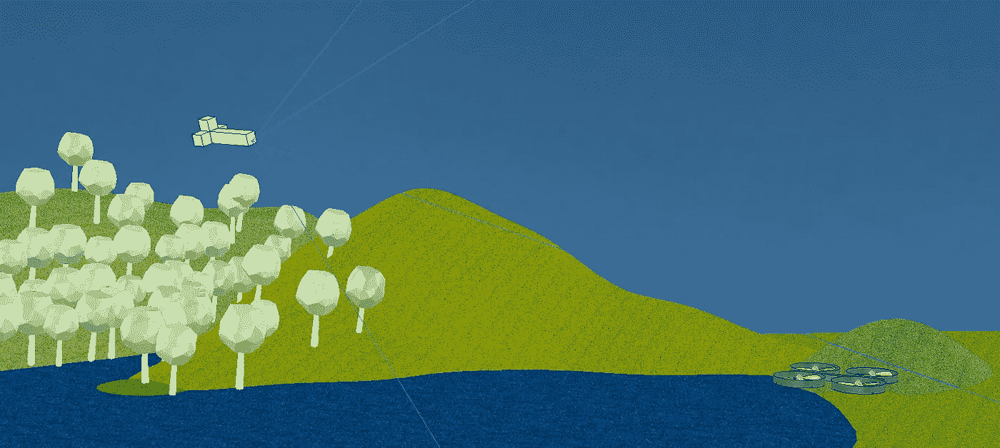

# 数字鸟类夜间飞行第一部分:人工智能模拟环境

> 原文：<https://towardsdatascience.com/digital-birds-fly-at-night-part-i-ai-simulation-environment-242fac9d67d8?source=collection_archive---------20----------------------->

## 在这一系列中，我将讲述我创造人工智能驾驶的固定翼飞机的努力。

在去现场之前，我们将在模拟环境中训练一个神经网络。我们可以从简单的东西开始，随着时间的推移提高模拟质量和飞行模型的准确性，最终在无人机拍摄的空中镜头上训练我们的神经网络。

对于模拟环境，我选择使用 V-Rep 进行初步实验，因为它有 Python 绑定和非常方便的 API 远程接口，但主要是因为 Unity 和 Unreal Engine 占用了太多的空间和资源，而 V-Rep 是一个简单的 tarball，笔记本电脑可以轻松运行它的多个无头实例。

创建了一个基本的“飞机”，并将其放置在由[西蒙·d·利维](https://github.com/simondlevy/Hackflight-VREP)创建的这个可爱的英国乡村场景中。

与大多数流行的模拟环境一样，V-Rep 实际上并不考虑空气阻力，因此不需要空气动力学模型。这个身体只不过是一个框架，当接收控制输入时，力被施加到四肢。

也没有飞行模型——模拟飞机飞行行为的数学模型，所以我对飞机施加了固定的推力和升力。

由于上述原因，该飞行器比固定翼飞机更像无人机或直升机——没有空气阻力意味着它可以转弯，漂移并失去所有动力。它在飞行中的表现也非常不稳定，这使得它极难用键盘控制。

从一个简单的任务开始——尽可能靠近目标飞行。为此，我创建了一个模拟，在这个模拟中，我将一个目标物体放在水面上，在鸟的视野范围内，让它自由飞行 3 秒钟。

期望——训练后，鸟会尽可能飞近目标区域。

现实——嗯，还没有完全实现，但已经有所改善。

我们将在本系列的下一篇文章中更多地讨论人工智能，但是在这个阶段我们已经被迫做出了一些设计决策:

# 监督学习与强化学习

当训练一个神经网络时，我们通常从一个大的数据集开始——过去的输入和与之相关的输出的例子。如果我们要训练一个对象分类器网络，我们会给它看很多狗和猫的图片，并附上“猫”/“狗”的标签，让网络“学习”什么是狗。

在我们希望人工智能驾驶我们的飞行器的情况下，我们将从视觉传感器捕捉图像，并与所需的控制输入配对。例如，如果我们看到我们将要撞上一棵树，输入将是“左转”。

这种训练方法非常有效，你的训练数据越多——你的模型就越精确。为了生成所述训练数据，人们将手动驾驶鸟，同时记录给定的控制输入。

然而，如前所述——我的模拟飞机是不可能控制的。我甚至不能用键盘保持它在空中飞行，更不用说让它接近目标了..

另一方面，强化学习假设不存在训练数据。取而代之的是，一个代理人执行一个动作，并因期望的结果而被奖励。在我们的例子中，一个成功的人工智能将是飞得离目标最近的那个。

为此，我们将培育多个候选人工智能模型，并让它们在我们的模拟世界中自由活动，只挑选冠军，并从其神经网络的权重中培育出略有变异的下一代。

但下一次会更多；)

直到那时！