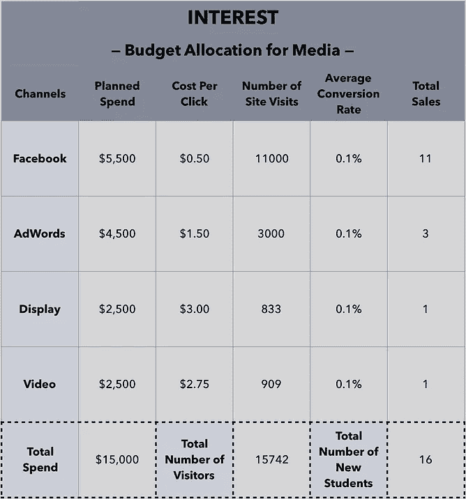
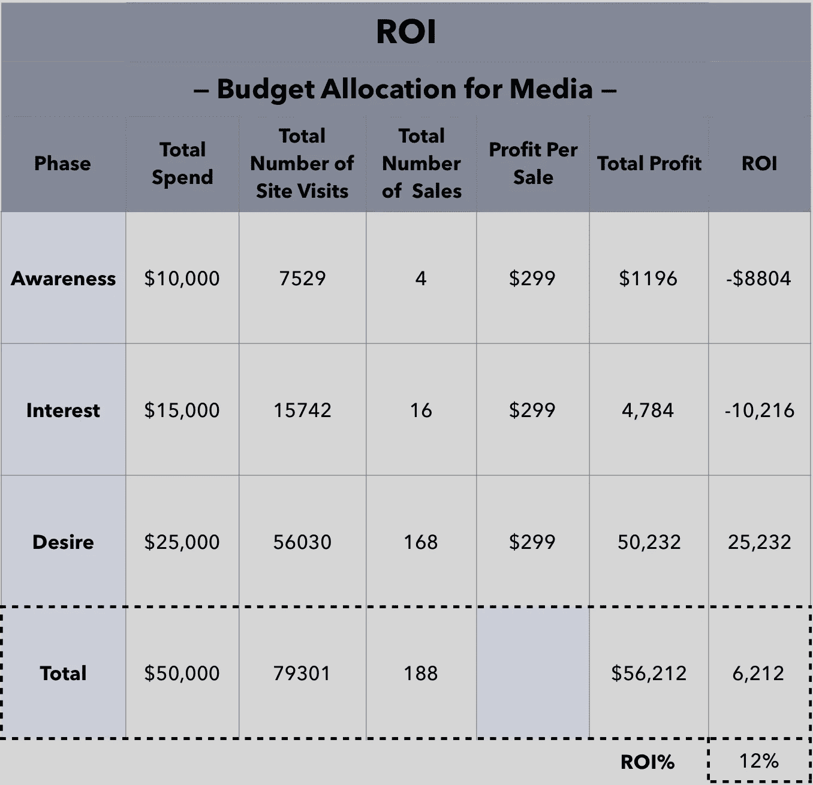
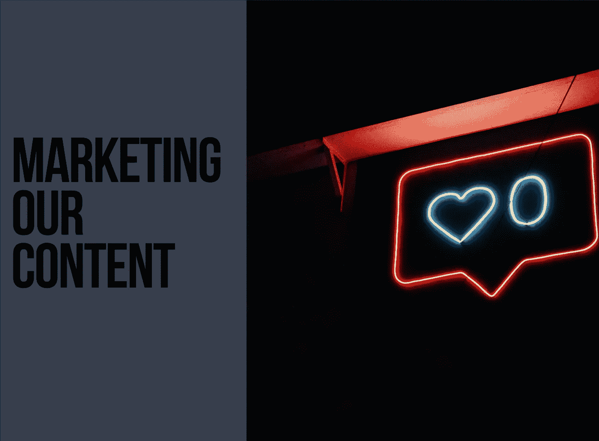

# 轻松实现数字营销

> 原文：<https://towardsdatascience.com/digital-marketing-made-easy-6c19dc597f6?source=collection_archive---------17----------------------->

我们将扮演营销顾问的角色，专注于在 [Udacity](https://share.udacity.com/x/WRVQ4e) 、**、*数字营销纳米学位项目*、**和 Tableau 中的免费课程 ***数据可视化两个 B2C 产品的营销。我们将一步一步地利用各种渠道开展活动，为这些项目吸引潜在的学生。更具体地说，我们的目标是收集可能对纳米学位课程或免费课程感兴趣的潜在学生的线索。***

Photo by Reza Rostampisheh on Unsplash

# 目录

在了解这些活动之前，我们将一步一步地做以下事情:

**1 |营销策略**

**ⓐ** 假设
**ⓑ** 营销目标& KPI
**ⓒ** 价值主张
**ⓓ** 移情地图和客户角色
**ⓔ** 营销策略

**2 |预算分配**

**ⓐ** 媒体上的成本与回报
t31】ⓑ建议

**3 |展柜作品**

**ⓐ** **营销我们的内容** : *博客和社交帖子* s
**ⓑ** **运行 Facebook 广告活动** : *Facebook 广告图片和结果*
**ⓒ** **进行 SEO 审核** : *审核和建议*
**ⓓ** **运行 AdWords 活动**

****

# **1 |营销策略**

****

**Photo Courtesy by [Udacity](https://share.udacity.com/x/WRVQ4e)**

**我们将专注于应用基于客户旅程的营销计划。在制定营销策略之前，我们将陈述我们的假设以及我们的营销目标和 KPI。我们将阐明我们活动的营销目标和 KPI，同时确保我们的目标是 SMART。**

> ****SMART** 目标是:
> **S**specific、**M**measurable、**A**achievable、 **R** ealistic、**T**I bound。**

## **ⓐ假设**

*   ****预算**:*:5 万美元***
*   ****利润** : *纳米学位项目的成本是 999 美元，我们假设利润率为 30%，也就是说* [*Udacity*](https://share.udacity.com/x/WRVQ4e) *每个报名的学生可以获得 299 美元的利润。***
*   ****活动** : *我们希望大力发展该项目，但是，我们希望在不赔钱的情况下实现。***

> **未来的学生可以下载免费的电子书，如果他们通过这个[登陆页面](http://dmnd.udacity.com/ebook)向我们提供他们的电子邮件地址；这本电子书——社交媒体广告指南——是数字营销纳米学位项目的简短摘录。**

## **ⓑ营销目标和关键绩效指标**

**总体*营销目标*是在三个月内获得至少 200 名报名参加我们数字营销纳米学位的新生，总预算为 5 万美元。**

**营销目标的总体*主要关键绩效指标(KPI)* 是在保持正投资回报的同时，当月注册课程的客户总数。**

## **ⓒ价值主张**

**利用**杰弗里·摩尔的模板**得出的**T21 的价值主张是:****

****对于希望进入数字营销领域
**的学生和营销人员来说，他们**渴望利用社交媒体营销、搜索营销和电子邮件营销等在线营销策略，**我们的**数字营销 Nanodegree 是一个项目**，**让你学习如何创建营销内容，使用社交媒体放大你的信息，使内容在搜索中可被发现，在脸书上开展广告活动和做广告。****

****与**Udemy 提供的完整数字营销课程不同，**我们的**课程将让您在向该领域顶级专家学习的同时，获得现场营销活动的实际经验。以对数字营销的 360 度理解开启你的职业生涯。**

## **ⓓ移情图和顾客角色**

**接下来，我们将关注**我们的客户是谁**来帮助我们编写内容、开展活动和审核网站。这可以通过**创建移情图**和**采访潜在客户来实现。****

> **移情图用于理解和总结客户研究。因此，在采访了至少三个潜在客户来为我们的移情图收集信息后，我们将有四个象限，分为思考、观察、行动和感受。**

****

> **客户角色是一个虚构的角色，它总结并传达了我们目标客户的关键特征。当创建人物角色时，我们将使用移情图中的信息来告知我们的虚构人物将具有什么样的特征。**

****

## **ⓔ **营销策略****

**在这里，我们将概述并提供客户旅程每个阶段的营销策略，包括信息传递和渠道。**

****

> ****登陆页面**:一个目的页面，或者一个独立的网页，开发来引导流量以采取行动，达到营销或广告活动的目的。当客户*点击谷歌 AdWords 或社交媒体上的任何广告时，就会登陆这个网站。***
> 
> **有机社交媒体:这完全是关于社交媒体上出现的东西，没有付费推广。通常，有机社交媒体与用户在任何社交媒体网络上发布的任何内容相关联。**
> 
> ****展示广告**:一种吸引网站、社交媒体平台受众注意力以采取特定行动的技术。这是一种在线付费广告的方式，可以是设计好的图像或照片和广告文案。**
> 
> ****反向链接**:反向链接，或入站链接，是一个网站上的超链接
> ，指向另一个外部网站。**
> 
> ****搜索引擎营销**:显示在搜索引擎结果页面上的付费广告。另一方面，在搜索引擎优化(SEO)中，一家企业不会为流量和点击量向谷歌付费；更确切地说，他们在搜索结果中获得了一个免费的位置，因为他们拥有与给定关键词搜索最相关的内容。
> 
> **关键词**:根据 MOZ 的说法，“关键词是定义你的内容是关于什么的想法和主题。就 SEO 而言，它们是搜索者输入搜索引擎的单词和短语，也称为搜索查询。**
> 
> ****重定向广告**:重定向广告是一种在线定向广告，是为已经访问过我们网站的人制作的。这有助于在网站访问者离开页面后将他们转化为顾客。**

> **97%第一次访问你网站的人什么都没买就离开了，然后他们就永远消失了。除非你能把他们带回来。——**Mailchimp.com****

****

# **2 |预算分配**

**营销成本将分几个阶段下降:**

*   ****创意:** *广告文案、图片、视频等***
*   ****媒体:****
*   ****时间和资源** : *管理社交媒体营销渠道需要大量的时间。***

**在这里，我们将只关注**媒体**:T2 媒体的成本和回报。**

## **ⓐ媒体的成本和回报**

****

**准确、有效的数字营销预算在任何活动中都扮演着重要的角色，同时还能保持积极的投资回报。下面，我们将针对客户旅程的认知、兴趣和需求阶段，对媒体进行预算分配。**

****************

## **ⓑ建议**

**在认知阶段，我们应该把重点放在脸书和 Adwords 上的展示广告上，尽可能多地吸引客户，帮助他们了解这个项目。我们需要优秀的创意来反映项目的目标。在 desire 阶段，我们需要应用更多的重新定位的广告来再次推动该计划的流量。脸书在任何阶段的每次点击费用都是最低的，我们建议增加计划支出，因为它比其他渠道产生更多的销售。**

****

# **3 |展示作品**

**陈述完营销目标和我们活动的关键绩效指标后，我们将通过在**脸书**、 **Instagram** 、 **LinkedIn** 、 **Twitter** 和**Google**上的**、*短期广告*、*、**、*活动*、**的**、*一些*细节*****然后，通过与 **MailChimp 进行**电子邮件营销** **战略**来完成我们的工作。********

> 每个**活动**或**广告**都有其**营销目标**和 **KPI** ，所有这些都与我们之前陈述的总体营销目标和 KPI 相关。
> 
> 这些**广告**和**广告**将短时间播放，以便在本文中展示它们的表现。

Photo by Prateek Katyal on Unsplash

## 营销目标和 KPI

营销目标是通过在一个月内让大约 300 人访问这篇文章来建立意识和兴趣。

文章营销目标的主要 KPI 是当月的访客总数。

Sharing a post in Twitter to reach prospective students

Sharing a post in Linkedin to reach specific target students and analysts who may want to learn marketing

Sharing a post in Instagram to reach prospective students

Photo by NeONBRAND on Unsplash

这项活动的主要焦点将集中在年龄在 25 岁到 35 岁之间的男性身上，他们认为自己是企业家或初创公司的创始人，并希望将他们的业务提升到一个新的水平。处于旅程的开始表明目标客户想要省钱和削减开支。因此，提供一个项目来学习社交媒体广告和数字营销的整体概念是至关重要的，并且可以为客户提供许多机会来将这些概念应用到他们的业务中。

下载免费电子书是客户旅程的第一步，他们可以更进一步，考虑参加完整的计划。因此，广告文案和广告创意与*边做边学*的理念有关。这些图片显示了通过不同的数字设备在线学习并在现实世界的项目中应用所学是多么的纵容。

所有人一起传递信息；**阅读，学习，然后应用**。你可以通过在 [Udacity](https://share.udacity.com/x/AUFMEi) 学习社交媒体营销和广告的概念来增强自己的能力。

我们不是针对对数字营销或社交媒体营销/广告感兴趣的普通人，而是试图专注于那些希望将这些概念应用到自己业务中的自雇人士。

## 营销目标和 KPI

营销目标是建立知名度和兴趣，在 3 天内使用 100 美元的总预算获得至少 50 次免费电子书下载。

活动营销目标的主要 KPI 是三天内的下载量。

A summary that shows the target criteria, ad placement, and schedule.

Here is the goal of the campaign (conversions) with a budget of $100

我们想告诉观众为什么他们应该下载电子书，阅读它，并在考虑学习数字营销和社交媒体广告时将该计划作为首选。

有一个清晰的行动号召让我们简洁而直接，例如，**通过下载电子书了解更多**。此外，添加引人入胜的图像来反映广告文本，同时代表目标受众，这一点至关重要。

这是两个广告的例子和活动的最终结果。

The results that show the number of conversions and the costs per each

*   这场运动没有达到我们的营销目标。在过去的 4 天里，只有 11 次点击，9 次下载和 1982 次点击。然而，考虑到整体正投资回报率，它赚了 3.54 美元。
*   尽管广告五有 6 个结果，但它的投资回报率为 4.81 美元，低于广告二有 3 个结果的投资回报率。
*   总体印象不是很好，但是，这将有助于推动我们想要的意识。
*   我们建议使用不同的图片，因为印象/接触结果显示一些创意对客户更有吸引力；图 2 和图 5 是相似的创意，也是唯一有结果的。
*   有了额外的预算，我们可以制作更少的广告，并应用 A/B 测试在两幅图像中进行选择；一个用特定性别反映标题，另一个没有特定性别。
*   我们会调整目标受众，针对所有性别，而不仅仅是男性。我们相信没有什么不同，努力接触普通客户可以让我们获得更多的结果，从而实现我们的营销目标。

An overall view of the ads performance where we can see the best ad with **6** leads and costs **$2.60** each

An overall view of the ads engagement with customers

An overall view of the ads delivery where the best ad reached **985** people

A chart that shows the demographics as all **men** mostly between **25–34** years old

**Facebook Audience Network** is an off-**Facebook**, in-app **advertising network** for mobile apps. Advertisers can serve up their **ads** to customers who are using mobile sites and apps other than **Facebook**, extending their reach beyond the platform (adespresso)

Photo by Stephen Dawson on Unsplash

> **搜索引擎优化(SEO)** :优化有机搜索引擎结果，以提高我们网站流量的质量和数量。

## 营销目标和 KPI

营销目标是建立知名度和兴趣，让至少 100 名访客在 7 天内访问登录页面。

活动营销目标的主要 KPI 是这三天的访客数量。

## 内容审核:关键词

首先，我们将使用 [Moz Keyword Explorer](https://moz.com/explorer) 工具来识别我们可能会将用户导向登录页面的关键词。我们应该确保混合使用品牌和非品牌关键词。

然后，我们将确定最有潜力的**头尾关键词**。最后，我们将编写三个博客主题，其中包含了最有潜力的关键词。关键词可以是广泛而深远的(这些通常被称为“头部关键词”)，或者它们可以是几个术语的更具体的组合——这些通常被称为“长尾关键词”

Photo Courtesy by Moz

> **头部关键词:**一两个词 **尾部关键词:**非常有针对性的搜索短语
> 
> **优先级得分**:根据 MOZ 的说法，关键词优先级是“通过查看所有其他指标(数量、难度和有机点击率)计算出的满分 100 分。较高的优先级代表了较高容量和较低难度的最佳点”。

Based on the priority scores, digital marketing is the best head keyword with a score of **78%**, and digital marketing certificate is the best tail keyword with a score of **64%**

## 技术审核:元数据

我们将通过创建一个包含我们选择的页面的当前元数据和我们建议的修订的表格，对元数据进行技术审核。

## 技术审计:反向链接审计

使用 [Moz OpenSite Explorer](https://moz.com/researchtools/ose/) 工具，我们将对我们选择的网页执行反向链接审计。

然后，我们将列出我们为网站发现的三个顶级反向链接 URL。这些反向链接应该增加网站的价值，而不是垃圾邮件。

> **域名权威**:根据 MOZ 的说法，域名权威(DA)是“由 Moz 开发的一种搜索引擎排名分数，可以预测一个网站在搜索引擎结果页面上的排名。一个领域权威的分数范围从 1 到 100，分数越高，对应的排名能力越强。”

## 链接构建

使用 [SEMRush](https://www.semrush.com/) 工具和研究，我们将策划一个链接建设活动。我们将确定**三个**我们认为相关的高流量网站，我们希望从这些网站获得反向链接，以帮助提高我们网站的流量。

## 现场性能审计:性能测试

*   使用[Pingler Google Indexed Pages Checker](https://pingler.com/seo-tools/tools/google-indexed-pages-checker/)工具，我们将研究有多少数字营销 Nanodegree 的页面被 Google 索引。解释为什么索引的页数很重要。

基本上，没有它谷歌不能索引我们的页面，页面不会在搜索引擎上显示。**不幸的是，平勒显示 dmnd.udacity.com 和**[**udacity.com**](https://share.udacity.com/x/WRVQ4e)都不适用。无论如何，我们应该确保谷歌蜘蛛捕捉尽可能多的链接，为我们的网站带来更多的流量。

> **Google spider** 又称网络爬虫，是一种抓取网站并存储信息供搜索引擎索引的互联网机器人。

—**WordStream.com**

*   使用[Google Page Speed Insights](https://developers.google.com/speed/pagespeed/insights/)工具，我们将对登录页面的移动显示进行速度测试。然后，我们将解释*为什么*评估页面速度很重要。

页面的速度与客户的购买行为相关，也就是说，页面速度慢不会引起客户的兴趣，他们会在几秒钟内离开网站。不需要很长时间来显示内容的更快的页面效率更高。**结果表明，我们需要提高手机的登陆页面速度**。

*   使用 [Think with Google](https://testmysite.thinkwithgoogle.com/) 工具，我们将评估登陆页面的移动友好性。然后，我们将解释*为什么*拥有手机优化版很重要。

拥有一个移动友好页面可以让我们接触到更多的客户。它表明页面将考虑客户访问页面时使用的每个设备，从而改善用户体验。结果显示装载速度很慢，这会让我们的客户付出代价。

## 推荐

*   首先需要调整的是页面元数据，添加 alt-tag 和描述，允许我们添加和优化更多的关键字。这让我们进入下一步，使用 MOZ 来监测和识别新的和更有效的关键字。利用 MOZ 的力量可以帮助我们根据客户的习惯和趋势来优化头尾关键词。
*   正如我们从性能测试的结果中看到的，我们需要优化页面加载速度，并通过拥有一个移动友好的页面来改善用户体验。我们需要一个速度和响应页面，考虑到不同的设备。页面速度很重要，优化页面速度的一个方法是删除所有不必要的代码、图片等。此外，增加离开页面可能性的最令人沮丧的因素之一是弹出窗口。我们需要避免在页面中使用它们。如前所述，我们需要优化元描述，然而，当我们试图拥有一个移动友好的页面时，我们需要简洁，因为它没有桌面的大空间。
*   我们应该调查页面索引问题。这可能是 Pingler 的一个错误，因此，我们应该使用另一个工具来评估我们的页面索引。如果页面不在谷歌的索引中，我们就不会获得有机的流量！我们需要专注于我们的 SEO 策略，优化页面，让谷歌的蜘蛛索引页面，然后建立排名，吸引流量，达到我们的网站目标。提高页面索引的重点是确保我们考虑了谷歌关于信任、权威和质量的指导方针。

Photo by Arthur Osipyan on Unsplash

## 营销目标和 KPI

营销目标是在 **5 天**内建立对**印度**的认知和兴趣，通过 **4 个广告**获得至少 **3 个报名**关于免费课程:***Tableau***中的数据可视化。

活动营销目标的主要 KPI 是五天内的注册转换率。

重点是为 Tableau 中的免费课程**数据可视化创建两个针对**印度**客户的广告组。**两组代表客户旅程中的两个不同客户: ***认知度*** 和 ***兴趣*** 。

处于旅程的开始表明处于认知阶段的目标客户想要了解更多关于数据可视化的知识以及他们可以使用哪种工具。因此，引入一门免费课程来学习数据可视化的概念，然后在 Tableau 中应用它们，可以为学生提供许多将这些概念应用到职业生涯中的机会。关键词范围很广，重点关注客户在搜索数据可视化时可能遇到的问题。

另一方面，对数据可视化和 Tableau 特别感兴趣的客户需要知道如何使用 Tableau 中的工具或部分工具。也就是说，我们添加了更具体的关键字来反映他们的关注点，如如何在 tableau 中创建图表，或创建仪表板等。

总的来说，认知组的关键字包括关于数据可视化和 Tableau 的信息，而兴趣组的关键字针对的是对 Tableau 有一定了解的客户的问题。

## 设置我们的广告

1.  **竞价** **策略**:手动每次点击费用(增强 CPC)
2.  **预算:**每天 10 美元
3.  **时间** : 5 天

A summary that shows and summerizes the ads for each target

An overview evaluation per ad group; as we can see that we have only **2** conversions from the **interest ads**

Overview of each ad; while one ad performed well with **36** clicks, it didn’t lead to any conversions

The tail keyword “**business certificate online**” lead to having the only **2** conversions with cost of **$5.43** each

## 评估活动绩效

*   在两个广告组中，只有“兴趣广告”产生了 2 的转化率。因此，每条线索的成本为 9.75 美元，转化率为 16.67%。
*   尽管“认知广告”总共有 55 次点击和更高的点击率；与“兴趣广告”的 12 次点击和 3.54%的点击率相比，它的转化率为零。
*   导致 have 转化的唯一关键词是“网上商业证书”。CTR 为 5.15%，CR 为 28.57%，每次转换的成本为 5.35 美元。
*   我们的营销目标是至少招收 3 名学生，然而，在五天的时间里，该活动只产生了 2 次转化，每次成本为 30.39 美元。只要课程是免费的，投资回报率就会是负数。一旦我们有了更多关于这些线索质量的信息，他们是否为纳米学位项目付费。如果 2 次转化产生的收益超过 60.74 美元(成本)，那么我们将获得正的投资回报。
*   虽然我们假设转化率为 5%，但我们得到的转化率为 2.99%，低于我们的预期。
*   在总共 1638 次展示中，我们总共收到了 67 次点击。这使我们的点击率(CTR)为 4.09%，平均每次点击成本(CPC)为 0.91 美元，低于我们的最高出价 3.00 美元。

## 推荐

*   由于“意识广告”有更好的点击率，我们将专注于优化我们对目标受众的信息，以鼓励学生采取下一步行动并加入课程。
*   我们将改变广告的标题“Tableau for 初学者|查看和理解您的数据”,因为它的点击率最低。
*   分析产生两条线索的广告:“免费在线 tableau 培训|提升您的技能”。虽然它的印象最差，但它的点击率最高。为此，我们将应用一个 **A/B 测试**并一次改变一个元素。然后，我们将转换表现不佳的广告，使其在头部关键词、尾部关键词等方面具有相似的广告文案。

An overall view of each ad group performance where we can see a total of **67** clicks with **4.09%** CTR and a total cost of **$60.79**

An overview analysis of the ads by gender

An overview analysis of the ads by age

A comparison between male and female with respect to the number of clicks and impressions; overall, males have seen the ads and click on one them more than females.

An overall view of each ad’s performance where we can see that we paid only for one add as it was the one with **2** conversion.

An overall view of each keyword performance

Photo by Alex Holyoake on Unsplash

这一部分包括评估三个不同的活动。陈述完假设后，我们将回顾每个活动的结果。

Evaluating the first ad that shows a positive **ROI** of **$597.4**

Evaluating the second ad that shows a positive **ROI** of **$67.01**

Evaluating the third ad that shows a positive **ROI** of **$363.5**

到目前为止，我们已经关注了客户获取漏斗的第一个方面，例如建立意识和收集潜在线索。这些营销漏斗顶端的活动包含了从设计优秀的内容并通过社交渠道分发这些内容，到通过搜索引擎优化提高我们网站的知名度，或者付费在搜索引擎上做广告的所有内容。现在，我们将把重点转移到电子邮件营销，这是转化率较高的营销渠道之一。

特别是，电子邮件营销是营销中使用的最佳手段之一，其重点是在客户获取和购买漏斗中加强参与、提高转化率和保留率。

现在，我们已经收集了销售线索(电子邮件地址)，并成功获得了客户的兴趣，是时候创建一个电子邮件营销活动来吸引这些销售线索，并最终将其转化为客户旅程中的后续阶段。

> 就当是礼貌好了。当有人开始听的时候，你应该说你好，对吗？当有人要求更多时，给他们你最好的。我认为欢迎系列既是聪明的营销，也是普通的礼貌。”——**安迪·克雷斯托迪纳，** [**轨道传媒**](https://www.orbitmedia.com/)

既然我们已经在上面规划了我们的电子邮件内容和活动日历，我们将使用上面的模板通过电子邮件服务提供商 **MailChimp 创建我们的第一封电子邮件。**

Photo used in the email by Austin Distel on Unsplash

测试是提高转化率的一个有效方法。实现这一点的方法之一是通过对我们的电子邮件内容进行 A/B 测试。

现在我们已经创建了序列中的第一封电子邮件，并对其进行了测试，是时候发送了！分析电子邮件营销活动的结果是电子邮件营销活动的重要组成部分。检查对电子邮件营销活动很重要的指标有助于指导我们为未来的电子邮件发送提出建议。

**对电子邮件二和三的建议**

我们应该考虑到我们有 225 封退回的电子邮件和 30 个未订阅的客户。首先，我们应该确保取消订阅的电子邮件从邮件列表中删除。然后，我们需要通过处理被退回的电子邮件来调整列表，并根据需要通过归档错别字或删除它们来找到解决方案。

根据 A/B 测试的结果，我们应该调整邮件正文、主题行、CTA、视觉效果等元素。然后，我们可以对这两封邮件进行 A/B 测试。我们应该留出一些时间来发送每封电子邮件。分析完邮件二，我们需要一些时间来分析，然后调整邮件三。

> 无论是你的盛大开业还是你的公司已经建立，一个有效的电子邮件营销计划是促进和发展你的业务、增加收入和销售更多东西的关键。—**Mailchimp.com**

# 最终想法— 2019 年及以后

第四次工业革命代表了由于采用信息物理系统和物联网，人们生活、工作和相互交往方式的逐步改变。

> **信息物理系统**是一种由基于计算机的算法管理的机制，该算法随着网络连接(互联网)及其用户而增强。

Infographic by Andrew Churchill at Raconteur

我们应该承认机器学习(ML)和人工智能(AI)促使我们进行更有效的数据分析的方式。人工智能使数字营销人员更易于管理，可以向客户提供更相关的内容、产品和服务信息，也称为“超个性化”。

> 第五次工业革命，或称工业 5.0，将聚焦于人与机器的合作，因为人类智能与认知计算和谐相处。通过协作机器人将人类重新投入工业生产，工人将获得更高技能，在生产中提供增值任务，从而为客户带来大规模定制和个性化。本·罗西

Infographic by Joydeep Bhattacharya at Single Grain