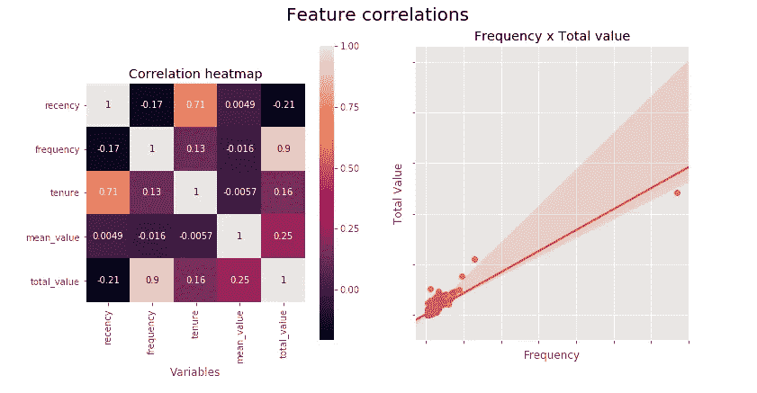
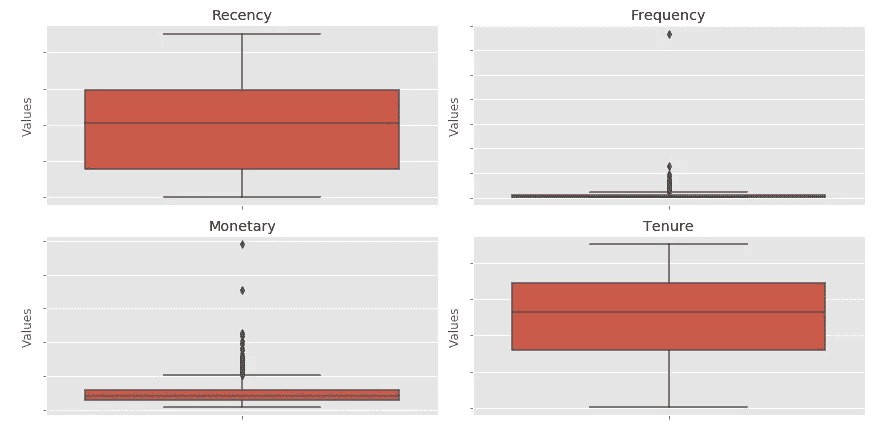
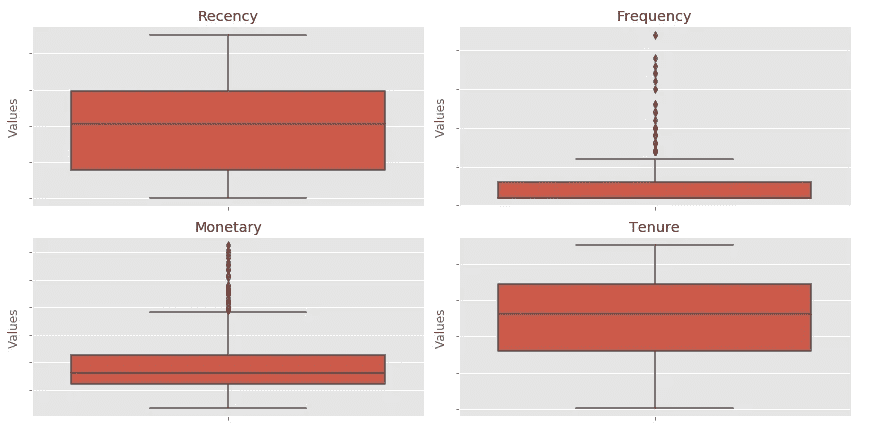
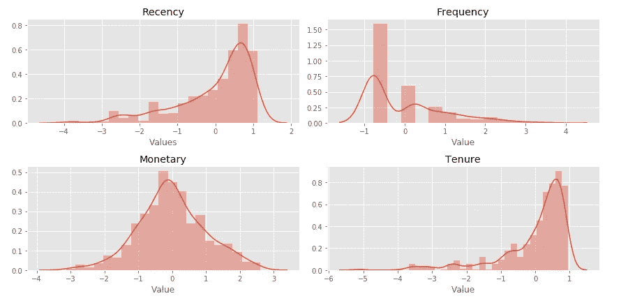
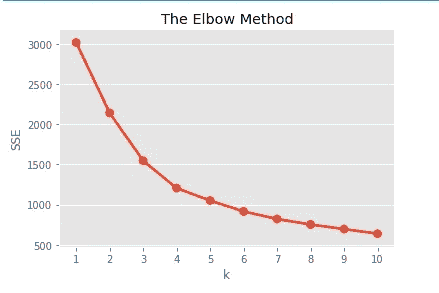
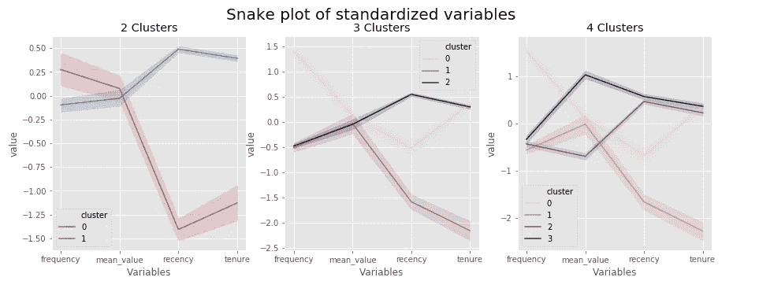
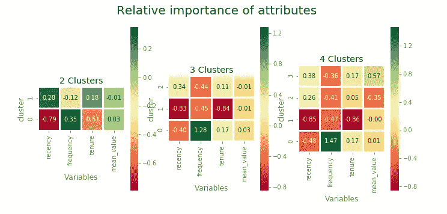
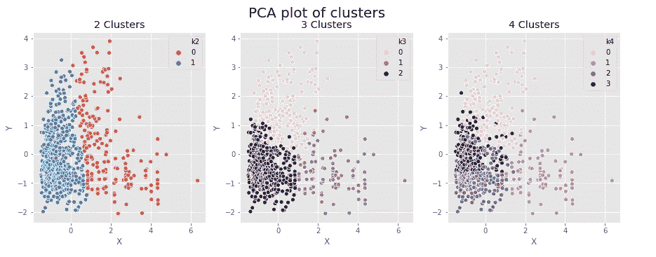
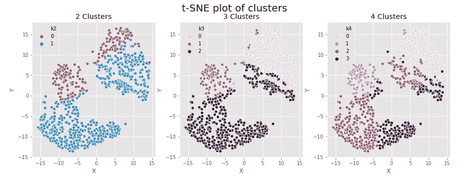

# 数字部落:用 K 均值进行客户聚类

> 原文：<https://towardsdatascience.com/digital-tribes-customer-clustering-with-k-means-6db8580a7a60?source=collection_archive---------16----------------------->

## 使用 PYTHON 进行客户细分

## 了解如何使用强大的机器学习技术来更好地细分您的客户群


Photo by [Perry Grone](https://unsplash.com/@perrygrone?utm_source=medium&utm_medium=referral) on [Unsplash](https://unsplash.com?utm_source=medium&utm_medium=referral)

这篇文章是 [*分而治之:使用 RFM 分析*](/divide-and-conquer-segment-your-customers-using-rfm-analysis-68aee749adf6) 故事细分你的客户的后续，在这里我们开始使用经典的 RFM 分析细分我们的用户群。

这一次，我们将探索一些机器学习技术，以获得更多定制和微调的分组。一种方法是使用聚类算法，例如 **K-Means** 。

# 什么是集群？

聚类模型是无监督机器学习算法组的一部分。在无监督学习问题中，没有明确的目标变量，例如，我们不试图将客户分为我们事先知道存在的不同类别。相反，该算法使用数据本身的模式来识别和分组相似的观察结果，并找到这些类别。

**K-Means** 模型的工作原理是寻找数据集中具有相似属性的不同数据点组(聚类)。它通过以最小化所有点到包含它们的聚类的质心的距离的方式对点进行分组来做到这一点。

换句话说:该算法的主要目标是找到聚类，使得同一聚类中的数据点之间的距离小于不同聚类中任意两点之间的距离。这样，属于同一组的成员往往具有相似的特征，而与其他组的成员不同。

解决了这个问题，让我们回到数据分析上来，好吗？

# 一些特征工程和预处理

由于我们试图了解更多关于客户行为模式的信息，我们可以使用这些行为的指示性特征来训练 K-Means 模型。例如，我们可以从使用我们在上一篇文章中计算的**新近度**、**频率**、**货币值**和**任期**开始。

这样，我们可以将志同道合的客户聚集在一起，然后分析这些不同的群体，以获得模式和趋势方面的见解，从而帮助制定未来的业务决策。

让我们首先从我们在上一篇文章中生成的**客户**数据集中抽取必要的列，并查看特性之间的相关性:

```
# retain only the recency, frequency, tenure and monetary columns
rfm = customer[['customer_id', 'recency', 'frequency', 'tenure', 'mean_value', 'total_value']]
rfm.set_index('customer_id', inplace=True)# build a feature correlation matrix
rfm_corr = rfm.corr()fig, ax = plt.subplots(1, 2, figsize=(12,6))# create a heatmap to display the correlations
sns.heatmap(rfm_corr, annot=True, ax=ax[0], square=True)
ax[0].set_ylim([5, 0])
ax[0].set_title('Correlation heatmap')
ax[0].set_xlabel('Variables')# plot the regrassion line to highlight the strong correlation
sns.regplot(rfm.frequency, rfm.total_value, ax=ax[1])
ax[1].set_title('Frequency x Total value')
ax[1].set_xlabel('Frequency')
ax[1].set_ylabel('Total Value')
# Turn off tick labels
ax[1].set_yticklabels([])
ax[1].set_xticklabels([])fig.suptitle('Feature correlations', fontsize=20)
plt.show()
```



**Figure 1:** Feature correlations

可以清楚地看到， **total_value** 和 **frequency** 列是非常强相关的(系数为 0.9)。事后看来，你可能会认为这是显而易见的:从长远来看，购买越频繁的客户往往会花更多的钱。虽然，这表明在试图训练任何机器学习模型之前，仔细检查你的数据是多么重要！

丢弃高度相关的要素是一种很好的做法，因为它们会给数据增加一些冗余，并且可能会影响模型的最终结果。从现在开始，我们将删除 **total_value** ，并在分析中使用 **mean_value** 列。

```
rfm.drop('total_value', axis=1, inplace=True)
```

我们必须采取的另一个步骤是从数据集中移除离群值。由于 **K-Means** 算法依赖于点与点之间距离的计算(大部分时间是简单的欧氏距离)，因此受离群点存在的影响较大。让我们从检查我们的四个特征的盒图开始。

```
fig, ax = plt.subplots(2, 2, figsize=(12,6))sns.boxplot(rfm.recency, orient='v', ax=ax[0][0])
ax[0][0].set_title('Recency')
ax[0][0].set_ylabel('Values')
ax[0][0].set_yticklabels([])
ax[0][0].set_xticklabels([])sns.boxplot(rfm.frequency, orient='v', ax=ax[0][1])
ax[0][1].set_title('Frequency')
ax[0][1].set_ylabel('Values')
ax[0][1].set_yticklabels([])
ax[0][1].set_xticklabels([])sns.boxplot(rfm.mean_value, orient='v', ax=ax[1][0])
ax[1][0].set_title('Monetary')
ax[1][0].set_ylabel('Values')
ax[1][0].set_yticklabels([])
ax[1][0].set_xticklabels([])sns.boxplot(rfm.tenure, orient='v', ax=ax[1][1])
ax[1][1].set_title('Tenure')
ax[1][1].set_ylabel('Values')
ax[1][1].set_yticklabels([])
ax[1][1].set_xticklabels([])plt.tight_layout()
plt.show()
```



**Figure 2:** boxplot of features before outlier removal

我们可以看到在**平均值**和**频率**列的分布中明显存在异常值，其中一些异常值距离其余的点非常远。我们将根据 **Z 分数**移除这些异常值:分数大于 3 的任何点都将被移除，即距离平均值超过 3 个标准偏差的任何点。

```
from scipy import stats# remove outliers based on the Z-score# For each column, first it computes the Z-score of each value in the column, relative to the column mean and standard deviation. 
# Then is takes the absolute of Z-score because the direction does not matter, only if it is below the threshold. 
# The .all(axis=1) ensures that for each row, all column satisfy the constraint. 
# Finally, result of this condition is used to index the dataframe.
is_inliner = (np.abs(stats.zscore(rfm)) < 3).all(axis=1)rfm = rfm[is_inliner]
```

然后我们可以重复箱线图来检查新的数据分布



**Figure 3:** boxplot of features after outlier removal

好多了！一些异常值将会保留，因为它们没有下降到均值的足够远的位置而被去除。但是，比较有攻击性的都没有了。

我们必须采取的最后一个预处理步骤是标准化数据。 **K-Means** 算法更适合正态分布的数据。考虑到这一点，我们将使用一个 **log** 函数来尝试消除一些数据的偏斜，然后使用来自 **scikit-learn** 的**标准定标器**来转换分布，使**均值**接近 0，而**标准差**接近 1。

```
# standardize variables
from sklearn.preprocessing import StandardScaler# take the log to unskew the data
log_rfm = np.log(rfm)
# use fit_transfome from StandardScaler to standardize the data (mean=0, std=1)
scaler = StandardScaler()
scaled_rfm_array = scaler.fit_transform(log_rfm)
scaled_rfm = pd.DataFrame(
    scaled_rfm_array,
    columns=rfm.columns,
    index=rfm.index,
)
```

让我们通过最后看一下我们的数据分布来完成预处理

```
fig, ax = plt.subplots(2, 2, figsize=(12,6))sns.distplot(scaled_rfm.recency, ax=ax[0][0])
ax[0][0].set_title('Recency')
ax[0][0].set_xlabel('Values')sns.distplot(scaled_rfm.frequency, ax=ax[0][1])
ax[0][1].set_title('Frequency')
ax[0][1].set_xlabel('Value')sns.distplot(scaled_rfm.mean_value, ax=ax[1][0])
ax[1][0].set_title('Monetary')
ax[1][0].set_xlabel('Value')sns.distplot(scaled_rfm.tenure, ax=ax[1][1])
ax[1][1].set_title('Tenure')
ax[1][1].set_xlabel('Value')plt.tight_layout()
plt.show()
```



**Figure 4:** feature distributions

那看起来足够好了！让我们开始你们期待已久的精彩部分吧。

# 最后，真正的交易

我们终于准备好安装 **K-Means** 模型了！然而，K-Means 算法的一个缺点是，您必须预先提供您希望它生成的聚类数。该算法不能从数据中学习该参数。

我们可以从任意设置集群数为 3 开始。这是我们在上一篇文章中用来进一步细分 **RFM 得分**的层级数，感觉这是一个很好的经验法则。

**K-Means** 是一种迭代算法。预先确定聚类数后，该模型将每个数据点分配给质心最近的聚类。然后重新计算质心，并重复该过程，直到数据点分配没有变化。这意味着我们有效地缩短了距离。

```
# import kmeans from sklearn
from sklearn.cluster import KMeans# run kmeans
kmeans = KMeans(n_clusters=2, random_state=1)
kmeans.fit(scaled_rfm)# extract the cluster labels from thte fitted model
cluster_labels = kmeans.labels_
```

搞定了。这就是训练一个 **K-Means** 模型所要做的一切。但是等等，我们已经根据经验将聚类数设置为 3，但是我们如何发现这个数是否最适合我们的数据呢？

我们可以看看各种 **K-Means** 模型拟合不同数量的 **K** 的**误差平方和(SSE)** 。 **SSE** 是每个观察值与其聚类平均值之间的平方差之和。它可以用来衡量一个集群内的变化。

**SSE** 函数将随着集群数量的增加而单调递减。然而，下降最初非常陡峭，在达到某个值**K***后，下降开始放缓，形成我们所说的肘形曲线。图的“肘”上的值 **K** (即下降开始减缓的 **K** 的值)为我们提供了给定数据集的最佳聚类数的指示。这种方法可以与特定领域的问题和需求知识相结合，以决定要使用的集群数量。*

```
*# find the ideal number of clusters
# Fit KMeans and calculate SSE for each k
sse = {}
for k in range(1, 11):
    kmeans = KMeans(n_clusters=k, random_state=1)
    kmeans.fit(scaled_rfm)
    sse[k] = kmeans.inertia_ # sum of squared distances to closest cluster center

# Plot SSE for each k
plt.title('The Elbow Method')
plt.xlabel('k')
plt.ylabel('SSE') 
sns.pointplot(x=list(sse.keys()), y=list(sse.values()))
plt.show()*
```

**

***Figure 4:** Elbow plot*

*看起来 3 或 4 个分类将是更好地代表数据集的分类数。只是为了比较，我们将再运行 **K-Means** 3 次，使其适合 2、3 和 4 个集群。*

```
*# fit kmeans with 2 clustes
kmeans = KMeans(n_clusters=2, random_state=1)
kmeans.fit(scaled_rfm)
# extract the lables
cluster_labels_k2 = kmeans.labels_
# assing the cluster labels to the dataset
rfm_k2 = rfm.assign(cluster = cluster_labels_k2)# fit kmeans with 3 clustes
kmeans = KMeans(n_clusters=3, random_state=1)
kmeans.fit(scaled_rfm)
# extract the lables
cluster_labels_k3 = kmeans.labels_
# assing the cluster labels to the dataset
rfm_k3 = rfm.assign(cluster = cluster_labels_k3)# fit kmeans with 4 clustes
kmeans = KMeans(n_clusters=4, random_state=1)
kmeans.fit(scaled_rfm)
# extract the lables
cluster_labels_k4 = kmeans.labels_
# assing the cluster labels to the dataset
rfm_k4 = rfm.assign(cluster = cluster_labels_k4)*
```

*我们最终得到 3 个不同的数据集: **rfm_k2** 、 **rfm_k3** 和 **rfm_k4** ，每个数据集都包含每个不同值 o **K** 的聚类信息。*

# *从集群中构建客户角色*

*我们可以做的第一件事是创建汇总表来检查每个集群中包含的样本的基本信息。与我们在上一篇文章中所做的类似，我们将包括一些汇总统计数据，比如每个特征的**均值**值，以及分配给每个聚类的样本数。*

```
*# group the rfm_k2 dataset by the clusters
rfm_k2_summary = rfm_k2.groupby('cluster').agg(
    recency=('recency',  'mean'),
    frequency=('frequency', 'mean'),
    tenure=('tenure', 'mean'),
    monetary=('mean_value', 'mean'),
    samples=('mean_value', 'count')
).round(0)# group the rfm_k3 dataset by the clusters
rfm_k3_summary = rfm_k3.groupby('cluster').agg(
    recency=('recency', 'mean'),
    frequency=('frequency', 'mean'),
    tenure=('tenure', 'mean'),
    monetary=('mean_value', 'mean'),
    samples=('mean_value', 'count')
).round(0)# group the rfm_k4 dataset by the clusters
rfm_k4_summary = rfm_k4.groupby('cluster').agg(
    recency=('recency',  'mean'),
    frequency=('frequency', 'mean'),
    tenure=('tenure', 'mean'),
    monetary=('mean_value', 'mean'),
    samples=('mean_value', 'count')
).round(0)*
```

*另一种更好地理解和比较分段的方法是创建所谓的**蛇形图**。该图来自市场研究技术，用于比较不同的细分市场，并提供每个细分市场属性的可视化表示。*

*要创建此图，我们需要归一化数据(中心和刻度)，然后绘制每个属性的每个聚类的平均归一化值。*

```
*# assign the cluster labes for the scaled rfm
scaled_rfm_k2 = scaled_rfm.copy()
scaled_rfm_k2['cluster'] = rfm_k2.clusterscaled_rfm_k3 = scaled_rfm.copy()
scaled_rfm_k3['cluster'] = rfm_k3.clusterscaled_rfm_k4 = scaled_rfm.copy()
scaled_rfm_k4['cluster'] = rfm_k4.cluster# melt the dataframes to get the required format
rfm_k2_melt = pd.melt(
    scaled_rfm_k2.reset_index(), 
    id_vars=['customer_id', 'cluster'],
    value_vars=['recency', 'frequency', 'mean_value', 'tenure'], 
    var_name='attribute',
    value_name='value'
)
rfm_k3_melt = pd.melt(
    scaled_rfm_k3.reset_index(), 
    id_vars=['customer_id', 'cluster'],
    value_vars=['recency', 'frequency', 'mean_value', 'tenure'], 
    var_name='attribute',
    value_name='value'
)
rfm_k4_melt = pd.melt(
    scaled_rfm_k4.reset_index(), 
    id_vars=['customer_id', 'cluster'],
    value_vars=['recency', 'frequency', 'mean_value', 'tenure'], 
    var_name='attribute',
    value_name='value'
)# plot the snakeplot for each dataset
fig, ax = plt.subplots(1, 3, figsize=(15,5))sns.lineplot(
    x="attribute",
    y="value",
    hue='cluster',
    data=rfm_k2_melt,
    ax=ax[0],
)
ax[0].set_title('2 Clusters')
ax[0].set_xlabel('Variables')sns.lineplot(
    x="attribute",
    y="value",
    hue='cluster',
    data=rfm_k3_melt,
    ax=ax[1],
)
ax[1].set_title('3 Clusters')
ax[1].set_xlabel('Variables')sns.lineplot(
    x="attribute",
    y="value",
    hue='cluster',
    data=rfm_k4_melt,
    ax=ax[2],
)
ax[2].set_title('4 Clusters')
ax[2].set_xlabel('Variables')fig.suptitle('Snake plot of standardized variables', fontsize=20)
plt.show()*
```

**

***Figure 6:** Snakeplot*

*有了这个**蛇形图**，就更容易看出生成的集群之间的差异。*

*最后，我们可以看到聚类之间差异的最后一件事是检查聚类属性相对于总体的相对重要性。由此，我们可以看出哪个特征在集群的形成中起了更重要的作用。首先，我们需要计算每个聚类的平均值，然后将它们除以总体平均值减 1。*

```
*# relative importance of segment attributes
cluster_avg_k2 = rfm_k2.groupby(['cluster']).mean()
cluster_avg_k3 = rfm_k3.groupby(['cluster']).mean()
cluster_avg_k4 = rfm_k4.groupby(['cluster']).mean()population_avg = rfm.mean()
relative_imp_k2 = cluster_avg_k2 / population_avg - 1
relative_imp_k3 = cluster_avg_k3 / population_avg - 1
relative_imp_k4 = cluster_avg_k4 / population_avg - 1fig, ax = plt.subplots(1, 3, figsize=(11,5))sns.heatmap(
    data=relative_imp_k2,
    annot=True,
    fmt='.2f',
    cmap='RdYlGn',
    linewidths=2,
    square=True,
    ax=ax[0],
)
ax[0].set_ylim([0, 2])
ax[0].set_title('2 Clusters')
ax[0].set_xlabel('Variables')sns.heatmap(
    data=relative_imp_k3,
    annot=True,
    fmt='.2f',
    cmap='RdYlGn',
    linewidths=2,
    square=True,
    ax=ax[1],
) 
ax[1].set_ylim([0, 3])
ax[1].set_title('3 Clusters')
ax[1].set_xlabel('Variables')sns.heatmap(
    data=relative_imp_k4,
    annot=True,
    fmt='.2f',
    cmap='RdYlGn',
    linewidths=2,
    square=True,
    ax=ax[2],
) 
ax[2].set_ylim([0, 4])
ax[2].set_title('4 Clusters')
ax[2].set_xlabel('Variables')fig.suptitle('Relative importance of attributes', fontsize=20)
# plt.tight_layout()
plt.show()*
```

**

***Figure 7:** Relative importance of the attributes*

*这里，离 0 越远，该片段的特定特征就越重要。*

# *可视化我们的结果*

*这一切都很酷，但是除了查看每个集群的指标之外，我们如何检查我们的结果呢？如果我们能有办法在空间上可视化这些星团会怎么样？但是我们的特征矩阵有 4 个特征，我们不能在一个 4 维空间里画出一些东西…我们能吗？*

*是也不是！实际上，您不能在 4 维上绘图，但是您可以使用一些巧妙的技巧将数据集的维度减少到 2，然后在常规平面上绘图！*

*其中一项技术是古老的**主成分分析(PCA)** 。有了它，我们可以围绕最高方差的轴旋转和变换数据，然后选择只保留我们需要的 *k* 主成分。在我们的例子中，我们将使用它来旋转多维数据集并将其转换为二维数据集。*

```
*from sklearn.decomposition import PCApca = PCA(n_components=2)pca_array = pca.fit_transform(scaled_rfm)
pca_data = pd.DataFrame(pca_array, columns=['x', 'y'], index=scaled_rfm.index)pca_data['k2'] = rfm_k2.cluster
pca_data['k3'] = rfm_k3.cluster
pca_data['k4'] = rfm_k4.clusterfig, ax = plt.subplots(1, 3, figsize=(15,5))sns.scatterplot(x='x', y='y', hue='k2', data=pca_data, ax=ax[0])
ax[0].set_title('2 Clusters')
ax[0].set_xlabel('X')
ax[0].set_ylabel('Y')sns.scatterplot(x='x', y='y', hue='k3', data=pca_data, ax=ax[1])
ax[1].set_title('3 Clusters')
ax[1].set_xlabel('X')
ax[1].set_ylabel('Y')sns.scatterplot(x='x', y='y', hue='k4', data=pca_data, ax=ax[2])
ax[2].set_title('4 Clusters')
ax[2].set_xlabel('X')
ax[2].set_ylabel('Y')fig.suptitle('PCA plot of clusters', fontsize=20)
plt.show()*
```

**

***Figure 8:** Dimensionality reduction with PCA*

*正如我们在上面的图中看到的，看起来 3 毕竟是理想的集群数。*

*另一种可视化高维数据的技术是**t-分布式随机邻居嵌入(t-SNE)** 。它是一种更复杂的非线性技术，涉及联合概率。对该过程内部工作的详细解释超出了本文的范围。然而，由于它也包含在 **scikit-learn** 库中，使用它就像我们迄今为止使用的其他模型一样简单。*

```
*from sklearn.manifold import TSNEtsne = TSNE(learning_rate=300, perplexity=80, early_exaggeration=20)tsne_array = tsne.fit_transform(scaled_rfm)
tsne_data = pd.DataFrame(tsne_array, columns=['x', 'y'], index=scaled_rfm.index)tsne_data['k2'] = rfm_k2.cluster
tsne_data['k3'] = rfm_k3.cluster
tsne_data['k4'] = rfm_k4.clusterfig, ax = plt.subplots(1, 3, figsize=(15,5))sns.scatterplot(x='x', y='y', hue='k2', data=tsne_data, ax=ax[0])
ax[0].set_title('2 Clusters')
ax[0].set_xlabel('X')
ax[0].set_ylabel('Y')sns.scatterplot(x='x', y='y', hue='k3', data=tsne_data, ax=ax[1])
ax[1].set_title('3 Clusters')
ax[1].set_xlabel('X')
ax[1].set_ylabel('Y')sns.scatterplot(x='x', y='y', hue='k4', data=tsne_data, ax=ax[2])
ax[2].set_title('4 Clusters')
ax[2].set_xlabel('X')
ax[2].set_ylabel('Y')fig.suptitle('t-SNE plot of clusters', fontsize=20)
# plt.tight_layout()
plt.show()*
```

**

***Figure 9:** Dimensionality reduction with PCA*

# *结论*

*这就是我们的客户细分之旅！我希望你喜欢它，并希望在这个过程中学到一些东西。如果你看到了，不要忘记留下一些掌声，请继续关注下一个系列。*