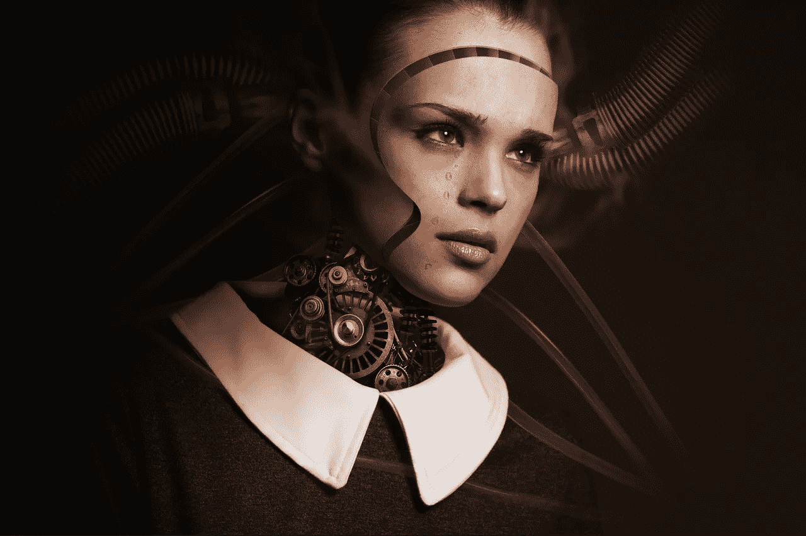

# 数字图灵测试

> 原文：<https://towardsdatascience.com/digital-turing-test-94532434292b?source=collection_archive---------27----------------------->

## 人工智能是如何变得与人类无法区分的

在人类历史的这个阶段，几乎每个人都听说过图灵测试——与一个我们会误认为是人类的机器人进行对话。

虽然我一直在通过机器学习自动化不同的数字任务——从分类电子邮件到获取数据——但我突然发现这不再相关了。以客户服务聊天为例，每个人都会时不时地进行聊天。你能确定你在和一个机器人还是一个人说话吗？或者你是否在和远方的人交换电子邮件——对方是一个真实的人吗？我再也不知道了。

我对你能生成或自动化的东西了解得越多，我就越不相信我在互联网上看到的东西。如果你知道 GANs、GPT-2 或 GROVE，你就不能像以前那样消化网络内容。50%看起来是合成的(最终也没那么糟糕)。

这就是为什么我提出了一个数字图灵测试(简称 DTT)，一个更广泛的概念，将包括上述情况。

我们会说，一个给定的工具集——有前端可以与之交互的 AI/ML 算法——通过了 DTT，如果与它交互的大多数人认为它是另一边的一个真人，或者不能肯定地说它不是。通过售后服务调查进行基准测试相对容易，虽然> 95%肯定表明它与人一样好，但它与我们正在自动化的手头任务密切相关。因此，有时甚至超过 50%可能是一个很好的指标，表明我们的算法做得很好。

何必呢？因为我们想测量我们接近 AGI 的速度——一种人工通用智能——它能够在所有数字任务中 95%以上与人类无法区分。最终，AGI 的 MVP 将是一堆连接起来的超高效工具集，完美地通过 DTT。

到那时，我们的经济和世界将会彻底改变。