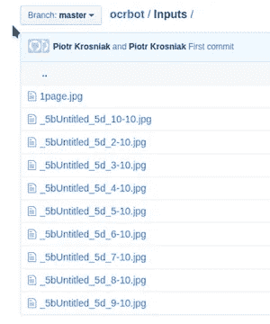
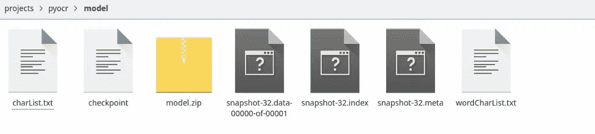
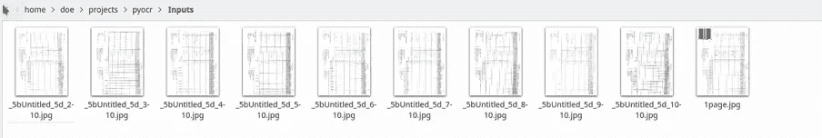
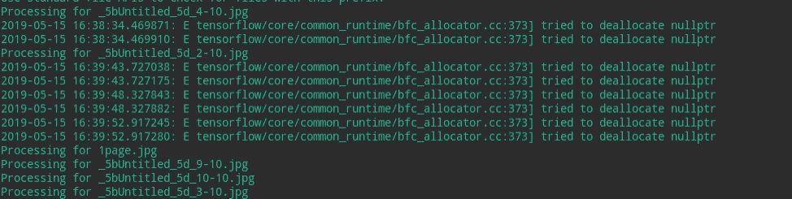

# 用 AI 和 ML 数字化尼日利亚手写疫苗接种记录

> 原文：<https://towardsdatascience.com/digitizing-handwritten-vaccination-records-in-nigeria-with-artificial-intelligence-and-machine-cff7721b177a?source=collection_archive---------26----------------------->

**简介**

作为小儿麻痹症数据科学家，我在联合国儿童基金会尼日利亚办事处工作时，遇到了由 20，000 名小儿麻痹症志愿者分发的疫苗接种卡存在错误的问题，甚至需要检查更大数量的疫苗接种卡。简单的数字化和给每个人一个平板电脑不是一个选项。经过研究，我决定使用 AI/ML 和计算机视觉从卡片上“读取”信息，然后提供关于最常见错误的反馈机制，并预测正确的信息。

在本教程中，您将看到如何实现这一点，以及未来优化的结果和建议。我将主要使用 python 库 TensorFlow 和 OpenCV 以及一些支持库。

**安装**

使用 TensorFlow 的安装因您要使用的操作系统和硬件而异。参考本文的一般说明 [**此处**](https://www.tensorflow.org/install/pip)

对于本教程，我将使用以下软件包:

> OS:Linux _ X64(Arch Linux)
> Python 包管理器:Anaconda 或 Miniconda(安装说明 [**此处**](https://docs.anaconda.com/anaconda/install/))
> CUDA 10 . 1 . 105
> cud nn 7 . 5 . 0
> Python tensor flow Api V1
> Opencv-Python

使用 miniconda(或 anaconda)，按照以下步骤安装所需的 python 库

创造康达环境

```
conda create -n pyocr
conda activate pyocr
```

安装所需的软件包

```
conda install tensorflow
conda install opencv
conda install -c lightsource2-tag pyzbar
pip install editdistance
```

为将来的复制保留库版本

```
conda env export > <environment-name>.yml
```

在另一台机器上重新创建环境

要在另一台计算机上重新创建环境，请在另一台计算机上创建并激活环境后使用此方法

```
conda env create -f <environment-name>.yml
```

**使用张量流识别文本**

首先要理解的是，该模型的准确性取决于您将用于训练的样本。需要更多的样本来获得更高的精度。这也意味着如果你需要识别多人写的文本，你必须包含足够多的他们写的文本样本

整个教程代码都上传到 GitHub 存储库中。如果您需要最终代码，可以使用 git clone 来克隆这个存储库

```
git clone git@github.com:PiotrKrosniak/ocrbot.git pyocr
```

**输入**

查看上面文件夹中的输入文件夹。将您想要运行脚本的图像保存在这里(以便更好地组织)



*Fig 1: Github folder structure for input folder*

**获取训练数据**

1.  获取 IAM 数据集
2.  报名地点:[**http://www . fki . INF . unibe . ch/databases/iam-手写-数据库**](http://www.fki.inf.unibe.ch/databases/iam-handwriting-database)
3.  下载 ascii/words.txt。
4.  将 words.txt 放入数据/目录中。
5.  下载 words/words.tgz.
    。创建目录 data/words/。

a.将 words.tgz 的内容(目录 a01、a02、…)放入 data/words/
i.
对于 linux 终端—在文件夹 data 中，运行 linux 命令 tar xvf words.tgz -C words)

1.  运行 checkDirs.py 对文件进行粗略检查

检查目录结构是否如下所示:

```
data
— test.png
— words.txt
— words
— — a01
— — — a01–000u
— — — — a01–000u-00–00.png
— — — — …
— — — …
— — a02
— — …
```

训练模型

首先提取模型。将 model.zip fil 解压到同一个文件夹( <root>/model)中，然后在 src 目录下运行训练。此处的脚本将基于之前训练的模型，并根据您的数据提高其准确性</root>

```
python main.py — train
```

这可能需要很长时间来运行培训，如果没有 GPU，可能需要 16 到 18 个小时。该脚本运行称为 epochs 的训练批次，直到连续批次之间的文本识别准确性没有明显提高。完成后，您将看到在模型文件夹下生成的文件。



*Fig 2: The Model folder with the TensorFlow trained models*

快照和检查点将如上生成

**运行 OCR 脚本**

既然模型是在 code 文件夹中生成的，让我们运行代码从我们的图像中获取文本。确保您的输入文件在输入文件夹中



*Fig 3: Input folder with your images*

运行 src 文件夹中的代码(在终端内部)

```
Python Demo.py
```

代码将在输入图像上运行。您将在终端中看到如下输出



*Fig 4: Sample Terminal output on running inference*

代码运行完成后，输出将出现在输出文件夹中:


*Fig 5: Output folder after running OCR script*

文件夹将包含表格单元格，每个单元格作为一个单独的图像。在下一节中，我们将使用这些生成的图像来进一步提高我们的准确性

但是，基于您当前的模型，识别的文本将以与输入图像相同的名称保存在 CSV 文件中。这些 CSV 文件可以在 Microsoft Excel 或 google sheets 等电子表格软件中打开

**提高精度**

图像中的单个表格单元格作为单独的图像存储在输出文件夹中。这些图像可以帮助模型识别您自己数据集的手写->文本映射。通常，如果您有许多不常用的英文单词，如姓名，或者图像中的手写风格与训练模型的 IAM 默认数据集有很大不同，则这是必要的

要使用这些表格单元格图像来训练数据集，请按照以下步骤操作:

1.  预处理图像，使其符合 IAM 数据集。这对于脚本正确训练你的图像是绝对必要的。在更高的级别上，执行以下步骤:

a.加粗文本中模糊的线条

b.用分词去掉单词周围多余的空格(参考 [**这段**](https://github.com/githubharald/WordSegmentation) 代码)

c.通过阈值技术提高对比度

1.  以 Dataloader.py 模块使用的格式重命名并复制数据文件夹中的图像:

例如，文件 c01–009–00–00.png 应该保存在以下文件夹层次结构中

```
| Words
| — a01
| — — c01–009
| — — — c01–009–00–00.png
```

但是，您可以通过编辑 DataLoader.py 模块来更改这些文件夹层次结构/文件命名约定

3.编辑数据模块中的 words.txt 文件以包含这些图像

以下代码执行操作 1a 和 b

```
import numpy as np
import cv2# read
img = cv2.imread(‘in.png’, cv2.IMREAD_GRAYSCALE)# increase contrast
pxmin = np.min(img)
pxmax = np.max(img)
imgContrast = (img — pxmin) / (pxmax — pxmin) * 255# increase line width
kernel = np.ones((3, 3), np.uint8)
imgMorph = cv2.erode(imgContrast, kernel, iterations = 1)# write
cv2.imwrite(‘out.png’, imgMorph)
```

要编写 words.txt 文件，请遵循以下适用于您的图像的格式:

样本线:a01–000 u-00–00 ok 154 1 408 768 27 51 AT A

*   a01–000 u-00–00->表格 a01–000 u 中第 00 行的 word id。这也是您正在映射的图像的文件名
*   确定->分词结果
*   好:单词是正确的
*   呃:词的切分可能不好
*   154 -> graylevel 对包含这个单词的行进行二值化。这是对比度拉伸/阈值处理步骤。
*   1 ->该词的成分数
*   4087682751-->以 x，y，w，h 格式围绕该单词的边框
*   在->这个词的语法标签，见

文件 tagset.txt 获得解释

*   描述图像文本内容的这个词的转录

以上将为您的图像定制模型。为了提高模型本身的精度，请参考本页 中 [**的提高精度部分**](https://github.com/githubharald/SimpleHTR)

方法的解释

该代码执行三个主要步骤:

1.  匹配模板并旋转图像
2.  识别表格中的行并进行裁剪
3.  使用 python-tensorflow 识别文本

该识别算法基于简化版本的 HTR 文本识别系统。如果对机理感兴趣，可以参考这篇 [**论文**](https://repositum.tuwien.ac.at/obvutwhs/download/pdf/2874742)

它由 5 个 CNN 层、2 个 RNN (LSTM)层和 CTC 丢失和解码层组成

*   输入图像是灰度值图像，大小为 128×32
*   5 个 CNN 层将输入图像映射到大小为 32×256 的特征序列
*   具有 256 个单元的 2 个 LSTM 层通过该序列传播信息，并将该序列映射到大小为 32×80 的矩阵。每个矩阵元素代表 80 个字符中的一个在 32 个时间步长中的一个的分数
*   CTC 层或者在给定矩阵和基本事实文本的情况下计算损失值(训练时)，或者利用最佳路径解码或波束搜索解码将矩阵解码为最终文本(推断时)
*   批量大小设置为 50

图 5:使用张量流的 OCR 步骤中涉及的机制

**结论**

遵循本教程，您现在有了一种自动数字化表格格式的手写文本的方法。一旦你训练模型识别你的笔迹并根据你的需求进行定制，就可以节省无数的时间。但是，要小心，因为识别不是 100%准确的。因此，在您准备好共享最终的电子表格之前，可能需要在电子表格生成之后进行一轮高级别的校对

参考:

1.  代码参考:[https://github.com/PiotrKrosniak/ocrbot](https://github.com/PiotrKrosniak/ocrbot)
2.  使用 google TensorFlow 进行手写识别:[https://towards data science . com/build-a-handled-text-recognition-system-using-tensor flow-2326 a 3487 cd5](/build-a-handwritten-text-recognition-system-using-tensorflow-2326a3487cd5)
3.  处理边缘案件:[https://towards data science . com/FAQ-build-a-handled-text-recognition-system-using-tensor flow-27648 FB 18519](/faq-build-a-handwritten-text-recognition-system-using-tensorflow-27648fb18519)
4.  数据集开始:[http://www . fki . INF . unibe . ch/databases/iam-手写-数据库](http://www.fki.inf.unibe.ch/databases/iam-handwriting-database)
5.  [https://github.com/githubharald/SimpleHTR](https://github.com/githubharald/SimpleHTR)