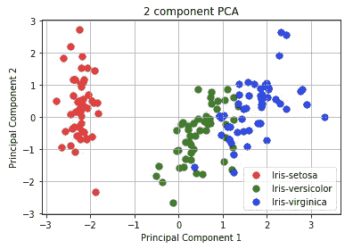

# Python 的降维技术

> 原文：<https://towardsdatascience.com/dimension-reduction-techniques-with-python-f36ca7009e5c?source=collection_archive---------0----------------------->

## 实践用户实用指南


(2021 年 10 月 12 日修订)

为什么我们需要降维？

高维数据集是具有大量列(或变量)的数据集。这样的数据集提出了许多数学或计算挑战**。**好消息是变量(或称为特征)通常是相关的——高维数据“表面上”由少量简单变量支配。我们可以找到变量的子集来表示数据中相同级别的信息，或者将变量转换为一组新的变量，而不会丢失太多信息。虽然高性能计算可以处理高维数据，但在许多应用中仍然需要降低原始数据的维数。

当我们想到降维时，主成分分析(PCA)可能是最流行的技术。在本文中，我将从 PCA 开始，然后介绍其他降维技术。Python 代码将包含在每项技术中。

**降维也能发现离群值**

数据科学家可以使用降维技术来识别异常。为什么？我们不就是想降维吗？直觉在于离群值本身。D.M .霍金斯说:“异常值是一个与其他观测值相差如此之大的观测值，以至于让人怀疑它是由不同的机制产生的。”一旦维度被减少到更少的主维度，模式被识别并且**然后离群值被揭示**。我们可以说离群点检测是降维的副产品，如文章“[使用自动编码器的异常检测变得简单](/anomaly-detection-with-autoencoder-b4cdce4866a6)”中所述。

我写过关于各种数据科学主题的文章。为了方便使用，你可以将我的总结文章“[数据人学习之路——培养你的技能，推动你的职业发展](https://medium.com/@Dataman.ai/dataman-learning-paths-build-your-skills-drive-your-career-e1aee030ff6e)”加入书签，其中列出了所有文章的链接。

值得一提的是，现实生活中很多分类问题都是多类的。如果你曾经面临对多类问题建模的需求，请参见我的帖子“[多类分类的各种模型](https://medium.com/dataman-in-ai/a-wide-choice-for-modeling-multi-class-classifications-d97073ff4ec8)”。

**主成分分析**

主成分分析(PCA)的思想是降低由大量相关变量组成的数据集的维度，同时尽可能多地保留数据中的方差。PCA 找到一组新变量，原来的变量只是它们的线性组合。新的变量被称为*主成分(PCs)* 。这些主成分是*正交的*:在三维情况下，主成分彼此垂直。x 不能用 Y 表示或者 Y 不能用 z 表示。

图(A)显示了 PCA 的直觉:它“旋转”轴以更好地与您的数据对齐。第一个主成分将捕获数据中的大部分差异，然后是第二个、第三个，依此类推。因此，新数据的维度会更少。


Figure (A): PCA

让我们使用 iris 数据集来说明 PCA:

```
# Use the iris dataset to illustrate PCA:
import pandas as pd
url = “[https://archive.ics.uci.edu/ml/machine-learning-databases/iris/iris.data](https://archive.ics.uci.edu/ml/machine-learning-databases/iris/iris.data)"
# load dataset into Pandas DataFrame
df = pd.read_csv(url, names=[‘sepal length’,’sepal width’,’petal length’,’petal width’,’target’])
df.head()
```


IRIS dataset


注意这个 IRIS 数据集带有目标变量。在 PCA 中，只转换 X 变量，而不转换目标 Y 变量。

**标准化:**在应用 PCA 之前，所有变量应该在相同的尺度上，否则，具有大值的特征将支配结果。这一点在我的文章“避免这些致命的建模错误，这些错误可能会让你失去职业生涯”中有进一步的解释。下面我使用 scikit 中的 **StandardScaler** 来学习将数据集的特征标准化到单位尺度上(均值= 0，方差= 1)。

```
from sklearn.preprocessing import StandardScaler
variables = [‘sepal length’, ‘sepal width’, ‘petal length’, ‘petal width’]
x = df.loc[:, variables].values
y = df.loc[:,[‘target’]].values
x = StandardScaler().fit_transform(x)
x = pd.DataFrame(x)
```


Standardized features

原始数据中有四个特征。因此 PCA 将提供相同数量的主成分。

```
from sklearn.decomposition import PCA
pca = PCA()
x_pca = pca.fit_transform(x)
x_pca = pd.DataFrame(x_pca)
x_pca.head()
```


The Principal Components for the IRIS Dataset

每个主成分解释的差异是什么？使用`pca.explained_variance_ratio_`返回方差的向量:

```
explained_variance = pca.explained_variance_ratio_
explained_variancearray([0.72770452, 0.23030523, 0.03683832, 0.00515193])
```

结果表明，第一主成分解释了 72.22%的方差，第二、第三和第四主成分分别解释了 23.9%、3.68%和 0.51%的方差。我们可以说 72.22 + 23.9 = 96.21%的信息被第一和第二主成分捕获。我们通常希望只保留重要的特性，而放弃不重要的特性。一个经验法则是保留捕捉显著差异的顶部主成分，忽略小的主成分。

我们可以使用前两个组件来绘制结果。让我们将目标变量 y 附加到新数据 x_pca 上:

```
x_pca[‘target’]=y
x_pca.columns = [‘PC1’,’PC2',’PC3',’PC4',’target’]
x_pca.head()
```


结果显示数据在新的空间中是可分的。

```
import matplotlib.pyplot as plt
fig = plt.figure()
ax = fig.add_subplot(1,1,1) 
ax.set_xlabel(‘Principal Component 1’) 
ax.set_ylabel(‘Principal Component 2’) 
ax.set_title(‘2 component PCA’) 
targets = [‘Iris-setosa’, ‘Iris-versicolor’, ‘Iris-virginica’]
colors = [‘r’, ‘g’, ‘b’]
for target, color in zip(targets,colors):
 indicesToKeep = x_pca[‘target’] == target
 ax.scatter(x_pca.loc[indicesToKeep, ‘PC1’]
 , x_pca.loc[indicesToKeep, ‘PC2’]
 , c = color
 , s = 50)
ax.legend(targets)
ax.grid()
```



我们如何使用 PCA 来检测异常值？让我给你一个直觉。变换后，“正常”数据点将沿着具有小特征值的特征向量(新轴)对齐。离群点远离特征值大的特征向量。因此，每个数据点到特征向量之间的距离成为离群值的度量。大距离表示异常。有关更多信息，请参见“使用 PyOD 的[异常检测](/anomaly-detection-with-pyod-b523fc47db9)”。

[](https://dataman-ai.medium.com/membership) [## 通过我的推荐链接加入 Medium-Chris Kuo/data man 博士

### 阅读 Chris Kuo/data man 博士的每一个故事。你的会员费直接支持郭怡广/戴塔曼博士和其他…

dataman-ai.medium.com](https://dataman-ai.medium.com/membership) 

**内核 PCA (KPCA)**

PCA 应用线性变换，这正是它的局限性。*内核 PCA* 将 PCA 扩展到非线性。它首先将原始数据映射到某个非线性特征空间(通常是一个更高的维度)，然后应用 PCA 提取该空间中的主成分。这可以从图(B)中理解。左侧的图表显示，使用任何线性变换都无法分离蓝点和红点。但是如果所有的点都投影到一个 3D 空间，结果就变成线性可分了！然后我们应用主成分分析来分离这些成分。

直觉从何而来？为什么在更高维度的空间中，组分分离变得更容易？这还得回到 Vapnik-Chervonenkis (VC)理论。它说，映射到更高维度的空间通常会提供更大的分类能力。


Figure (B)

以下 Python 代码制作了一个由红色和蓝色圆点组成的圆形图。没有办法用一条线把红点和蓝点分开(线性分离)。

```
print(__doc__)
import numpy as np
import matplotlib.pyplot as plt
from sklearn.decomposition import PCA, KernelPCA
from sklearn.datasets import make_circlesnp.random.seed(0)
X, y = make_circles(n_samples=400, factor=.3, noise=.05)plt.figure(figsize=(10,10))
plt.subplot(2, 2, 1, aspect='equal')
plt.title("Original space")
reds = y == 0
blues = y == 1plt.scatter(X[reds, 0], X[reds, 1], c="red",s=20, edgecolor='k')
plt.scatter(X[blues, 0], X[blues, 1], c="blue",s=20, edgecolor='k')
plt.xlabel("$x_1$")
plt.ylabel("$x_2$")
```


然而，当我们将圆投影到一个更高维的空间并使用 PCA 分离时，针对第一和第二主成分的数据观察是可分离的！下面是点相对于第一和第二主成分绘制的结果。我画了一条线来区分红色和蓝色的点。在 KernelPCA 中，我们指定 kernel='rbf '，这是[径向基函数](https://en.wikipedia.org/wiki/Radial_basis_function)，或者欧几里德距离。RBF 通常用作机器学习技术的核心，例如[支持向量机(SVM)](https://en.wikipedia.org/wiki/Support-vector_machine) 。

```
kpca = KernelPCA(kernel=”rbf”, fit_inverse_transform=True, gamma=10)
X_kpca = kpca.fit_transform(X)
pca = PCA()
X_pca = pca.fit_transform(X)plt.scatter(X_kpca[reds, 0], X_kpca[reds, 1], c=”red”,s=20, edgecolor=’k’)
plt.scatter(X_kpca[blues, 0], X_kpca[blues, 1], c=”blue”,s=20, edgecolor=’k’)
x = np.linspace(-1, 1, 1000)
plt.plot(x, -0.1*x, linestyle=’solid’)
plt.title(“Projection by KPCA”)
plt.xlabel(r”1st principal component in space induced by $\phi$”)
plt.ylabel(“2nd component”)
```


如果我们把核指定为“线性的”，如下面的代码(KernelPCA(kernel='linear ')，就变成了只有线性变换的标准 PCA，红蓝点不可分。

```
kpca = KernelPCA(kernel=”linear”, fit_inverse_transform=True, gamma=10)
X_kpca = kpca.fit_transform(X)
pca = PCA()
X_pca = pca.fit_transform(X)plt.scatter(X_kpca[reds, 0], X_kpca[reds, 1], c=”red”,s=20, edgecolor=’k’)
plt.scatter(X_kpca[blues, 0], X_kpca[blues, 1], c=”blue”,s=20, edgecolor=’k’)
x = np.linspace(-1, 1, 1000)
plt.plot(x, -0.1*x, linestyle=’solid’)
plt.title(“Projection by KPCA”)
plt.xlabel(r”1st principal component in space induced by $\phi$”)
plt.ylabel(“2nd component”)
```


**线性判别分析**

LDA 的起源不同于 PCA。PCA 是一种无监督的学习方法，它将原始特征转换成一组新的特征。我们不关心新的特征集是否能为目标变量提供最好的区分能力。相比之下，线性判别分析(LDA)寻求尽可能多地保留因变量的判别能力，同时将原始数据矩阵投影到低维空间。LDA 是一种监督学习技术。它利用因变量中的类别将预测器空间划分为*个区域*。所有的*区域*都应该有*线性*边界。线性的名称由此而来。该模型预测一个区域内的所有观测值都属于同一类因变量。

LDA 通过三个主要步骤实现了上述目标。首先，它计算因变量的不同类之间的可分性，称为*类间方差*，如图 LDA 的(1)所示。其次，计算每一类的均值与样本之间的距离，称为*类内方差，*如(2)所示。然后以最大化类间方差和最小化类内方差为准则构造低维空间。这个标准的解决方案是计算特征值和特征向量。得到的特征向量代表新空间的方向，相应的特征值代表特征向量的长度。因此，每个特征向量代表 LDA 空间的一个轴，特征值代表该特征向量的长度。


Figure: LDA

直觉是这样的:如果两个阶级能真正分开，那么两个阶级尽可能远，同时每个阶级尽可能同质，这将是理想的。这种直觉可以用三个步骤来表达:

*   第一步:找到不同阶层之间的分野。这也被称为类间方差。是不同阶级手段之间的距离。见上图(1)。
*   第二步:求类内方差。这是每个类的平均值和样本之间的距离。见上图(2)。
*   第三步:在低维空间中最大化第一步(类间方差)，最小化第二步(类内方差)。这也被称为费雪准则。

我将在 Kaggle 比赛中使用“[红酒质量](https://www.kaggle.com/piyushgoyal443/red-wine-dataset#wineQualityInfo.txt)”数据集。该数据集有 11 个输入变量和一个输出变量“质量”。

```
import matplotlib.pyplot as plt
from sklearn.decomposition import PCA
from sklearn.discriminant_analysis import LinearDiscriminantAnalysis
wine = pd.read_csv(‘winequality-red.csv’)
wine.head()
```


为了简单起见，我将输出变量重新分组为三个值。`wine[‘quality2’] = np.where(wine[‘quality’]<=4,1, np.where(wine[‘quality’]<=6,2,3)).`


下面的代码执行 PCA 和 LDA。

```
X = wine.drop(columns=[‘quality’,’quality2'])
y = wine[‘quality2’]
target_names = np.unique(y)
target_namespca = PCA(n_components=2)
X_r = pca.fit(X).transform(X)lda = LinearDiscriminantAnalysis(n_components=2)
X_r2 = lda.fit(X, y).transform(X)
```

然后绘制 PCA 和 LDA 的结果:

```
# Percentage of variance explained for each components
print(‘explained variance ratio (first two components): %s’
 % str(pca.explained_variance_ratio_))plt.figure()
colors = [‘navy’, ‘turquoise’, ‘darkorange’]
lw = 2for color, i, target_name in zip(colors, target_names, target_names):
 plt.scatter(X_r[y == i, 0], X_r[y == i, 1], color=color, alpha=.8, lw=lw,
 label=target_name)
plt.legend(loc=’best’, shadow=False, scatterpoints=1)
plt.title(‘PCA of WINE dataset’)plt.figure()
for color, i, target_name in zip(colors, target_names, target_names):
 plt.scatter(X_r2[y == i, 0], X_r2[y == i, 1], alpha=.8, color=color,
 label=target_name)
plt.legend(loc=’best’, shadow=False, scatterpoints=1)
plt.title(‘LDA of WINE dataset’)plt.show()
```


LDA 适用于多类分类问题。如果你甚至需要对一个多类问题建模，请看我的文章“[多类分类的多种模型](https://medium.com/dataman-in-ai/a-wide-choice-for-modeling-multi-class-classifications-d97073ff4ec8)”。

**奇异值分解**

SVD 是一种类似于 PCA 的数据汇总方法。它从数据中提取重要特征。但是 SVD 还有一个优点:将原始数据集重构为一个小数据集。奇异值分解在图像压缩中有着广泛的应用。例如，如果您有一个 32*32 = 1，024 像素的图像，SVD 可以将其总结为 66 像素。66 个像素可以代表 32*32 像素的图像，而不会丢失任何重要信息。奇异值分解是线性代数的基础，但它似乎“并不像它应该的那样有名”。这个伟大的评论是在经典教科书“线性代数及其应用”由吉尔伯特斯特朗。

为了正确地介绍奇异值分解，让我们从矩阵运算开始。如果 A 是对称实矩阵 *n × n* ，则存在正交矩阵 *V* 和对角矩阵 *D* 使得


列 *V* 是 A 的特征向量， *D* 的对角元素是 A 的特征值，这个过程被称为矩阵 *A* 的*特征值分解*或 *EVD* 。它告诉我们如何选择*标准正交*基，使变换用一个尽可能简单的矩阵表示，即对角矩阵。(对于想浏览对角化矩阵步骤的读者来说，[这里的](https://yutsumura.com/how-to-diagonalize-a-matrix-step-by-step-explanation/)是一个很好的例子。)术语**正交的**意味着两个向量是垂直的。

扩展对称矩阵，SVD 可以处理任何实矩阵*m×n*A*。给定一个实 m *× n* 矩阵 *A* ，存在一个正交 *m × m* 矩阵 *U，*一个正交矩阵 *m × m V，*和一个对角 *m × n* 矩阵*σ*使得*


注意，正交矩阵是方阵，使得其自身与其逆矩阵的乘积是单位矩阵。对角矩阵是指对角线以外的元素都为零的矩阵。

下面我将再次使用 iris 数据集向您展示如何应用奇异值分解。

```
from numpy import *
import operator
import matplotlib.pyplot as plt
import pandas as pd
from numpy.linalg import *url = “[https://archive.ics.uci.edu/ml/machine-learning-databases/iris/iris.data](https://archive.ics.uci.edu/ml/machine-learning-databases/iris/iris.data)"
# load dataset into Pandas DataFrame
df = pd.read_csv(url, names=[‘sepal length’,’sepal width’,’petal length’,’petal width’,’target’])# Only the X variables
data = df[[‘sepal length’,’sepal width’,’petal length’,’petal width’]]#calculate SVD
n = 2 # We will take two Singular Values
U, s, V = linalg.svd( data )# eye() creates a matrix with ones on the diagonal and zeros elsewhere
Sig = mat(eye(n)*s[:n])
newdata = U[:,:n]
newdata = pd.DataFrame(newdata)
newdata.columns=[‘SVD1’,’SVD2']
newdata.head()
```


你可以比较奇异值分解和主成分分析的结果。两者的结果相似。

```
# Add the actual target to the data in order to plot it
newdata[‘target’]=df[‘target’]fig = plt.figure()
ax = fig.add_subplot(1,1,1) 
ax.set_xlabel(‘SVD 1’) 
ax.set_ylabel(‘SVD 2’) 
ax.set_title(‘SVD’) 
targets = [‘Iris-setosa’, ‘Iris-versicolor’, ‘Iris-virginica’]
colors = [‘r’, ‘g’, ‘b’]
for target, color in zip(targets,colors):
 indicesToKeep = newdata[‘target’] == target
 ax.scatter(newdata.loc[indicesToKeep, ‘SVD1’]
 , newdata.loc[indicesToKeep, ‘SVD2’]
 , c = color
 , s = 50)
ax.legend(targets)
ax.grid()
```


Figure: SVD

***t*-分布式随机邻居嵌入(t-SNE)**

*t*——SNE 由[劳伦斯·范·德·马滕和乔治·辛顿](http://www.cs.toronto.edu/~hinton/absps/tsne.pdf)开发。它是一种可视化的机器学习算法，将高维数据嵌入到二维或三维的低维空间中。


把上面的三维瑞士卷呈现为二维的最好方法是什么？直觉上，我们想把瑞士面包卷“展开”成一块扁平的蛋糕。在数学中，这意味着相似的点将成为附近的点，不同的点将成为遥远的点。

图(C)显示了另一个例子。它是一个三维四面体，数据点聚集在顶点角上。如果我们只是像面板(A)那样将 3 维图形折叠成 2 维图形，效果并不好，因为组(A)变成了中心聚类。相比之下，画面(B)可能是更好的 2d 展示，其保留了聚类(A)-(E)之间的远距离，同时保持了每个聚类中的点的局部距离。SNE，一种非线性降维技术，旨在保持局部邻域。如果 t-SNE 图上的一组点聚集在一起，我们可以相当确定这些点彼此靠近。


Figure (C): t-SNE

SNE 为点之间的相似性建模。它是如何定义相似性的？首先，它由点 *Xi* 和 *Xj* 之间的欧几里德距离定义。第二，它被定义为“数据点 *i* 到点 *j* 的相似度是条件概率 *p* 如果在高斯分布下根据其概率挑选其他邻居，则点 *i* 将挑选数据 *j* 作为其邻居。”在下面的条件表达式中，如果点 *j* 比其他点更靠近点 *i* ，那么它被选中的概率更大(注意负号)。


t-SNE 的目的是通过点 *Yi* 和点 *Yj，*之间的低维空间 *q* 尽可能匹配上述条件概率 *p* ，如下图所示。概率 *q* 遵循厚尾 Student-t 分布，因此 t-SNE 中的“ *t* ”由此而来。


下一步是找到 *Yi* ，使分布 *q* 尽可能接近分布 *p* 。t-SNE 使用梯度下降技术，一种优化技术，来找到这些值。

下面我演示了 t-SNE 技术是如何用于虹膜数据集的。

```
from sklearn.manifold import TSNE
from sklearn.datasets import load_iris
from sklearn.decomposition import PCA
import matplotlib.pyplot as plt
iris = load_iris()
X_tsne = TSNE(learning_rate=100).fit_transform(iris.data)
X_pca = PCA().fit_transform(iris.data)
plt.figure(figsize=(10, 5))
plt.subplot(121)
plt.scatter(X_tsne[:, 0], X_tsne[:, 1], c=iris.target)
plt.subplot(122)
plt.scatter(X_pca[:, 0], X_pca[:, 1], c=iris.target)
```


更多信息，这篇文章“[如何更有效地使用 t-SNE](https://distill.pub/2016/misread-tsne/)”提供了更多的讨论。

[](https://dataman-ai.medium.com/membership) [## 通过我的推荐链接加入 Medium-Chris Kuo/data man 博士

### 阅读 Chris Kuo/data man 博士的每一个故事。你的会员费直接支持郭怡广/戴塔曼博士和其他…

dataman-ai.medium.com](https://dataman-ai.medium.com/membership)