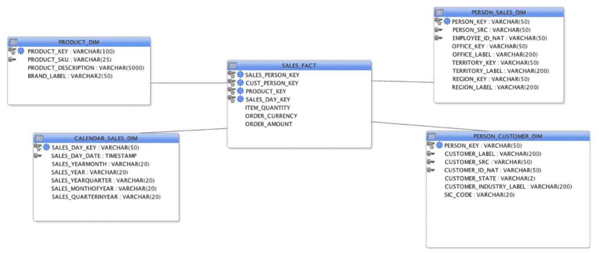
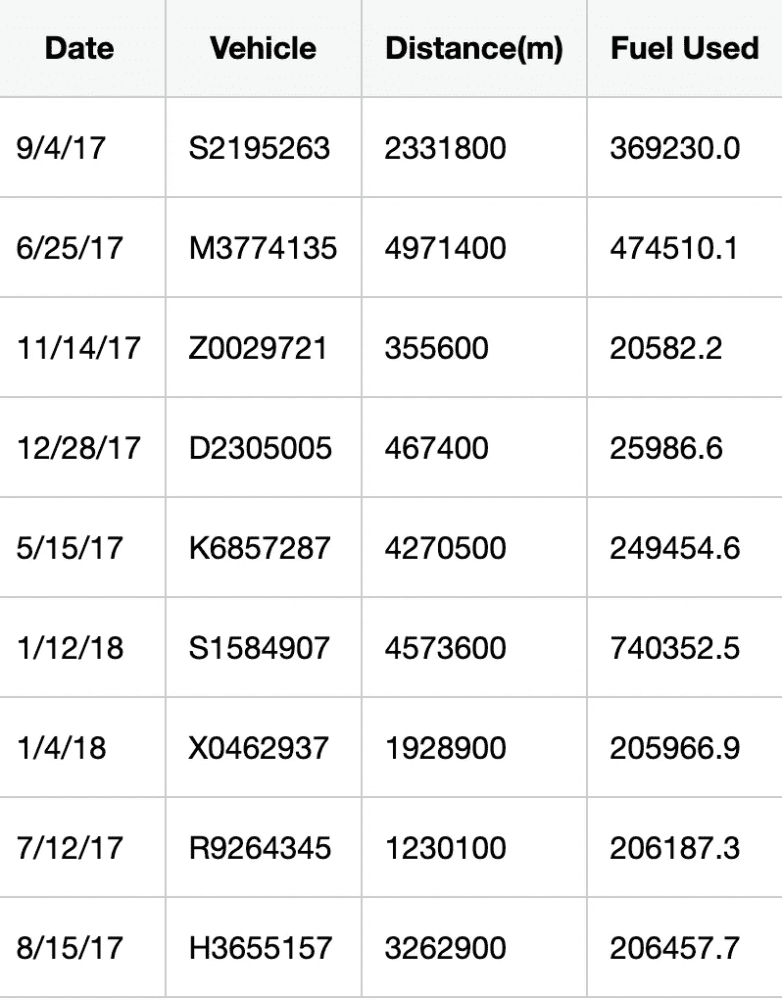
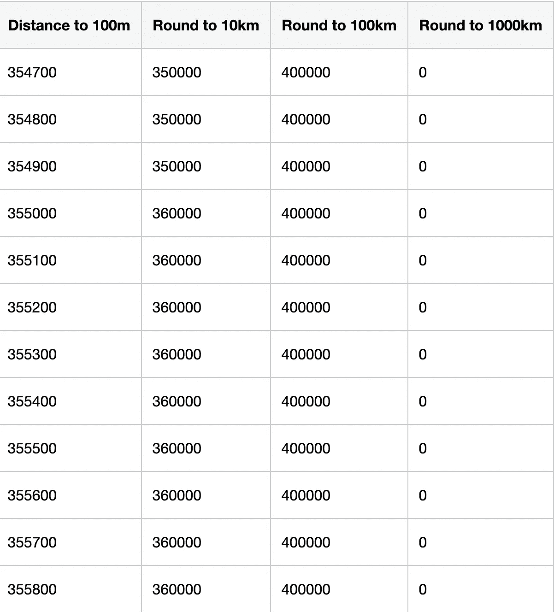
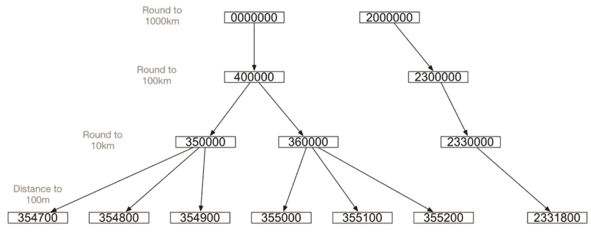
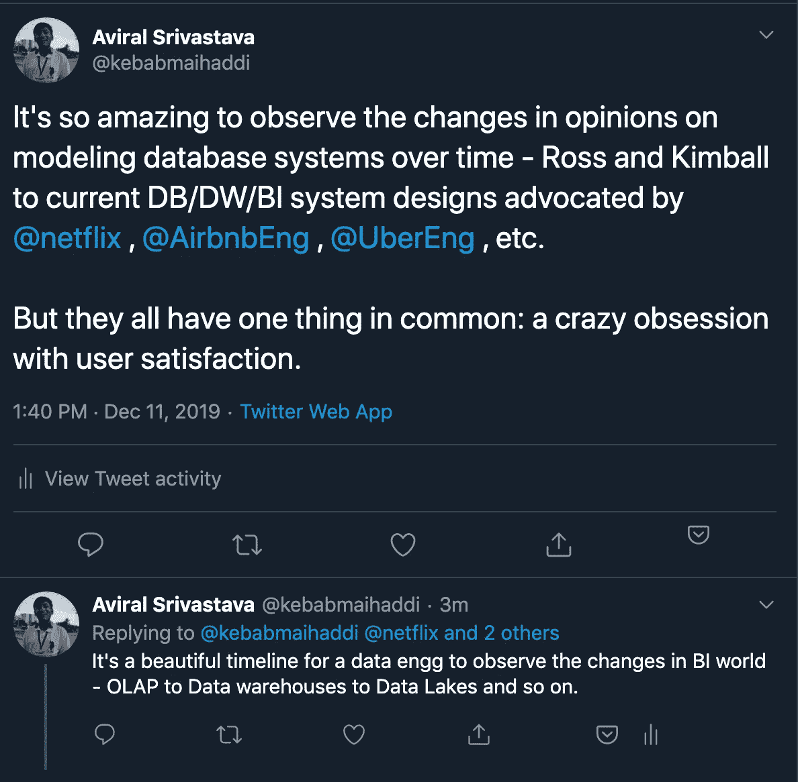

# 维度数据建模

> 原文：<https://towardsdatascience.com/dimensional-data-modeling-49038b96d95a?source=collection_archive---------4----------------------->

## 为什么需要维度数据建模，如何实现？

# 什么是维度数据建模？

> **维度建模** (DM)是由 [Ralph Kimball](https://en.wikipedia.org/wiki/Ralph_Kimball) 开发的*业务维度生命周期*方法的一部分，其中包括一套用于[数据仓库](https://en.wikipedia.org/wiki/Data_warehouse)设计的方法、技术和概念。该方法侧重于识别业务中的关键业务流程，并在添加其他业务流程之前首先建模和实现这些流程，这是一种自下而上的方法。[1]

# 数据仓库建模的目标是什么？

罗斯和金博尔提出的目标很简单:

*   让信息易于获取
*   一致地呈现信息
*   适应性强，易于接受变化
*   及时展示信息
*   保护信息资产
*   作为改进决策制定的权威和可信赖的基础(数据工程语言中的唯一真实来源)
*   贵宾必须接受你的系统

如果您从事或使用过 ETL 系统，您会注意到信息一致性是通过一致性度量来实现的，ETL 周期提供的及时性和适应性也很大程度上取决于 ETL 设计。

# 为什么要做模特？

作为一名数据工程师，您非常了解 SQL，可能会整天编写 SQL 查询。但是您不能假设典型的最终用户是编写 SQL 查询的专家。因此，我们的目标是构建一个数据仓库，以便分析师快速有效地编写分析查询。

## 您不希望您的分析师做的事情:

*   基于 ID 的查询
*   级联外部连接(即使您不想这样做)
*   分组或连接多个子查询
*   递归子查询(只需访问 Hackerrank SQL，您就会理解这种痛苦)
*   子查询关联:在不同的子查询中跨多个列提取数据
*   没有 PK/FK 的加入:即使对我来说(1.5 年的 DE 经验)，也很难想象。

## 您可以并且应该从您的分析师那里期待的事情:

*   简单连接
*   带有名称和综合文本的列
*   简单聚集
*   分析窗口函数
*   明显的

请注意，以上几点并不容易，您的系统应该具有足够的可伸缩性来处理所有这些类型的查询。

由于上述目标，OLTP 数据库被转换成事实和维度。

# 从事务数据库过渡到*事实*

大多数企业通过测量特定类型的数据来衡量他们的成功和效率。这些数据捕捉真实的业务活动和进展。这个数据被称为*事实*。

面向 OLTP 的数据库一次记录事务，有点像事件流，但以事务为中心。DW 是不同的。DW 不需要在事务级别记录细节。数据仓库需要你的业务的不同标准的事实。DW 需要聚集(或让分析师聚集)改进业务所需的信息。因此，冗余在 DW 中是不可饶恕的罪过。

# 什么是度量，为什么要在事实表中填入度量？

> 在数据仓库中，度量是可以进行计算的属性。[2]

我们从运营数据存储中获得的事实伴随着一些额外的数据，这些数据通常会在我们的分析中进行汇总。这些是一个事实的各个方面，允许分析师或查看分析的主管看到事实中的价值。

# 保持一致的颗粒

## 为什么需要保持一致的纹路？

以便您可以确保您的系统能够合理地关联和聚合事实。

但是并不总是有原子级别的数据。因此，要弥合这一差距，有两种方法:

*   定期快照事实表
*   累积快照事实表

## 定期快照事实表

顾名思义，它们是定期收集的。气体消耗、审计和检查是为其启用了定期快照的一些数据收集实例。

## 累积快照事实表

当业务绩效指标是完成多步骤业务流程的比率时，您可能希望捕获流程的整体的粒度，并记录开始、完成以及中间的步骤。这可能是事务粒度的，但是在这两者之间有很多度量。因此，您使用累积快照事实表来回答商业智能中的复杂问题，其中事实之间存在时间流逝。一个很好的例子是你点了一份鸡肉三明治的事实表行，以及在麦当劳的汽车窗口递过来的袋子的事实表行。

# 通过维度定位事实

您和您的分析师需要知道如何查询和过滤事实，以便从中获得商业智能。维度服务于这个目的。

# 从参考和原始元数据中绘制尺寸

维度几乎总是用代理键创建的；事实表中的外键(或*键*)自然会引用代理键。我们通过搜索我们感兴趣的维度来搜索该表。描述我们的事实的所有其他数据，如时间戳、客户代理、商店位置、产品和客户，都是我们转化为维度的内容。

维度建模的美妙之处在于，事实不是由主键或任何类型的唯一标识符定义的，而是由维度的组合定义的。这就产生了星型模式。

我们在维度上的独特性是非常重要的。当我们跨事实进行查询时，维度组合中的重复将变成一场灾难。如果不能，那么添加或聚合维度以使它们唯一。

# 维度中的层次

考虑下面两个图像。

[3]

[3]

如果你为他/她设置第二维表，分析师将会过得很轻松。

因此，对于第二个表，您有以下层次结构:

[3]

有各种各样的层次结构——多层次结构、单层次结构等。我不打算在这篇博文中解决这些问题。

我想指出的一点是，时间维度是一个真正的难题。你必须考虑神奇的日子、财政日历、时区、周期(季度利润类型)。不要对此感到糟糕或过于自信，如果你的 ETL 搞砸了，即使时间序列数据库也不会在层次结构中帮助你。你可能想看看舷外支架的尺寸。也有一个维度自然依赖于另一个维度的情况。在这种情况下，设计人员可能会将一个外键放在另一个外键中。这就是“外延维度”的构成。在日历维度中，这很常见。

> 您不能在 outrigger 中使用与您在事实表中使用的日期不同的日期。您不能允许外伸支架维度上的聚合。如果需要，用文本前缀或后缀来屏蔽支架中的数值。[4]

# 尺寸缓慢变化

尽管我很想写它，但我仍然认为我的读者最好从[这里](https://en.wikipedia.org/wiki/Slowly_changing_dimension)彻底理解这个概念。

我不是在讨论雪花维度，只是想指出，它们仍然在 OLAP 数据库中使用。

# 将大数据集成到 ETL 系统中

您将把表格形式的大数据视为通过标准提取阶段之一获得的。因此，您将对其应用与在 transform 中相同的步骤:

1.  数据清理
2.  符合单位和格式
3.  重复数据删除
4.  重组
5.  脚手架

# 摘要

我想了解数据库设计的理论方面，这促使我读了《Ross 和 Kimball》这本书。然后，我开始好奇，想找出他们的方法与当今领先的数据驱动型公司(如网飞、Airbnb、优步等)的方法之间的差异和相似之处。

在这个探索中，我可以公平地说，维度建模的结构化格式比硬核 ETL 更受欢迎。因为通过这种方式，您消除了对您的依赖，您的 BI 团队不会让您在空闲时为每个其他洞察创建新的 DAG，相反，通过正确的建模，您使他们能够在没有您的需要的情况下自由地行动和探索。

请留下我如何改进的反馈，我相信这不是你最好的阅读。谢谢你的时间。

# 脚注

[1][https://en.wikipedia.org/wiki/Dimensional_modeling](https://en.wikipedia.org/wiki/Dimensional_modeling)

[2][https://en . Wikipedia . org/wiki/Measure _(data _ warehouse)](https://en.wikipedia.org/wiki/Measure_(data_warehouse))

[3]罗斯和金博尔，第 2 章和第 18 章

[4]金博尔/罗斯，第 103-109 页