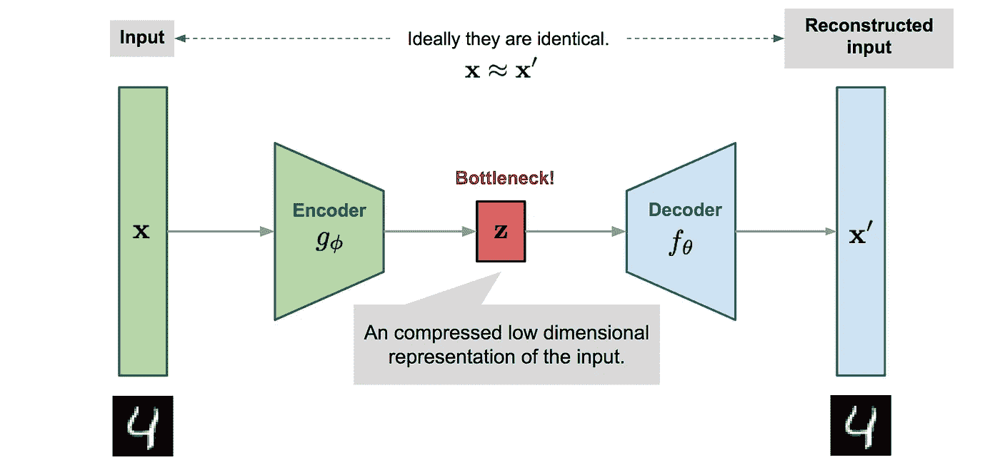

# 机器学习中的降维初学者指南

> 原文：<https://towardsdatascience.com/dimensionality-reduction-for-machine-learning-80a46c2ebb7e?source=collection_archive---------2----------------------->

这是我第一篇关于媒介的文章。在这里，我将快速概述什么是降维，为什么我们需要它，以及如何做到这一点。

## 什么是降维？

简而言之，降维就是降低特征集的维数的过程。您的特征集可以是一个包含 100 列(即特征)的数据集，也可以是一个由点组成的数组，这些点构成了三维空间中的一个大球体。降维是将列的数量减少到比如说 20 列，或者将二维空间中的球体转换为圆形。

这一切都很好，但我们为什么要在乎呢？当我们可以直接将 80 列输入到我们的机器学习算法并让它完成剩下的工作时，我们为什么要从我们的数据集中删除 80 列呢？

## 维度的诅咒

我们关心是因为维度的诅咒要求我们这样做。维数灾难指的是在高维度中处理数据时出现的所有问题，这些问题在低维度中并不存在。

随着特征数量的增加，样本数量也成比例增加。我们拥有的特征越多，我们需要的样本数量就越多，以便在我们的样本中很好地代表特征值的所有组合。


The Curse of Dimensionality

随着特征数量的增加，模型变得更加复杂。特征的数量越多，过度拟合的可能性就越大。根据大量特征训练的机器学习模型越来越依赖于它被训练的数据，进而过度拟合，导致在真实数据上的表现不佳，达不到目的。

避免过度拟合是执行降维的主要动机。我们的训练数据的特征越少，我们的模型做出的假设就越少，就越简单。但这还不是全部，降维还有很多优点，比如

1.  更少的误导性数据意味着模型准确性的提高。
2.  更少的维度意味着更少的计算。数据越少意味着算法训练越快。
3.  更少的数据意味着需要更少的存储空间。
4.  较小的维度允许使用不适合大量维度的算法
5.  移除多余的特征和噪声。

## 面向降维的特征选择和特征工程

降维可以通过特征选择方法和特征工程方法来完成。

特征选择是为您的样品识别和选择相关特征的过程。特征工程是通过对现有特征应用某种变换或执行某种操作，从现有特征手动生成新特征。

功能选择可以手动或编程完成。例如，假设您正在尝试构建一个预测人们体重的模型，并且您已经收集了大量数据，这些数据对每个人都进行了全面的描述。如果你有一个描述每个人衣服颜色的专栏，对预测他们的体重会有很大帮助吗？我想我们可以有把握地同意不会。这是我们可以不再费周折就放弃的事情。描述他们身高的专栏怎么样？那是肯定的。当某些特征的相关性或不相关性是显而易见的或公知常识时，我们可以进行这些简单的手动特征选择并降低维度。当不明显时，我们可以使用许多工具来帮助我们选择特征。

1.  显示要素之间相关性的热图是一个好主意。
2.  通过对照目标变量绘制每个特征来可视化特征和目标变量之间的关系也是如此。

现在让我们看看流行的机器学习库 sci-kit learn 中的一些用于特征选择的编程方法，即，

1.  方差阈值和
2.  单变量选择。

方差阈值是特征选择的基本方法。顾名思义，它会删除沿列变化不超过阈值的所有要素。前提是一个本身变化不大的特征几乎没有预测能力。

```
**>>>** X = [[0, 2, 0, 3], [0, 1, 4, 3], [0, 1, 1, 3]]
**>>>** selector = VarianceThreshold()
**>>>** selector.fit_transform(X)
array([[2, 0],
       [1, 4],
       [1, 1]])
```

单变量特征选择使用统计测试来选择特征。单变量描述了一种仅由单一特征或属性的观察值组成的数据类型。单变量特征选择单独检查每个特征，以确定该特征与响应变量的关系强度。可用于评估特征相关性的统计测试的一些例子是皮尔逊相关、最大信息系数、距离相关、方差分析和卡方检验。卡方用于发现分类变量之间的关系，当变量是连续的时，方差分析是优选的。

Scikit-learn 将 SelectKBest、SelectPercentile 或 GenericUnivariateSelect 等功能选择例程作为实现基于 anova、chi2 或交互信息的转换方法的对象。Sklearn 提供 f_regression 和 mutual_info_regression 作为回归的评分函数，提供 f_classif 和 mutual_info_classif 作为分类的评分函数。f 检验检查并仅捕获特征和标签之间的线性关系。高度相关的特征被给予较高的分数，而不太相关的特征被给予较低的分数。相关性具有很强的欺骗性，因为它不能捕捉强非线性关系。另一方面，互信息方法可以捕捉任何类型的统计相关性，但由于是非参数的，它们需要更多的样本来进行精确估计。

特征选择是最简单的降维方法。稍后，我们将研究一些用于降维的特征工程方法。

## **线性降维方法**

最常见和众所周知的降维方法是应用线性变换的方法，如

1.  PCA(主成分分析) :普遍用于连续数据的降维，PCA 是沿着方差递增的方向旋转和投影数据。方差最大的特征是主成分。
2.  因素分析:一种技术，用于将大量变量减少为较少数量的因素。观察数据的值被表示为许多可能原因的函数，以便找出最重要的原因。观察结果被认为是由低维潜在因素的线性变换和添加的高斯噪声引起的。
3.  LDA(线性判别分析):以最大化类别可分性的方式投影数据。来自同一类的例子通过投影紧密地放在一起。来自不同类别的例子被投影放置得相距很远


PCA orients data along the direction of the component with maximum variance whereas LDA projects the data to signify the class separability

## 非线性降维方法

当数据不位于线性子空间上时，使用非线性变换方法或流形学习方法。它基于流形假设，即在高维结构中，大多数相关信息集中在少数低维流形中。如果线性子空间是一张平的纸，那么卷起的纸就是非线性流形的一个简单例子。非正式地，这被称为瑞士卷，非线性降维领域中的一个典型问题。一些流行的流形学习方法是，

1.  多维标度(MDS):一种用于分析数据在几何空间中的相似性或不相似性的技术。将数据投影到较低的维度，使得在较高维度中彼此接近的数据点(根据欧几里德距离)在较低维度中也是接近的。
2.  等距要素映射(Isomap):将数据投影到较低的维度，同时保留测地线距离(而不是 MDS 中的欧几里德距离)。测地线距离是曲线上两点之间的最短距离。
3.  局部线性嵌入(LLE):从线性拟合中恢复全局非线性结构。在给定足够数据的情况下，流形的每个局部面片可以写成其邻居的线性加权和。
4.  Hessian 特征映射(HLLE):将数据投影到一个较低的维度，同时保留像 LLE 这样的局部邻域，但使用 Hessian 算子来更好地实现这一结果，因此得名。
5.  频谱嵌入(拉普拉斯特征映射):通过将附近的输入映射到附近的输出，使用频谱技术来执行维数减少。它保持局部性而不是局部线性
6.  t-分布式随机邻居嵌入(t-SNE):计算高维空间中数据点对相关的概率，然后选择产生相似分布的低维嵌入。


Shows the resulting projection from applying different manifold learning methods on a 3D S-Curve

## 自动编码器

另一种产生惊人结果的流行降维方法是自动编码器，一种旨在将输入复制到输出的人工神经网络。他们将输入压缩成一个**潜在空间表示**，然后从这个表示中重建输出。自动编码器由两部分组成:

1.  **编码器:**将输入压缩成潜在空间表示。
2.  **解码器:**从潜在空间表示中重建输入。



在随后的文章中，让我们更深入地研究线性和非线性降维方法。