# python 中的降维工具箱

> 原文：<https://towardsdatascience.com/dimensionality-reduction-toolbox-in-python-9a18995927cd?source=collection_archive---------8----------------------->

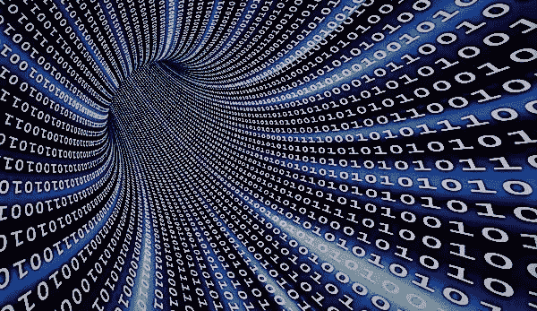

这篇文章来源于我和我的朋友 Hervé Trinh 的工作。

近年来，数据量爆炸式增长了 80%以上。这导致了许多机器学习模型的出现，因为用一个重要的数据集来训练这些模型更容易。

然而，数据的权重会对算法的执行时间产生显著影响，因为复杂度随着数据的大小而增加。同时，维度会使查看数据库中包含的信息变得复杂。

降维是使用特征选择或特征提取等策略减少特征集中特征总数的过程。

例如，包含汽车特征的底座很难查看，因为它们数量众多。人们可以想象将里程和车龄结合起来形成特征磨损，只要它们是相关的。

降维算法有很多种，主要有两类，线性方法和非线性方法。

我将分享的技术是关于 python 的。确保您的机器上安装了 python。

首先，我们导入必要的库。

让我们导入 mnist 数据进行处理。

从高维到低维的线性数据转换的一种非常流行的技术是主成分分析，也称为 PCA。在接下来的几节中，让我们试着了解更多关于 PCA 的知识，以及如何使用它进行特征提取。

## 主成分分析

主成分分析是一种统计方法，使用线性正交变换过程将可能相关的高维特征集转换为线性不相关的低维特征集。这些转换和新创建的特征也称为主要组件或 PCs。在任何 PCA 变换中，PC 的总数总是小于或等于特征的初始数量。第一主成分试图捕捉原始特征集的最大方差。

前面的代码将减小 mnist 数据库的大小，并以其原始维度重新构建它。我们现在可以绘制小尺寸的数据。

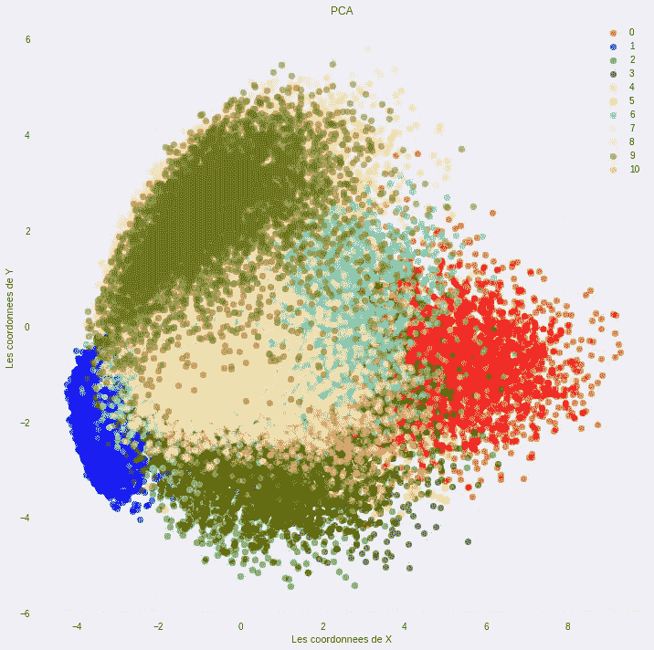

## 增量 PCA

增量主成分分析是 ACP 的一种变体，它只保留最重要的奇异向量，以将数据投影到一个空间中以
缩减大小。

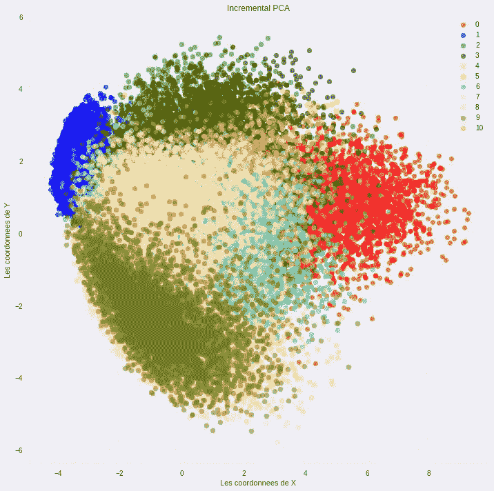

## 核主成分分析

KPCA 使执行复杂的非线性投影降维成为可能。

例如，下面的代码使用 Scikit-Learn 的 KernelPCA 类对一个 RBF 内核执行 kPCA。

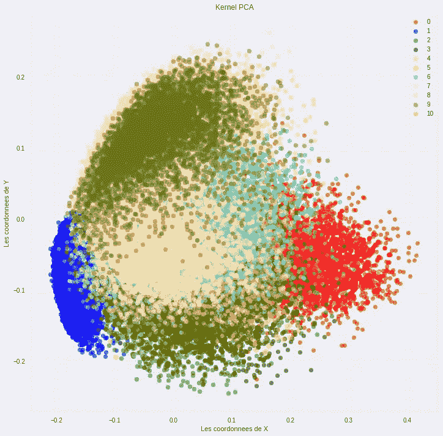

## 稀疏主成分分析

稀疏 PCA 使用 ACP 和 SVD 之间的链接，通过求解低阶矩阵近似问题来提取主要分量。

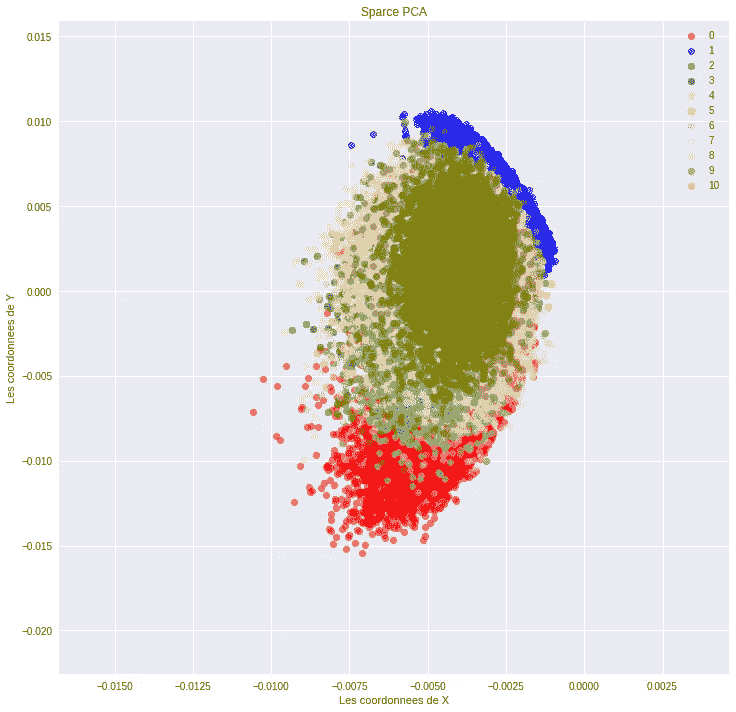

## 奇异值分解

奇异值分解甚至可以应用于矩形矩阵；然而，特征值只为方阵定义。通过 SVD 方法获得的特征值的等价物被称为奇异值，而获得的与特征向量等价的向量被称为奇异向量。然而，由于它们在本质上是矩形的，我们需要为它们的维数分别有左奇异向量和右奇异向量。

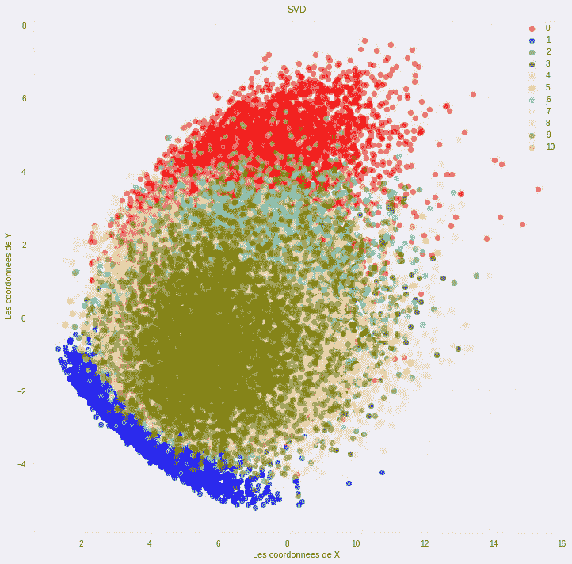

## 高斯随机投影

在随机投影中，具有非常大的维度(d)的数据被投影
到具有随机矩阵的二维空间(kd)中。

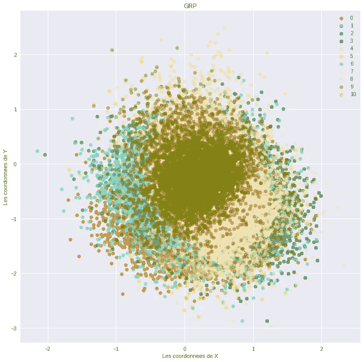

## 稀疏随机投影

分段随机矩阵是使用传统降维方法的密集随机投影矩阵的替代方案。它确保类似的嵌入质量，同时最大限度地提高存储效率，并允许更快地计算投影数据。

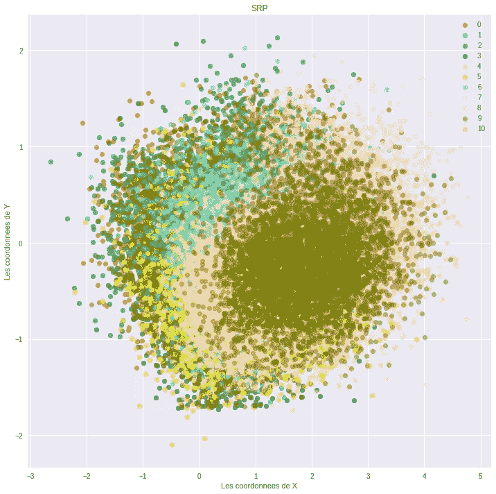

## 多维标度[MDS]

MDS 是一种将样本之间的二相似性可视化的方法。MDS 返回一个最佳解决方案，在一个更小的维度空间中表示数据，如果维度的数量 k 是预先定义的。

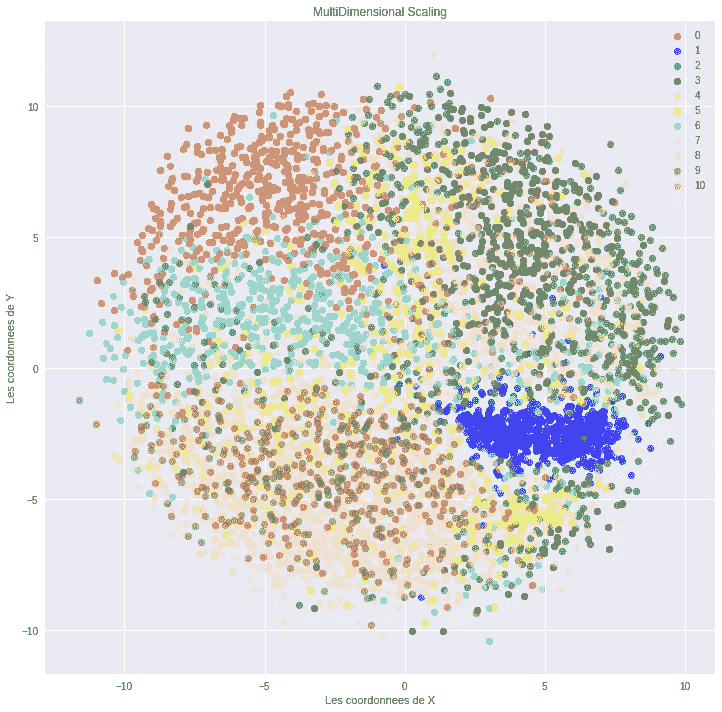

## ISOMAP

它是一种基于谱理论的非线性降维方法，试图在低维中保持大地距离。

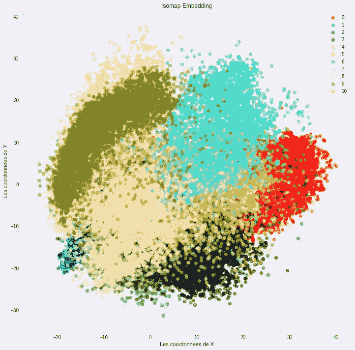

## 迷你批处理词典学习

基于字典的学习解决了矩阵分解的问题，这相当于找到一个字典，该字典可以在代码简约的条件下给出好的结果。

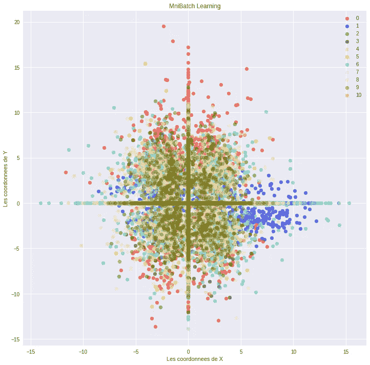

## 独立成分分析

独立分量分析是一种主要用于信号处理以线性分离混合数据的方法。

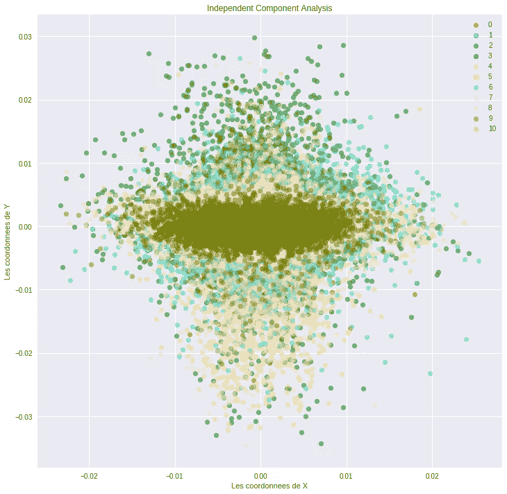

## T-分布随机邻居嵌入[T-SNE]

T-SNE 减少维数，同时试图保持相似的实例接近，不相似的实例分开。它主要用于可视化，特别是可视化高维空间中的实例集群。

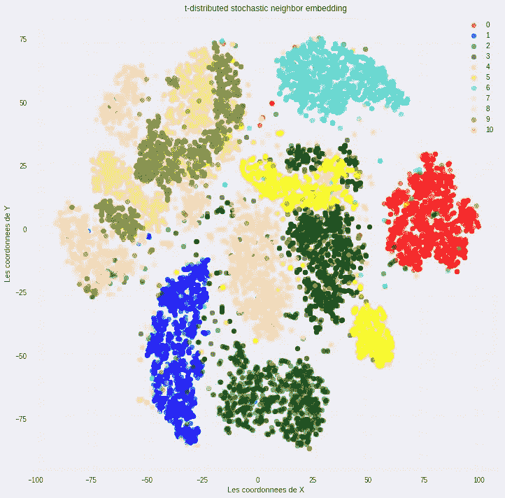

## 局部线性嵌入[LLE]

LLE 的工作方式是，首先测量每个训练实例如何与其最近的邻居(c.n .)线性相关，然后寻找训练集的低维表示，其中这些局部关系得到最佳保留(稍后将有更多详细信息)。这使得它特别擅长展开扭曲的流形，尤其是在没有太多噪声的时候。

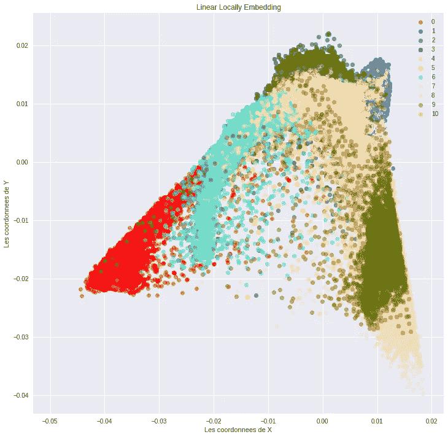

## 自动编码器

自动编码器是人工神经网络，能够学习输入数据的有效表示，称为编码，而无需任何监督(即，训练集是无标签的)。

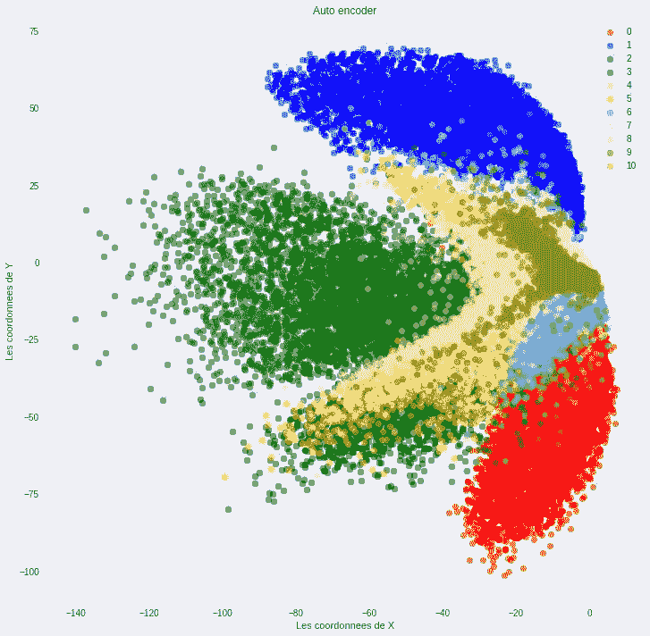