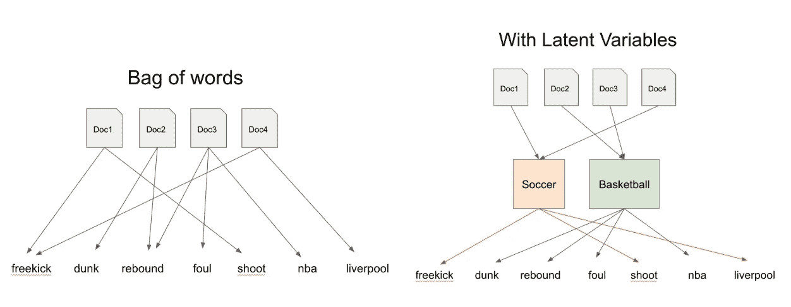
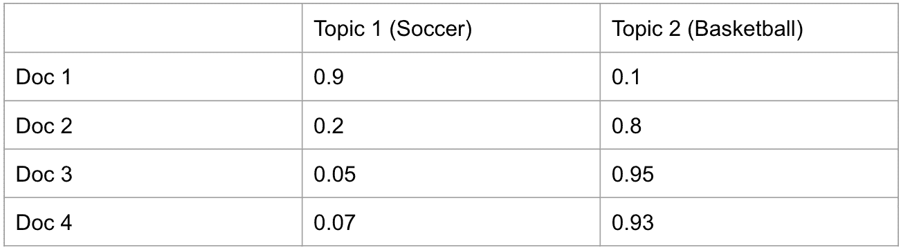
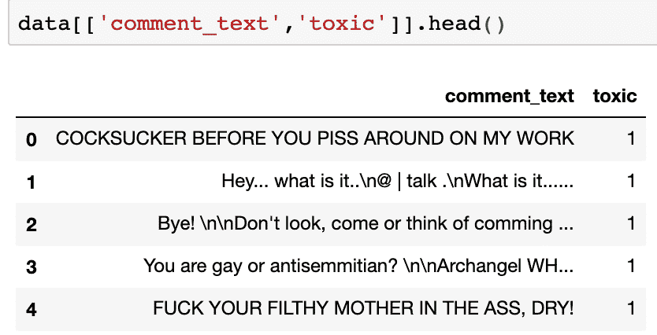
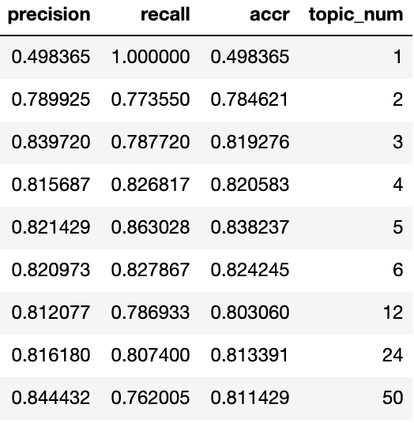
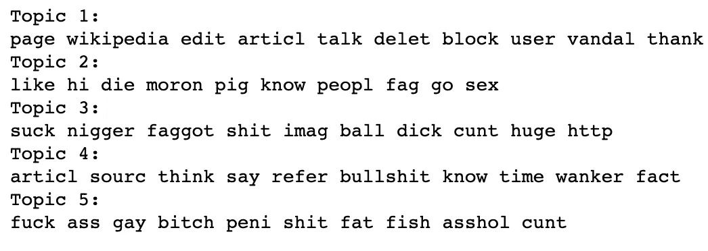
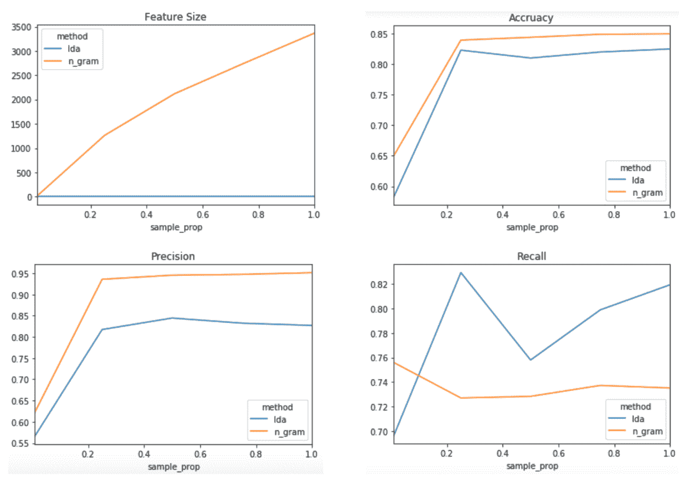
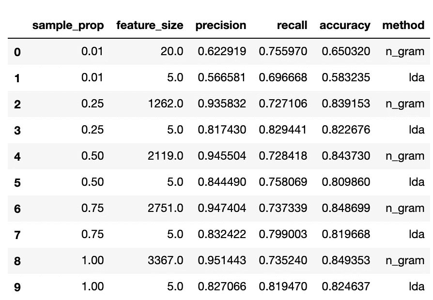

# 基于潜在狄利克雷分配的降维方法

> 原文：<https://towardsdatascience.com/dimensionality-reduction-with-latent-dirichlet-allocation-8d73c586738c?source=collection_archive---------11----------------------->

## 在性能下降不到 3%的情况下，将训练数据的维度减少了 99.7%以上。

降维是一种无监督的机器学习技术，通常与监督模型结合使用。虽然降低维度通常会使基于特征的模型更难解释，但它总是非常有效地防止过度拟合，并通过减少特征的数量来缩短训练时间。最流行的降维技术无疑是主成分分析(PCA)及其变体。然而，当涉及到文本数据时，我发现潜在的狄利克雷分配(LDA)非常有效。

## 潜在狄利克雷分配

潜在狄利克雷分配的概念最早是在 2003 年由大卫·布雷、吴恩达和迈克尔·乔丹撰写的研究论文中提出的。作者将其描述为“语料库的生成概率模型”LDA 广泛用于执行主题建模——一种可以从语料库中提取潜在主题/主题的统计技术。

在用于文本特征提取的传统单词包方法中，我们通过文档术语矩阵将每个文档直接映射到所有单词标记。这种方法通常会产生一个巨大、稀疏的矩阵，其中大多数条目等于 0，当我们使用这样的矩阵作为模型输入时，我们需要估计许多参数，但其中许多参数提供的信息有限，有时甚至是“有噪声的”。在 LDA 方法中，不是直接建模每个文本文档和每个单词标记之间的关系，而是引入“潜在变量”作为“桥梁”语料库中的每个文档由潜在变量(主题)上的[狄利克雷分布](https://en.wikipedia.org/wiki/Dirichlet_distribution)来表征，并且每个主题由所有单词标记上的另一个狄利克雷分布来表征。



Figure on the left represents a traditional Bag-of-Words approach where each document is directly mapped to the tokens (Usually in the form of a Document-Term or Term-Document Matrix). Figure on the right represents the LDA approach. The two latent variables represent topics regarding soccer and basketball. LDA is able to map each document to its corresponding topic and each topic to its corresponding tokens. Although in practice, we usually don’t have the number of topics or the “meaning” of each topic as prior information.

假设文档数为 N，我们选择主题数为 k，用 LDA 降维的思路就是把重点放在上面提到的第一个狄利克雷分布上。对于每个文档，我们可以获得一个长度为 K 的向量，它表示文档在 K 个主题上的概率分布。为所有文档添加这样的向量，我们可以得到一个 N 乘 K 的特征矩阵，该矩阵可以用某些标签输入到我们的监督模型中。



最近，受上面引用的原始研究论文的启发，我做了一个小实验，探索 LDA 在降维方面的性能。在实验中，我能够将训练数据的维度减少 99%以上，而原始准确性的下降不到 3%。接下来，让我更详细地说明这个实验。

## **毒性评论分类**

我用的数据来自[毒评分类 Kaggle 挑战赛](https://www.kaggle.com/c/jigsaw-toxic-comment-classification-challenge)的训练数据。因为我的目标是探索 LDA 的降维，所以我以下列方式对数据进行子集化和过滤以简化过程:

1.  原始数据的每个注释有 6 个不同的标签。我只关注了“有毒”标签。就这样，我把问题从多标签分类变成了单标签分类。
2.  欠采样:原始数据极不平衡，超过 90%的评论被标为“无毒”通过欠采样，我获得了一个平衡的数据集，其中 15294 条评论被标记为“有毒”，另外 15294 条没有被标记为“有毒”。



Sorry about the toxic comments. They are indeed very toxic

作为第一步，我使用标准的 uni-gram 方法和 TF-IDF 矢量器构建了一个 XG-boost 分类模型:

1.  *培训和测试拆分:*

```
from sklearn.model_selection import train_test_splitX_train, X_test, y_train, y_test = train_test_split(data.comment_text, data.toxic, test_size = 0.25,random_state = 23)X_train.reset_index(drop = True,inplace = True)X_test.reset_index(drop = True,inplace = True)y_train.reset_index(drop = True,inplace = True)y_test.reset_index(drop = True,inplace = True)
```

*2。为 n_gram 模型安装 TF-IDF 矢量器。请注意，我过滤了标记，使标记出现在少于 15 个文档中，超过 90%的文档被删除。****tokenizer _ XM****是一个定制的记号化器，包括记号化、词条化和词干化*

```
from sklearn.feature_extraction.text import TfidfVectorizervec_tfidf = TfidfVectorizer(ngram_range =(1,1),tokenizer=tokenizer_xm,min_df = 15, max_df = 0.9)vec_tfidf_f = vec_tfidf.fit(X_training)
```

*3。获得 n-gram 模型的文档-术语矩阵，并用训练数据拟合。*

```
train_dtm_ngram = vec_tfidf_f.transform(X_training)from xgboost import XGBClassifierxgbc = XGBClassifier(n_estimators=200)xgbc_ngram = xgbc.fit(train_dtm_ngram,y_training)
```

接下来，我开始用 LDA 建立模型。为了使用 LDA，我们需要首先获得文档-术语-矩阵。因为 LDA 是基于原始计数的，所以最好使用计数矢量器，而不是 TF-IDF。

```
from sklearn.feature_extraction.text import CountVectorizervec_count = CountVectorizer(ngram_range = (1,1),tokenizer=tokenizer_xm,min_df = 15, max_df = 0.9)vec_count_f = vec_count.fit(X_train)
```

*为 LDA 权重创建培训文档-术语矩阵*

```
vec_f = vec_count_ftrain_dtm = vec_f.transform(X_train)topic_num = 5from sklearn.decomposition import LatentDirichletAllocationlda = LatentDirichletAllocation(n_components = topic_num)lda_f = lda.fit(train_dtm)lda_weights = lda_f.transform(train_dtm)
# The lda_weights is a n by k matrix where n is the number of documents and k is the number of topics# Fit the xgb-model with lda weightsfrom xgboost import XGBClassifierxgbc = XGBClassifier(n_estimators=200)xgbc_lda = xgbc.fit(lda_weights,y_train)
```

和上面的代码一样，LDA 需要一个“n_components”参数，它实际上是主题的数量。然而，我们通常不知道语料库中有多少“主题”。因此，我用等于 1、2、3、4、5、6、12、24、50 的主题数重复了上述过程 9 次，并根据测试数据对模型进行评分，试图找到一个相对最优的值。下面是结果。



看起来最好的题数是 5，准确率在 84%左右。以下是基于狄利克雷分布的五个主题中每个主题的前 10 个“显著”标记。



在这篇文章中，我们不会深入探讨 LDA 主题建模的性能。但有趣的是注意到不同主题之间的差异。主题 1 看起来是最中性的，而主题 5 毒性极大。狄利克雷分布实际上有助于从语料库中分离出无毒的评论。

接下来，我用 1%、25%、50%、75%和 100%的训练数据运行了上述整个过程，记录了基于 N-gram(xgbc _ ngram)和基于 LDA(xgbc _ LDA)的极限梯度提升分类器的性能(注意，这两个模型都用 200 个估计器初始化，所有其他超参数都保留为默认值)，并比较了它们的精度、召回率和准确度分数。



下面是上图的原始表格:



如上图所示，虽然基于 N-gram 的模型的准确性总是略高于基于 LDA 的模型，但它最终在 100%的训练数据下达到 3367 个不同的特征，而基于 LDA 的模型的特征数仍然保持为 5，这是一个显著的差异！有趣的是，基于 LDA 的模型实际上在召回率方面优于 n-gram 模型，而在精确度方面则没有那么好。也就是说，基于 LDA 的模型更善于发现所有有毒的例子，但不太善于防止无毒的评论被标记为有毒的。一般来说，基于 LDA 的模型似乎在精确度和召回率之间具有更好的平衡。

使用 LDA 进行降维，我们无法绕过 n-gram 特征提取过程。因此，我们在缩短端到端模型构建时间方面没有得到太多的推动。然而，虽然 LDA 在降维方面似乎至少与 PCA 一样有效，但它非常容易解释。在基于特征的文本分类/回归模型中，这是一种很有前途的技术，因为我们可以将文本中的所有信息压缩到一个低维的密集矩阵中，以便我们能够添加许多其他特征来帮助提高模型性能，而不用担心过拟合。