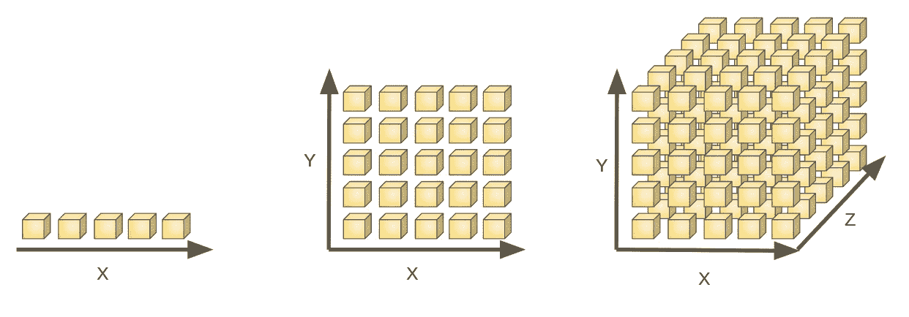
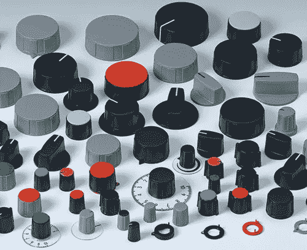

# 维度和自由度

> 原文：<https://towardsdatascience.com/dimensions-and-degrees-of-freedom-365461abcd5f?source=collection_archive---------23----------------------->

## 特征数量与维度数量


一个数学对象的维数是完全描述它所需的**个独立** **个变量**的个数。一个点有 0 个维度。直线有一维，正方形有二维，立方体有三维。在一条直线上，我们需要一个变量，比如说从起点到终点的距离，来确定我们的位置。在正方形上，我们至少需要两条信息(x 和 y)。在一个立方体中，我们需要 3 个坐标(x，y，z)



[source](https://medium.freecodecamp.org/the-curse-of-dimensionality-how-we-can-save-big-data-from-itself-d9fa0f872335)

***物体的维度是物体的内在属性，独立于其嵌入的空间*** 。

基本上一条线本质上有*一维，即使我们把它放在二维、三维或十维空间中。例如，如果我们在一个二维平面的一条直线(y=2x)上有一些点，我们仍然需要一个信息，例如离原点的距离，来唯一地识别这条线上的任何点。即使这些点有两个笛卡尔坐标，**坐标 x 和 y 依赖于**线的方程(y=2x)，**因此它们是多余的**，因为它们中的任何一个都可以由另一个推导出来(x=y/2，或 y=2x)。*

*机器学习和数据分析中的一个大误解是混淆了两个完全不同的概念:**特征数量**和**维度数量**。说明这种差异的最佳方式是想象三个不同尺寸的管道，它们都由同一个阀门控制。每一个都具有在其中流动的具有不同属性的不同流体和计数体积的仪表。因此，我们数据集中的特征数量为 3(流体体积 1、流体体积 2、流体体积 3)。*

**

*3 pipes controlled by the same valve. Image rendering by [Alexy Frangieh](http://alexfr.net/)*

```
*+---------+---------+---------+
| Meter 1 | Meter 2 | Meter 3 |
+---------+---------+---------+
| 1       | 10      | 100     |
+---------+---------+---------+
| 2       | 20      | 200     |
+---------+---------+---------+
| 3       | 30      | 300     |
+---------+---------+---------+
| 4       | 40      | 400     |
+---------+---------+---------+
| 5       | 50      | 500     |
+---------+---------+---------+
| 2.5     | 25      | 250     |
+---------+---------+---------+
| 0       | 0       | 0       |
+---------+---------+---------+
A sample of the data collected*
```

*虽然我们在这个数据集中有 3 个特征，但我们可以很容易地看出它们之间存在比例或相关性(即 1x: 10x: 100x)。这种相关性的存在是因为我们只有一个控制点。主要是一个阀门以相同的速率同时控制所有三种流量。因此，即使表面上我们有 3 个不同的变量，3 米和 3 个特征，对机器学习和数据分析真正重要的是数据集中的**自由度**。我们可以独立控制多少不同的管道。我们能让第一根管子完全打开，而第二根完全关闭吗？在这个系统中，我们不能，通过设计。所以即使我们收集了 3 个流的数据，也没有关系，这是一个冗余信息。一个流信息就足够了。其余的可以通过比例/相关性推导出来。*

*只有当我们在每个管道上使用独立的阀门时，我们才能说尺寸的数量等于特征的数量。但是，在我们可以说我们“覆盖”了整个探索空间之前，我们需要尝试所有管道上所有阀门的所有状态之间的所有不同组合。*

**

*What matters is how many independent knobs we have.*

*如果我们考虑每个阀门只有两种状态:完全打开和完全关闭。系统中每增加一个阀门，我们就有两倍多的组合可以探索。例如，对于 3 个阀门，我们得到以下 8 种组合:*

*   *[关门，关门，关门]*
*   *[关闭，关闭，打开]*
*   *[关闭，打开，关闭]*
*   *[关闭，打开，打开]*
*   *[打开、关闭、关闭]*
*   *[打开，关闭，打开]*
*   *[打开，打开，关闭]*
*   *[打开，打开，打开]*

*每个额外的管道，一个额外的阀门(或旋钮)将增加一个额外的空间，并增加一倍所需的数据。我们需要更多的数据来涵盖所有可能的组合。这是数据分析中一个众所周知的问题，称为“[维度的诅咒”](/curse-of-dimensionality-2092410f3d27)。*

**

*Too many variables!*

*我打算写一些数学工具，这些工具允许从不同的特征中发现独立维度的数量(比如主成分分析 PCA)。但是我找到了[这篇关于这个话题的优秀博文](https://medium.freecodecamp.org/the-curse-of-dimensionality-how-we-can-save-big-data-from-itself-d9fa0f872335)。*

**原载于 2019 年 3 月 6 日*[*data things*](https://medium.com/datathings/dimensions-and-degrees-of-freedom-8b6125dbbd4a)*。**