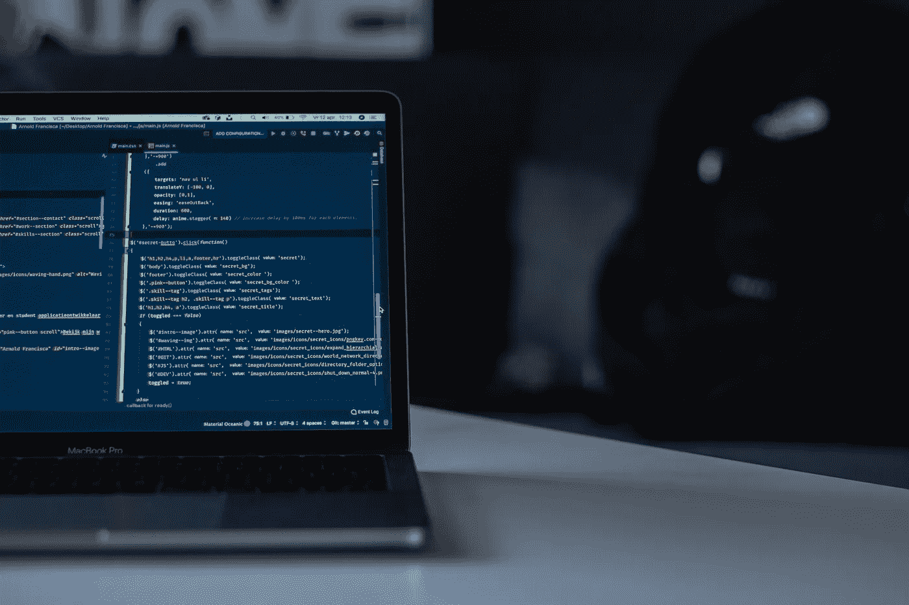

# 探索数据科学——一个“商业”人士的一些想法

> 原文：<https://towardsdatascience.com/dipping-into-data-science-a-few-thoughts-from-a-business-guy-8c4f1ab538b?source=collection_archive---------32----------------------->

[unsplash.com](https://unsplash.com/photos/nPhl2x4fk2s)

我两年前写了这篇文章，但从未公开发表过。我通过电子邮件把它发给了感兴趣的朋友和同事，许多人告诉我，他们发现它很有帮助，越来越多的人要求我在网上发表。在这里！

—

作为一名“商业”人士，我从未想过自己会探索数据科学。但在一年前加入一家医疗保健分析初创公司后，我很快意识到，我越是能够超越 3 万英尺的视角来理解分析(是的，我曾经是一名管理顾问，你怎么知道的？)，我就越能通过将数据分析学科与业务决策和管理联系起来，帮助推动我们公司的业务向前发展。麦肯锡[将这些人](https://www.mckinsey.com/business-functions/digital-mckinsey/our-insights/how-to-get-the-most-from-big-data)称为“翻译”。

我在网上找到了许多直接学习编程语言和统计学的资源，但没有一个真正谈到如何*接近*学习数据科学，特别是作为一个对如何编码毫无经验的人来说。在经历了太多的谷歌兔子洞和数周的反复试验后，我学到了以下几点:

**1。在开始任何在线课程之前，重要的是要想好你在数据科学生态系统中的角色**。这会让你更专注于你想学的东西，更重要的是，学什么编程语言。(查看:[六类数据科学家](http://www.datasciencecentral.com/profiles/blogs/six-categories-of-data-scientists)、[了解数据科学中不断变化的职位角色](http://www.datasciencecentral.com/profiles/blogs/understanding-the-changing-position-roles-in-data-science)、[你能在工作中学习数据科学吗](http://www.datasciencecentral.com/profiles/blogs/can-you-learn-data-science-on-the-job)？)

在与我的数据科学朋友和同事交谈后，我很快意识到数据科学家的大量时间都花在清理、操作和争论数据上，只是为了让数据达到可用的程度。我很惊讶地得知，数据科学家花了高达 60%的时间清理数据，而普遍的共识是，他们并不真正喜欢它。如果您在一个环境或项目中工作，可以通过帮助格式化和操作数据来减轻一些数据科学家的负担，这是一个很好的开始方式。

**2。一旦你对如何融入更广阔的生态系统有了一个基本的想法，选择一门语言来学习。**

[许多数据科学家用 R 和 Python 编写代码](https://www.datacamp.com/community/tutorials/r-or-python-for-data-analysis#gs.g3OJC14)。有些人信誓旦旦地说一个对另一个(例如，观点:“[为什么 R 对你不好](http://www.datasciencecentral.com/profiles/blogs/why-r-is-bad-for-you)”)——我不打算深入探讨。我选择 Python 是因为我公司的数据科学家正在使用 Python，我希望能够依靠他们的帮助。

我没有选择纯粹的 Python 在线课程(又名“MOOC”)，而是决定选择基于 python 的*数据科学 MOOC。(点击此处查看一篇对数据科学课程进行排名的酷炫文章[)。这让我能够在上下文中学习 python，并能够将它与我可以想象解决的真实业务问题联系起来，而不是在孤立的环境中学习 python 的基础知识。](https://medium.freecodecamp.org/i-ranked-all-the-best-data-science-intro-courses-based-on-thousands-of-data-points-db5dc7e3eb8e)*

我梳理了几门课程，决定选两门:

*   [**Python 数据科学入门——Coursera/密歇根大学**](https://www.coursera.org/learn/python-data-analysis)——这是一堂很棒的入门课，但对我这样的完全初学者来说很有挑战性。它的节奏相对较快，能让你迅速思考并投入 python。这门课程让你自己解决很多问题，而不是从头到尾握着你的手。)，但在我看来那是乐趣的一部分。任务很难，但有一点让我印象深刻，就像有多种方法可以构建 excel 模型以获得相同的结果一样，在编码中也有多种方法可以获得相同的结果。你学得越多，看到别人是如何编码的，你就越能建立起你的“库”来完成一些事情。
*   [**用于数据科学和机器学习的 Python—Udemy**](http://udemy.com/python-for-data-science-and-machine-learning-bootcamp/)**——我现在还在上这门课但是强烈推荐。Jose 是一位优秀的讲师，从基础 python 开始，到在 python 中应用机器学习(ML)技术。该课程首先从 python bootcamp 开始(与 Coursera / UMich 课程相比，更具结构化和指导性，这取决于你的学习风格)，以及 matplotlib 和 seaborn 等包的数据可视化技术。提前学习这些东西真的很有用，很有帮助，你可以马上把它应用到你的日常生活中。Jose 然后使用 sklearn 和其他技术深入 ML 应用程序。我现在正在研究这些。本课程主要侧重于数据科学的应用，以帮助人们起步，但也很好地将一些高层次的统计概念与统计书籍结合在一起(下文将详细介绍)。**

***旁注:*如果你曾经在尝试编码时遇到困难，那就谷歌一下。你可能会发现一个堆栈溢出链接，链接上有人问了和你相同/相似的问题，有来自世界各地的 17 个不同的回答。这是我学习编码最喜欢的事情之一——有一个完整的社区在努力互相帮助，你总能找到问题的答案。**

**许多这些纯数据科学 MOOCs(包括上面的那些)主要专注于数据科学**、**的*应用*，并没有真正进入这些技术背后的数学或推理。这让我想到了下一个要点:**

****3。在某种程度上，您可能应该从概念上理解数据科学背后的一些基础数学和统计学。**我并不是在说要达到开发奇特算法的地步；我说的是对统计学习的基本理解，以帮助你理解解释数据的细微差别(例如，何时使用这种类型的回归与分类模型，为什么，以及这如何影响你的分析？).网上有很多关于这些主题的课程，我还没有去探索，但同时我拿起了 Jose 在他的课程中使用的书:**

*   **[**【R 中的应用】**](http://faculty.marshall.usc.edu/gareth-james/ISL/) —有人告诉我这是数据科学家的圣杯书籍(我不是数据科学家，所以我不能确认)。Udemy 类大量引用这本书；Jose 并没有试图深入研究数据科学背后的数学，而是要求他的学生在感兴趣的时候阅读这本书。警告:这是一本教科书，毫无疑问，但它是一本精彩的读物。虽然标题是“R 中的应用程序”，但是如果您正在学习 Python，请不要担心，主要的统计概念是与语言无关的。大部分 R 应用程序是针对书中的实验部分/练习。这本书在网上是免费的，尽管我确实买了一本二手的硬拷贝，因为我想支持作者，而且我讨厌在屏幕上阅读东西，尤其是教科书**

**好了，这些是我在这次旅程中得到的两分钱。希望这在某种程度上有所帮助。如果您有任何问题、反馈或意见，请告诉我！总是寻求联系和了解更多。**