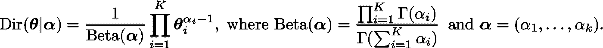
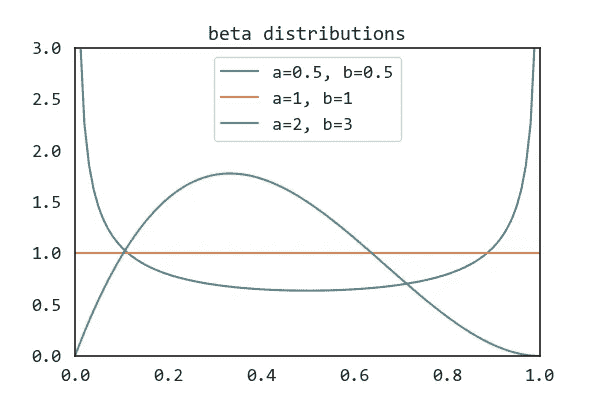
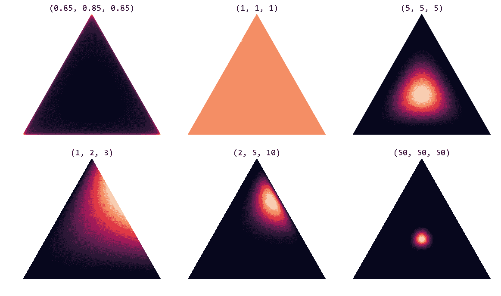

# 狄利克雷分布

> 原文：<https://towardsdatascience.com/dirichlet-distribution-a82ab942a879?source=collection_archive---------2----------------------->

## 激励 LDA

几个月前，我构建了一个推荐系统，采用主题建模向员工显示相关任务。使用的算法是潜在的狄利克雷分配(LDA)，这是一种自 21 世纪初就存在的生成模型。当然，我没有从头开始重写 LDA，而是使用了 Python 的 [scikit-learn](https://scikit-learn.org/stable/modules/generated/sklearn.decomposition.LatentDirichletAllocation.html) 中的实现。但这让我开始思考导致 LDA 模型产生的一系列研究。这种库的问题是，在代码中包含几行代码并继续前进太容易了，所以我翻出了我的旧机器学习书籍，目的是了解足够多的知识，以便能够解释 LDA 所有血淋淋的概率细节。一度有人担心它会变成一个无限的回归，但最终理性占了上风，这一系列的文章被构建出来。按照相反的顺序，我们有:

五:潜在狄利克雷分配(LDA)
四:潜在语义索引(LSA)
三:混合模型和 EM 算法
二:贝叶斯生成模型
一:狄利克雷分布

希望到我们到达终点时，目标已经实现了。我们将从狄利克雷分布开始。

# 狄利克雷分布——它是什么，为什么有用？

在任何教科书中查找狄利克雷分布，我们都会遇到以下定义:

> 狄利克雷分布 Dir( **α** )是一族由正实数的向量 **α** 参数化的连续多元概率分布。它是贝塔分布的多元推广。狄利克雷分布是贝叶斯统计中常用的先验分布。

一个直接的问题是*为什么*狄利克雷分布被用作贝叶斯统计中的先验分布？一个原因是它是许多重要概率分布的*共轭先验*:分类分布和多项式分布。用它做先验会让数学变得容易很多。

## 共轭先验

在贝叶斯概率论中，如果后验分布*p*(***θ***|**x**)和先验分布*p*(***θ***)来自同一个概率分布族，那么这个先验和后验就叫做*共轭分布*，先验就是似然函数的*共轭先验*。

如果我们考虑从给定的一组数据 **x** 中推断一个分布的参数***θ*的问题，那么贝叶斯定理说后验分布等于似然函数***θ***→*p*(**x**|***θ***)和先验 *p* ( ***的乘积*****

Bayes’ theorem. To calculate the posterior we need to normalise by the integral.

由于似然函数通常是在数据生成过程中定义的，我们可以看到，先验的差异选择会使积分或多或少地难以计算。如果先验具有与似然相同的代数形式，那么我们通常可以得到后验的封闭形式的表达式，避免了数值积分的需要。

## 激励狄利克雷分布:骰子制造

我们展示了如何使用狄利克雷分布来描述多项分布的随机可变性。我从一篇关于可视化狄利克雷分布的博客文章中借用了这个例子。

假设我们要制造 6 面骰子，但允许一次投掷的结果只有 1、2 或 3(这是为了后面的可视化更容易)。如果骰子是公平的，那么三种结果的概率将是相同的，等于 1/3。我们可以用向量***θ***=(*θ*₁， *θ* ₂， *θ* ₃).)来表示结果的概率

***θ*** 有两个重要的性质:第一，每个条目的概率之和必须等于 1，并且任何一个概率都不能为负。当这些条件成立时，与骰子滚动相关的结果可以用多项式分布来描述。

换句话说，如果我们观察到 *n* 掷骰子， *D* ={x₁,…,x_k}，那么似然函数具有以下形式

其中 *N_* k 是值 *k* ∈{1，2，3}出现的次数。

我们预计我们生产的骰子的特征会有一些变化，因此即使我们试图生产公平的骰子，由于生产过程中的变化，我们也不会期望特定骰子的每个结果的概率都是 1/3。为了从数学上描述这种可变性，我们想知道给定制造过程中*的每个可能值的概率密度。要做到这一点，让我们把 ***θ*** 的每一个元素看作一个独立变量。即对于***θ***=(*θ*₁、 *θ* ₂、 *θ* ₃)，我们可以把 *θ* ₁、 *θ* ₂、 *θ* ₃各自作为一个自变量。由于多项式分布要求这三个变量之和为 1，所以我们知道 ***θ*** 的允许值被限制在一个平面内。此外，由于每个值 *θ* ᵢ必须大于或等于零，所以 ***θ*** 的所有允许值的集合被限制在一个三角形内。*

*我们想知道的是这个三角形上每一点的概率密度。这就是狄利克雷分布可以帮助我们的地方:我们可以用它作为多项式分布的先验。*

## *狄利克雷分布*

*狄利克雷分布定义了与我们的多项式参数 ***θ*** 具有相同特征的向量值输入的概率密度。它有*支持*(有非零值的点的集合)*

**

*其中 *K* 是变量的个数。其概率密度函数具有以下形式:*

**

*狄利克雷分布由向量 ***α*** 参数化，其元素 *K* 的数量与我们的多项式参数 ***θ*** 相同。所以你可以把*p*(***θ****|****α***)解读为回答“什么是与多项分布 ***θ*** 相关的概率密度，给定我们的狄利克雷分布有参数 ***α*** ”*

## *可视化狄利克雷分布*

*我们看到狄利克雷分布确实具有与多项式似然分布相同的形式。但是它实际上看起来像什么呢？*

*要看到这一点，我们需要注意，这是贝塔分布的多元推广。β分布定义在由两个正形状参数α和β参数化的区间[0，1]上。正如所料，它们是二项式(包括伯努利)分布的共轭先验。该图显示了具有多个α和β值的β分布的概率密度函数。*

**

*正如我们所见，β密度函数可以根据α和β采用各种不同的形状。当α和β都小于 1 时，分布呈 U 型。在α = β → 0 的极限下，它是一个两点伯努利分布，在每个狄拉克δ函数端点 *x* =0 和 *x* =1 处概率相等 1/2，其他地方概率为零。当α=β=1 时，我们有均匀的[0，1]分布，这是具有最大熵的分布。当α和β都大于 1 时，分布是单峰的。这种通过仅改变两个参数的形状多样性使得它对于模拟实际测量特别有用。*

*对于狄利克雷分布 Dir( ***α*** )我们将这些形状概括为一个 *K* 单形。对于 *K* =3，可视化分布要求我们做以下事情:1 .在我们的三角形上生成一组 x-y 坐标，2。将 x-y 坐标映射到 2-单纯形坐标空间，3。计算每个点的方向( ***α*** )。下面是一些例子，你可以在我的 Github 库中找到[代码。](https://github.com/yusueliu/medium/blob/master/scripts/plot_dirichlet.py)*

**

*Dirichlet distribution on a 2-simplex (equilateral triangle) for different values of ***α****.**

*我们看到现在是参数 ***α*** 决定了分布的形状。特别是，α₀=∑αᵢ总和控制着分布的强度(峰值有多高)。如果对所有的*I*αᵢ为 1，我们在单纯形的角上得到“尖峰”。对于αᵢ > 1 的值，分布趋向于单纯形的中心。随着α₀的增加，分布越来越紧密地集中在单形的中心。*

*在我们最初的骰子实验中，当αᵢ → ∞时，我们会产生一致公平的骰子。对于αᵢ > 1 的对称狄利克雷分布，我们将平均产生一个公平的骰子。如果目标是生产有负荷的骰子(例如，以更高的概率掷出 3)，我们会想要具有更高α₃.值的非对称狄利克雷分布*

*我们现在已经看到了什么是狄利克雷分布，它看起来像什么，以及在骰子制造示例的上下文中使用它作为多项式似然函数的先验的含义。在下一篇文章中，我们将深入探讨贝叶斯生成模型以及如何进行推理。*

## *参考*

*Blei，D.M .，Ng，A.Y .，Jordan，MI (2003) [潜在狄利克雷分配](http://www.jmlr.org/papers/volume3/blei03a/blei03a.pdf)。*《机器学习研究杂志》，* ***3*** (Jan)，第 993–1022 页。*