# 使用有序数据的 Spearman 等级相关系数

> 原文：<https://towardsdatascience.com/discover-the-strength-of-monotonic-relation-850d11f72046?source=collection_archive---------17----------------------->

## 统计数字

## 发现单调关系的力量


Photo by [Fabio Ballasina](https://unsplash.com/@fabiolog?utm_source=medium&utm_medium=referral) on [Unsplash](https://unsplash.com?utm_source=medium&utm_medium=referral)

```
**Table of Contents**[**Introduction**](#e6af)1\. [Simplified formula](#a7ee)
2\. [General formula](#1852)
3\. [Pandas corr](#cde9)
4\. [Finding mathematically using the formula (1–1)](#4fa8)
5 [Finding mathematically using the formula (1–2)](#177a)
6\. [Real-life example](#e68a)[**Conclusion**](#d193)
```

# 介绍

斯皮尔曼等级相关系数， *𝑟𝑠* 显示两个有序数据之间的相关性。一个序数数据如何随着另一个序数的变化而变化。

有序集之间的函数称为单调函数。

在这篇文章中，我探索了使用不同等级的数据来寻找 Spearman 等级相关系数的不同方法。

Spearman 的等级相关需要序数数据。序数数据的例子有:

*   第一、第二、第三、
*   小号，中号，大号，加大码，
*   强烈同意、同意、中立、不同意、强烈不同意
*   经常，经常，不经常，一点也不

# 简化公式

当所有等级都是不同的整数时，Spearman 相关系数由以下公式计算。

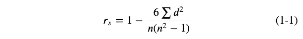

如果数据是有序和单调的，并且数据中没有联系，则此公式是皮尔逊相关性的替代方法。

值为 1 意味着数据集严格增加，值为-1 意味着严格减少。值为 0 表示数据不显示单调行为。当观察值在两个变量之间具有相似的等级时，两个变量之间的 Spearman 相关性将会很高。

[](/the-subtlety-of-spearmans-rank-correlation-coefficient-29478653bbb9) [## 斯皮尔曼等级相关系数的微妙性

### 单调关系的未知部分

towardsdatascience.com](/the-subtlety-of-spearmans-rank-correlation-coefficient-29478653bbb9) 

# 通式

Spearman 相关系数被定义为使用等级变量的 Pearson 相关系数。在原始数据 x 和 y 被转换成分级数据 *𝑟𝑥* 和 *𝑟𝑦* 之后，斯皮尔曼相关系数被定义为:

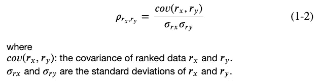

让我们找出 5 公里跑的等级与 10 公里跑的等级之间的相关性。所有等级都是不同的整数，没有相同的数字。求系数有不同的方法。

1.  `[scipy.stats.spearmanr](https://docs.scipy.org/doc/scipy/reference/generated/scipy.stats.spearmanr.html)`用相关的 p 值计算斯皮尔曼相关系数。
2.  [熊猫 corr](https://pandas.pydata.org/pandas-docs/stable/reference/api/pandas.DataFrame.corr.html?highlight=corr#pandas.DataFrame.corr)
3.  使用公式(1–1)
4.  使用公式(1–2)

我们开始吧。
我们需要导入必要的库。

以下是我们的样本数据。

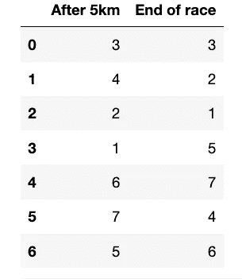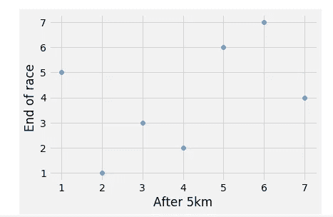

我们使用`scipy.stats.spearmanr`找到 *𝑟𝑠* 和 p 值。

```
correlation=0.428571, p-value=0.337368
```

p 值是显著性水平。它决定了相关性偶然发生的概率。

```
correlation=0.428571, p-value=0.337368
At 5% level of significance, the final rankings is not significant or independent
```

# 熊猫角

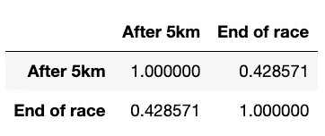

Pandas corr 返回相关矩阵。我们需要从`[0,1]`中选择值。

```
0.42857142857142855
```

# 使用公式(1–1)进行数学计算

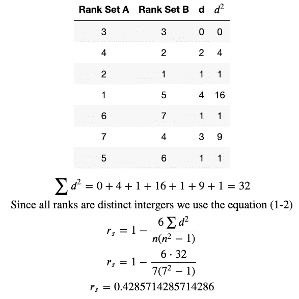

```
1-(6*(0+4+1+16+1+9+1)/(7*(7**2-1)))=0.4285714285714286
```

# 使用公式(1–2)进行数学计算

我们求出 *𝑟𝑥* 和 *𝑟𝑦* 的协方差， *𝜎𝑟𝑥* 、 *𝜎𝑟𝑦* 的标准差。

正如我们所料，我们得到了同样的结果。

## 严格递增

值为 1 意味着数据集在严格增加。当等级不变时会发生这种情况。在这种情况下，你会发现 p 值为 0。

```
correlation=1.000000, p-value=0.000000
```

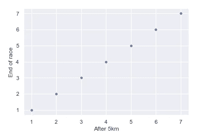

## 严格递减的

值-1 意味着它在严格减少。排名是逆序的。

```
correlation=-1.000000, p-value=0.000000
```

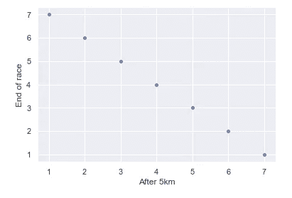

## 非单调行为

非单调行为的值为 0。

```
correlation=0.000000, p-value=1.000000
```

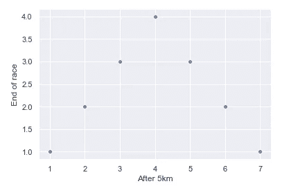[](/a-measure-of-linear-relationship-5dd4a995ee7e) [## 线性关系的度量

### 皮尔逊与 Jupyter 笔记本的积矩相关性

towardsdatascience.com](/a-measure-of-linear-relationship-5dd4a995ee7e) 

# 现实生活中的例子

我们将使用 BIXI Montréal 的数据。BIXI Montréal 是一个公共自行车共享系统，服务于加拿大魁北克省的 Montréal。这是一个很大的文件，所以需要时间来处理数据。我们用`shape()`和`head()`来看尺寸和头部。

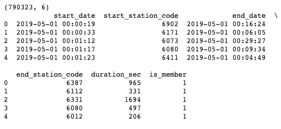

六列七万九千余行。列有开始数据、开始站代码、结束日期、结束站代码、持续时间和成员。

我们按终点站代码分组，并对持续时间(秒)求和。我们用终点站代码的号码来分配 n 次乘车。

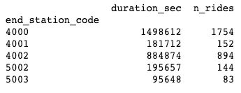

## 打印导入的数据

让我们绘制导入的数据。

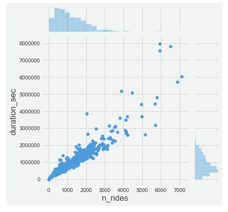

## 排名数据

请注意，大多数数据都在低端。我们可以用`scipy.stats.rankdata`通过排名来看数据。

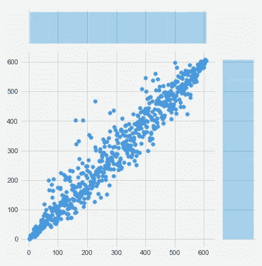

让我们找到斯皮尔曼的 *𝑅𝑠* 。

```
correlation, pval = spearmanr(by_end_station)
print(f'correlation={correlation:.6f}')
```

输出是:

```
correlation=0.964881
```

自行车停靠点的乘车次数几乎与通勤时间成正比。

# 结论

我们探索了使用有序数据寻找 Spearman 相关系数。四种不同的方法都很有效。[在第 2 部分](/the-subtlety-of-spearmans-rank-correlation-coefficient-29478653bbb9)中，我们将使用具有相同数据的不同数据集。这将需要额外的谨慎，以找到斯皮尔曼的相关系数。

**通过** [**成为**](https://blog.codewithshin.com/membership) **的会员，可以完全访问媒体上的每一个故事。**


[https://blog.codewithshin.com/subscribe](https://blog.codewithshin.com/subscribe)

# 使用斯皮尔曼相关的例子

*   [一个人的智商与花在游戏上的小时数](https://www.wikiwand.com/en/Spearman%27s_rank_correlation_coefficient)
*   [免费的大学餐和他们的 CGPA 分数](https://www.toppr.com/guides/business-mathematics-and-statistics/correlation-and-regression/rank-correlation/)
*   [物理和数学排名](https://www.statisticshowto.datasciencecentral.com/spearman-rank-correlation-definition-calculate/)

# 参考

*   要比较 Spearman 相关性和 Pearson 相关性，请在此阅读[Pearson 和 Spearman 相关性的比较](https://support.minitab.com/en-us/minitab-express/1/help-and-how-to/modeling-statistics/regression/supporting-topics/basics/a-comparison-of-the-pearson-and-spearman-correlation-methods/)
*   [https://statistics . laerd . com/statistical-guides/spearmans-rank-order-correlation-statistical-guide-2 . PHP](https://statistics.laerd.com/statistical-guides/spearmans-rank-order-correlation-statistical-guide-2.php)
*   [https://www . ka ggle . com/resident Mario/spearman-correlation-with-Montreal-bikes/data](https://www.kaggle.com/residentmario/spearman-correlation-with-montreal-bikes/data)
*   [https://seaborn.pydata.org/generated/seaborn.jointplot.html](https://seaborn.pydata.org/generated/seaborn.jointplot.html)