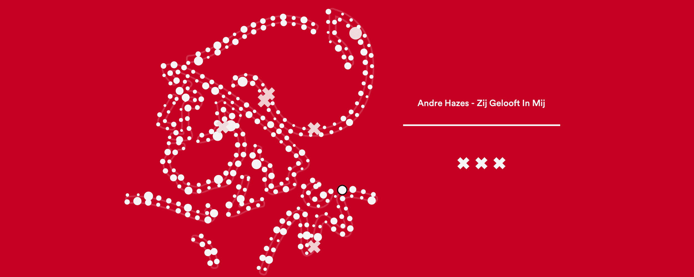
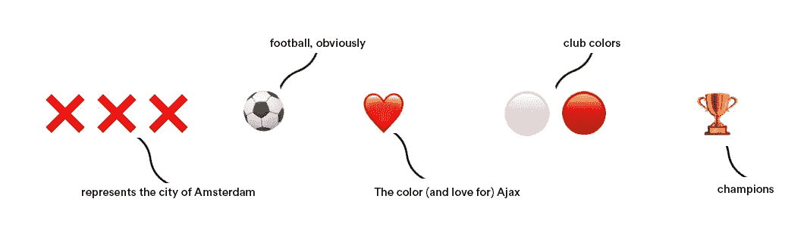
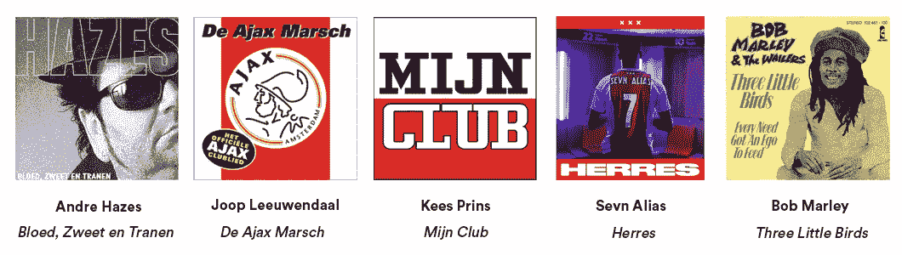
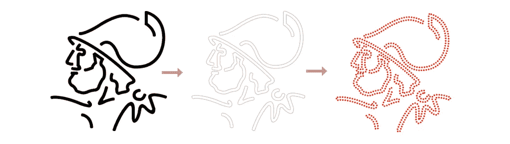
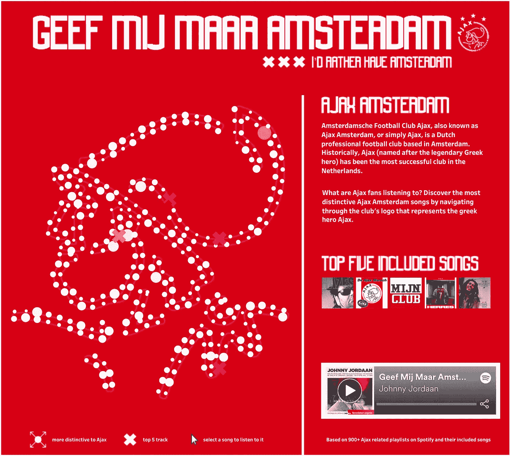

# 通过数据分析发现足球国歌

> 原文：<https://towardsdatascience.com/discovering-football-anthems-through-data-analysis-3a9773499d77?source=collection_archive---------26----------------------->

在我之前的一篇关于 FIFA 世界杯的博客中，我写了音乐和足球是如何不可分割的。音乐是足球文化的一部分，反之亦然。音乐团结了世界各地俱乐部背后的军队，增强了赛前(和赛中)的气氛。

每个人可能都有他或她最喜欢的足球歌曲。我想知道是否有办法通过数据分析来识别某个足球俱乐部最有特色的歌曲。由于来自阿姆斯特丹，我决定找出阿贾克斯阿姆斯特丹的支持者是否有他们支持的俱乐部最喜欢的歌曲。

如果你从未听说过阿姆斯特丹阿贾克斯足球俱乐部，也称为阿姆斯特丹阿贾克斯，或简称为阿贾克斯，它是一家总部设在阿姆斯特丹的荷兰职业足球俱乐部。历史上，阿贾克斯(以传说中的希腊英雄命名)一直是荷兰最成功的俱乐部。尽管有些人可能不同意。

在你继续阅读之前，我必须提醒你，这个分析中涉及了一些荷兰民间音乐。

## **数据集**

*   通过查看 Spotify 用户生成的播放列表，在它们的播放列表标题或描述中有“Ajax”或“Ajax Amsterdam ”,我创建了一个与足球俱乐部有关的播放列表子集。
*   通过提取这些播放列表中包含的所有歌曲，我们能够建立一个与 Ajax Amsterdam 相关的歌曲数据集。这是通过 Spotify 的 API 完成的。

## Ajax 相关播放列表

通过在 Spotify 平台上搜索在用户的播放列表标题或描述中包含 Ajax 相关术语的播放列表，我能够收集到超过 900 个播放列表**。除了俱乐部的名字，最常用的表情符号是代表阿姆斯特丹的三个❌'s。**

****

**像⚽️、❤️and 这样的表情符号🔴⚪️也是常用的。这并不奇怪，因为它们与阿贾克斯的俱乐部颜色联系在一起。平均一个 Ajax 支持者的播放列表中有 27 首歌曲。**

## **最佳阿贾克斯阿姆斯特丹歌曲**

**识别用户生成的 Ajax 播放列表后，下一步是更好地了解哪些曲目被收听最多。**

**为此，我们必须查看 900 多个播放列表中包含的所有曲目。这导致了令人印象深刻的歌曲数量，因为 **27，161 首不同的歌曲**包含在所有播放列表中。**

**为了了解哪些歌曲在支持者中最受欢迎，我查看了哪些歌曲被添加到大多数播放列表中，并计算了每首歌曲的包含率。**

**收录率最高且最受阿贾克斯支持者欢迎的五首歌曲: **1)** [安德烈·哈泽斯—布洛德、兹韦特·恩·特兰恩](https://open.spotify.com/track/5ZLkc5RY1NM4FtGWEd6HOE?si=uOdMgX6HTWqKNwmxpkbgxA)**2)**[Joop leeuwendal—德·阿贾克斯·马希](https://open.spotify.com/track/2W5hpQxGjuMaoxuibmSXid?si=ox_QiUxsTHKiNYgzitfNwQ)**3)**[Kees Prins—Mijn Club](https://open.spotify.com/track/3HVDrXFKGC2kfo4JfZmG1M?si=tVV-JvxNSMeZCHBMhhVEPQ)**4)**[Sevn Alias—赫雷斯](https://open.spotify.com/track/411fSfMfrNGxVsIGK3drHT?si=ioiRjZNlQIyjB9to1xTtdA) **5)****

****

**Top 5 songs with highest inclusion rate**

**作为荷兰人，这些歌曲拥有最高的收录率并不奇怪，数据也证实了我最初的直觉。然而，有很多其他的歌曲似乎与 Ajax 有关联，这是我没有想到甚至不知道的。**

**我的目标是让自己熟悉阿贾克斯阿姆斯特丹国歌，但当你谈论 27K 首歌曲时，这似乎是一个相当大的挑战。因此，找到一种能让我很容易(重新)发现音乐的方式来想象这些歌曲是至关重要的。**

## **创建 Ajax 自动点唱机**

**我认为我(和我的支持者们)在听所有 Ajax 歌曲的同时浏览数据会很有趣。我决定使用阿贾克斯的标志(代表希腊英雄阿贾克斯)来创建一个散点图点唱机。**

****

**converting a vector to a scatterplot**

**为了确保我们只查看与 Ajax 关联最多的歌曲，我在数据集上放置了一个过滤器，将它总结为包含率最高的 330 首歌曲。**

****

**圆圈的大小表明特定的轨道对 Ajax 来说更有特色(并且具有更高的包含率)。叉号表示包含的前五首曲目。一旦你选择了一首歌曲，将会提供一个 30 秒的音频剪辑，这样你就可以享受一些正宗的(主要是)荷兰音乐，并为阿贾克斯的下一场比赛进入状态。**

****每个人都可以通过**[**Tableau Public**](https://public.tableau.com/profile/bo.plantinga#!/vizhome/TESTING_15696971557740/AJAXAMSTERDAM)**访问 Ajax 点唱机。对于真正的 Ajax 爱好者来说，你可以通过** [**这里**](https://drive.google.com/file/d/1OKOnEMEawBGVqoHWXzmZ3fgZ-3ZtOdV8/view?usp=sharing) **下载一个高分辨率的散点图 iPhone 屏保。****

**在这里阅读更多我的故事:**

** [## 可视化 2019 年美国公开赛的发球

### 今年夏天，我有机会参加了我的第一个大满贯网球锦标赛，美国公开赛。我很幸运地…

towardsdatascience.com](/visualizing-the-serves-of-the-2019-us-open-b575c61f58ef)  [## 荷兰 DJ 的世界之旅

### 成为一名世界级的 DJ 并不全是闪闪发光和魅力。我是说，环游世界，紧张的旅行…

medium.com](https://medium.com/@boplantinga/the-journey-of-dutch-djs-around-the-world-d7434966ce9d)  [## Pusha T vs. Drake:用数据备份他们的 diss 轨迹

### 也许没有必要花太多时间来介绍德雷克和普什塔之间的矛盾

towardsdatascience.com](/pusha-t-vs-drake-backing-up-their-diss-tracks-with-data-1083e6159c75)**