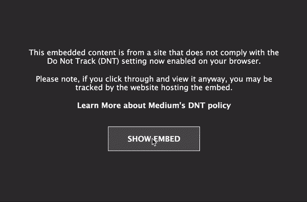

# 发现用 Python 包装的 Spotify 扩展的数据探索

> 原文：<https://towardsdatascience.com/discovering-spotify-wrapped-an-extended-data-exploration-1975a8b7af29?source=collection_archive---------17----------------------->

## 2017、2018、2019 和十年；不仅仅是流计数，以交互方式呈现。

# 序

2010 年已经结束，除非你一直生活在岩石下，最近几天你很可能会遇到一个人全年收听历史的个性化视觉呈现；正式名称为 [**Spotify 裹**](https://www.spotify.com/ca-en/wrapped/) 。虽然一些数据人员可能认为它本质上只是 SQL 查询中的 COUNT、SUM、WHERE 和 GROUP BY 的输出，但**美观的可视化列表**在上线当天成功地导致[服务器因突发流量而停机](https://www.standard.co.uk/tech/spotify-wrapped-2019-not-working-a4305311.html)，并通过大量的社交媒体分享将其订户转化为免费的品牌大使；由于 FOMO 综合症，我们大多数人都有。

Originally by [Erik Herrström](https://medium.com/u/739fe8b15412?source=post_page-----1975a8b7af29--------------------------------)

看看下面的链接(如果你还没有的话),看看在各自的时间跨度内，全世界都在听些什么。

 [## 你的 2017 年结束了

### 这一年即将结束。也就是说，你猜对了，是时候进行我们一年一度的音乐年活动了…

community.spotify.com](https://community.spotify.com/t5/Community-Blog/Your-2017-Wrapped/ba-p/3638025)  [## 2018 年热门歌曲、艺术家、播放列表和播客——Spotify

### 2018 年即将结束，但在 Spotify 上，音乐一如既往地大声播放。一年到头，我们的用户…

newsroom.spotify.com](https://newsroom.spotify.com/2018-12-04/the-top-songs-artists-playlists-and-podcasts-of-2018/)  [## 2019 年和过去十年的顶级歌曲、艺术家、播放列表和播客- Spotify

### 随着 2019 年接近尾声，Spotify 上的流媒体也将迎来辉煌的一年。你可能会回想过去的 12 年…

newsroom.spotify.com](https://newsroom.spotify.com/2019-12-03/the-top-songs-artists-playlists-and-podcasts-of-2019-and-the-last-decade/) 

这些见解点燃了我的好奇心，让我去探索 Spotify 向我们展示的东西之外的东西。所以我决定推出我的 Jupyter 笔记本，并开始摆弄 2017 年、2018 年、2019 年和十年全球排行榜上的**曲目数据。继续向下滚动，看看我发现了什么。**

# 获取和清洁

首先，我使用 [Spotipy](https://spotipy.readthedocs.io/en/latest/) (一个轻量级 Spotify Web API 库)检索了每个播放列表中每个曲目的音频特征。一个客户端 ID、一个秘密令牌、一些播放列表的唯一 ID 和几行脚本就可以完成这项工作，并将我们需要的信息编译到数据帧中。

Fetch track info & audio features

在撰写本文时，2017 年版的播放列表 ID 不再公开。幸运的是，我在 [**Kaggle**](https://www.kaggle.com/nadintamer/top-tracks-of-2017) 中找到了数据集(功劳归于 [Nadin Tamer](https://medium.com/u/c11430960bdd?source=post_page-----1975a8b7af29--------------------------------) )，并做了一些调整以使系列完整。

在准备数据时，我决定只包括主要的艺术家，忽略有特色的艺术家，如果有的话，以保持分析简单。此外，在 200 首曲目(每首前 50 首)中，一些曲目被证明存在于其他播放列表中；**杜阿·利帕**的**新规则** ( **2017** 、**2018**)**艾德·希兰** - **外形的你** ( **2017** 、 **2018** 、**十年**、**摇滚明星**由**后马龙**在这种情况下，我通过按此顺序(2017 > 2018 > 2019 >十年)排列优先级来删除重复项。下面快速浏览一下我的最终数据(172 行 x 14 列)及其描述。

Final data randomly shuffled

*   **露骨**:歌词中是否包含露骨词语或表达的指标。
*   **可跳舞性**:根据速度、节奏稳定性、节拍强度和整体规律性，一首曲目适合跳舞的程度。(0~1)
*   **能量**:基于动态范围、感知响度、音色、开始速率和一般熵的强度感知度量。(0~1)
*   **键**:估计音轨的整体音高等级及其旋律内容来源的音阶类型。
*   **响度**:声音的质量，是以分贝为单位的振幅的主要心理相关性。(-60~0)
*   **语速**:音轨中出现的口语单词。(0~1)
*   **声学**:音轨是否声学的置信度度量。(0~1)
*   **现场感**:录音中有观众在场。较高的活跃度值表示音轨被现场执行的概率增加。(0~1)
*   **效价**:一首曲目所传达的音乐积极性(如:快乐、愉悦、欣快)。(0~1)
*   **速度**:轨道的整体估计速度，单位为每分钟节拍数(BPM)。( 50~200)
*   **时长**:曲目的长度，以秒为单位。

事实上，我也可以有**乐器**和**拍号**，但是大多数顶级曲目都不是乐器，只有 4 个四分音符节拍；使他们不太想被包括在内。

# 绘制分布图

我选择了 [Plotly](https://plot.ly/python-api-reference/) library 作为框架，这样你就可以四处徘徊了。右上角的工具栏也可能有助于进一步探索。建议在大屏幕上观看。

**只需点击* ***显示嵌入*** *如果遇到中等的 DNT 注。(见上文)*

> **显式与非显式**

*   **2019** (播放列表)显示**在清晰度上**与 **2017** 没有太大区别。
*   显式轨迹与非显式轨迹在 **2018** 中处于**水平**。
*   第 28 个十年是**与其他三个十年**惊人的不同。(*往年人们更喜欢露骨的内容吗？*)

> **用什么调？**

*   不出所料，人们就是那么喜欢初学者友好的 c 大调音阶。
*   从**约翰·传奇**的**我的全部**到**阿黛尔**、**、**的**、**都是在第二届最受欢迎的 **G#大调**的**、**基础上发展而来。
*   **B 小调**代表前 3 的小调家族。

> 谁的声音最大？

*   与其他播放列表相比，**十年**中的大多数歌曲**的音量都更大**。
*   两条**比莉·埃利什**最响的轨道导致 **2019** 射程更长。
*   在 **2017** 中，**哈立德**的**位置**和**百香果** by **德雷克**是*噪音*异常值。(双关语)

> **[**116 BPM**](https://www.washingtonpost.com/news/to-your-health/wp/2015/10/30/the-mathematical-formula-behind-feel-good-songs/)**还有相关性吗？****

*   **在 **2017** 集中在 **100 BPM** 左右。 **Paris** by **烟瘾者**坐在 99.99。**
*   ****2 图案**大致分组在**2018**；有了 **XXXTentacion 的变化**的节拍最慢。**
*   **《十年》**看起来更稀疏，从**乘客**的**让她走**到**法瑞尔·威廉**的**快乐**。(忽略**好玩。** - **我们还年轻**既然看来只查到了第一节的轨迹)****

> ****多长时间才算够长？****

*   ****流行歌曲**似乎有**变短**的趋势。******
*   ****皇后** - **波西米亚狂想曲**令人惊讶的仅次于**尼奥加西亚**的**特博特**。**
*   ****XXXTentacion** 的 **Jocelyn Flores** 以不到 2 分钟的 **2018** 版。**

**Histogram and violin plot**

## **全图对比**

**与上面的不同，让我们对其他特性进行另一种类型的比较。由于特征具有不同的范围，我需要使用**最小-最大缩放器**将值重新缩放到相对相似的范围。就原始数据的失真而言，这种定标器优于标准定标器。缩放后的 KDE 图如下所示:**

**看起来棒极了！现在所有的数据都在 0 和 1 之间；大多数特征分布是正态分布的，而且相当偏斜。缩放后的值对以后的聚类任务也很有用。下面绘制的是比较 4 个播放列表的每个特征的平均值。**

**一眼看去，播放列表中似乎没有明显的**。仔细看， **2019** 中的曲目与其他版本的相比**更加声学**。**十年**少了**言论**大概是因为 **Hip Hop** 这几年的兴起。 **2019** 和 **2018** 在**活跃度**上的差距，和 **10%** 一样大。 **2017** 的热门歌曲似乎总是在每个功能的中间左右。****

****KDE and radar plot****

## ****映射和聚类****

****在看到更大的图片后，我想知道一个特定的音轨相对于其他音轨的位置。**主成分分析(PCA)** 是最常见的线性降维技术之一。它**强调变化**，并在数据集中带出**强模式**。换句话说，它接受所有变量，然后在一个更小的空间中表示它，同时尽可能保持原始数据的性质。点击[此链接](http://setosa.io/ev/principal-component-analysis/)获取 PCA 的简短直观说明。****

****因此，我尝试了一个快速的 [Scikit-learn](https://scikit-learn.org/stable/) 调用，并拟合所有 9 个数字特征，以将维度减少到 3，这样它就可以被映射。预测后的**解释方差比**对于 PC1、PC2、PC3 分别为 27%、17%、15%。因为我的目的只是可视化，这些数字对我来说已经足够好了。然后，我取每个投影空间的**特征向量**相对于每个原始特征的绝对值。结果是**价**在构成**第一主成分**中具有**最大权重**(负载)。****

******为了更好地查看下面的情节，您可能想先点击* ***缩放*** *工具(工具栏上左数第二个)，向前拖动直到您获得下降距离，然后返回到* ***转盘旋转*** *模式来徘徊。*****

****在那里，您可以看到每首歌曲的位置及其与其他歌曲的距离，这是基于已转换的音频特征。大多数点都集中在黄色区域，只有少数粉红色点被发现。该映射也证实了化合价在某种程度上确实与 PC1 相关。忧郁的**比莉·艾利什的**可爱的和派对结束时的**与更积极的**截然相反——摇摆不定的**无法留住我们**由**麦克摩尔&瑞恩·刘易斯**和**马克·朗森** - **上城放克**。****

****PCA implementation****

****本文的最后一部分是每个轨迹在各自簇中的投影。对于映射，我尝试了一种相对较新的非线性降维算法，称为**均匀流形近似和投影(UMAP)** 。它的工作方式类似于**t-分布式随机邻居嵌入(t-SNE)** ，但更具可扩展性，约束条件更少。两者都使用**图形布局算法**来构建一个高维表示，以表示其结构相似的低维表示。在[这一页](https://pair-code.github.io/understanding-umap/)中的解释或许可以帮助你理解背后的直觉。****

****由于数据集相当小，因此**层次聚类**方法足以找到聚类。它假设每个点是一个单独的聚类，然后计算它们之间的接近度。它不断地合并聚类和更新矩阵，直到形成最合适的聚类。我遵循经验法则，通过检查**树状图**来选择聚类数，最终决定选择 5 作为最佳数，并手动调整 UMAP 算法的主要参数( *n_neighbors* = 10 和 *min_dist* = 0.01)。结果显示在下面的 2D 图上(* *为了更好的视觉效果，我这次省略了歌名*****

****尽管 5 个主要簇没有完全分开，但它给了我们一个大画面，即轨道及其潜在的相似邻居是如何基于接近度进行分组的。相似性可以来自任何特征；无论是速度、可跳性、艺术家名字等等。有趣的是**我喜欢**由**卡迪 B** 和**妮琪·米娜**的**星际飞船**是多么的接近，**西班牙歌曲**在**集群 4 中形成一个子集，**或者来自**同一艺术家**的曲目**被密集投射**。如果你有其他有趣的观察，请随意写在评论区。****

******在下图中，我手动标记了在整个播放列表中拥有至少 4 首歌曲的顶级艺术家的位置。*****

********

****UMAP implementation****

# ****附言****

****重新发现包装是一个有趣的旅程。作为一个狂热的音乐听众，浏览音频数据并了解流计数列表之外的信息是一种满足感。这个项目确实可以通过**将更多的变量**带入表中来扩展。除了前面提到的音频特征，**细节**如小节、节拍、小节、片段和状态**可以给每首歌更多的身份**。包含**特色和相关艺术家**将导致更健壮的映射和聚类。像歌词或社交媒体情绪这样的外部变量可能会使分析更加有趣。就个人而言，在 **2020 Wrapped** 中，我认为如果 [Spotify](https://medium.com/u/60a317bb70e4?source=post_page-----1975a8b7af29--------------------------------) 能够**推出一些用户能够**自己处理数据**的功能**，那就太好了。让我们看看他们会提供什么。****