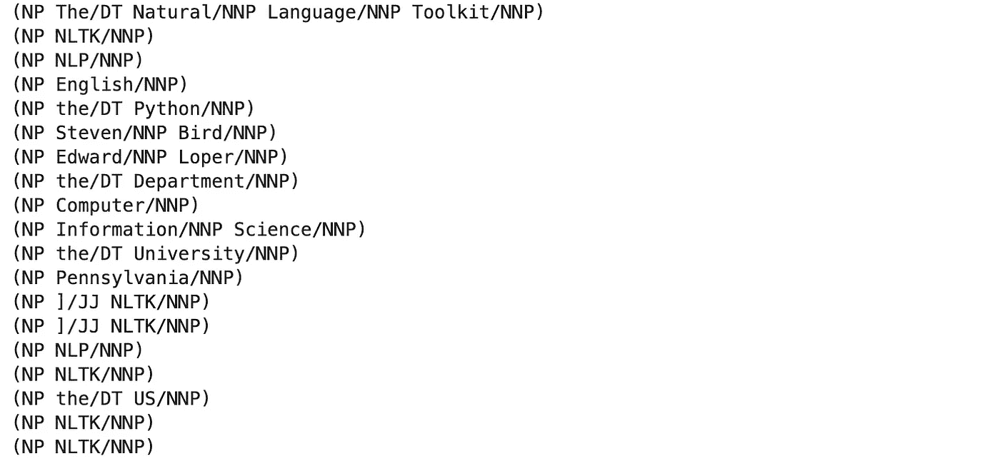
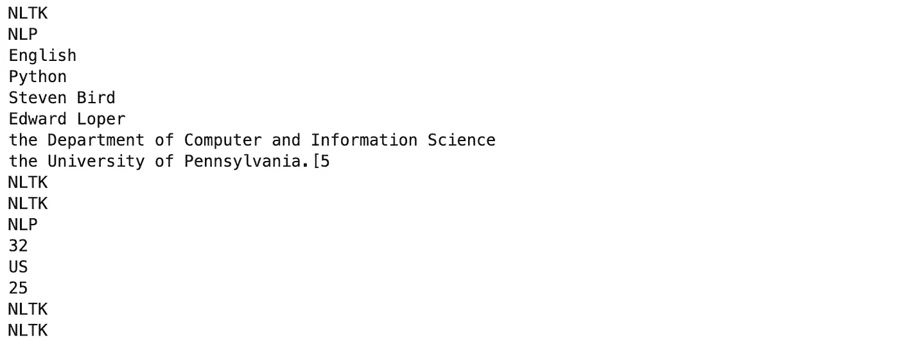

# 发现命名实体识别的基本工具

> 原文：<https://towardsdatascience.com/discovering-the-essential-tools-for-named-entities-recognition-8176c94d9747?source=collection_archive---------4----------------------->

Photo by [chuttersnap](https://unsplash.com/photos/JChRnikx0tM?utm_source=unsplash&utm_medium=referral&utm_content=creditCopyText) on [Unsplash](https://unsplash.com/?utm_source=unsplash&utm_medium=referral&utm_content=creditCopyText)

## 都是名字的问题！

这封信是 E …开始！……”——我的一个兄弟说。

我们开始疯狂地写下每个类别中以 E 开头的单词。每个人都想在下午的比赛中赢得尽可能多的分数。

*“站住！！！！!"——*我姐姐突然宣布——*“我已经完成了所有的分类”*。

我们不相信地盯着对方。

*“好的。我们开始检查吧！”*——我说。

我们开始一个接一个地列举我们在每个类别下输入的单词:水果、地点、名字…

*“颜色名呢？”*——我的另一个哥哥一度问道。

*“祖母绿……”*——姐姐骄傲地说。

” *Noo！不要。那不是颜色名！！！*”——我的两个哥哥同时大声抱怨。

*“当然是！如果没人放个颜色名我就拿双倍积分！”——*她开心地回答。

每次我们玩 [Scattergories](https://en.wikipedia.org/wiki/Scattergories) 或者 *Tutti Frutti* 的时候，我们都会进行同样的讨论。关于颜色名称的规则每次都在改变。

这完全取决于当时的球员。正如我们后来了解到的那样，很多玩那个游戏的人身上发生了一些事情。

我们很容易将单词分类。我们可以在文章中分辨出哪个单词是名词、形容词还是动词。我们可以指出一个人、一个组织或一个国家的名称。

对于一台机器来说，这不是一件容易的事情。然而，我们已经走过了漫长的道路。

现在，我们不再需要花很长时间阅读长篇大论。我们可以使用机器学习算法从中提取有用的信息。

记得第一次读到*自然语言处理(NLP)。*我很难想象一个算法是如何识别单词的。它是如何识别它们的含义的。或者选择它们是哪种类型的单词。

我甚至不知道如何开始。信息太多了。在绕了一圈之后，我开始问自己我到底和 NLP 有什么关系。

我从不同的网站搜集了几个文本语料库。我的主要目标是提取和分类人名、组织名和地名等。

我手中的是一个*命名实体识别(NER)* 任务。

这些名称被称为实体，通常用专有名称来表示。它们有共同的语义属性。它们通常出现在相似的上下文中。

为什么我要提取这些实体？嗯，这么做有很多原因。

我们用语言相互交流。我们讲故事。我们陈述我们的想法。我们交流我们的感受。我们宣称我们喜欢什么、不喜欢什么或需要什么。

现在，我们大多通过书面文本传递信息。我们发微博。我们在博客中写作。这条新闻出现在一个网站上。所以书面文字是一个强大的工具。

让我们想象一下，我们有超能力知道哪些人、组织、公司、品牌或地点在网络上的每条新闻、推文或帖子中被提及。

我们可以检测并为每篇文章或帖子分配相关标签。这将有助于我们将它们分门别类。我们可以将他们与对阅读这类实体感兴趣的人特别匹配。所以我们会充当分类者。

我们也可以做相反的过程。任何人都可以问我们一个具体的问题。使用这些关键词，我们也能够非常高效地推荐文章、网站或帖子。听起来很熟悉？

我们可以更进一步，推荐产品或品牌。如果有人抱怨某个特定的品牌或产品，我们可以在几秒钟内很容易地将其分配到最不相关的部门。因此，我们将成为出色的客户支持。

你可以猜到，NER 是一个非常有用的工具。然而，任何事情都是有代价的。

在算法能够识别文本中的实体之前，它应该能够将单词分类为动词、名词、形容词。它们一起被称为*词类*。

给它们标注的任务叫做*词性标注*，或者**词性标注**。该方法基于单词上下文和定义来标记单词。

Example of POS-tagging a text.

以句子为例:“新技术影响着整个世界”和“为了减少全球变暖的影响，我们现在应该做点什么”。“*影响*在每一句中都有两种不同的意思。

有几种监督学习算法可供选择:

*基于词法的方法。他们在训练集中分配与一个词同现最频繁的词性。*

*概率方法。*他们考虑特定标签序列出现的概率，并在此基础上进行分配。

*基于规则的方法。*他们创建规则来表示出现在训练集中的单词序列的结构。基于这些规则分配 POS。

*深度学习方法*。在这种情况下，循环神经网络被训练并用于分配标签。

训练 NER 算法需要合适的带注释的数据。这意味着您需要与您想要分析的数据类型相匹配的不同类型的数据。

数据还应附有注释。这意味着命名实体应该以可靠的方式为训练集进行识别和分类。

还有，我们要挑一个算法。训练它。测试一下。调整模型…

幸运的是，它们是 Python 中的几个工具，使我们的工作变得更容易。我们来回顾其中的两个。

1 **自然语言工具包(NLTK):** [NLTK](http://www.nltk.org/) 是在 Python 中处理人类语言数据时使用最多的平台。

它提供了 50 多个语料库和词汇资源。除了其他功能之外，它还具有对文本进行分类、标记和标记的库。

对于下一部分，我们将得到更多的技术。开始吧！

Code showing the required NLTK modules to be imported.

在代码中，我们导入了模块`ntlk`以及方法`word_tokenize`和`pos_tag`。

第一个将帮助我们对句子进行标记。这意味着把句子分成记号或单词。

你可能想知道为什么我们不使用 Python 方法`.split()`。NLTK 将句子拆分成单词和标点符号。因此它更健壮。

第二种方法是将我们的标记“标记”到不同的词类中。

首先，我们将使用另外两个 Python 模块:`requests`和`BeautifulSoup`。我们将使用它们来搜集关于 NLTK 的维基百科网站。并检索其文本。

Code showing how to retrieve the text from a website using requests and BeautifulSoup.

现在，我们的文本在变量`wiki_nltk`中。

是时候看看我们的主要方法了。我们将创建一个将文本作为输入的方法。它将使用`word_tokenize`将文本分割成标记。然后，它将使用`pos_tag`标记每个标记的词性。

该方法将返回一个元组列表。每个元组由什么组成？嗯，一个单词及其标签；它所对应的演讲部分。

Code showing the method created. It takes the text, split it in tokens, and label them. It outputs a list with tuples.

之后，我们将该方法应用于我们的文本`wiki_nltk`。为了方便起见，我们将只打印前 20 个元组；每行 5 个。

标签很神秘，对吧？让我们来解码其中的。

*DT* 表示这个词是限定词。 *NN* 名词，单数。 *NNP* 专有名词，单数。一个并列连词。JJR 是形容词，比较级。副词。在介词中。

为什么`pos_tag`能够返回所有这些标签？

它使用概率方法。特别是*条件随机场* (CRF)和*隐马尔可夫模型。*

首先，该模型提取每个单词的一组特征，称为*状态特征*。它基于诸如第一个字母的大写、数字或连字符、后缀、前缀等特征来做出决定。

该模型还考虑了称为过渡特征的函数中的前一个单词的标签。它将确定不同特征函数的权重，以最大化标签的可能性。

下一步是执行实体检测。这项任务将使用一种叫做 ***分块*** 的技术来完成。

标记化只提取“标记”或单词。另一方面，组块提取可能在文本中有实际意义的短语。

组块要求我们的文本首先进行标记和词性标注。它使用这些标签作为输入。它输出可以指示实体的“块”。

An example of how chunking can be visualized.

NLTK 有几个函数可以简化文本分块的过程。该机制基于使用正则表达式来生成组块。

我们可以首先应用名词代词组块或 *NP-chunk* s。我们将寻找匹配单个名词短语的组块。为此，我们将定制机制中使用的正则表达式。

我们首先需要定义规则。它们会指出句子应该如何分块。

Defining the rule of how sentences should be chunked.

我们的规则规定，我们的 NP 组块应该由可选的限定词(DT)后跟任意数量的形容词(JJ)以及一个或多个代词名词(NNP)组成。

现在，我们使用`RegexpParser`和这条规则创建一个块解析器。我们将使用`chunkParser.parse`把它应用到我们的词性标注单词上。

结果是一棵树。在这种情况下，我们只打印了块。我们也可以用图形显示出来。

Entities recognized in the text.

NLTK 还使用函数`nltk.ne_chunk()`提供了一个预训练的分类器。它允许我们识别文本中的命名实体。它也适用于带词性标签的文本。

Code showing how to use chunking for entity detection.

Entities recognized in the text.

正如我们所看到的，使用两种方法的结果是相同的。

然而，结果并不完全令人满意。NLTK 的另一个缺点是，词性标注支持英语和俄语。

2*[**SpaCy 模型**](https://github.com/explosion/spaCy)**:**Python 中的一个开源库。它通过标记连续记号组为 NER 提供了有效的统计系统。*

*它能够识别各种各样的命名或数字实体。其中，我们可以找到公司名称、地点、产品名称和组织。*

*Spacy 的一个巨大优势是拥有多种语言的预训练模型:英语、德语、法语、西班牙语、葡萄牙语、意大利语、荷兰语和希腊语。*

*这些模型支持标记、解析和实体识别。它们是专门为 spaCy 从头开始设计和实现的。*

*它们可以作为 Python 库导入。*

*Importing spacy and pre-trained model in English.*

*并使用`spacy.load()`轻松加载。在我们的代码中，我们将它保存在变量`nlp`中。*

*SpaCy 提供了一个标记器、一个位置标记器和一个命名实体识别器。所以非常好用。我们在文中称我们的模型为`nlp(text)`。这将标记它，给它加标签并识别实体。*

*属性`.sents`将检索令牌。`.tag_`每个令牌的标签。`.ents`公认的实体。`.label_`每个实体的标签。`.text`任何属性的文本。*

*我们为这项任务定义了如下方法。*

*现在，我们将定义的方法应用于我们的原始维基百科文本。*

**

*Spacy 不仅能识别名字，还能识别数字。很酷，对吧？*

*可能提出的一个问题是 SpaCy 是如何工作的。*

*它的[架构](https://www.youtube.com/watch?time_continue=2099&v=sqDHBH9IjRU)非常丰富。这产生了非常有效的算法。解释空间模型的每个组成部分将需要另一整篇文章。甚至[记号化](https://explosion.ai/blog/how-spacy-works)都是以一种非常新颖的方式完成的。*

> *根据爆炸 AI 的说法，Spacy 命名实体识别系统具有使用子词特征的复杂单词嵌入策略，具有残余连接的深度卷积神经网络，以及用于命名实体解析的新颖的[基于转换的方法](https://arxiv.org/abs/1603.01360)。*

*让我们一步步解释这些基本概念。*

****使用子词特征的词嵌入策略。*** 哇！很长的名字和很多难懂的概念。*

*这是什么意思？我们应该用多维数字向量来表示它们，而不是用文字。*

*每个维度都捕捉到单词的不同特征。这也被称为*单词嵌入*。*

*好处是与数字打交道比与文字打交道更容易。我们可以计算，应用函数，等等。*

*最大的局限是这些模型通常会忽略单词的形态结构。为了纠正这一点，引入了*子词特征*，以包括关于词的形态结构的知识。*

*[***带残差连接的卷积神经网络***](https://arxiv.org/abs/1603.01360) ***。*** 卷积网络主要用于处理图像。卷积层将内核或滤波器(带权重的矩阵)乘以窗口或输入矩阵的一部分。*

*传统的[神经网络](/understanding-neural-networks-what-how-and-why-18ec703ebd31)的结构是每一层反馈下一层。*

*具有残余块的神经网络将大网络分割成小块。这些网络块通过跳跃功能或快捷方式连接。*

*剩余网络的效率由激活函数必须被应用的次数更少这一事实给出。*

***[***过渡型***](https://explosion.ai/blog/parsing-english-in-python) **。**该策略使用连续的步骤来添加一个标签或改变状态，直到它到达最可能的标签。***

**最后，Spacy 提供了一个功能来显示带有命名实体注释的句子:`displacy`。**

**让我们使用它！**

****

**…结束了！**

**命名实体识别是一个正在开发的工具。关于这个话题已经做了很多。然而，仍有改进的余地。**

**自然语言处理工具包——这是一个非常强大的工具。广泛使用。它为同一任务提供了多种算法可供选择。然而，它只支持 2 种语言。它需要更多的调音。它不支持单词向量。**

**SpaCy——这是一个非常先进的工具。它支持 7 种语言以及多语言。这样效率更高。它是面向对象的。但是，背后的算法很复杂。只保留任务的最佳算法。它支持单词向量。**

**总之，尽管去尝试一种方法吧！你会玩得开心的！**

**— [查看我的 GitHub 回购！](https://github.com/ugis22/essential_tools_ner) —**