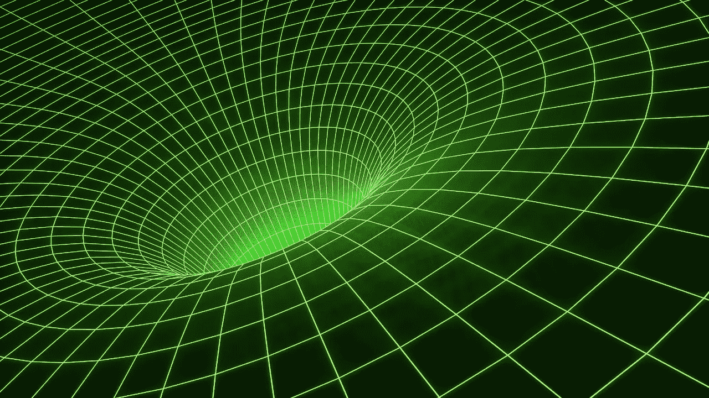
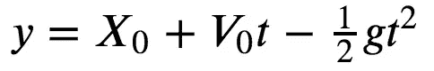

# 用机器学习发现物理定律

> 原文：<https://towardsdatascience.com/discovering-the-laws-of-physics-with-machine-learning-f2c2b5548fe?source=collection_archive---------23----------------------->

## 使用多项式回归来模拟和揭示重力



机器学习不仅在预测你接下来想看哪部电影方面，而且在推进科学研究方面都非常强大。它可以帮助科学家预测某些现象的结果，在某些情况下甚至揭示潜在的规律本身。

我们将看一个相当简单的例子:重力对下落物体的作用。如果你上过物理或微积分入门课，你会看到这个公式。但是，即使你只学过高中代数，你也能掌握它背后的数学。

下落物体位置的公式为:



其中:

*=物体的初始位置，即其初始高度。*

**=物体在这个初始位置时的初速度(或速度)。**

*****t*** =物体掉落后的时间。**

*****g*** =重力，也就是大约 9.8 米/秒的加速度。这实际上是一个常数，而不是像所有其他变量一样的变量(除非我们将一个物体投放到不同的行星上，但事实并非如此)。它是负的，因为重力是向下的，从正的位置值朝向零。**

**这个方程是一个二次多项式(由于 *t )* ，你可能还记得代数中的这个方程。像 scikit-learn 这样的机器学习库可以使用线性回归非常容易地处理这个问题。这个数据实际上不是线性的，但是 scitkit-learn 让我们能够修改数据，以便可以将它训练为线性回归模型，同时考虑到它实际上是一个多项式。**

**为了继续，我们需要一些数据。我们可以将许多不同的物体丢下 10，000 次，并记录它们在不同时间的位置，但这相当耗时。相反，我们将从上面的等式中创建数据集。幸运的是，由于艾萨克·牛顿的工作和数百年来重复的实验，我们可以肯定我们的数据将反映现实世界中发生的事情。**

## **创建我们的数据集**

**首先，我们将创建一个 Python 函数来计算下落物体的位置:**

```
**def location(x_0, v_0, t):
    return x_0 + v_0*t - (9.8/2)*t**2**
```

**这只是 Python 形式的前一个等式。接下来，我们使用这个函数创建一个数据集，并将其保存在一个 CSV 文件中:**

```
**import csv
import random
import math
random.seedwith open('gravity_location_data.csv', mode='w') as gravity_file:
    gravity_writer = csv.writer(gravity_file, delimiter=',', quotechar='"', quoting=csv.QUOTE_MINIMAL)
    gravity_writer.writerow(['initial_position', 'initial_velocity', 'mass', 'time', 'location'])for i in range (0, 10000):
        initial_position = random.randrange(1, 10000)
        initial_velocity = random.randrange(1, 100)
        mass = random.randrange(1, 1000)
        time = random.randrange(1, 100)gravity_writer.writerow([initial_position, initial_velocity, mass, time, location(initial_position, initial_velocity, time)])**
```

**我们在这里做的是创建 10，000 个例子，使用我们所有变量的随机值，然后计算在某个(随机选择的)时间的位置。关于这一点，有几点需要注意。**

**首先，一些位置值将是负的。这不应该困扰你，它只是意味着物体已经下降到我们定义为零的某个高度以下。想象一下，你站在悬崖边，拿着一个与眼睛齐平的物体，然后把它从悬崖上扔下去。在这种情况下，零是你脚的位置，-100 是你脚下 100 米，1.85 米是你放下它的初始位置(即你自己的高度，如果你身高 6 英尺)。**

## **智胜亚里士多德**

**第二，注意我们在数据中包括了物体的质量。这实际上与计算物体坠落时间或位置完全无关。这个事实对于那些在高中或大学没有学过物理的人来说可能是违反直觉的。事实上，亚里士多德相信这一点，数百年来许多人都相信这一点，直到伽利略从比萨斜塔上扔下两个不同重量的球体，并证明它们同时落地。**

**看原方程。质量是无处可寻的，因为不同质量的物体以相同的加速度下落，假设我们可以忽略空气阻力(我们经常可以做到)。**

**那么为什么要把质量包括在这个数据集中呢？因为我们想尝试欺骗机器学习算法来使用它！我们将会看到我们的机器学习实验是否能智胜亚里士多德。**

**现在我们已经将数据保存在 CSV 文件中，我们导入它:**

```
**import pandas as pdgravity_data = pd.read_csv('gravity_location_data.csv')
df_location = pd.DataFrame(gravity_data)**
```

**与机器学习一样，我们需要将数据分成一个训练集(用于训练模型)和一个测试集(用于评估训练好的模型)。这个函数将完成这个任务。**

```
**from sklearn.model_selection import train_test_splitdef split_data(data, target_name):
    y = data[target_name]
    X = data.drop(target_name, axis=1)
    return train_test_split(X, y, test_size=0.2, random_state=30)**
```

**为了训练和评估我们的模型，我们将使用以下函数:**

```
**from sklearn.linear_model import LinearRegression
from sklearn.preprocessing import PolynomialFeatures
from sklearn.metrics import mean_squared_error, mean_absolute_error, r2_score
from math import sqrtdef train_eval_poly(X_train, X_test, y_train, y_test):
    regression_model = LinearRegression() 

    poly = PolynomialFeatures(degree=2)
    X_train_transform = poly.fit_transform(X_train)
    X_test_transform = poly.fit_transform(X_test)

    regression_model.fit(X_train_transform, y_train)

    print(poly.fit(X_train).get_feature_names(X_train.columns))

    y_pred = regression_model.predict(X_test_transform)
    print("R2: \t", r2_score(y_test, y_pred))
    print("RMSE: \t", sqrt(mean_squared_error(y_test, y_pred)))
    print("MAE: \t", mean_absolute_error(y_test, y_pred))

    return regression_model**
```

**请注意，这只是线性回归，只是我们使用多项式功能来转换数据，以便线性回归可以正确地模拟二次多项式，我们碰巧知道在这种情况下这正是我们要寻找的。我们将在下面看到更多关于数据如何转换的内容。**

**在我们训练模型之后，我们将获得特征名称，这将告诉我们如何分配结果系数。**

**现在我们用以下代码训练模型:**

```
**df_split = split_data(df_location, 'location')
lrModel = train_eval_poly(*df_split)**
```

**当我运行上面的代码时，我得到了下面的输出(由于随机化的值，在不同的尝试中会略有不同):**

```
**['1', 'initial_position', 'initial_velocity', 'mass', 'time', 'initial_position^2', 'initial_position initial_velocity', 'initial_position mass', 'initial_position time', 'initial_velocity^2', 'initial_velocity mass', 'initial_velocity time', 'mass^2', 'mass time', 'time^2']
R2: 	 1.0
RMSE: 	 2.858993700594185e-09
MAE: 	 2.4177281243084604e-09**
```

**请注意，r 值是 1.0 —我以前从未见过！此外，均方根误差(RMSE)和平均绝对误差(MAE)非常小—*e-09*表示将前面的数字乘以. 000000001。所以均方根误差实际上是 0.00000000285…在这个范围内，这是很小的，基本上为零。**

## **多项式特征的多项式回归**

**还要注意上面结果中的 15 个条目的初始列表。这是多项式特征方法的结果。它转换了四个特征的初始集(“初始位置”、“初始速度”、“质量”、“时间”)，并将它们更改为这些特征的组合，如“初始位置^ 2”和“初始位置时间”，其值为初始位置乘以时间。这个扩展的特征集然后被输入到简单的旧线性回归中。这是一个小技巧，它允许我们不使用不同的算法，而是使用转换后的数据来执行多项式回归。**

**现在让我们来看看模型中的指数，它们是模型用来进行预测的多项式方程中的指数:**

```
**lrModel.coef_**
```

**这为我们提供了以下内容，分别对应于上述十五个特征:**

```
**array([ 0.00000000e+00,  1.00000000e+00,  1.55880730e-12,  6.28398701e-15,
       -4.95194273e-14, -1.69455737e-16,  2.20395687e-16,  5.63820313e-18,
        1.73104757e-16, -1.06371232e-14,  4.99284970e-16,  1.00000000e+00,
       -2.55450811e-16,  1.73797602e-16, -4.90000000e+00])**
```

**第一个值(0.00000000e+00 或 0)是值 1 的系数。这将是一个没有变量的悬挂常数，一个常数值总是加到方程中，除了系数是零，所以没有常数值加到我们的结果中。数组中的第二个值(1.00000000e+00，或 1)是“initial_position”的系数事实上，在我们的原始方程中，我们有初速度( *X₀)* ，系数为 1*。***

**我们的大多数其他系数本质上为零，并告诉我们这些因素与预测位置无关，但我们确实有一些不是。我们列表中的第十二个也是系数 1，对应于‘初速度时间’，或者初速度乘以时间。同样，我们在原始方程中有这个因素，它表现为 *V₀*t.***

**最后，最后一个值是-4.9，这是对应于“时间^ 2”的系数请注意，这也出现在我们的原始方程作为-1/2 gt。但是我们前面说过 g 大约是 9.8，而-1/2 * 9.8 = -4.9。所以这也符合我们最初的方程。**

**如果您将这些系数与功能名称列表中的变量组合进行匹配，并将它们相加，并忽略系数基本为零的情况，您最终会得到一个非常接近我们在本文顶部开始时的方程。**

**这里有两个非常有趣的结论。首先，最终的模型发现质量与预测无关，这是正确的。**

**第二，**机器学习算法能够导出重力加速度常数 *g，*** 或者至少确定包括 g ***在内的整个系数的值(-1/2 * 9.8)。*****

**换句话说，用 Python 和 scikit-learn 可以在几秒钟内发现艾萨克·牛顿和伽利略的一些工作。这太令人兴奋了。**

**当然，分析和理解这些结果仍然需要大量的人类干预，但这至少让我们看到了如何从数据中提取对宇宙基本规律的见解。**