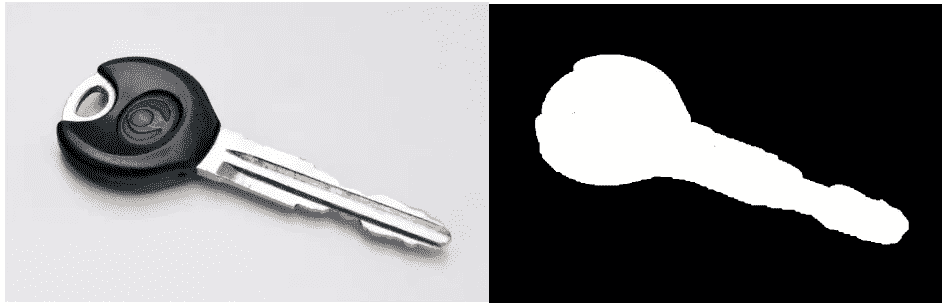

# 将 2D 图像离散成多边形和点模型

> 原文：<https://towardsdatascience.com/discretizing-2d-images-into-polygonal-and-point-models-9e91c239b329?source=collection_archive---------23----------------------->

## 将复杂的图像简化为简单的数据格式

现实世界是复杂多变的。随着机器人技术和自动驾驶汽车的发展，人们普遍需要将物体简化为更易于管理的形式。此外，我们的世界是连续的(在大多数情况下)，然而我们的技术以数字方式解释内容。因此，对于任何世界互动，都会有某种程度的离散化。

对于我正在开发的一个机器人抓取项目，我最近遇到了这个问题。2D 形状是存在的，并且表面信息需要被外推以确定在哪里抓取该形状。幸运的是，OpenCV 有办法将弯曲的轮廓简化成更加多边形的形状。让我们来看看这些函数及其结果。

A key and the result after salience detection.

在得到一幅图像后，我们使用我们最喜欢的[显著性方法](https://medium.com/me/stats/post/473b4cb31774)抓取感兴趣的项目。如上例所示，这为感兴趣的对象创建了一个相当不错的遮罩。可以看出，如果试图进行任何几何操作，都会出现困难。例如，钥匙手柄的曲率会使确定法向量变得困难。此外，分割过程中拾取的噪声会产生错误的边缘。

方便的 OpenCV 函数`approxPolyDP()`用于将轮廓近似为更少的点。该函数使用[Ramer–Douglas–peu cker 算法](https://en.wikipedia.org/wiki/Ramer%E2%80%93Douglas%E2%80%93Peucker_algorithm)来减少点数。这是一个取常数值的递归算法， ***ε。*** 算法从寻找两个起始点的最远点开始。如果该点小于 ***ε*** ，那么前两个起点之间的所有点都被丢弃。否则，该算法再次平分该组点，并向下递归到下一组点。对每个二等分的集合重复该过程。

A handy animation of theDouglas–Peucker algorithm. [Source](https://en.wikipedia.org/wiki/Ramer%E2%80%93Douglas%E2%80%93Peucker_algorithm)

通过改变 ***ε*** 的值，可以实现不同层次的“离散化”。该值越大，最终形状的多边形程度越高。

From Left to Right, Top to Bottom: *ε = 0.5, 2, 5, 20*

对于许多应用来说，以上是一个完美的解决方案。然而，[一些处理离散现实世界物体的算法](https://www.researchgate.net/publication/224623408_Determining_independent_grasp_regions_on_2D_discrete_objects)会进一步将多边形分解成连续的点。这将涉及更多的信息存储，但可以提供更多的信息。

从上面的多边形创建一个基于点的物体框架并不困难。有了组成多边形的连续顶点的数组，我们可以沿着每条边迭代。对于每条边，确定两个顶点之间的向量。沿着每个向量，根据期望的分辨率生成一定百分比的点。我们使用的分辨率将决定每条边上的点数。

The dotted with a resolution of 10%

利用所描述的方法，相当复杂的形状可以简化为简单的边或点。如果需要与对象进行任何交互或需要进行几何分析，这将非常有用。如果正在构建某个对象识别方案，比较简化的对象可能更有意义。这让我们可以忽略细节和特质。

本文是一个正在进行的项目的一部分。正在进行的 C++代码可以在我的 github 上找到:

 [## TimChinenov/GraspPicture

### 用于分割显著的彩色图像并确定抓取的代码。- TimChinenov/GraspPicture

github.com](https://github.com/TimChinenov/GraspPicture)